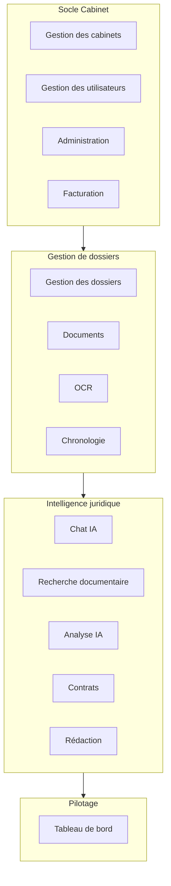
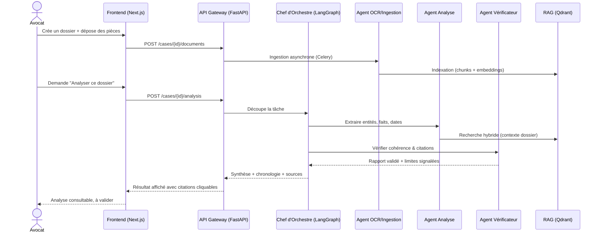
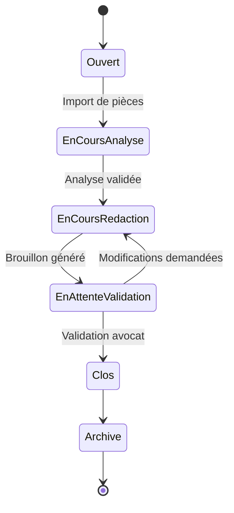

# Architecture fonctionnelle

## Vue d'ensemble des modules (V1)

## Modules et responsabilités

| Module | Responsabilité | Bounded context DDD |
|---|---|---|
| Gestion des cabinets | Création/paramétrage d'un tenant cabinet, marque blanche, offres | `firm` |
| Gestion des utilisateurs | Comptes, rôles, permissions, MFA, invitations | `identity` |
| Gestion des dossiers | Cycle de vie d'un dossier, parties, phases, statuts | `case` |
| Documents | Stockage, versionning, classification des pièces | `document` |
| OCR | Extraction de texte depuis PDF/scans/images | `ocr` |
| Chat IA | Interface conversationnelle multi-agents sur un dossier | `assistant` |
| Recherche documentaire | Connecteurs vers sources juridiques configurables | `legal_research` |
| Analyse IA | Extraction d'entités, incohérences, chronologie automatique | `case_analysis` |
| Chronologie | Construction et édition de frises chronologiques | `timeline` |
| Contrats | Analyse, comparaison, détection de risques contractuels | `contract` |
| Rédaction | Génération de brouillons (consultations, conclusions...) | `drafting` |
| Tableau de bord | Vue synthétique cabinet / dossier / utilisateur | `dashboard` |
| Facturation | Abonnements, usage, Stripe, quotas | `billing` |
| Administration | Supervision, audit, configuration globale | `platform_admin` |

## Parcours utilisateur clé : analyse d'un nouveau dossier

## Cycle de vie d'un dossier

## Extensibilité multi-métiers (post-V1)

L'architecture modulaire (voir `03-architecture-technique.md`) permet
d'ajouter de futurs modules métiers (notaires, experts-comptables,
directions juridiques) comme de **nouveaux bounded contexts** branchés sur
le même socle (identity, firm, billing, RAG, agents) sans modifier le
noyau existant. Ce point n'est pas développé en V1.
