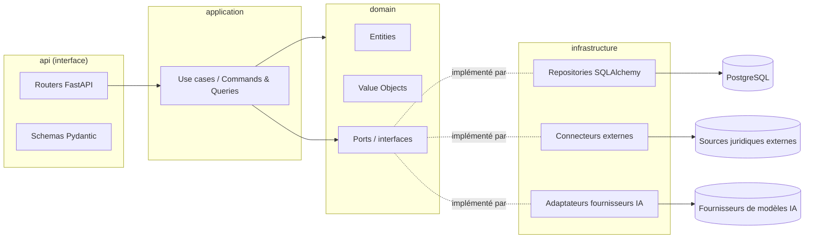
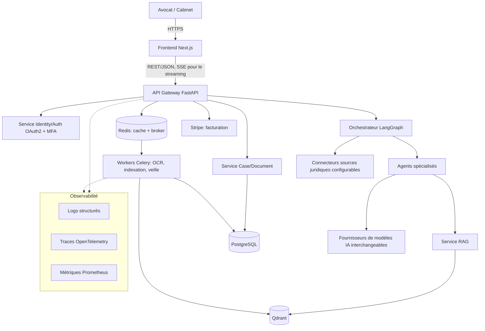
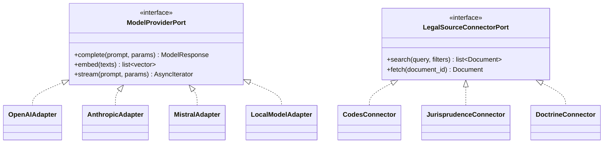

# Architecture technique

## Principes

- **Clean Architecture / DDD** : le domaine ne dépend d'aucune infrastructure.
- **API First** : tout est conçu contrat d'abord (OpenAPI généré par FastAPI).
- **Twelve Factor App** : configuration par variables d'environnement,
  process stateless, logs sur stdout, builds reproductibles.
- **CQRS** là où la charge de lecture/écriture diverge fortement (recherche
  documentaire, tableau de bord).
- **Event Driven** pour les traitements longs et asynchrones (OCR,
  indexation RAG, veille juridique) via Celery + Redis comme broker.
- **Aucun couplage fort** : toute dépendance externe (fournisseur de
  modèle IA, connecteur juridique, moyen de stockage) est injectée derrière
  une interface (port) définie dans le domaine, implémentée dans
  l'infrastructure (adapter).

## Stack

| Couche | Choix |
|---|---|
| Backend | Python 3.11+, FastAPI, SQLAlchemy 2.x, Alembic, Pydantic v2 |
| Base de données | PostgreSQL 16 |
| Cache / broker | Redis |
| Tâches asynchrones | Celery |
| Frontend | Next.js (App Router), React, TypeScript, Tailwind CSS, Shadcn UI |
| Orchestration IA | LangGraph |
| RAG | LlamaIndex + Qdrant |
| Fournisseurs de modèles | OpenAI, Anthropic, Mistral, ou modèles open source — interchangeables via un `ModelProviderPort` |
| Infrastructure | Docker, Docker Compose (dev), Kubernetes-ready (prod) |
| CI/CD | GitHub Actions |
| Observabilité | Logs structurés (JSON), traces OpenTelemetry, métriques Prometheus |

## Architecture en couches (par bounded context)



La règle de dépendance est stricte : `api` → `application` → `domain`.
`infrastructure` dépend de `domain` (implémente ses ports) mais `domain` ne
dépend jamais de `infrastructure`.

## Vue système (déploiement logique)



## Multi-tenant

Isolation logique par `firm_id` (schema partagé, ligne à ligne) en V1, avec
row-level security PostgreSQL activable par tenant. Chaque requête passe par
un middleware qui résout le tenant courant depuis le token d'authentification
et l'injecte dans le contexte de la requête (aucune requête ne peut
traverser les tenants par erreur).

## Structure du dépôt

```
tmis/
├── backend/                  # API FastAPI, domaine, agents, infra
│   ├── src/tmis/
│   │   ├── domain/           # Bounded contexts (entités, ports)
│   │   ├── application/      # Use cases (commands/queries, CQRS)
│   │   ├── infrastructure/   # SQLAlchemy, connecteurs, adaptateurs IA
│   │   ├── api/              # Routers FastAPI, schémas
│   │   ├── agents/           # Orchestrateur + agents LangGraph
│   │   └── core/             # Config, sécurité, logging, observabilité
│   ├── tests/{unit,integration,e2e}/
│   └── alembic/
├── frontend/                  # Next.js App Router
│   └── src/{app,components,lib,hooks}/
├── docs/                      # Documentation Sprint 1+
├── docker-compose.yml
└── .github/workflows/
```

Voir `04-domain-driven-design.md` pour le détail des bounded contexts et
l'arborescence complète du backend.

## Fournisseurs de modèles IA et connecteurs — interchangeabilité



Chaque adaptateur est enregistré dans un registre configuré par variables
d'environnement / configuration cabinet, permettant d'activer, désactiver ou
remplacer un fournisseur sans changement de code applicatif.
