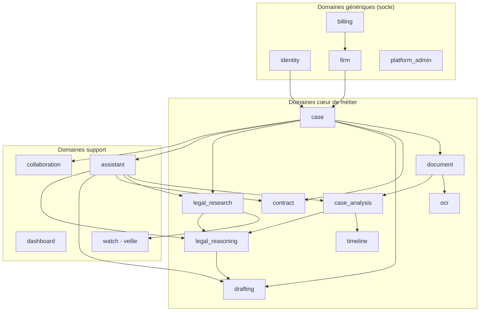

# Domain Driven Design — Bounded contexts

## Cartographie des bounded contexts



## Détail des bounded contexts (V1)

### `identity` (domaine générique)
Utilisateurs, rôles, permissions (RBAC), authentification OAuth2, MFA,
invitations, sessions. Agrégat racine : `User`. Value objects : `Email`,
`Role`, `Permission`.

### `firm` (domaine générique)
Cabinet (tenant), paramétrage, marque, membres. Agrégat racine : `Firm`.

### `billing` (domaine générique)
Abonnements (Solo / Cabinet / Entreprise), essai gratuit, usage, intégration
Stripe, webhooks. Agrégat racine : `Subscription`.

### `platform_admin` (domaine générique)
Supervision multi-tenant, audit global, feature flags, configuration des
connecteurs et fournisseurs de modèles disponibles pour un cabinet.

### `case` (domaine cœur)
Dossier juridique : identité, appartenance au cabinet, statut
administratif/facturable. Agrégat racine : `Case` (persisté depuis le
Sprint 1). C'est le pivot autour duquel gravitent la plupart des autres
contextes. Depuis le Sprint 4, l'intelligence du dossier (acteurs, faits,
chronologie consolidée, questions juridiques, graphe de relations,
résumés, recherche) est déléguée au **Case Intelligence Engine**
(`tmis.case_intelligence`, voir `docs/19-case-intelligence.md`) plutôt
que réimplémentée ici — ce bounded context ne portera, à terme, que la
persistance/API du `CaseProfile` qu'il produit (Sprint 7), sur le même
principe que `document`/`tmis.document_intelligence`.

### `document` (domaine cœur)
Pièces déposées dans un dossier : upload, persistance, versionning,
lien vers un dossier. À partir du Sprint 3, l'analyse d'une pièce
(OCR, mise en page, classification, entités, chronologie, chunking,
embeddings, knowledge graph) est déléguée au **Document Intelligence
Engine** (`tmis.document_intelligence`, voir
`docs/14-document-intelligence.md`) plutôt que réimplémentée ici ; ce
bounded context ne porte que la persistance et l'exposition API du
`DocumentRecord` qu'il produit (Sprint 7). Agrégat racine : `Document`.

### `ocr` (domaine cœur)
Historiquement prévu pour l'extraction de texte ; ce rôle est couvert
par `tmis.document_intelligence.ocr` depuis le Sprint 3 (`OcrEnginePort`
interchangeable — passthrough aujourd'hui, Tesseract/moteur cloud demain).
Ce bounded context reste réservé à une éventuelle orchestration Celery
dédiée si le volume l'exige (Sprint 7 et au-delà).

### `case_analysis` (domaine cœur)
Reconnaissance d'entités (personnes, sociétés, faits, dates, contrats,
événements, juridictions, montants), détection d'incohérences, préparation
de chronologie automatique. Consomme le RAG et les agents IA.

### `timeline` (domaine cœur)
Construction et édition de frises chronologiques à partir des faits extraits
par `case_analysis`, avec édition manuelle par l'avocat.

### `contract` (domaine cœur)
Analyse de contrats, détection de risques, comparaison de versions,
génération de rapports.

### `drafting` (domaine cœur)
Génération de brouillons de documents (consultations, conclusions,
assignations, requêtes, courriers, notes internes). Tout document produit
porte un statut `DRAFT` explicite tant qu'il n'est pas validé par un
avocat. Depuis le Sprint 7, ce rôle est délégué au **Legal Drafting
Studio** (`tmis.legal_drafting`, voir docs/28-legal-drafting.md) — ce
bounded context ne portera, à terme, que la persistance des brouillons
qu'il produit (Sprint 9), sur le même principe que `document`/`case`.
`Document.is_draft` y reste une invariante technique : aucun document
n'est jamais présenté comme juridiquement validé.

### `legal_research` (domaine cœur)
Recherche documentaire via connecteurs configurables (codes, textes,
jurisprudence, doctrine, documentation interne, bases privées) et
recherche de jurisprudence pertinente. Depuis le Sprint 5, ce rôle est
délégué au **Legal Research Engine** (`tmis.legal_research`, voir
docs/21-legal-research.md) plutôt que réimplémenté ici — ce bounded
context ne portera, à terme, que la persistance de l'historique de
recherche (Sprint 9), sur le même principe que `document`/`case`.

### `legal_reasoning` (domaine cœur)
Raisonnement juridique : hypothèses concurrentes, arguments et
contre-arguments tracés, détection de conflits, score de confiance
expliqué, synthèse transparente. Depuis le Sprint 6, ce rôle est
délégué au **Legal Reasoning Engine** (`tmis.legal_reasoning`, voir
docs/25-legal-reasoning.md) — moteur d'assistance à la décision qui ne
produit jamais de document juridique final ni de conclusion
automatique ; ce bounded context ne portera, à terme, que la
persistance des sessions de raisonnement.

### `assistant` (domaine support)
Interface de chat multi-agents, orchestration des conversations,
historique des échanges liés à un dossier.

### `dashboard` (domaine support)
Agrégation de données en lecture (CQRS - côté Query) pour la vue cabinet /
dossier / utilisateur.

### `collaboration` (domaine support)
Espace de travail multi-utilisateurs : rôles/permissions, membres,
tâches, workflow, commentaires/mentions, validations, notifications,
journal d'activité, présence, partage. Depuis le Sprint 8, ce rôle est
délégué au **Legal Collaboration Engine** (`tmis.collaboration`, voir
docs/33-legal-collaboration.md) — moteur **indépendant de l'IA**
(aucun import de `tmis.ai`), qui publie ses événements sur son propre
`CollaborationEventBus` pour que les modules d'IA puissent y réagir
sans que le LCE ne les connaisse ; ce bounded context ne portera, à
terme, que la persistance de ce que le LCE produit, sur le même
principe que `document`/`case`.

### `watch` — veille (domaine support)
Suivi des évolutions juridiques depuis les connecteurs configurés,
génération d'alertes ciblées.

## Langage ubiquitaire (extrait)

| Terme | Définition |
|---|---|
| Dossier (`Case`) | Unité de travail juridique regroupant parties, pièces, analyses et productions |
| Pièce (`Document`) | Fichier déposé dans un dossier, avec métadonnées et version |
| Brouillon (`Draft`) | Production générée par TMIS, non opposable, à valider par l'avocat |
| Citation | Référence traçable vers un document source consultable |
| Connecteur | Adaptateur interchangeable vers une source juridique externe |
| Agent | Composant IA spécialisé dans une tâche du domaine (analyse, recherche...) |
| Chef d'Orchestre | Composant qui découpe une demande en tâches et choisit les agents |

## Arborescence complète du backend

```
backend/
├── pyproject.toml
├── alembic.ini
├── Dockerfile
├── .env.example
├── alembic/
│   ├── env.py
│   └── versions/
├── src/
│   └── tmis/
│       ├── __init__.py
│       ├── main.py                     # Point d'entrée FastAPI
│       ├── core/
│       │   ├── config.py               # Settings (pydantic-settings)
│       │   ├── logging.py              # Logs structurés JSON
│       │   ├── security.py             # JWT, hashing, RBAC helpers
│       │   ├── database.py             # Session SQLAlchemy, engine
│       │   └── observability.py        # OpenTelemetry / metrics
│       ├── domain/
│       │   ├── identity/{entities,value_objects,ports}.py
│       │   ├── firm/...
│       │   ├── billing/...
│       │   ├── case/...
│       │   ├── document/...
│       │   ├── ocr/...
│       │   ├── case_analysis/...
│       │   ├── timeline/...
│       │   ├── contract/...
│       │   ├── drafting/...
│       │   ├── legal_research/...
│       │   ├── legal_reasoning/...
│       │   ├── assistant/...
│       │   ├── dashboard/...
│       │   ├── collaboration/...
│       │   └── watch/...
│       ├── application/
│       │   └── <bounded_context>/{commands,queries}.py
│       ├── infrastructure/
│       │   ├── persistence/
│       │   │   ├── models.py           # Modèles SQLAlchemy
│       │   │   └── repositories.py     # Implémentations des ports
│       │   └── storage/                # Stockage fichiers (S3-compatible)
│       ├── api/
│       │   └── v1/
│       │       ├── router.py
│       │       └── <bounded_context>/{routes.py,schemas.py}  # incl. case_intelligence/
│       │                                                      # (legal_research/legal_reasoning/legal_drafting
│       │                                                      #  ont leur propre api/, voir plus bas)
│       ├── agents/                     # Agents métier (Sprint 1), branchés
│       │   │                           # sur le Kernel à partir du Sprint 12
│       │   ├── orchestrator.py         # Chef d'Orchestre (démonstration)
│       │   ├── analysis_agent.py
│       │   ├── research_agent.py
│       │   ├── jurisprudence_agent.py
│       │   ├── contract_agent.py
│       │   ├── strategy_agent.py
│       │   ├── drafting_agent.py
│       │   ├── verifier_agent.py
│       │   ├── synthesis_agent.py
│       │   ├── collaboration_agent.py
│       │   └── watch_agent.py
│       ├── ai/                         # AI Kernel (Sprint 2, docs/10-13)
│       │   ├── schemas/                # Contrats partagés (base commune)
│       │   ├── kernel/                 # TMISKernel, KernelConfig, get_kernel()
│       │   ├── providers/              # ProviderPort + adaptateurs
│       │   ├── connectors/             # ConnectorPort + ConnectorManager
│       │   ├── memory/                 # Mémoire conversation/case/workflow/user
│       │   ├── cache/                  # CachePort (mémoire, Redis)
│       │   ├── events/                 # EventBus + événements
│       │   ├── prompts/                # PromptRegistry versionné
│       │   ├── guardrails/             # Garde-fous entrée/sortie
│       │   ├── evaluation/             # Métriques d'évaluation IA
│       │   ├── tools/                  # ToolRegistry
│       │   ├── embeddings/             # EmbeddingProviderPort
│       │   ├── retrieval/              # Récupération hybride
│       │   ├── reranking/              # Reranking
│       │   ├── rag/                    # Pipeline RAG (ingestion → citations)
│       │   └── langgraph/              # Graphe de démonstration du Kernel
│       ├── document_intelligence/      # Document Intelligence Engine (Sprint 3, docs/14-18)
│       │   ├── schemas/                # Contrats partagés (base commune)
│       │   ├── bootstrap.py            # get_document_pipeline() (partage l'EventBus du Kernel)
│       │   ├── ingestion/              # Parsers PDF/DOCX/TXT/image, validation, virus scan
│       │   ├── ocr/                    # OcrEnginePort, détection langue/rotation
│       │   ├── layout/                 # Analyse de mise en page (titres, tableaux, ...)
│       │   ├── classification/         # ClassifierPort (10 catégories)
│       │   ├── metadata/               # MetadataExtractorPort
│       │   ├── entities/               # EntityExtractorPort (10 types)
│       │   ├── timeline/               # TimelineBuilderPort
│       │   ├── chunking/               # DocumentChunkerPort (structurel + taille fixe)
│       │   ├── embeddings/             # Pont vers tmis.ai.embeddings/rag
│       │   ├── knowledge/              # KnowledgeGraphPort (V1, par document)
│       │   ├── pipeline/               # DocumentIntelligencePipeline
│       │   ├── storage/                # DocumentStorePort
│       │   ├── export/                 # ExportPort (JSON)
│       │   └── evaluation/             # Métriques par étape du pipeline
│       ├── case_intelligence/          # Case Intelligence Engine (Sprint 4, docs/19-20)
│       │   ├── bootstrap.py            # get_case_intelligence_workflow()
│       │   ├── cases/                  # CaseProfile (agrégat), CaseStorePort
│       │   ├── actors/                 # ActorMergerPort (dédoublonnage/alias)
│       │   ├── facts/                  # FactEnginePort (confirmation/contradiction)
│       │   ├── evidence/               # EvidenceLinkerPort (niveaux de confiance)
│       │   ├── issues/                 # IssueDetectorPort
│       │   ├── relationships/          # CaseGraphPort (Legal Knowledge Graph V1)
│       │   ├── knowledge/              # CaseKnowledgeAggregator (Profile → graphe)
│       │   ├── timeline/               # TimelineConsolidatorPort (multi-documents)
│       │   ├── summaries/              # SummaryGeneratorPort (via TMISKernel)
│       │   ├── search/                 # CaseSearchPort (compatible RAG)
│       │   ├── workflow/               # CaseIntelligenceWorkflow (dossier vivant)
│       │   └── evaluation/             # Métriques par mise à jour de dossier
│       ├── legal_research/             # Legal Research Engine (Sprint 5, docs/21-24)
│       │   ├── bootstrap.py            # get_research_orchestrator()
│       │   ├── providers/              # ResearchKernelPort (narrow, mirrors SummaryKernelPort)
│       │   ├── connectors/             # Connecteurs LRE, enregistrés sur le ConnectorManager du Kernel
│       │   ├── sources/                # SourceRegistry (catalogue d'autorité par connecteur)
│       │   ├── queries/                # QueryEnginePort (normalisation, langue, mots-clés, expansion)
│       │   ├── search/                 # HybridResearchSearch, ResearchOrchestrator (racine)
│       │   ├── ranking/                # RankingPort, ConfigurableRanker
│       │   ├── citations/              # ResearchCitation, CitationFormatterPort
│       │   ├── normalization/          # SourceNormalizerPort (unification, dédoublonnage, versions)
│       │   ├── cache/                  # ResearchCache (3 couches : brut, normalisé, classé)
│       │   ├── history/                # ResearchHistoryPort
│       │   ├── evaluation/             # Métriques par recherche
│       │   └── api/                    # Router FastAPI dédié (inclus dans api/v1/router.py)
│       ├── legal_reasoning/            # Legal Reasoning Engine (Sprint 6, docs/25-27)
│       │   ├── bootstrap.py            # get_reasoning_orchestrator()
│       │   ├── planner/                # ReasoningPlanner (plan fixe du workflow)
│       │   ├── reasoner/               # ReasoningKernelPort/CasePort/ResearchPort, ReasoningOrchestrator (racine)
│       │   ├── hypotheses/             # HypothesisEnginePort (hypothèses coexistantes)
│       │   ├── arguments/              # ArgumentEnginePort (provenance conservée)
│       │   ├── counter_arguments/      # CounterArgumentEnginePort
│       │   ├── evidence/               # EvidenceEnginePort (fait/document/hypothèse/argument)
│       │   ├── conflicts/              # ConflictDetectorPort (réutilise les contradictions du CIE)
│       │   ├── confidence/             # ConfidenceEnginePort (score expliqué, poids configurables)
│       │   ├── strategy/               # StrategyEnginePort (jamais de choix à la place de l'avocat)
│       │   ├── validation/             # HypothesisValidationPort (valider/rejeter sans écraser)
│       │   ├── explanations/           # ExplanationEnginePort
│       │   ├── decision_graph/         # DecisionGraphBuilderPort
│       │   ├── evaluation/             # Métriques par raisonnement
│       │   └── api/                    # Router FastAPI dédié (inclus dans api/v1/router.py)
│       └── legal_drafting/             # Legal Drafting Studio (Sprint 7, docs/28-32)
│           ├── bootstrap.py            # get_document_orchestrator()
│           ├── templates/              # DocumentTemplate versionné (9 types de documents)
│           ├── documents/              # Document (is_draft toujours True), DocumentOrchestrator (racine)
│           ├── sections/               # DocumentBuilderPort (sections indépendamment régénérables)
│           ├── paragraphs/             # ParagraphEnginePort (traçabilité stricte, seul point Kernel)
│           ├── citations/              # DraftCitation (document/section/paragraphe/source)
│           ├── references/             # ReferenceResolverPort (ids bruts -> ReferenceLink lisibles)
│           ├── style/                  # StyleProfile/StyleEnginePort (charte rédactionnelle par cabinet)
│           ├── validation/             # Human In The Loop (valider/rejeter/commenter, jamais écraser)
│           ├── review/                 # ReviewEnginePort (constate, ne corrige jamais)
│           ├── export/                 # ExporterPort (DOCX/PDF/HTML)
│           ├── history/                # Journal d'audit de toute action
│           ├── versioning/             # Instantanés, comparaison, restauration
│           ├── evaluation/             # Métriques par génération
│           └── api/                    # Router FastAPI dédié (inclus dans api/v1/router.py)
│       └── collaboration/              # Legal Collaboration Engine (Sprint 8, docs/33-38)
│           │                           # — zéro import de `tmis.ai`, vérifié par test statique
│           ├── event_bus.py            # CollaborationEventBus (indépendant de celui du Kernel)
│           ├── events.py               # Événements publiés par le LCE
│           ├── bootstrap.py            # get_workspace_engine()
│           ├── workspace/              # Workspace (frontière SaaS), WorkspaceEngine (racine)
│           ├── members/                # MemberServicePort (cycle de vie tracé)
│           ├── roles/                  # RoleAssignmentStorePort (six rôles)
│           ├── permissions/            # PermissionEnginePort (matrice + dérogations deny-overrides)
│           ├── tasks/                  # TaskServicePort (délègue au workflow)
│           ├── workflow/               # WorkflowEnginePort (transitions configurables)
│           ├── comments/               # CommentServicePort (fils de discussion)
│           ├── mentions/               # MentionEnginePort (@user/@team/@firm -> notifications)
│           ├── approvals/               # ApprovalEnginePort (simple/multiple, jamais de vainqueur imposé)
│           ├── notifications/          # NotificationEnginePort (canaux extensibles)
│           ├── activity/               # ActivityFeedPort (journal chronologique filtrable)
│           ├── timeline/               # TimelineServicePort (projection par cible)
│           ├── presence/               # PresencePort/OptimisticLockPort (architecture seulement)
│           ├── audit/                  # AuditTrailPort (acteur/IP/état avant-après)
│           ├── sharing/                # SharingEnginePort (interne + liens sécurisés)
│           ├── evaluation/             # Métriques d'activité par espace de travail
│           └── api/                    # Router FastAPI dédié (inclus dans api/v1/router.py)
└── tests/
    ├── unit/
    │   ├── ai/                         # Un test par module `tmis.ai.*`
    │   ├── document_intelligence/      # Un test par module `tmis.document_intelligence.*`
    │   ├── case_intelligence/          # Un test par module `tmis.case_intelligence.*`
    │   ├── legal_research/             # Un test par module `tmis.legal_research.*`
    │   ├── legal_reasoning/            # Un test par module `tmis.legal_reasoning.*`
    │   ├── legal_drafting/             # Un test par module `tmis.legal_drafting.*`
    │   └── collaboration/              # Un test par module `tmis.collaboration.*` + indépendance IA
    ├── integration/
    │   ├── ai/                         # Kernel, providers, LangGraph, events
    │   ├── document_intelligence/      # Pipeline bout en bout, validation, performance
    │   ├── case_intelligence/          # Dossier vivant bout en bout, API REST
    │   ├── legal_research/             # Recherche bout en bout, API REST
    │   ├── legal_reasoning/            # Raisonnement bout en bout, API REST
    │   ├── legal_drafting/             # Rédaction bout en bout, API REST
    │   └── collaboration/              # Cycle de vie d'un espace de travail bout en bout, API REST
    └── e2e/
```
