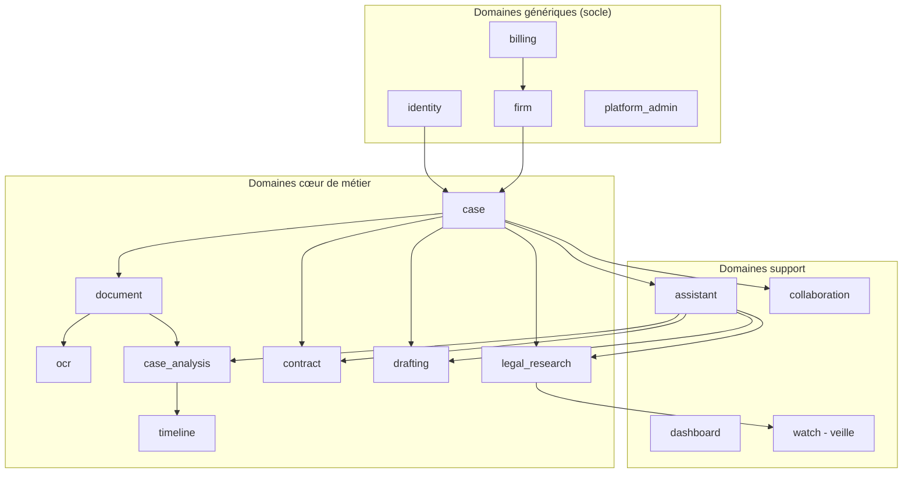

# Domain Driven Design — Bounded contexts

## Cartographie des bounded contexts



## Détail des bounded contexts (V1)

### `identity` (domaine générique)
Utilisateurs, rôles, permissions (RBAC), authentification OAuth2, MFA,
invitations, sessions. Agrégat racine : `User`. Value objects : `Email`,
`Role`, `Permission`.

### `firm` (domaine générique)
Cabinet (tenant), paramétrage, marque, membres. Agrégat racine : `Firm`.

### `billing` (domaine générique)
Abonnements (Solo / Cabinet / Entreprise), essai gratuit, usage, intégration
Stripe, webhooks. Agrégat racine : `Subscription`.

### `platform_admin` (domaine générique)
Supervision multi-tenant, audit global, feature flags, configuration des
connecteurs et fournisseurs de modèles disponibles pour un cabinet.

### `case` (domaine cœur)
Dossier juridique : parties, phases, statut, juridiction, échéances.
Agrégat racine : `Case`. C'est le pivot autour duquel gravitent la plupart
des autres contextes (document, timeline, contract, drafting...).

### `document` (domaine cœur)
Pièces déposées dans un dossier : métadonnées, versionning, classification,
stockage. Agrégat racine : `Document`.

### `ocr` (domaine cœur)
Extraction de texte depuis PDF/scans/images, normalisation. Orchestré en
tâche asynchrone Celery. Port `OcrEnginePort` interchangeable
(Tesseract, moteur cloud...).

### `case_analysis` (domaine cœur)
Reconnaissance d'entités (personnes, sociétés, faits, dates, contrats,
événements, juridictions, montants), détection d'incohérences, préparation
de chronologie automatique. Consomme le RAG et les agents IA.

### `timeline` (domaine cœur)
Construction et édition de frises chronologiques à partir des faits extraits
par `case_analysis`, avec édition manuelle par l'avocat.

### `contract` (domaine cœur)
Analyse de contrats, détection de risques, comparaison de versions,
génération de rapports.

### `drafting` (domaine cœur)
Génération de brouillons de documents (consultations, conclusions,
assignations, requêtes, courriers, notes internes). Tout document produit
porte un statut `DRAFT` explicite tant qu'il n'est pas validé par un
avocat.

### `legal_research` (domaine cœur)
Recherche documentaire via connecteurs configurables (codes, textes,
jurisprudence, doctrine) et recherche de jurisprudence pertinente.
Port `LegalSourceConnectorPort` interchangeable.

### `assistant` (domaine support)
Interface de chat multi-agents, orchestration des conversations,
historique des échanges liés à un dossier.

### `dashboard` (domaine support)
Agrégation de données en lecture (CQRS - côté Query) pour la vue cabinet /
dossier / utilisateur.

### `collaboration` (domaine support)
Commentaires, historique, validation, versionning collaboratif, gestion de
tâches liées à un dossier.

### `watch` — veille (domaine support)
Suivi des évolutions juridiques depuis les connecteurs configurés,
génération d'alertes ciblées.

## Langage ubiquitaire (extrait)

| Terme | Définition |
|---|---|
| Dossier (`Case`) | Unité de travail juridique regroupant parties, pièces, analyses et productions |
| Pièce (`Document`) | Fichier déposé dans un dossier, avec métadonnées et version |
| Brouillon (`Draft`) | Production générée par TMIS, non opposable, à valider par l'avocat |
| Citation | Référence traçable vers un document source consultable |
| Connecteur | Adaptateur interchangeable vers une source juridique externe |
| Agent | Composant IA spécialisé dans une tâche du domaine (analyse, recherche...) |
| Chef d'Orchestre | Composant qui découpe une demande en tâches et choisit les agents |

## Arborescence complète du backend

```
backend/
├── pyproject.toml
├── alembic.ini
├── Dockerfile
├── .env.example
├── alembic/
│   ├── env.py
│   └── versions/
├── src/
│   └── tmis/
│       ├── __init__.py
│       ├── main.py                     # Point d'entrée FastAPI
│       ├── core/
│       │   ├── config.py               # Settings (pydantic-settings)
│       │   ├── logging.py              # Logs structurés JSON
│       │   ├── security.py             # JWT, hashing, RBAC helpers
│       │   ├── database.py             # Session SQLAlchemy, engine
│       │   └── observability.py        # OpenTelemetry / metrics
│       ├── domain/
│       │   ├── identity/{entities,value_objects,ports}.py
│       │   ├── firm/...
│       │   ├── billing/...
│       │   ├── case/...
│       │   ├── document/...
│       │   ├── ocr/...
│       │   ├── case_analysis/...
│       │   ├── timeline/...
│       │   ├── contract/...
│       │   ├── drafting/...
│       │   ├── legal_research/...
│       │   ├── assistant/...
│       │   ├── dashboard/...
│       │   ├── collaboration/...
│       │   └── watch/...
│       ├── application/
│       │   └── <bounded_context>/{commands,queries}.py
│       ├── infrastructure/
│       │   ├── persistence/
│       │   │   ├── models.py           # Modèles SQLAlchemy
│       │   │   └── repositories.py     # Implémentations des ports
│       │   ├── model_providers/
│       │   │   ├── openai_adapter.py
│       │   │   ├── anthropic_adapter.py
│       │   │   ├── mistral_adapter.py
│       │   │   └── local_adapter.py
│       │   ├── legal_connectors/
│       │   │   ├── codes_connector.py
│       │   │   ├── jurisprudence_connector.py
│       │   │   └── doctrine_connector.py
│       │   └── storage/                # Stockage fichiers (S3-compatible)
│       ├── api/
│       │   └── v1/
│       │       ├── router.py
│       │       └── <bounded_context>/{routes.py,schemas.py}
│       └── agents/
│           ├── orchestrator.py         # Chef d'Orchestre (LangGraph)
│           ├── analysis_agent.py
│           ├── research_agent.py
│           ├── jurisprudence_agent.py
│           ├── contract_agent.py
│           ├── strategy_agent.py
│           ├── drafting_agent.py
│           ├── verifier_agent.py
│           ├── synthesis_agent.py
│           ├── collaboration_agent.py
│           └── watch_agent.py
└── tests/
    ├── unit/
    ├── integration/
    └── e2e/
```
