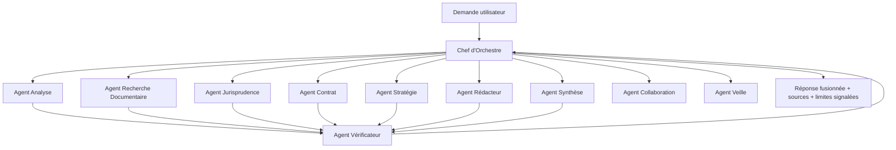
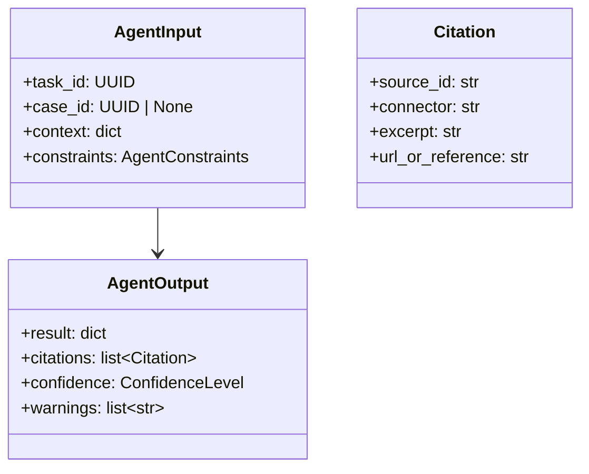

# Stratégie multi-agents

TMIS fonctionne comme une équipe d'experts orchestrée par LangGraph. Chaque
agent est un nœud spécialisé, invoqué par le Chef d'Orchestre, avec un
contrat d'entrée/sortie strict et un accès limité à ses propres outils.

## Graphe d'orchestration

## Rôle de chaque agent

| Agent | Rôle | Entrées | Sorties |
|---|---|---|---|
| **Chef d'Orchestre** | Découpe la demande en tâches, choisit et enchaîne les agents, fusionne et contrôle la cohérence globale | Requête utilisateur, contexte dossier | Plan d'exécution, réponse fusionnée |
| **Analyse** | Reconnaît personnes, sociétés, faits, dates, contrats, événements, juridictions, montants ; détecte les incohérences ; construit une chronologie | Documents du dossier (via RAG) | Entités structurées, incohérences, chronologie brute |
| **Recherche Documentaire** | Interroge les connecteurs vers les sources juridiques configurées (codes, textes, jurisprudence, doctrine) | Requête, filtres, droits disponibles | Extraits + références sourcées |
| **Jurisprudence** | Recherche des décisions pertinentes, compare les solutions, explique leur intérêt | Question juridique, contexte dossier | Décisions classées + analyse comparative |
| **Contrat** | Analyse un contrat, détecte les risques, compare plusieurs versions | Contrat(s) | Rapport de risques, tableau comparatif |
| **Stratégie** | Propose plusieurs pistes d'analyse, arguments favorables/défavorables, hypothèses à valider | Faits, recherche, jurisprudence | Pistes argumentées + hypothèses ouvertes |
| **Rédacteur** | Prépare des projets de documents (consultations, conclusions, assignations, requêtes, courriers, notes internes) | Faits validés, recherche, stratégie | Brouillon marqué `DRAFT` |
| **Vérificateur** | Vérifie cohérence, citations, sources, contradictions, doublons ; signale les limites | Sortie de tout autre agent | Rapport de vérification + avertissements |
| **Synthèse** | Produit chronologies, résumés, tableaux, fiches, checklists | Résultats des autres agents | Documents de synthèse structurés |
| **Collaboration** | Historique, commentaires, validation, versionning, gestion de tâches | Actions utilisateurs | Journal d'activité, tâches |
| **Veille** | Suit les évolutions juridiques depuis les sources configurées, génère des alertes | Sources configurées, profils utilisateurs | Alertes ciblées |

## Contrat commun à tous les agents

Chaque agent respecte un contrat d'E/S homogène pour rester composable dans
le graphe LangGraph :

- Toute sortie citant une source documentaire porte une liste de
  `Citation` consultables.
- Toute incertitude est portée par `confidence` et `warnings`, jamais
  silencieuse.
- Aucun agent n'écrit directement en base : il retourne un résultat que
  l'application (couche `application/`) persiste après validation
  éventuelle du Vérificateur.

## Le Chef d'Orchestre reste maître

Le Chef d'Orchestre :
1. reçoit la demande (chat, action UI, tâche planifiée) ;
2. la découpe en sous-tâches typées ;
3. sélectionne les agents pertinents et l'ordre d'exécution (séquentiel ou
   parallèle selon les dépendances) ;
4. transmet systématiquement les sorties sensibles (citations, brouillons,
   analyses) à l'Agent Vérificateur avant fusion ;
5. fusionne les résultats et renvoie une réponse unique, avec sources et
   limites explicites.

## Indépendance vis-à-vis des fournisseurs de modèles

Chaque agent invoque le LLM via `ModelProviderPort` (voir
`03-architecture-technique.md`), jamais directement un SDK propriétaire.
Le fournisseur (OpenAI, Anthropic, Mistral, modèle open source auto-hébergé)
est choisi par configuration, potentiellement différent par agent (ex :
un modèle rapide/économique pour la Synthèse, un modèle plus capable pour
la Stratégie).
