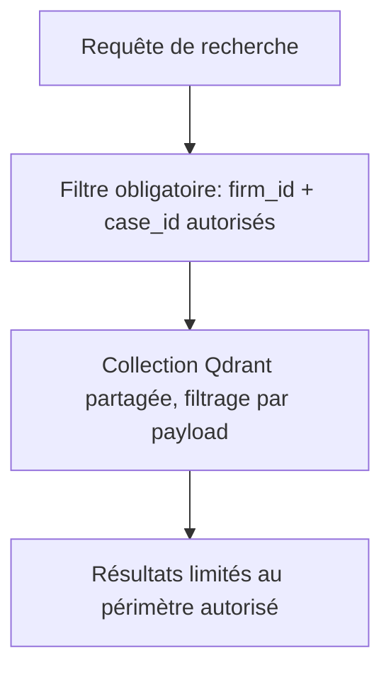

# Stratégie RAG

## Pipeline

```mermaid
flowchart LR
    F[Dépôt d'une pièce] --> ING[Ingestion]
    ING --> OCR[OCR]
    OCR --> CLEAN[Nettoyage / normalisation]
    CLEAN --> CHUNK[Chunking]
    CHUNK --> EMB[Embeddings]
    EMB --> IDX[Indexation Qdrant]

    Q[Requête utilisateur / agent] --> HYB[Recherche hybride: vectorielle + lexicale]
    IDX --> HYB
    HYB --> RERANK[Reranking]
    RERANK --> CACHE{Cache hit?}
    CACHE -->|oui| RESP[Réponse + citations]
    CACHE -->|non| MEM[Assemblage contexte + mémoire conversationnelle]
    MEM --> LLM[Appel modèle IA]
    LLM --> CIT[Attache citations traçables]
    CIT --> RESP
    RESP --> CACHE
```

## Détail des étapes

1. **Ingestion** : réception du fichier (upload UI, import en masse),
   stockage brut, mise en file Celery.
2. **OCR** : extraction de texte pour les documents scannés/images via
   `OcrEnginePort` (moteur interchangeable).
3. **Nettoyage** : suppression des artefacts OCR, normalisation Unicode,
   détection de langue, structuration minimale (titres, articles).
4. **Chunking** : découpage sémantique (par article/clause/paragraphe avec
   chevauchement contrôlé), conservation des métadonnées de provenance
   (dossier, document, page, position).
5. **Embeddings** : vectorisation via le fournisseur de modèles configuré
   (`ModelProviderPort.embed`), modèle interchangeable par cabinet.
6. **Indexation** : écriture dans Qdrant avec métadonnées filtrables
   (`firm_id`, `case_id`, `document_id`, type de source, date, connecteur).
   L'isolation multi-tenant est appliquée au niveau du filtre de recherche,
   jamais laissée à la discrétion du prompt.
7. **Recherche hybride** : combinaison recherche vectorielle (similarité
   sémantique) et recherche lexicale (BM25 / full-text PostgreSQL) pour
   couvrir aussi bien les questions ouvertes que les références précises
   (numéro d'article, référence de décision).
8. **Reranking** : ré-ordonnancement des résultats hybrides par un modèle
   de reranking dédié pour maximiser la pertinence avant transmission au
   LLM.
9. **Cache** : cache de requêtes/réponses (Redis) par empreinte de
   requête + périmètre (dossier/cabinet), invalidé à chaque nouvelle
   indexation pertinente.
10. **Mémoire** : mémoire conversationnelle courte (fil de discussion) et
    mémoire longue (résumés de dossier) injectées dans le contexte, gérées
    par l'Agent Synthèse.
11. **Citations** : chaque passage utilisé dans une réponse est restitué
    avec sa référence exacte (document, page/article, connecteur source),
    cliquable côté frontend.
12. **Connecteurs interchangeables** : les sources externes (codes, textes,
    jurisprudence, doctrine) sont branchées via `LegalSourceConnectorPort`
    et injectées dans le même pipeline de recherche hybride, avec leur
    propre stratégie de cache et de fraîcheur (utile pour l'Agent Veille).

## Isolation multi-tenant dans Qdrant

Une collection Qdrant unique est utilisée en V1 avec filtrage strict par
payload (`firm_id` obligatoire sur toute requête), plutôt qu'une collection
par tenant, pour limiter la charge opérationnelle tout en gardant la
possibilité de migrer vers des collections dédiées pour les plus gros
comptes ("Entreprise") si nécessaire.

## Qualité et vérifiabilité

- Aucune réponse ne peut citer un extrait qui n'a pas été effectivement
  retrouvé et transmis par le pipeline (pas de citation « inventée » :
  l'agent Vérificateur croise les citations retournées avec les identifiants
  de chunks réellement récupérés).
- Le niveau de confiance de la réponse dépend du score de reranking : sous
  un seuil configurable, la réponse est explicitement marquée incertaine.
