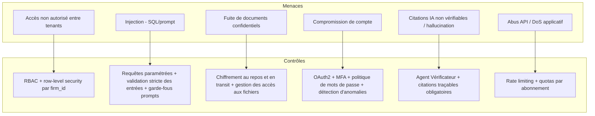
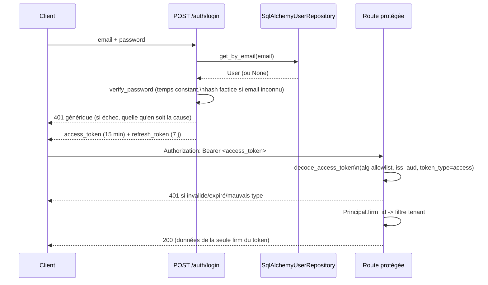

# Stratégie sécurité & RGPD

## Principes

TMIS traite des données à caractère personnel et des données couvertes par
le secret professionnel de l'avocat. La sécurité et la conformité RGPD sont
des exigences **de conception**, pas des ajouts a posteriori.

## Modèle de menaces (synthèse OWASP)



## Authentification & autorisation

- **OAuth2** (Authorization Code + PKCE pour le frontend) avec JWT signés,
  durée de vie courte + refresh token rotatif.
- **MFA** obligatoire pour les rôles à privilèges (administrateur cabinet,
  administrateur plateforme) et proposé à tous les utilisateurs.
- **RBAC** : rôles (Avocat, Collaborateur, Administrateur cabinet,
  Administrateur plateforme) avec permissions granulaires par module et
  par action ; contrôle appliqué à la fois côté API et côté requêtes de
  données (aucune permission gérée uniquement côté frontend).
- **Isolation multi-tenant** : tout accès aux données passe par un filtre
  `firm_id` non contournable, vérifié en base (row-level security
  PostgreSQL) en plus du filtrage applicatif.

### Modèle d'application : default-deny (ADR-SEC-02)

Avant le sprint sécurité, l'authentification était **opt-in par route** :
`0` route ne dépendait d'une vérification d'identité, et le tenant
(`firm_id`) provenait d'un header `X-Firm-Id` fourni par le client — donc
falsifiable. Ce modèle a été inversé : l'authentification est désormais
**appliquée globalement** par le routeur agrégateur, avec une **allowlist
publique explicite**. Une nouvelle route est protégée par défaut, sans
action du développeur.

```mermaid
flowchart LR
    subgraph Client
        A[Requête HTTP]
    end
    subgraph "API /api/v1 (tmis.api.v1.router)"
        B{public_router}
        C[/auth/login, /auth/refresh, /health/]
        D{protected_router\ndependencies=[get_current_principal]}
        E["get_current_principal\n(decode + valide le JWT)"]
        F["get_current_firm_id\n(firm_id = Principal.firm_id)"]
        G[Tous les autres routeurs\n(cases, documents, chat, ...)]
    end
    A --> B
    B -->|allowlist| C
    B -->|sinon| D
    D --> E
    E -->|401 si invalide/absent| A
    E --> F
    F --> G
```

Flux d'émission et de validation d'un token :



**Résolution du tenant** : `api/v1/case/routes.py` lisait `firm_id` depuis
un header `X-Firm-Id` fourni par le client. Ce chemin est supprimé —
`get_current_firm_id` (`tmis.api.deps`) ne lit plus que
`Principal.firm_id`, lui-même dérivé du JWT validé. Un `X-Firm-Id` envoyé
par le client n'a plus aucun effet (testé explicitement, voir
`tests/security/test_tenant_isolation.py::test_x_firm_id_header_is_ignored`).

**Garde d'isolation au niveau des données** : `tmis.core.tenancy.
scoped_query(model, firm_id)` est le seul point d'entrée qu'un repository
doit utiliser pour interroger un modèle multi-tenant — il refuse
(`TypeError`) de construire une requête sur un modèle qui ne déclare pas
de colonne `firm_id`. L'oubli du filtre tenant devient une erreur au
niveau du code, pas seulement une convention de revue.

**RBAC minimal** : `require_role(*roles)` / `require_scope(*scopes)`
(`tmis.api.deps`) sont des dépendances FastAPI qui lisent le `Principal`
déjà validé et lèvent `403` si le rôle/scope est insuffisant. Le sprint
pose le pattern et l'applique à deux routes sensibles
(`identity-platform/dashboard`, `identity-platform/security-events`) —
l'appliquer systématiquement au reste de l'API est une dette du sprint
suivant.

### Référence API — `/auth`

| Route | Description |
|---|---|
| `POST /api/v1/auth/login` | `{email, password}` → `{access_token, refresh_token, token_type}`. Réponse `401` générique et indistinguable pour un email inconnu, un mauvais mot de passe, ou un compte désactivé (pas d'énumération de comptes). |
| `POST /api/v1/auth/refresh` | `{refresh_token}` → un nouveau couple de tokens (rotation : l'utilisateur est rechargé depuis le repository, pas seulement relu depuis les anciens claims). Un access token présenté ici, ou un refresh token présenté à `/login`... à `/api/v1/cases`, sont rejetés (`token_type` vérifié). |

Ces deux routes sont les seules routes d'authentification de l'allowlist
publique — tout le reste de `/api/v1` exige `Authorization: Bearer
<access_token>`.

### Dette reconnue — deux stores utilisateurs (ADR-SEC-01)

`tmis.identity_platform` (OAuth2/OIDC/RBAC/MFA riches, mais en mémoire,
sans persistance) reste **non branché** sur le chemin de requête réel.
Ce sprint retient `tmis.domain.identity` +
`SqlAlchemyUserRepository` (persistant) comme unique source
d'authentification (ADR-SEC-01) — on ne fait pas les deux à la fois. La
réconciliation des deux stores (faire de `identity_platform` la
véritable couche IAM, ou migrer son contenu vers `domain.identity`) est
une dette explicite, à traiter dans un sprint dédié.

## Protection des données (RGPD)

- **Minimisation** : seules les données nécessaires à la fonctionnalité
  sont collectées.
- **Finalité** : chaque traitement (y compris les appels aux fournisseurs
  de modèles IA) documente sa finalité et sa base légale.
- **Registre des traitements** tenu à jour au fil des sprints.
- **Droits des personnes** : accès, rectification, effacement, portabilité,
  implémentés via des points d'entrée API dédiés dans `platform_admin`.
- **Suppression sécurisée** : suppression logique immédiate + purge
  physique planifiée (y compris dans les index Qdrant et les sauvegardes),
  traçée dans le journal d'audit.
- **Sous-traitants IA** : les fournisseurs de modèles sont sélectionnés
  avec des garanties contractuelles (pas d'entraînement sur les données
  clients, hébergement documenté) ; le choix du fournisseur est
  configurable par cabinet pour répondre à des exigences de souveraineté.
- **Conservation** : durées de conservation configurables par type de
  donnée, alignées sur les obligations professionnelles des avocats.

## Chiffrement

- **En transit** : TLS partout (frontend ↔ API, API ↔ services internes,
  API ↔ fournisseurs externes).
- **Au repos** : chiffrement des volumes de base de données et de
  stockage de fichiers ; secrets gérés via un coffre-fort de secrets, jamais
  en clair dans le code ou les variables d'environnement versionnées.
- **Champs sensibles** : chiffrement applicatif additionnel pour les
  données les plus sensibles (ex : pièces d'identité) lorsque pertinent.

## Audit & traçabilité

- Journal d'audit immuable (qui, quoi, quand, sur quelle donnée) pour
  toute action sensible : accès à un dossier, export, suppression,
  changement de permission, appel à un fournisseur IA externe.
- Logs applicatifs structurés (JSON), corrélés par `trace_id`
  (OpenTelemetry), sans donnée personnelle en clair dans les logs.

## Sécurité applicative (OWASP Top 10)

| Risque OWASP | Contrôle TMIS |
|---|---|
| Injection | ORM avec requêtes paramétrées, validation Pydantic stricte, garde-fous sur les prompts (séparation contenu utilisateur / instructions système) |
| Authentification défaillante | OAuth2 + MFA + verrouillage après tentatives échouées |
| Exposition de données sensibles | Chiffrement, filtrage RBAC, minimisation des payloads API |
| Contrôle d'accès défaillant | RBAC + row-level security, tests d'autorisation automatisés |
| Mauvaise configuration | Configuration as code, revue des secrets, scans automatisés en CI |
| Composants vulnérables | Analyse de dépendances automatisée en CI (SCA) |
| Journalisation insuffisante | Audit trail systématique + alerting sur anomalies |
| SSRF / requêtes sortantes | Liste blanche stricte de domaines pour les connecteurs externes |

## Sauvegardes & continuité

- Sauvegardes automatisées chiffrées de PostgreSQL et Qdrant, testées par
  restauration périodique.
- Plan de reprise documenté avec objectifs de RPO/RTO définis par palier
  d'abonnement.

## Sécurité spécifique IA

- Séparation stricte entre **instructions système** et **contenu
  utilisateur/documents** dans les prompts pour limiter les injections de
  prompt via des documents déposés.
- Limitation du périmètre d'action des agents (aucun agent n'exécute
  d'action irréversible sans validation humaine).
- Détection et marquage des réponses à faible confiance avant affichage.
