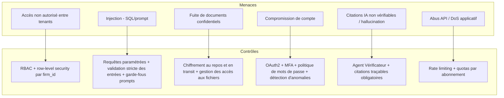

# Stratégie sécurité & RGPD

## Principes

TMIS traite des données à caractère personnel et des données couvertes par
le secret professionnel de l'avocat. La sécurité et la conformité RGPD sont
des exigences **de conception**, pas des ajouts a posteriori.

## Modèle de menaces (synthèse OWASP)

## Authentification & autorisation

- **OAuth2** (Authorization Code + PKCE pour le frontend) avec JWT signés,
  durée de vie courte + refresh token rotatif.
- **MFA** obligatoire pour les rôles à privilèges (administrateur cabinet,
  administrateur plateforme) et proposé à tous les utilisateurs.
- **RBAC** : rôles (Avocat, Collaborateur, Administrateur cabinet,
  Administrateur plateforme) avec permissions granulaires par module et
  par action ; contrôle appliqué à la fois côté API et côté requêtes de
  données (aucune permission gérée uniquement côté frontend).
- **Isolation multi-tenant** : tout accès aux données passe par un filtre
  `firm_id` non contournable, vérifié en base (row-level security
  PostgreSQL) en plus du filtrage applicatif.

## Protection des données (RGPD)

- **Minimisation** : seules les données nécessaires à la fonctionnalité
  sont collectées.
- **Finalité** : chaque traitement (y compris les appels aux fournisseurs
  de modèles IA) documente sa finalité et sa base légale.
- **Registre des traitements** tenu à jour au fil des sprints.
- **Droits des personnes** : accès, rectification, effacement, portabilité,
  implémentés via des points d'entrée API dédiés dans `platform_admin`.
- **Suppression sécurisée** : suppression logique immédiate + purge
  physique planifiée (y compris dans les index Qdrant et les sauvegardes),
  traçée dans le journal d'audit.
- **Sous-traitants IA** : les fournisseurs de modèles sont sélectionnés
  avec des garanties contractuelles (pas d'entraînement sur les données
  clients, hébergement documenté) ; le choix du fournisseur est
  configurable par cabinet pour répondre à des exigences de souveraineté.
- **Conservation** : durées de conservation configurables par type de
  donnée, alignées sur les obligations professionnelles des avocats.

## Chiffrement

- **En transit** : TLS partout (frontend ↔ API, API ↔ services internes,
  API ↔ fournisseurs externes).
- **Au repos** : chiffrement des volumes de base de données et de
  stockage de fichiers ; secrets gérés via un coffre-fort de secrets, jamais
  en clair dans le code ou les variables d'environnement versionnées.
- **Champs sensibles** : chiffrement applicatif additionnel pour les
  données les plus sensibles (ex : pièces d'identité) lorsque pertinent.

## Audit & traçabilité

- Journal d'audit immuable (qui, quoi, quand, sur quelle donnée) pour
  toute action sensible : accès à un dossier, export, suppression,
  changement de permission, appel à un fournisseur IA externe.
- Logs applicatifs structurés (JSON), corrélés par `trace_id`
  (OpenTelemetry), sans donnée personnelle en clair dans les logs.

## Sécurité applicative (OWASP Top 10)

| Risque OWASP | Contrôle TMIS |
|---|---|
| Injection | ORM avec requêtes paramétrées, validation Pydantic stricte, garde-fous sur les prompts (séparation contenu utilisateur / instructions système) |
| Authentification défaillante | OAuth2 + MFA + verrouillage après tentatives échouées |
| Exposition de données sensibles | Chiffrement, filtrage RBAC, minimisation des payloads API |
| Contrôle d'accès défaillant | RBAC + row-level security, tests d'autorisation automatisés |
| Mauvaise configuration | Configuration as code, revue des secrets, scans automatisés en CI |
| Composants vulnérables | Analyse de dépendances automatisée en CI (SCA) |
| Journalisation insuffisante | Audit trail systématique + alerting sur anomalies |
| SSRF / requêtes sortantes | Liste blanche stricte de domaines pour les connecteurs externes |

## Sauvegardes & continuité

- Sauvegardes automatisées chiffrées de PostgreSQL et Qdrant, testées par
  restauration périodique.
- Plan de reprise documenté avec objectifs de RPO/RTO définis par palier
  d'abonnement.

## Sécurité spécifique IA

- Séparation stricte entre **instructions système** et **contenu
  utilisateur/documents** dans les prompts pour limiter les injections de
  prompt via des documents déposés.
- Limitation du périmètre d'action des agents (aucun agent n'exécute
  d'action irréversible sans validation humaine).
- Détection et marquage des réponses à faible confiance avant affichage.
