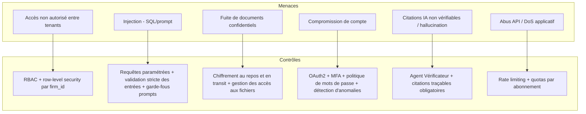
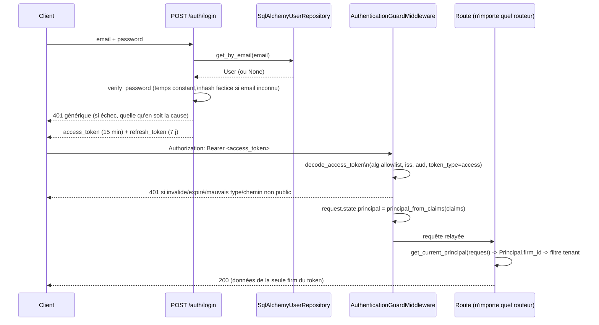

# Stratégie sécurité & RGPD

## Principes

TMIS traite des données à caractère personnel et des données couvertes par
le secret professionnel de l'avocat. La sécurité et la conformité RGPD sont
des exigences **de conception**, pas des ajouts a posteriori.

## Modèle de menaces (synthèse OWASP)



## Authentification & autorisation

- **OAuth2** (Authorization Code + PKCE pour le frontend) avec JWT signés,
  durée de vie courte + refresh token rotatif.
- **MFA** obligatoire pour les rôles à privilèges (administrateur cabinet,
  administrateur plateforme) et proposé à tous les utilisateurs.
- **RBAC** : rôles (Avocat, Collaborateur, Administrateur cabinet,
  Administrateur plateforme) avec permissions granulaires par module et
  par action ; contrôle appliqué à la fois côté API et côté requêtes de
  données (aucune permission gérée uniquement côté frontend).
- **Isolation multi-tenant** : tout accès aux données passe par un filtre
  `firm_id` non contournable, vérifié en base (row-level security
  PostgreSQL) en plus du filtrage applicatif.

### Modèle d'application : default-deny (ADR-SEC-02)

Avant le sprint sécurité, l'authentification était **opt-in par route** :
`0` route ne dépendait d'une vérification d'identité, et le tenant
(`firm_id`) provenait d'un header `X-Firm-Id` fourni par le client — donc
falsifiable. Ce modèle a été inversé : l'authentification est désormais
**appliquée globalement**, avec une **allowlist publique explicite**. Une
nouvelle route est protégée par défaut, sans action du développeur.

### SEC-HOTFIX-01 — l'enforcement remonte à la frontière de l'app (ADR-SEC-03)

Le default-deny d'ADR-SEC-02 avait été câblé comme une dépendance sur
`protected_router` (`tmis.api.v1.router`) — donc effective uniquement pour
les routeurs montés à travers ce fichier. Trois routeurs opérationnels
(`platform`, `cloud_operations`, `runtime_platform` — 67 routes) sont
montés directement sur `app` dans `main.py`, hors de `protected_router`,
et échappaient donc silencieusement à l'authentification : le plan de
contrôle et l'observabilité (traces, alertes, dashboards, tâches
d'orchestration, ...) étaient accessibles sans token. Le test de
non-régression du sprint (`test_unauthenticated_access.py`) ne l'a pas
détecté par construction : il n'échantillonnait que des contextes montés
sous `protected_router`, donc son périmètre épousait exactement celui du
trou.

**Correctif** : l'enforcement ne dépend plus du lieu de montage d'un
routeur. Une **garde unique** (`tmis.api.auth_guard.
AuthenticationGuardMiddleware`, middleware app-level) protège tout ce qui
n'est pas explicitement listé dans `PUBLIC_PATHS`
(`auth_guard.build_public_paths`) — quel que soit le routeur et quel que
soit l'endroit où il est monté sur `app`. `get_current_principal`
(`tmis.api.deps`) cesse de décoder le token lui-même : il devient un
simple lecteur de `request.state.principal`, posé une seule fois par la
garde — un seul décodage par requête, une seule source de vérité. La
dépendance `dependencies=[Depends(get_current_principal)]` a été retirée
de `protected_router` : la garde est désormais l'unique point
d'application, pour éviter deux mécanismes qui pourraient diverger. Le
split `public_router`/`protected_router` dans `tmis.api.v1.router` reste,
mais purement organisationnel — il ne fait plus rien fonctionnellement.

*Alternative rejetée* : ajouter `Depends(get_current_principal)` aux
trois routeurs ops directement. Ça bouche le trou du jour mais laisse le
lieu de montage comme piège permanent — le prochain routeur oublié
rouvrirait le même trou. Le correctif retenu corrige la classe de bug,
pas seulement l'instance.

**Inventaire `PUBLIC_PATHS`** (`auth_guard.build_public_paths`) — l'unique
liste des routes accessibles sans token :

| Chemin | Raison |
|---|---|
| `/` | Racine de l'app (statut du service) |
| `/docs`, `/redoc`, `/openapi.json` | Documentation OpenAPI |
| `{api_v1_prefix}/health` | Sonde de supervision applicative |
| `{api_v1_prefix}/auth/login`, `{api_v1_prefix}/auth/refresh` | Émettent les tokens — ne peuvent pas en exiger un |
| `/platform/health/live` | Sonde liveness Kubernetes |
| `/platform/health/ready` | Sonde readiness Kubernetes |

**Décision `metrics`** : `/platform/metrics` et `/cloud-operations/metrics/*`
restent **protégés par défaut** — absents de `PUBLIC_PATHS` volontairement.
Un scraping Prometheus non authentifié n'est pas un ajout silencieux à
l'allowlist : ce serait une entrée explicite, justifiée, adossée à une
`NetworkPolicy` (`deploy/kubernetes/networkpolicy.yaml`) restreignant la
source du scrape. Par défaut, la métrologie interne n'est pas diffusée
sans token.

**Ordre des middlewares** (`main.py`) : `AuthenticationGuardMiddleware`
est enregistrée en premier, donc la plus interne — chaque middleware
ajoutée après elle (CORS en tête) l'enveloppe et continue de s'appliquer
même à un 401 qu'elle court-circuite. C'est nécessaire pour CORS en
particulier : si `CORSMiddleware` n'enveloppait pas la garde, un 401
renvoyé par la garde n'aurait pas d'en-tête `Access-Control-Allow-Origin`
et le navigateur afficherait une erreur CORS opaque au lieu du 401 (testé
dans `tests/security/test_unauthenticated_access.py::
test_a_401_from_the_guard_still_carries_cors_headers`). La méthode
`OPTIONS` (préflight CORS) contourne systématiquement la garde — un
préflight ne porte jamais de token.

```mermaid
flowchart LR
    subgraph Client
        A[Requête HTTP]
    end
    subgraph "app (main.py)"
        M{AuthenticationGuardMiddleware}
        P["PUBLIC_PATHS\n(build_public_paths)"]
        D["decode_access_token +\nprincipal_from_claims"]
        S["request.state.principal"]
        R[Routeur concerné\n(api_router, platform,\ncloud_operations, runtime_platform)]
        G["get_current_principal\n(lecteur de request.state.principal)"]
    end
    A --> M
    M -->|path dans PUBLIC_PATHS\nou méthode OPTIONS| R
    M -->|sinon| D
    D -->|401 si absent/invalide| A
    D --> S --> R
    R -->|route en a besoin| G
```

Flux d'émission et de validation d'un token :



**Résolution du tenant** : `api/v1/case/routes.py` lisait `firm_id` depuis
un header `X-Firm-Id` fourni par le client. Ce chemin est supprimé —
`get_current_firm_id` (`tmis.api.deps`) ne lit plus que
`Principal.firm_id`, lui-même dérivé du JWT validé. Un `X-Firm-Id` envoyé
par le client n'a plus aucun effet (testé explicitement, voir
`tests/security/test_tenant_isolation.py::test_x_firm_id_header_is_ignored`).

**Garde d'isolation au niveau des données** : `tmis.core.tenancy.
scoped_query(model, firm_id)` est le seul point d'entrée qu'un repository
doit utiliser pour interroger un modèle multi-tenant — il refuse
(`TypeError`) de construire une requête sur un modèle qui ne déclare pas
de colonne `firm_id`. L'oubli du filtre tenant devient une erreur au
niveau du code, pas seulement une convention de revue.

**Généralisation du pattern (tranche `cases -> drafting`)** : `case`
prouvait le pattern sur un seul modèle ; `legal_drafting.documents`
(brouillons + versions) est le premier module stateful à le reprendre —
store construit par requête sur `Depends(get_current_firm_id)`, chaque
lecture/écriture via `scoped_query`, appartenance d'un dossier référencé
vérifiée via `SqlAlchemyCaseRepository.get_by_id(case_id, firm_id)` avant
toute création de brouillon. Voir docs/28-legal-drafting.md §
"Persistance & isolation multi-tenant" (ADR-SLICE-01/02/03) pour le
détail et pour la dette assumée (historique/validation/review/style
restent en mémoire, donc partagés entre cabinets, cette tranche-ci) — les
28 autres modules ne sont pas généralisés par ce sprint.

**Généralisation du pattern (tranche `legal_research`)** : deuxième
module stateful à reprendre le pattern, avec deux écarts propres que la
tranche `cases -> drafting` n'avait pas — traités avec le même sérieux
que l'isolation des données, pas comme une optimisation : `firm_id`
préfixé dans **toutes** les clés du cache de recherche (`ResearchCache`,
ADR-RESEARCH-01 — un connecteur privé mal scopé aurait servi les
résultats d'un cabinet à un autre) et l'état d'une recherche
(`_responses`/`_citations`, autrefois sur le singleton lui-même) devenu
une table persistante, `research_searches`, scopée `firm_id`
(ADR-RESEARCH-02) — nécessaire pour qu'un `GET /searches/{search_id}`,
sur une requête et un orchestrateur différents de celui qui a produit la
recherche, la retrouve encore. Voir docs/21-legal-research.md §
"Persistance & isolation multi-tenant" pour le détail et pour la dette
assumée (`legal_reasoning` et `tmis.agents` composent toujours
`ResearchOrchestrator` en dehors de toute requête HTTP, via un singleton
non isolé délibérément préservé — leur propre passage à l'isolation est
un chantier séparé ; les métriques d'`evaluation` restent elles aussi
non scopées, hors périmètre — voir l'Axe B de la roadmap).

**Généralisation du pattern (tranche `case_intelligence`)** : troisième
module stateful à reprendre le pattern, avec un écart propre que ni
`cases -> drafting` ni `legal_research` n'avaient : faire traverser
`firm_id` **hors de la requête HTTP**. `CaseProfile` a trois points
d'écriture — une route web, une tâche Celery
(`trigger_case_workflow_task`) et un handler d'événement de domaine
(`DocumentProcessed`) — et seul le premier passait par une requête avant
cette tranche. `firm_id` est désormais un argument obligatoire de la
tâche et un champ de l'événement, vérifié contre le dossier propriétaire
(`SqlAlchemyCaseRepository.get_by_id`) aux trois points d'entrée, pas
seulement à la frontière web (ADR-CASEINT-01/02) — un test dédié invoque
la tâche et publie l'événement directement, sans passer par HTTP, pour
le prouver (`tests/security/test_case_intelligence_isolation.py`,
`test_trigger_case_workflow_task_rejects_a_case_owned_by_another_firm`,
`test_document_processed_event_rejects_a_case_owned_by_another_firm`) :
une suite qui ne testerait que les routes passerait au vert même si ce
chemin async fuyait encore. Voir docs/19-case-intelligence.md §
"Persistance & isolation multi-tenant" pour le détail, la règle de
migration two-step sur une table déjà peuplée (première du gabarit dans
ce cas) et la dette assumée (`legal_reasoning`/`tmis.agents`/`chat` sur
le même singleton non isolé délibérément préservé que `legal_research` ;
le graphe de relations reste volatile).

**RBAC minimal** : `require_role(*roles)` / `require_scope(*scopes)`
(`tmis.api.deps`) sont des dépendances FastAPI qui lisent le `Principal`
déjà validé et lèvent `403` si le rôle/scope est insuffisant. Le sprint
pose le pattern et l'applique à deux routes sensibles
(`identity-platform/dashboard`, `identity-platform/security-events`) —
l'appliquer systématiquement au reste de l'API est une dette du sprint
suivant.

### Référence API — `/auth`

| Route | Description |
|---|---|
| `POST /api/v1/auth/login` | `{email, password}` → `{access_token, refresh_token, token_type}`. Réponse `401` générique et indistinguable pour un email inconnu, un mauvais mot de passe, ou un compte désactivé (pas d'énumération de comptes). |
| `POST /api/v1/auth/refresh` | `{refresh_token}` → un nouveau couple de tokens (rotation : l'utilisateur est rechargé depuis le repository, pas seulement relu depuis les anciens claims). Un access token présenté ici, ou un refresh token présenté à `/login`... à `/api/v1/cases`, sont rejetés (`token_type` vérifié). |

Ces deux routes sont les seules routes d'authentification de l'allowlist
publique — tout le reste de `/api/v1` exige `Authorization: Bearer
<access_token>`.

### Dette reconnue — deux stores utilisateurs (ADR-SEC-01)

`tmis.identity_platform` (OAuth2/OIDC/RBAC/MFA riches, mais en mémoire,
sans persistance) reste **non branché** sur le chemin de requête réel.
Ce sprint retient `tmis.domain.identity` +
`SqlAlchemyUserRepository` (persistant) comme unique source
d'authentification (ADR-SEC-01) — on ne fait pas les deux à la fois. La
réconciliation des deux stores (faire de `identity_platform` la
véritable couche IAM, ou migrer son contenu vers `domain.identity`) est
une dette explicite, à traiter dans un sprint dédié.

## Protection des données (RGPD)

- **Minimisation** : seules les données nécessaires à la fonctionnalité
  sont collectées.
- **Finalité** : chaque traitement (y compris les appels aux fournisseurs
  de modèles IA) documente sa finalité et sa base légale.
- **Registre des traitements** tenu à jour au fil des sprints.
- **Droits des personnes** : accès, rectification, effacement, portabilité,
  implémentés via des points d'entrée API dédiés dans `platform_admin`.
- **Suppression sécurisée** : suppression logique immédiate + purge
  physique planifiée (y compris dans les index Qdrant et les sauvegardes),
  traçée dans le journal d'audit.
- **Sous-traitants IA** : les fournisseurs de modèles sont sélectionnés
  avec des garanties contractuelles (pas d'entraînement sur les données
  clients, hébergement documenté) ; le choix du fournisseur est
  configurable par cabinet pour répondre à des exigences de souveraineté.
- **Conservation** : durées de conservation configurables par type de
  donnée, alignées sur les obligations professionnelles des avocats.

## Chiffrement

- **En transit** : TLS partout (frontend ↔ API, API ↔ services internes,
  API ↔ fournisseurs externes).
- **Au repos** : chiffrement des volumes de base de données et de
  stockage de fichiers ; secrets gérés via un coffre-fort de secrets, jamais
  en clair dans le code ou les variables d'environnement versionnées.
- **Champs sensibles** : chiffrement applicatif additionnel pour les
  données les plus sensibles (ex : pièces d'identité) lorsque pertinent.

## Audit & traçabilité

- Journal d'audit immuable (qui, quoi, quand, sur quelle donnée) pour
  toute action sensible : accès à un dossier, export, suppression,
  changement de permission, appel à un fournisseur IA externe.
- Logs applicatifs structurés (JSON), corrélés par `trace_id`
  (OpenTelemetry), sans donnée personnelle en clair dans les logs.

## Sécurité applicative (OWASP Top 10)

| Risque OWASP | Contrôle TMIS |
|---|---|
| Injection | ORM avec requêtes paramétrées, validation Pydantic stricte, garde-fous sur les prompts (séparation contenu utilisateur / instructions système) |
| Authentification défaillante | OAuth2 + MFA + verrouillage après tentatives échouées |
| Exposition de données sensibles | Chiffrement, filtrage RBAC, minimisation des payloads API |
| Contrôle d'accès défaillant | RBAC + row-level security, tests d'autorisation automatisés |
| Mauvaise configuration | Configuration as code, revue des secrets, scans automatisés en CI |
| Composants vulnérables | Analyse de dépendances automatisée en CI (SCA) |
| Journalisation insuffisante | Audit trail systématique + alerting sur anomalies |
| SSRF / requêtes sortantes | Liste blanche stricte de domaines pour les connecteurs externes |

## Sauvegardes & continuité

- Sauvegardes automatisées chiffrées de PostgreSQL et Qdrant, testées par
  restauration périodique.
- Plan de reprise documenté avec objectifs de RPO/RTO définis par palier
  d'abonnement.

## Sécurité spécifique IA

- Séparation stricte entre **instructions système** et **contenu
  utilisateur/documents** dans les prompts pour limiter les injections de
  prompt via des documents déposés.
- Limitation du périmètre d'action des agents (aucun agent n'exécute
  d'action irréversible sans validation humaine).
- Détection et marquage des réponses à faible confiance avant affichage.
