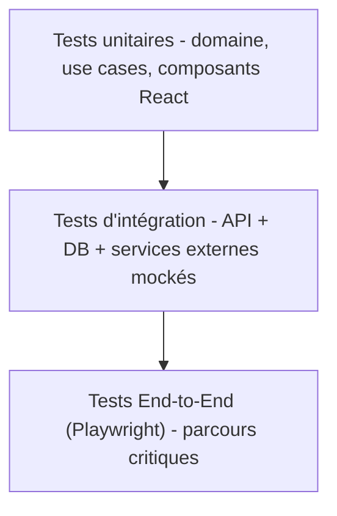

# Plan de tests

## Pyramide de tests

La majorité des tests sont unitaires (rapides, isolés), un socle
raisonnable de tests d'intégration couvre les interactions
API/DB/connecteurs, un nombre volontairement restreint de tests E2E couvre
les parcours métier critiques.

## Backend

- **Tests unitaires** (`backend/tests/unit`) : entités de domaine, value
  objects, use cases (avec ports mockés), agents (logique de découpage,
  formatage des sorties) — sans dépendance réseau/DB.
- **Tests d'intégration** (`backend/tests/integration`) : routers FastAPI
  avec base de test PostgreSQL (conteneur), repositories SQLAlchemy,
  pipeline RAG avec Qdrant de test, connecteurs avec doubles de test.
- **Tests de contrat** : validation du schéma OpenAPI généré à chaque
  build (non-régression de contrat API).
- **Tests de sécurité automatisés** : tests d'autorisation (RBAC,
  isolation multi-tenant — vérifier qu'un utilisateur du cabinet A ne peut
  jamais lire une donnée du cabinet B), scan de dépendances (SCA), lint de
  sécurité (Bandit).

## Frontend

- **Tests unitaires** (Vitest + React Testing Library) : composants,
  hooks, utilitaires.
- **Tests d'intégration** : pages avec API mockée (MSW).
- **Tests End-to-End** (Playwright) : parcours critiques — connexion,
  création d'un dossier, dépôt d'une pièce, lancement d'une analyse,
  consultation des citations, génération d'un brouillon.

## Tests spécifiques IA / RAG

- **Tests de non-hallucination** : jeu de questions/réponses de référence
  vérifiant que chaque citation retournée correspond à un chunk réellement
  indexé (pas de référence inventée).
- **Tests de pertinence** : jeu d'évaluation (golden set) mesurant la
  qualité de la recherche hybride et du reranking (precision@k, recall@k).
- **Tests de régression de prompts** : snapshot des sorties d'agents sur
  des cas représentatifs pour détecter les régressions lors des évolutions
  de prompt ou de modèle.
- **Tests d'isolation multi-tenant du RAG** : vérifier qu'une recherche ne
  peut jamais retourner un document d'un autre cabinet.

## Couverture et qualité

- Couverture cible : ≥ 80 % sur le domaine et l'application (backend),
  ≥ 70 % sur les composants critiques (frontend).
- 100 % typé (mypy strict côté backend, `strict` TypeScript côté frontend) —
  le typage fait partie de la définition de "fini".
- Aucune fusion sur la branche principale sans CI verte (lint, types,
  tests unitaires + intégration, scan de sécurité).

## Environnements de test

- **Local** : Docker Compose dédié aux tests (base éphémère).
- **CI** (GitHub Actions) : services PostgreSQL/Redis/Qdrant en conteneurs
  éphémères, exécution à chaque pull request.
- **Staging** : environnement Kubernetes de préproduction pour les tests
  E2E et de charge avant chaque mise en production.

## Tests de performance

- Tests de charge sur les endpoints critiques (recherche, ingestion) avant
  chaque mise en production majeure.
- Suivi des temps de réponse P50/P95/P99 par endpoint via l'observabilité
  (voir `03-architecture-technique.md`).
