# Roadmap détaillée — 41 sprints

> Le nombre de sprints a évolué au fil des révisions (voir notes
> ci-dessous) ; l'intitulé et le nom de fichier d'origine ("30 sprints")
> sont conservés pour la stabilité des liens.

Méthode : à chaque sprint — expliquer les choix techniques, générer
uniquement le code du sprint, générer les tests, mettre à jour la
documentation, vérifier que le projet compile et fonctionne, puis
**s'arrêter en attendant la validation** avant de passer au sprint
suivant.

> **Note de révision (après Sprint 4)** : la roadmap initiale prévoyait
> `Identity & Firm` au Sprint 2. Le CTO a choisi de prioriser le socle IA
> (Sprint 2 — AI Kernel), le socle documentaire (Sprint 3 — Document
> Intelligence Engine) puis le socle métier des dossiers (Sprint 4 — Case
> Intelligence Engine) avant toute fonctionnalité métier applicative, y
> compris avant l'authentification. Le total reste fixé à 30 sprints :
> l'ancien Sprint 10 "Orchestrateur LangGraph" est couvert par le
> Sprint 2, l'ancien Sprint 7 "OCR" par le Sprint 3, et l'ancien Sprint 6
> "Module Case" (CRUD dossiers — déjà livré au Sprint 1, voir
> `tmis.domain.case`) par le Sprint 4, qui construit la véritable couche
> d'intelligence par-dessus. Le futur sprint « Agent Synthèse narrative »
> (voir la table détaillée pour son numéro à jour) se recentre sur la
> rédaction narrative de synthèses (la consolidation chronologique
> elle-même est déjà assurée par le CIE).

> **Note de révision (après Sprint 5)** : même logique pour le socle
> recherche documentaire. Le Sprint 5 livre le **Legal Research Engine**
> (`tmis.legal_research`, docs/21-24) avec des connecteurs simulés — ce
> qui couvre par anticipation l'ancien Sprint 9 "Connecteurs recherche
> documentaire réels" côté architecture (le classement, la
> normalisation, les citations, le cache trois couches et l'API sont
> déjà en place) et l'ancien Sprint 10 "Recherche hybride avancée" côté
> mécanique de scoring (lexical + vectoriel). Ces deux sprints sont donc
> recentrés : le Sprint 9 devient le branchement de **vraies** sources
> derrière les connecteurs déjà écrits (aucun nouveau module), et le
> Sprint 10 devient l'industrialisation du cache (Redis en production) et
> d'un reranker appris, plutôt que la construction de la mécanique
> elle-même. Le total reste fixé à 30 sprints.

> **Note de révision (après Sprint 6)** : le Sprint 6 livre le **Legal
> Reasoning Engine** (`tmis.legal_reasoning`, docs/25-27) juste après le
> Legal Research Engine, avant `Identity & Firm` et tout le reste du
> socle applicatif — même logique de priorisation qu'aux sprints
> précédents : construire le raisonnement avant les fonctionnalités qui
> s'appuieront dessus. `Identity & Firm`, `Billing`, `Module Document`,
> et les deux sprints RAG/recherche gardent leur contenu mais glissent
> chacun d'un cran (S6→S7, S7→S8, S8→S9, S9→S10, S10→S11). L'ancien
> Sprint 19 "Agent Stratégie" (pistes argumentées, hypothèses à valider)
> est entièrement couvert par les modules `strategy`/`hypotheses`/
> `validation` livrés ce sprint et disparaît donc de la roadmap comme
> sprint dédié — sur le même principe que l'ancien Sprint 6 "Module
> Case" absorbé par le Sprint 4. Tout ce qui suivait l'ancien Sprint 19
> (Agent Collaboration, Agent Veille, et toute la Phase 4/5) garde
> exactement son numéro : l'insertion du Sprint 6 et la suppression de
> l'ancien Sprint 19 se compensent. Le total reste fixé à 30 sprints.

> **Note de révision (après Sprint 7)** : même logique une nouvelle
> fois. Le Sprint 7 livre le **Legal Drafting Studio**
> (`tmis.legal_drafting`, docs/28-32), qui transforme ce que les
> Sprints 3-6 produisent en brouillons de documents. `Identity & Firm`,
> `Billing`, `Module Document`, et les deux sprints RAG/recherche
> glissent chacun d'un cran (S7→S8, S8→S9, S9→S10, S10→S11, S11→S12).
> L'ancien Sprint 19 "Module Rédaction" (génération de brouillons) est
> entièrement couvert par `tmis.legal_drafting` — templates, sections,
> paragraphes, citations, style, review, versioning, export — et
> disparaît donc à son tour de la roadmap comme sprint dédié, sur le
> même principe que l'ancien Sprint 19 "Agent Stratégie" absorbé par le
> Sprint 6. Tout ce qui suivait (Agent Collaboration, Agent Veille, et
> toute la Phase 4/5) garde exactement son numéro : l'insertion du
> Sprint 7 et la suppression de l'ancien Sprint 19 "Module Rédaction" se
> compensent. Le total reste fixé à 30 sprints.

> **Note de révision (après Sprint 8)** : même logique une nouvelle
> fois. Le Sprint 8 livre le **Legal Collaboration Engine**
> (`tmis.collaboration`, docs/33-38), qui transforme TMIS en espace de
> travail collaboratif — **indépendant de l'IA**, il fonctionne sans
> `TMISKernel` et ne communique avec les futurs modules d'IA que via
> ses propres événements. `Identity & Firm`, `Billing`, `Module
> Document`, et les deux sprints RAG/recherche glissent chacun d'un
> cran (S8→S9, S9→S10, S10→S11, S11→S12, S12→S13). L'ancien Sprint 20
> "Agent Collaboration" (commentaires, tâches, versionning, validation)
> est entièrement couvert par `tmis.collaboration` — rôles,
> permissions, membres, tâches, workflow, commentaires, mentions,
> validations, notifications, activité, présence, partage — et
> disparaît donc à son tour de la roadmap comme sprint dédié, sur le
> même principe que les anciens Sprints 19 "Agent Stratégie" et "Module
> Rédaction" absorbés par les Sprints 6 et 7. Tout ce qui suivait
> (Agent Veille et toute la Phase 4/5) garde exactement son numéro :
> l'insertion du Sprint 8 et la suppression de l'ancien Sprint 20
> "Agent Collaboration" se compensent. Le total reste fixé à 30
> sprints.

> **Note de révision (après Sprint 9)** : le Sprint 9 livre le
> **Cabinet Operating System** (`tmis.cabinet_os`, docs/39-45), qui
> transforme TMIS en plateforme métier complète (CRM, calendrier,
> audiences, délais, temps passé, facturation, abonnements,
> documents, tableaux de bord, analytique, rapports, paramètres,
> administration, API publique) — multi-tenant dès sa conception,
> sans dépendance directe à un fournisseur d'IA (l'usage IA passe par
> `TMISKernel` derrière un port étroit). `Identity & Firm`,
> `Billing & abonnements`, `Module Document`, et les deux sprints
> RAG/recherche glissent chacun d'un cran (S9→S10, S10→S11, S11→S12,
> S12→S13, S13→S14).
>
> Contrairement aux révisions précédentes, **deux** sprints
> disparaissent cette fois, pas un seul : l'ancien Sprint 22 "Tableau
> de bord" est entièrement couvert par `tmis.cabinet_os.dashboard`/
> `tmis.cabinet_os.analytics`, et l'ancien Sprint 23 "Administration"
> par `tmis.cabinet_os.administration` (qui réutilise directement
> `tmis.collaboration.audit.AuditTrail` pour le journal d'audit plutôt
> que de le reconstruire). L'insertion d'un sprint et la suppression de
> deux ne se compensent donc pas : **le total passe de 30 à 29
> sprints** — assumé et documenté plutôt que masqué par l'ajout d'un
> sprint artificiel pour "faire les comptes".
>
> Trois sprints existants sont en revanche **recentrés plutôt que
> supprimés**, parce que leur mécanique est désormais livrée mais
> l'intégration avec un vrai tiers ne l'est pas : `Billing &
> abonnements` (les plans/quotas/essai gratuit sont construits, seule
> l'intégration Stripe réelle reste à faire derrière
> `PaymentGatewayPort`), `Facturation avancée` (les quotas d'usage
> sont déjà suivis par `tmis.cabinet_os.subscriptions` ; seuls les
> webhooks Stripe réels manquent), et `API publique & Webhooks` (clés
> API, OAuth2 client-credentials, scopes, rate limiting et versionnage
> sont livrés par `tmis.cabinet_os.public_api` ; seuls les webhooks
> **sortants** vers des tiers restent à construire).

> **Note de révision (après Sprint 10)** : le Sprint 10 livre
> l'**Enterprise Platform** (`tmis.platform`, docs/46-52) — une couche
> transverse de durcissement (sécurité, conformité, observabilité,
> performance, coûts, feature flags, licences, sauvegarde/restauration/
> reprise après incident, déploiement Kubernetes) qui **n'ajoute
> aucune fonctionnalité métier** et ne modifie aucun module des
> Sprints 1-9. Contrairement aux révisions précédentes, ce sprint ne
> couvre par anticipation aucun sprint futur ni n'en absorbe aucun : il
> s'insère simplement avant `Identity & Firm`, qui glisse d'un cran
> (ainsi que tous les sprints suivants, jusqu'à l'ancien Sprint 29
> "Durcissement pré-lancement" devenu Sprint 30). **Le total repasse de
> 29 à 30 sprints** — une insertion nette, sans compensation par une
> absorption, assumée et documentée comme les révisions précédentes.
>
> Ce choix rapproche la roadmap de la réalité commerciale : livrer une
> plateforme réellement déployable (Kubernetes, sauvegardes,
> conformité, supervision) avant `Identity & Firm` permet de valider
> l'architecture multi-tenant/multi-palier (solo, cabinet 10, cabinet
> 100, direction juridique) avec de vrais cabinets pilotes en bêta
> privée, plutôt que d'attendre la fin de la roadmap. L'authentification
> réelle (voir la révision suivante pour son numéro à jour) s'appuiera
> sur les fondations de sécurité déjà posées ici (chiffrement, rotation
> de secrets, en-têtes durcis, architecture prête pour un SSO
> OIDC/SAML).

> **Note de révision (après Sprint 11)** : le Sprint 11 livre l'**AI
> Team Platform** (`tmis.ai_team`, docs/53-58) — TMIS cesse d'être un
> assistant unique pour devenir une équipe d'agents spécialisés
> (Coordinateur, Analyste documentaire, Chercheur juridique, Expert
> jurisprudence, Rédacteur, Vérificateur, Contrôleur qualité, Experts
> RGPD/fiscal/social) capables de collaborer sur un même dossier, avec
> composition automatique ou personnalisée d'équipe, planification,
> délégation, file de travail, contexte partagé limité en tokens,
> mémoire par agent, consensus, négociation, critique, et validation
> humaine à chaque étape. Comme le Sprint 10, ce sprint ne couvre par
> anticipation aucun sprint futur : il s'insère avant `Identity &
> Firm`, qui glisse à nouveau d'un cran (ainsi que tous les sprints
> suivants). **Le total passe de 30 à 31 sprints.**
>
> Ce choix suit la même logique que l'insertion du Sprint 10 : livrer
> la capacité de collaboration multi-agents — le cœur de la proposition
> de valeur "équipe IA" de TMIS — avant l'authentification réelle
> permet de valider l'expérience complète (composition d'équipe,
> suivi de mission, validation humaine) avec les cabinets pilotes de la
> bêta privée déjà préparée au Sprint 10. Le futur sprint « Intégration
> agents métier + Agent Analyse » (voir la table détaillée pour son
> numéro à jour) et les suivants de la Phase 3 s'appuieront directement
> sur `tmis.ai_team.coordinator`/`tmis.ai_team.planner` plutôt que de
> redévelopper une orchestration multi-agents distincte.

> **Note de révision (après Sprint 12)** : le Sprint 12 livre le
> **Cabinet Knowledge Engine** (`tmis.cabinet_knowledge`, docs/59-64)
> — TMIS apprend progressivement le fonctionnement propre de chaque
> cabinet (doctrine interne, playbooks, clauses, modèles, patterns de
> raisonnement, style rédactionnel, bonnes pratiques, retours
> d'expérience) et le transforme en base de connaissances structurée,
> strictement isolée par cabinet et jamais modifiée sans validation
> humaine explicite. Comme les Sprints 10 et 11, ce sprint ne couvre
> par anticipation aucun sprint futur : il s'insère avant `Identity &
> Firm`, qui glisse à nouveau d'un cran (ainsi que tous les sprints
> suivants). **Le total passe de 31 à 32 sprints.**
>
> Ce choix suit la même logique que l'insertion des Sprints 10 et 11 :
> livrer la mémoire structurée du cabinet — le socle sur lequel les
> agents IA s'appuieront pour produire des analyses et des brouillons
> alignés sur les habitudes réelles du cabinet — avant
> l'authentification réelle, pour valider cette capacité avec les
> cabinets pilotes de la bêta privée déjà préparée au Sprint 10. Les
> futurs sprints « Agent Synthèse narrative » et « Module Contrats +
> Agent Contrat » (voir la table détaillée pour leurs numéros à jour)
> pourront s'appuyer sur
> `tmis.cabinet_knowledge.clauses`/`tmis.cabinet_knowledge.templates`
> plutôt que de redévelopper une bibliothèque de clauses ou de modèles
> distincte.

> **Note de révision (après Sprint 13)** : le Sprint 13 livre le
> **TMIS Platform SDK & Marketplace** (`tmis.platform_sdk`, docs/65-72)
> — TMIS devient une plateforme extensible : agents IA, connecteurs,
> workflows, modèles documentaires et outils métier tiers peuvent être
> développés, validés, signés, publiés, installés et retirés sans
> jamais modifier le code source principal, au travers d'API publiques
> et d'interfaces stables. Comme les Sprints 10, 11 et 12, ce sprint ne
> couvre par anticipation aucun sprint futur : il s'insère avant
> `Identity & Firm`, qui glisse à nouveau d'un cran (ainsi que tous les
> sprints suivants). **Le total passe de 32 à 33 sprints.**
>
> Ce choix suit la même logique que les insertions précédentes :
> livrer l'extensibilité de la plateforme — la capacité pour un
> cabinet pilote d'installer ses propres agents/connecteurs/workflows
> — avant l'authentification réelle, pour valider cette capacité avec
> les cabinets pilotes de la bêta privée déjà préparée au Sprint 10. Le
> futur sprint « Intégration agents métier + Agent Analyse » (voir la
> table détaillée pour son numéro à jour) pourra s'appuyer sur
> `tmis.platform_sdk.agent_sdk` pour tout agent développé en interne,
> plutôt que de redévelopper une seconde façon de connecter un agent au
> Kernel.

> **Note de révision (après Sprint 14)** : le Sprint 14 livre l'**AI
> Intelligence Fabric** (`tmis.ai_fabric`, docs/73-79) — la couche
> d'orchestration intelligente qui sélectionne, combine, supervise et
> évalue les modèles d'IA de TMIS (registre de modèles avec scores
> qualité/coût/latence, routeur explicable, planificateur de
> pipelines, moteurs de benchmark/comparaison/consensus/fusion,
> critique déterministe, optimiseurs coût/latence/qualité, fallback,
> cache, gouvernance et quotas). Comme les Sprints 10 à 13, ce sprint
> ne couvre par anticipation aucun sprint futur : il s'insère avant
> `Identity & Firm`, qui glisse à nouveau d'un cran (ainsi que tous les
> sprints suivants). **Le total passe de 33 à 34 sprints.**
>
> Ce choix suit la même logique que les insertions précédentes : livrer
> la capacité de router intelligemment entre plusieurs modèles — avant
> l'authentification réelle — pour que les cabinets pilotes de la bêta
> privée (préparée au Sprint 10) bénéficient d'un choix de modèle
> explicable et gouverné dès leurs premiers usages. Tout futur agent ou
> module métier consommant un modèle d'IA (au-delà de
> `TMISKernel.complete()`, Sprint 2) devra passer par
> `tmis.ai_fabric.fabric.AIIntelligenceFabric` plutôt que d'appeler un
> fournisseur directement.

> **Note de révision (après Sprint 15)** : le Sprint 15 livre l'**AI
> Governance & Explainability Platform** (`tmis.ai_governance`,
> docs/80-85) — garantit que chaque décision, recommandation ou
> brouillon produit par TMIS reste explicable, traçable, gouverné et
> auditable (chaîne de raisonnement visualisable, provenance à quatre
> niveaux de granularité, score de confiance décomposé, risques
> classés par gravité, détection de biais/hallucinations extensible,
> politiques de gouvernance configurables par cabinet, validation
> humaine simple/multiple/hiérarchique, audit IA spécialisé,
> rapports de gouvernance). Comme les Sprints 10 à 14, ce sprint ne
> couvre par anticipation aucun sprint futur : il s'insère avant
> `Identity & Firm`, qui glisse à nouveau d'un cran (ainsi que tous
> les sprints suivants). **Le total passe de 34 à 35 sprints.**
>
> Ce choix suit la même logique que les insertions précédentes :
> livrer la transparence et la gouvernance des productions IA — un
> prérequis pour tout usage réel en cabinet d'avocats — avant
> l'authentification réelle, pour que les cabinets pilotes de la bêta
> privée (préparée au Sprint 10) disposent d'un niveau de confiance et
> d'auditabilité complet dès leurs premiers usages. Tout futur agent
> ou module métier produisant une recommandation, un brouillon ou une
> décision devra pouvoir l'expliquer via
> `tmis.ai_governance.overview.AIGovernancePlatform` plutôt que de
> laisser une production sans traçabilité ni gouvernance.

> **Note de révision (après Sprint 16)** : le Sprint 16 livre le
> **Strategic Litigation & Advisory Intelligence** (SLAI,
> `tmis.strategic_intelligence`, docs/86-91) — un moteur d'assistance
> stratégique qui, à partir d'un dossier, génère plusieurs stratégies
> possibles (négociation, procédurale, transactionnelle...), les
> compare, identifie leurs risques, leurs éléments de preuve manquants
> et leurs prochaines actions pertinentes — **le SLAI ne rend jamais de
> décision juridique définitive** ; toute proposition reste une
> recommandation soumise à l'analyse et à la validation d'un
> professionnel du droit. Comme les Sprints 10 à 15, ce sprint ne
> couvre par anticipation aucun sprint futur : il s'insère avant
> `Identity & Firm`, qui glisse à nouveau d'un cran (ainsi que tous les
> sprints suivants). **Le total passe de 35 à 36 sprints.**
>
> Ce choix suit la même logique que les insertions précédentes : livrer
> l'assistance stratégique — la capacité pour un avocat de comparer
> plusieurs approches argumentées avant de choisir sa ligne de défense
> — avant l'authentification réelle, pour que les cabinets pilotes de
> la bêta privée (préparée au Sprint 10) disposent de cette capacité
> dès leurs premiers usages. Tout futur agent ou module métier
> produisant une stratégie, un scénario ou une recommandation d'action
> devra s'appuyer sur `tmis.strategic_intelligence.overview.
> StrategicIntelligencePlatform` plutôt que de redévelopper un moteur
> de stratégie distinct.

> **Note de révision (après Sprint 17)** : le Sprint 17 livre
> l'**Autonomous Legal Workflow Platform** (ALWP,
> `tmis.workflow_automation`, docs/92-96) — automatise les processus
> métier d'un cabinet d'avocats grâce à des workflows intelligents
> pilotés par des événements (import de document → analyse
> automatique, création d'audience → checklist de préparation,
> échéance qui approche → tâches et notifications, brouillon validé →
> circuit de signature) — **le système ne remplace jamais l'avocat
> dans les décisions juridiques** ; il n'automatise que les tâches
> administratives, documentaires, organisationnelles et les analyses
> préparatoires, toujours gouvernées par des règles configurables par
> le cabinet. Comme les Sprints 10 à 16, ce sprint ne couvre par
> anticipation aucun sprint futur : il s'insère avant `Identity &
> Firm`, qui glisse à nouveau d'un cran (ainsi que tous les sprints
> suivants). **Le total passe de 36 à 37 sprints.**
>
> Ce choix suit la même logique que les insertions précédentes :
> livrer l'automatisation de processus — la capacité pour un cabinet
> pilote de configurer ses propres règles, déclencheurs et modèles de
> workflow sans redéploiement — avant l'authentification réelle, pour
> que les cabinets pilotes de la bêta privée (préparée au Sprint 10)
> disposent de cette capacité dès leurs premiers usages. Tout futur
> agent ou module métier voulant déclencher une automatisation devra
> publier un événement sur `tmis.workflow_automation.event_bus.
> WorkflowEventBus` plutôt que de redévelopper un moteur de règles ou
> d'exécution distinct.

> **Note de révision (après Sprint 18)** : le Sprint 18 livre le
> **Legal Integration Hub** (LIH, `tmis.integration_hub`, docs/97-102)
> — couche d'intégration universelle connectant TMIS à l'écosystème
> applicatif d'un cabinet (messagerie, agenda, stockage documentaire,
> signature électronique, GED, facturation, CRM) **sans dépendance
> forte à un fournisseur** : framework et registre de connecteurs,
> authentification multi-méthode, synchronisation configurable
> (pull/push/bidirectionnelle, full/incrémentale), mapping et
> transformation de champs, résolution de conflits (y compris
> validation humaine), webhooks entrants/sortants signés HMAC, pont
> vers `tmis.workflow_automation`, file/planification/retry dédiés,
> supervision et sandbox par connecteur, SDK développeur, 7
> connecteurs de référence remplaçables. Comme les Sprints 10 à 17, ce
> sprint ne couvre par anticipation aucun sprint futur : il s'insère
> avant `Identity & Firm`, qui glisse à nouveau d'un cran (ainsi que
> tous les sprints suivants). **Le total passe de 37 à 38 sprints.**
>
> Ce choix suit la même logique que les insertions précédentes :
> livrer la capacité d'intégration — brancher les outils déjà utilisés
> par un cabinet pilote sans développement sur mesure — avant
> l'authentification réelle, pour que les cabinets pilotes de la bêta
> privée (préparée au Sprint 10) disposent de cette capacité dès leurs
> premiers usages. Tout futur module métier voulant échanger des
> données avec un système externe devra passer par
> `tmis.integration_hub.connector_framework.ConnectorPort` plutôt que
> de redévelopper un client d'intégration ad hoc.

> **Note de révision (après Sprint 19)** : le Sprint 19 livre l'**Enterprise
> Identity & Trust Platform** (EITP, `tmis.identity_platform`,
> docs/103-110) au créneau déjà réservé pour `Identity & Firm` — ce
> sprint ne s'insère donc pas, il occupe la place prévue depuis la
> révision post-Sprint 4, et **le total reste fixé à 38 sprints**. Il
> livre nettement plus que ce que l'intitulé d'origine laissait
> présager : authentification complète (OAuth2, OpenID Connect, MFA,
> WebAuthn/passkeys, passwordless, magic link), hiérarchie tenant
> complète (organisation/départements/équipes/utilisateurs), moteur
> d'autorisation Zero Trust (RBAC → ABAC → politiques, jamais d'accès
> implicite), gestion des sessions/appareils, délégation et
> impersonation journalisées, coffre-fort de secrets, bus d'événements
> de sécurité et audit, moteur de risque, conformité RGPD et
> configuration par cabinet. Tous les modules construits depuis le
> Sprint 2 doivent désormais passer par cette plateforme pour toute
> action sensible ; ce sprint migre 5 points d'entrée représentatifs
> (`workflow_automation.decide_approval`,
> `ai_governance.decide_validation`,
> `cabinet_knowledge.decide_validation_request`,
> `integration_hub.set_connector_configuration`,
> `ai_team.launch_mission`) et documente le reste comme travail de
> migration progressif (voir docs/109-guide-migration-identity-platform.md)
> plutôt que de réécrire chaque endpoint existant en un seul sprint.

> **Note de révision (après Sprint 20)** : le Sprint 20 livre la **SaaS
> Business Platform** (`tmis.business_platform`, docs/111-117) au
> créneau réservé pour `Billing & abonnements` — ce sprint ne s'insère
> donc pas, **le total reste fixé à 38 sprints**. Il livre nettement
> plus que ce que l'intitulé d'origine (« intégration Stripe réelle »)
> laissait présager : cinq plans commerciaux versionnés, quatre types
> de licence, sept dimensions de quota, métrologie IA historisée,
> facturation d'abonnement indépendante de tout prestataire de
> paiement (compose `cabinet_os.billing`, Sprint 9), feature flags
> étendus (environnement/groupe/fenêtre/expérimentation, compose
> `platform.feature_flags`, Sprint 10), activation par bounded
> context, portail client agrégé, abonnements Marketplace payants
> (compose `platform_sdk.marketplace`, Sprint 13), dashboard
> commercial. Tous les modules métier peuvent désormais interroger
> les quotas/modules/feature flags de la plateforme avant d'agir ; ce
> sprint migre 4 points d'entrée représentatifs
> (`ai_fabric.route_request`, `workflow_automation.start_execution`,
> `integration_hub.set_connector_configuration`,
> `cabinet_knowledge.evaluate_quality`) et documente le reste comme
> travail de migration progressif (voir
> docs/116-guide-migration-business-platform.md) plutôt que de
> réécrire chaque endpoint existant en un seul sprint. L'intégration
> Stripe réelle elle-même reste un choix de production différé — le
> système reste "indépendant d'un prestataire de paiement" par
> conception (`PaymentGatewayPort`, Sprint 9), une intégration réelle
> pouvant être branchée derrière ce port sans modification du reste
> de la plateforme.

> **Note de révision (après Sprint 21)** : le Sprint 21 livre la
> **Cloud Operations & Observability Platform** (`tmis.cloud_operations`,
> docs/118-125) — télémétrie, métriques historisées, traces distribuées,
> logs, alerting, health checks, SLA/SLO, capacité, performance,
> profiling, observabilité cache/files, error tracking, gestion
> d'incidents, runbooks, diagnostics, résilience (circuit breaker) et
> chaos testing. Ce n'est **pas** l'ancien Sprint 21 "Module Document" :
> par instruction utilisateur explicite, ce numéro de sprint a été
> réattribué à un contenu entièrement différent, qui livre — et dépasse
> largement — ce que l'ancien **Sprint 36 "Observabilité complète"**
> prévoyait ("traces, métriques, dashboards, alerting — branche un
> exportateur réel derrière `tmis.platform.monitoring`/
> `tmis.platform.metrics`").
>
> Contrairement aux révisions précédentes où un sprint livré
> anticipait un sprint futur sans le remplacer, ici **une insertion et
> une absorption se compensent** : le nouveau Sprint 21 s'insère avant
> l'ancien Sprint 21 "Module Document" (qui glisse d'un cran, ainsi que
> tous les sprints suivants jusqu'à l'ancien Sprint 35 "Performance &
> scalabilité" devenu Sprint 36), et l'ancien Sprint 36 "Observabilité
> complète" — désormais livré par ce Sprint 21 — disparaît de la
> roadmap comme sprint dédié, sur le même principe que les anciennes
> absorptions (Sprints 19/20/22/23 des révisions précédentes). **Le
> total reste fixé à 38 sprints.**
>
> "Module Document + Persistance" (désormais Sprint 22) reste donc
> **non livré** et demeure la priorité proposée pour le prochain
> sprint (voir la proposition de Sprint 22 dans
> docs/reports/sprint-21-rapport-architecture.md) — ce report n'efface
> pas le besoin, il le replace simplement après ce sprint
> d'exploitation transverse, sur le même principe que l'insertion du
> Sprint 10 avant `Identity & Firm` en son temps. Comme pour l'Enterprise
> Platform (Sprint 10), ce sprint **n'ajoute aucune fonctionnalité
> métier et ne modifie aucun module existant** — il instrumente 3
> points représentatifs (middleware API, `workflow_automation.
> execution_engine`, `ai_fabric.router`) et documente le reste comme
> travail d'instrumentation progressif, plutôt que de réécrire chaque
> module existant en un seul sprint.

> **Note de révision (après Sprint 22)** : le Sprint 22 livre neuf
> nouveaux sous-modules de `tmis.cloud_operations` (docs/126-131) :
> `audit_pipeline` (fusionne les trois journaux d'audit déjà
> firm-scopés d'`identity_platform`/`ai_governance`/
> `workflow_automation` en une seule chronologie corrélée),
> `cost_monitoring` (coût par modèle/utilisateur, composé sur
> `platform.cost_control`), `ai_monitoring` (historise les
> hallucinations/biais détectés par `ai_governance`, jusqu'ici de
> simples résultats de scan jamais conservés), `workflow_monitoring`
> et `integration_monitoring` (branchés sur les sinks de métriques de
> `workflow_automation`/`integration_hub`, Sprints 17/18, qui
> n'avaient encore aucun appelant), `tenant_monitoring` (tableau de
> bord par cabinet composé sur `business_platform`),
> `security_monitoring` (agrégation plateforme des événements de
> sécurité), `retention` (politique de rétention propre aux données
> d'observabilité, distincte de `platform.compliance` et de
> `cloud_operations.logging`), `exports` (CSV/JSON, délègue à
> `business_platform.exports` plutôt que de réimplémenter l'export).
>
> Ce n'est ni l'ancien Sprint 22 "Module Document" ni un doublon du
> Sprint 21 : c'est une extension du même package, sur un périmètre
> délibérément non couvert par lui. Le sprint a d'abord été proposé
> sous le nom « Enterprise Observability & Reliability Platform »
> (`tmis.observability`, ~22 modules) — après consultation explicite
> de l'utilisateur sur le chevauchement massif avec le Sprint 21 déjà
> livré, la portée a été réduite aux neuf domaines réellement
> nouveaux plutôt que de dupliquer telemetry/metrics/tracing/
> logging/alerting/dashboards/health_checks/sla/slo/capacity/
> performance/profiling/error_tracking/incident_management/
> diagnostics sous un second nom.
>
> Contrairement au Sprint 21, aucun sprint futur n'est absorbé : les
> neuf domaines ne recoupent aucun placeholder existant de la
> roadmap. `Module Document`, les deux sprints RAG/recherche, et tous
> les sprints suivants glissent donc chacun d'un cran (S22→S23,
> S23→S24, ..., S38→S39) — une insertion nette, sans compensation,
> comme pour le Sprint 10. **Le total passe de 38 à 39 sprints.**
>
> Deux points d'instrumentation réels démontrent que ces nouveaux
> modules lisent de vraies données plutôt que des sinks vides :
> `integration_hub.synchronization.SynchronizationEngine.run_pull`
> publie désormais dans `integration_hub.monitoring.
> ConnectorMonitoringEngine` (paramètre optionnel, aucun appelant
> existant cassé), et `workflow_automation.execution_engine.
> ExecutionEngine._run_from` publie dans `workflow_automation.
> metrics.WorkflowMetricsEngine` — les deux sinks Sprint 17/18
> n'avaient auparavant aucun appelant dans tout le code, confirmé par
> recherche directe.

> **Note de révision (après Sprint 23)** : le prompt utilisateur pour
> ce sprint s'intitulait explicitement « Sprint 23 » et décrivait une
> « Cloud Native Runtime Platform » : exécution, scalabilité,
> résilience, performances. Une Phase 1 d'audit exhaustif, exigée par
> le prompt lui-même avant toute implémentation, a recensé
> précisément ce qui existait déjà (moteurs d'exécution, files, bus
> d'événements, cache, HA/DR, chaos testing) et ce qui manquait
> réellement (Dead Letter Queue, delta événementiel générique, Event
> Store, fondations CQRS, load testing) — voir
> docs/132-architecture-runtime-platform.md pour le détail complet.
>
> Le nouveau package `tmis.runtime_platform` (12 sous-modules) ne
> reconstruit aucun moteur existant : il étend `platform.
> disaster_recovery`/`.backup`/`.restore`/`.autoscaling` (Sprint 10),
> `ai.cache.CachePort`/`RedisCache` (Sprint 2), `cloud_operations.
> performance`/`.capacity`/`.profiling`/`.resilience`/`.
> chaos_testing`/`.workflow_monitoring` (Sprints 21-22), et
> `workflow_automation.execution_engine` (Sprint 17, via un
> adaptateur, sans modifier son code) — chacune de ces compositions
> est documentée dans le rapport d'architecture du sprint.
>
> Le contenu de ce sprint recoupe largement ce que l'ancien **Sprint
> 37 "Performance & scalabilité"** promettait (« profiling, cache,
> tests de charge ») et le dépasse — `runtime_optimizer`/
> `autoscaling_advisor` couvrent le profiling appliqué à des
> recommandations concrètes, `distributed_cache` étend le cache,
> `load_testing` livre l'infrastructure de tests de charge qui
> n'existait nulle part ailleurs dans le dépôt. Ce sprint absorbe donc
> l'ancien Sprint 37, qui disparaît de la table (son contenu est
> couvert et dépassé). `Module Document` et tous les sprints suivants
> glissent chacun d'un cran pour l'insertion (S23→S24, ..., S36→S37),
> puis reculent d'un cran pour l'absorption de l'ancien Sprint 37
> (l'ancien S38 devient S38 au lieu de S39, l'ancien S39 devient S39
> au lieu de S40) — le même mécanisme net-neutre que le Sprint 21.
> **Le total reste fixé à 39 sprints.**
>
> Une migration représentative démontre un bénéfice réel plutôt que
> théorique : `legal_research.bootstrap.get_research_orchestrator`
> construit désormais `ResearchCache` sur un `DistributedCacheEngine`
> plutôt qu'un `CachePort` brut — invalidation par listener,
> warming, compression et statistiques d'usage gratuits pour le
> Legal Research Engine, sans changement de son API publique.

> **Note de révision (après Sprint 24)** : le prompt utilisateur pour
> ce sprint s'intitulait explicitement « Sprint 24 » et décrivait un
> « Legal Copilot Framework » (LCF), avec une Phase 1 d'audit
> obligatoire avant tout code. Cet audit (docs/reports/
> sprint-24-rapport-audit.md) a recensé 18 composants directement
> réutilisables (AI Team, AI Intelligence Fabric, Knowledge Engine,
> Workflow Automation, Enterprise Identity & Trust Platform, SaaS
> Business Platform, Cloud Operations, Runtime Platform, Marketplace,
> Governance...), 5 extensions additives strictement nécessaires, et
> 11 composants réellement nouveaux — aucun composant concurrent
> d'un module existant.
>
> Le nouveau package `tmis.legal_copilot_framework` (11 sous-modules)
> est une couche d'orchestration **au-dessus** de l'existant, jamais
> un doublon : `prompt_packs` délègue à `ai.prompts.PromptRegistry`/
> `ai_fabric.prompt_optimizer` (Sprints 2/14), `knowledge_packs` et
> `reasoning_packs` à `cabinet_knowledge.knowledge.KnowledgeSpace`/
> `.reasoning_patterns` (Sprint 12, sans jamais exécuter un
> raisonnement — cela reste `legal_reasoning`, Sprint 6),
> `document_packs` à `legal_drafting.templates.TemplateRegistry`/
> `cabinet_knowledge.templates` (Sprints 7/12), `workflow_packs` à
> `workflow_automation.template_library.TemplateLibrary` (Sprint 17),
> `validation_policies` à `ai_governance.policy_engine`/
> `.human_validation` (Sprint 15), `context_engine` à
> `identity_platform.tenant_context` (Sprint 19), et `sdk.
> CopilotBuilder` à `ai_team.teams.TeamBuilder` (Sprint 11) pour
> l'équipe d'agents de chaque copilote. Le Copilot SDK, le Copilot
> Registry (versions multiples simultanées) et les 5 copilotes MVP
> (Contentieux, Droit des sociétés, Droit fiscal, Droit social,
> Contrats — données fictives, architecture démontrée sans logique
> métier complète) sont les seuls éléments réellement nouveaux, avec
> un nouveau `PluginType.COPILOT` dans `platform_sdk.plugin_system`
> pour préparer un futur Marketplace de copilotes sans construire un
> quatrième mécanisme de marketplace (voir la section « conflits
> d'architecture » de l'audit sur les trois couches de marketplace
> déjà existantes).
>
> Ce sprint ne recoupe aucun placeholder existant de la roadmap :
> `Module Document` et tous les sprints suivants glissent chacun d'un
> cran (S24→S25, ..., S39→S40) — une insertion nette, sans
> compensation, comme pour les Sprints 10 et 22. **Le total passe de
> 39 à 40 sprints.**

> **Note de révision (après Sprint 25)** : le prompt utilisateur pour
> ce sprint s'intitulait explicitement « Sprint 25 » et décrivait un
> « Legal Knowledge Graph & Semantic Intelligence Platform » (LKG-SIP),
> avec une Phase 1 d'audit obligatoire avant tout code. Cet audit a
> recensé trois graphes déjà existants et fragmentés —
> `document_intelligence.knowledge` (Sprint 3, scope un seul
> document), `case_intelligence.
> relationships` (Sprint 4, scope un seul dossier) et `cabinet_
> knowledge.ontology` (Sprint 12, seul fragment multi-tenant mais
> restreint aux relations entre deux `KnowledgeObject`) — et a choisi
> d'étendre ce dernier plutôt que de créer un quatrième moteur de
> graphe, conformément à la consigne du sprint (« ne jamais créer un
> moteur de connaissances concurrent »). `document_intelligence.
> knowledge` et `case_intelligence.relationships` restent inchangés :
> ils alimentent le nouveau graphe via l'ingestion, sans être
> remplacés.
>
> Une Phase 1 de refactoring DRY (zéro nouvelle fonctionnalité, zéro
> rupture), indépendante du choix d'architecture ci-dessous, a précédé
> la nouvelle capacité : `InMemoryCaseGraph` et `InMemoryKnowledgeGraph`
> dupliquaient à l'identique le même mécanisme de stockage (dict de
> nodes, liste d'edges, adjacency list en `defaultdict`).
> `tmis.core.graph.AdjacencyGraphStore` (générique, contraint par des
> protocoles structurels) factorise ce mécanisme ; les deux classes le
> composent désormais par délégation, sans changement de leurs ports
> (`CaseGraphPort`/`KnowledgeGraphPort`) ni d'un seul test existant.
>
> Le nouveau package `tmis.legal_knowledge_graph` (11 sous-modules)
> ajoute une abstraction `GraphNode` par pointeur (`ref_id` vers
> l'entité réelle dans son contexte d'origine — jamais une copie de
> contenu) au-dessus de `cabinet_knowledge.ontology.KnowledgeRelation`/
> `RelationType`, réutilisé tel quel comme vocabulaire de relations
> pour l'ensemble du graphe (4 nouveaux types additifs : `INFLUENCES`,
> `APPEARS_IN`, `MENTIONS`, `SAME_AS`). Le moteur sémantique compose
> `ai.embeddings.HashingEmbeddingProvider`/`ai.embeddings.similarity`
> et `document_intelligence.classification` (jamais un second modèle
> d'embeddings) ; la résolution d'entités généralise le principe de
> `case_intelligence.actors.merger.normalize_name` (Sprint 4) à
> l'échelle du cabinet, avec scoring, validation humaine et historique
> complet — seule une correspondance de nom exact (score 1.0)
> auto-confirme une relation `SAME_AS`, tout le reste attend une
> décision humaine ; le pipeline d'ingestion compose `cabinet_
> knowledge.knowledge.KnowledgeSpace`/`.lineage`/`.validation`/
> `.approval` (Sprint 12) plutôt que de reconstruire un stockage ou un
> circuit de validation ; la boucle de validation humaine réutilise le
> vocabulaire `cabinet_knowledge.feedback.FeedbackAction` pour les
> sujets qu'`ai_governance.human_validation`/`cabinet_knowledge.
> feedback` ne peuvent pas couvrir (une relation de graphe, une
> correspondance d'entités) ; la gouvernance ne construit aucun second
> mécanisme d'autorisation — elle porte uniquement les métadonnées de
> confidentialité/rétention par nœud et délègue la décision
> d'accès/modification/publication à `identity_platform.api.guard.
> authorize_or_403` (nouveau `Permission.KNOWLEDGE_GRAPH_MANAGE`,
> immédiatement accordé à `PARTNER`/`ASSOCIATE`/`IT_ADMIN` dans le
> même commit, à la différence du bug du Sprint 24 où `COPILOT_MANAGE`
> n'avait été accordé à aucun rôle) ; le moteur de qualité étend
> `cabinet_knowledge.quality.QualityEngine` avec trois pénalités
> multiplicatives (doublons via `SAME_AS`, incohérences via
> `CONTRADICTS`, sources manquantes via `cabinet_knowledge.lineage`) ;
> l'intégration Copilotes ajoute un champ optionnel `graph_context` à
> `legal_copilot_framework.context_engine.CopilotContext` (Sprint 24)
> rempli par une fonction pont pure (`copilot_bridge.
> attach_graph_context`), sans jamais modifier `ContextEngine.build()`
> lui-même — un copilote fonctionne avec ou sans le graphe.
>
> Ce sprint ne recoupe aucun placeholder existant de la roadmap :
> `Module Document` et tous les sprints suivants glissent chacun d'un
> cran (S25→S26, ..., S40→S41) — une insertion nette, sans
> compensation, comme pour les Sprints 10, 22 et 24. **Le total passe
> de 40 à 41 sprints.**

> **Note de révision (après Sprint 26)** : le prompt utilisateur pour ce
> sprint s'intitulait explicitement « Sprint 26 » et décrivait la
> persistance réelle des 7 ports de stockage jusqu'ici en mémoire
> (`DocumentRecord`, `CaseProfile`, historique de recherche, sessions de
> raisonnement, brouillons, espaces de travail, registre documentaire
> cabinet), une API d'upload et une exécution asynchrone via Celery.
> Contrairement aux Sprints 21, 22, 24 et 25, ce sprint ne s'insère pas
> en supplément : il livre exactement le placeholder « Module Document »
> déjà présent à la position 26 de la roadmap — aucun sprint suivant ne
> glisse, le total reste à 41.
>
> La Phase 0 d'audit obligatoire (avant tout code, exigée par le prompt)
> a mis au jour deux écarts avec ses prémisses, tous deux tranchés avec
> l'utilisateur avant d'écrire une ligne de code plutôt que devinés :
> (1) contrairement à l'énoncé « aucun modèle SQLAlchemy n'existe dans le
> dépôt », `tmis.core.database.Base`/`engine`/`SessionLocal` existaient
> déjà (socle identité/firm), synchrones (`psycopg`) — décision :
> `tmis.core.db.base.Base` réexporte cette même `Base` (jamais une
> seconde base déclarative), `tmis.core.db.session` ajoute un moteur
> `asyncpg` à côté du moteur sync existant, les deux lisant la même
> configuration ; (2) `legal_reasoning` n'avait aucun port de stockage
> pour `ReasoningSession` (gardée dans un dict privé de
> `ReasoningOrchestrator`) — décision : nouveau `SessionStorePort`
> additif (même forme que les 6 autres ports), `InMemorySessionStore`
> remplace le dict privé à l'identique, `ReasoningOrchestrator` gagne un
> paramètre optionnel `session_store` sans rupture d'aucun appelant
> existant.
>
> Puisque les 7 ports concernés sont tous synchrones (aucune méthode
> `async def`), les 7 `SQLAlchemy*Store` le sont aussi — c'est la seule
> façon d'implémenter un `Protocol` sans en changer la signature. Le
> moteur `asyncpg` ne sert que là où aucun port n'existe déjà :
> l'historique complet des versions d'un document, exposé par un nouvel
> endpoint API (`GET /documents/{id}/versions`), pas par
> `DocumentStorePort` (qui n'expose que la dernière version, par
> construction). Deux domaines (`legal_drafting.documents`,
> `legal_reasoning.reasoner`) avaient déjà un fichier `adapters.py` pour
> un tout autre usage (adapter un port vers un autre moteur, ex.
> `DraftingReasoningPort` vers `ReasoningOrchestrator`) — leur store
> SQLAlchemy vit donc en fichier frère (`sqlalchemy_store.py`), pas dans
> un sous-paquet `adapters/`, pour ne pas entrer en collision.
>
> Limite connue, documentée plutôt que corrigée dans ce sprint (hors
> périmètre : le prompt demandait des adaptateurs derrière les ports
> existants, pas un changement du câblage par défaut des singletons des
> Sprints 4/8/9) : `case_intelligence.bootstrap.
> get_case_intelligence_workflow()` et les endpoints synchrones
> `/api/v1/cases/*` continuent d'utiliser `InMemoryCaseStore` par
> défaut ; seul le nouveau chemin asynchrone (tâches Celery déclenchées
> par l'upload) utilise `SQLAlchemyCaseStore`. Les deux vues d'un même
> dossier divergent tant qu'un sprint futur ne change pas ce câblage par
> défaut — voir docs/151-architecture-persistance.md.

> **Note de révision (après Sprint 27)** : le prompt utilisateur pour ce
> sprint s'intitulait explicitement « Sprint 27 » et décrivait le
> remplacement des implémentations en mémoire des Sprints 2 (RAG,
> embeddings, connecteurs codes/jurisprudence/doctrine) et 5 (connecteurs
> du Legal Research Engine — documentation interne, base privée) par des
> adaptateurs réels derrière les mêmes ports, sans en changer la
> signature. Comme le Sprint 26, ce sprint livre exactement le
> placeholder déjà présent à la position 27 de la roadmap — aucun sprint
> suivant ne glisse, le total reste à 41.
>
> La Phase 0 d'audit obligatoire (avant tout code) a confirmé que les
> neuf fichiers désignés par le prompt (`ai/rag/ports.py` et
> `indexing.py`, `ai/embeddings/ports.py` et `hashing_provider.py`,
> `ai/connectors/ports.py`/`manager.py` et les 3 connecteurs Sprint 2,
> `legal_research/connectors/registration.py` et les 2 connecteurs
> Sprint 5, `hybrid_retriever.py`, `document_intelligence/embeddings/
> bridge.py`, `core/config.py`) avaient exactement la forme attendue —
> aucun écart, donc aucun arbitrage utilisateur nécessaire avant de
> commencer (contrairement au Sprint 26, qui en avait trouvé deux).
>
> Décisions de composition : `ConnectorManager.__init__` et
> `register_legal_research_connectors()` gagnent chacun des paramètres
> optionnels (`codes`/`jurisprudence`/`doctrine` et
> `internal_documentation`/`private_database`) — même patron additif que
> `session_store` sur `ReasoningOrchestrator` au Sprint 26 — pour que les
> deux points de bootstrap process-wide (`ai.kernel.bootstrap.
> get_kernel()`, `legal_research.bootstrap.get_research_orchestrator()`)
> puissent injecter un adaptateur réel sans qu'aucun appelant existant ne
> change de comportement. Qdrant a été choisi comme index vectoriel (déjà
> nommé comme cible dans docs/03), un modèle `sentence-transformers`
> local comme fournisseur d'embedding réel (suggéré explicitement par le
> prompt, pour ne pas rendre le pipeline RAG dépendant d'une clé API en
> dev), et pour les connecteurs : Légifrance/Judilibre (API publiques
> réelles, via la passerelle PISTE) pour codes/jurisprudence, un
> connecteur HTTP générique configurable pour doctrine (aucune API
> publique pertinente) et pour les deux connecteurs du LRE (sources
> propres au cabinet par nature). Voir
> docs/153-architecture-rag-production.md et
> docs/154-guide-configuration-connecteurs.md.
>
> Limite assumée, documentée plutôt que masquée : les adaptateurs
> Légifrance/Judilibre n'ont pas pu être validés contre le service PISTE
> réel dans cet environnement (aucun identifiant disponible, proxy
> sortant du bac à sable qui bloque les hôtes non listés) — seul le
> contrat HTTP est testé (requêtes/réponses simulées). Docker n'étant pas
> disponible dans cet environnement, l'intégration Qdrant est testée via
> le mode local intégré de `qdrant-client` (`AsyncQdrantClient(location=
> ":memory:")`, le même moteur Rust qu'en production, sans serveur
> réseau) plutôt que via testcontainers — l'équivalent le plus proche
> déjà en usage dans ce dépôt pour la même raison étant `aiosqlite`
> (Sprint 26). Voir docs/reports/sprint-27-rapport-audit.md.

> **Note de révision (après Sprint 28)** : le prompt utilisateur pour ce
> sprint s'intitulait explicitement « Sprint 28 » et décrivait le
> branchement réel de `CachePort` sur `RedisCache` (Sprint 2, jusqu'ici
> jamais construit en dehors des tests) et le remplacement du reranker
> heuristique `KeywordOverlapReranker` par un reranker appris, tous deux
> derrière leurs ports existants sans changement de signature — du
> câblage, pas de la construction, exactement comme annoncé par la note
> de révision après le Sprint 5. Ce sprint livre exactement le
> placeholder déjà présent à la position 28 de la roadmap — aucun sprint
> suivant ne glisse, le total reste à 41.
>
> La Phase 0 d'audit obligatoire a confirmé que les neuf fichiers
> désignés par le prompt (`ai/cache/ports.py`, `in_memory_cache.py`,
> `redis_cache.py` ; `ai/kernel/kernel.py`, `platform_sdk/connector_sdk/
> base.py`, `ai_fabric/bootstrap.py` — les trois câblages en dur sur
> `InMemoryCache` ; `legal_research/cache/research_cache.py` et
> `schemas.py`, `legal_research/bootstrap.py` ; `ai/reranking/ports.py`,
> `simple_reranker.py` ; `ai/retrieval/hybrid_retriever.py` ;
> `ai/connectors/factory.py`, `legal_research/connectors/factory.py` ;
> `core/config.py`) avaient exactement la forme attendue — aucun écart,
> donc aucun arbitrage utilisateur nécessaire avant de commencer, comme
> au Sprint 27. Un seul point de contexte à noter : `legal_research.
> bootstrap.get_research_orchestrator` n'avait en réalité aucun câblage
> en dur à remplacer — il compose déjà `ResearchCache(DistributedCacheEngine
> (kernel.cache))` depuis le Sprint 23, donc hérite automatiquement du
> nouveau comportement de `TMISKernel.cache` sans modification de ce
> fichier ; et `hybrid_retriever.py`, désigné par le prompt comme
> « consommateur du reranker », ne consomme en réalité que `IndexPort`
> (le reranking est une étape séparée, dans `RagPipeline`) — n'a donc,
> comme prévu pour un fichier protégé, reçu aucune modification.
>
> Décision de composition la plus notable : `ai.cache.factory.
> make_cache()` déroge délibérément à la convention établie au Sprint 27
> (« aucun adaptateur ne sonde son backend à la construction » —
> `get_qdrant_client()`, `get_connector_http_client()`) en sondant Redis
> par un `PING` borné (0,5 s) au démarrage plutôt qu'au premier appel
> réel. Le prompt du sprint demande explicitement cette sémantique
> (« RedisCache si `redis_url` configuré **et joignable** ») ; `CachePort`
> est en outre sur le chemin chaud de pratiquement chaque appel du
> Kernel, contrairement à Qdrant ou aux connecteurs HTTP, ce qui rend le
> coût borné d'un `PING` unique par process (mis en cache, jamais répété)
> préférable à laisser une `ConnectionError` non gérée remonter à chaque
> appelant dès que Redis devient indisponible. Voir
> docs/155-architecture-cache-production.md pour le détail complet de
> cet arbitrage.
>
> Limite assumée, documentée plutôt que masquée : aucun Redis ni modèle
> `sentence-transformers` cross-encoder n'a pu être validé contre un
> service réellement joignable dans cet environnement (pas de Redis en
> cours d'exécution dans le bac à sable, proxy sortant qui bloque
> `huggingface.co` avec un `403` — déjà rencontré au Sprint 27 pour
> l'embedding). Les deux replis (`InMemoryCache`, `KeywordOverlapReranker`)
> se sont donc déclenchés en conditions réelles pendant le développement,
> pas seulement en test unitaire monkeypatché — la meilleure preuve
> possible que « jamais d'échec au démarrage » tient vraiment. Les tests
> qui exercent les backends réels restent gatés par opt-in
> (`TMIS_REDIS_URL`, `TMIS_RUN_MODEL_DOWNLOAD_TESTS`), même patron que les
> Sprints 26/27. Voir docs/reports/sprint-28-rapport-audit.md.

> **Note de révision (après Sprint 29)** : le Sprint 29 relie les agents
> de `tmis.agents` au Kernel, au Document Intelligence Engine et au Case
> Intelligence Engine — mais **seulement l'Agent Analyse**, exactement
> comme annoncé à la position 29 de la table détaillée (« Agent Analyse »,
> pas « Agents métier » au pluriel). `AnalysisAgent` remplace le
> placeholder Sprint 1 (résultat vide, confiance `LOW` systématique) par
> une extraction réelle : lecture d'un `DocumentRecord` réellement
> persisté (`DocumentStorePort`, Sprint 26) et, si un `case_id` est
> fourni, du `CaseProfile` correspondant (`CaseStorePort`, Sprint 26),
> regroupement des entités déjà extraites par le Document Intelligence
> Engine (Sprint 3), report de la chronologie et des incohérences déjà
> consolidées par le Case Intelligence Engine (Sprint 4), synthèse
> narrative via `TMISKernel.complete()` (Sprint 2, seul point d'appel
> générique à un modèle), choix du modèle via `AIIntelligenceFabric.route()`
> (Sprint 14) plutôt qu'un fournisseur fixe, et rapport d'explicabilité via
> `AIGovernancePlatform.explainability` (Sprint 15). Voir
> docs/157-architecture-agent-analyse.md pour le détail du câblage.
>
> **Les 8 autres agents de `tmis.agents` restent des placeholders**, sur
> le même principe qu'aux Sprints 22 et 25 (ne pas absorber par
> anticipation le travail d'un sprint dédié sans note de révision) :
> `SynthesisAgent` (Sprint 30), `VerifierAgent` (Sprint 31),
> `ResearchAgent` (Sprint 33), `JurisprudenceAgent` (Sprint 34),
> `ContractAgent` (Sprint 35, « Module Contrats + Agent Contrat »),
> `WatchAgent` (Sprint 36) gardent chacun leur propre sprint dédié plus
> loin dans cette même table. `DraftingAgent`, `StrategyAgent` et
> `CollaborationAgent` sont, eux, **hors de ce roadmap de 41 sprints** :
> l'ancien Sprint 19 « Agent Stratégie » a été absorbé par le Sprint 6
> (`tmis.legal_reasoning`), l'ancien Sprint 20 « Agent Collaboration » par
> le Sprint 8 (`tmis.collaboration`), et aucun sprint dédié à un
> `DraftingAgent` n'a jamais existé dans la Phase 3 actuelle (S29-S36) —
> le moteur de rédaction lui-même (`tmis.legal_drafting`) est déjà livré
> au Sprint 7. Les docstrings de ces 9 agents ont été corrigées pour
> refléter ces numéros à jour (plusieurs référençaient encore d'anciens
> numéros de sprint issus de révisions antérieures de cette roadmap,
> jamais mis à jour depuis) — aucun changement de comportement, voir
> docs/reports/sprint-29-rapport-audit.md.
>
> Ce sprint ne couvre par anticipation aucun sprint futur et n'absorbe
> aucun sprint existant : la table détaillée et le total (41 sprints)
> restent inchangés.

> **Note de révision (après Sprint 30)** : le Sprint 30 relie un second
> agent de `tmis.agents` au Kernel et aux plateformes déjà livrées —
> **seulement l'Agent Synthèse**, exactement comme annoncé à la position 30
> de la table détaillée. `SynthesisAgent` remplace le placeholder Sprint 1
> (`raise NotImplementedError`) par une agrégation réelle : lecture d'un
> `CaseProfile` réellement persisté (`CaseStorePort`, Sprint 26),
> réutilisation de `CaseSummaryGenerator.generate()` (Sprint 4) pour le
> résumé exécutif/chronologique/documentaire et les points ouverts (aucun
> second appel de modèle pour ce que ce générateur produit déjà),
> agrégation déterministe d'un tableau acteurs/faits/échéances, d'une
> fiche de synthèse et d'une checklist à partir du `CaseProfile`, lecture
> du `WritingStyleProfile` du cabinet via `WritingStyleEngine.
> get_or_create_profile()` (Sprint 12, données seulement — `apply_style()`
> n'est ni modifié ni détourné) injecté dans le prompt, note de synthèse
> narrative via `TMISKernel.complete()` (Sprint 2, seul point d'appel
> générique à un modèle), choix du modèle via `AIIntelligenceFabric.
> route()` (Sprint 14) plutôt qu'un fournisseur fixe, et rapport
> d'explicabilité via `AIGovernancePlatform.explainability` (Sprint 15).
> `Orchestrator` gagne un nœud `"synthesis"` entre `"verifier"` et `END`,
> dont le résultat est fusionné dans la sortie vérifiée plutôt que de la
> remplacer, pour ne jamais faire chuter la confiance d'une simple analyse
> de document sous prétexte qu'aucun `case_id` n'était fourni. Voir
> docs/158-architecture-agent-synthese.md pour le détail du câblage.
>
> **Les 7 autres agents de `tmis.agents` restent des placeholders**, sur
> le même principe qu'aux Sprints 22, 25 et 29 : `VerifierAgent`
> (Sprint 31), `ResearchAgent` (Sprint 33), `JurisprudenceAgent`
> (Sprint 34), `ContractAgent` (Sprint 35), `WatchAgent` (Sprint 36)
> gardent chacun leur propre sprint dédié plus loin dans cette même
> table ; `DraftingAgent`, `StrategyAgent` et `CollaborationAgent` restent
> hors de ce roadmap de 41 sprints (voir la note de révision après le
> Sprint 29 pour le détail de leur absorption).
>
> Ce sprint ne couvre par anticipation aucun sprint futur et n'absorbe
> aucun sprint existant : la table détaillée et le total (41 sprints)
> restent inchangés.

> **Note de révision (après Sprint 31)** : le Sprint 31 relie un
> troisième agent de `tmis.agents` aux plateformes déjà livrées —
> **seulement l'Agent Vérificateur**, exactement comme annoncé à la
> position 31 de la table détaillée. `VerifierAgent.verify()` remplace
> la seule vérification de citations du Sprint 1 par trois vérifications
> supplémentaires, chacune une composition stricte sur un moteur déjà
> livré, sans jamais le reconstruire : cohérence dossier via
> `HeuristicConflictDetector.detect()` (Sprint 6) sur les
> `facts`/`timeline_inconsistencies` d'un `CaseProfile` chargé par
> `CaseStorePort` (Sprint 26), hallucinations via
> `HallucinationDetectionEngine.scan()` (Sprint 15) et biais via
> `BiasDetectionEngine.scan()` (Sprint 15) sur le texte narratif
> réellement généré par modèle (`result["narrative"]`,
> `result["synthesis_note"]`, `result["executive_summary"]` — jamais les
> résumés déterministes). Chaque signal devient un `warning`, jamais une
> suppression de contenu, et dégrade la confiance selon une cascade
> explicite (`HIGH -> MEDIUM` à partir d'un signal, `MEDIUM -> LOW` à
> partir de deux) qui remplace la règle Sprint 1 plus grossière
> ("`if warnings: HIGH -> MEDIUM`", déclenchée par n'importe quel
> avertissement préexistant). La ligne 31 de la table détaillée mentionne
> par ailleurs `ReasoningOrchestrator`/`ConfidenceEngine` en plus de
> `ConflictDetector` : ce sprint ne câble délibérément que les trois
> moteurs listés dans son brief (`HeuristicConflictDetector`,
> `HallucinationDetectionEngine`, `BiasDetectionEngine`) — composition
> stricte imposée par sa propre portée, pas un oubli ; voir
> docs/159-architecture-agent-verificateur.md.
>
> Ce sprint corrige aussi un bug de câblage introduit sans s'en rendre
> compte au Sprint 30 : avec `"verifier"` câblé uniquement entre
> `"analysis"` et `"synthesis"`, la sortie de `SynthesisAgent` atteignait
> `END` sans jamais passer par `VerifierAgent.verify()` — en
> contradiction avec le docstring même de `VerifierAgent` ("every other
> agent's output is routed through this agent"). Le graphe devient
> `analysis -> verifier -> synthesis -> verifier_final -> END` : le
> positionnement `"verifier"` avant `"synthesis"` du Sprint 30 est
> conservé tel quel (sa justification — Synthèse consomme la sortie déjà
> vérifiée d'Analyse — reste valide), et un second nœud `verifier_final`
> vérifie la sortie fusionnée avant `END`, pour que la contribution de
> Synthèse soit elle aussi contrôlée. Voir
> docs/159-architecture-agent-verificateur.md pour le détail du câblage
> et le raisonnement complet sur ce choix face à l'alternative (déplacer
> `"verifier"` après `"synthesis"`).
>
> **Les 7 autres agents de `tmis.agents` restent des placeholders**, sur
> le même principe qu'aux Sprints 22, 25, 29 et 30 : `ResearchAgent`
> (Sprint 33), `JurisprudenceAgent` (Sprint 34), `ContractAgent`
> (Sprint 35), `WatchAgent` (Sprint 36) gardent chacun leur propre sprint
> dédié plus loin dans cette même table ; `DraftingAgent`, `StrategyAgent`
> et `CollaborationAgent` restent hors de ce roadmap de 41 sprints (voir
> la note de révision après le Sprint 29 pour le détail de leur
> absorption).
>
> Ce sprint ne couvre par anticipation aucun sprint futur et n'absorbe
> aucun sprint existant : la table détaillée et le total (41 sprints)
> restent inchangés.

> **Note de révision (après Sprint 32)** : le Sprint 32 livre le chat IA
> généraliste en streaming annoncé à la position 32 de la table détaillée
> — **strictement appuyé sur `TMISKernel.complete()`/`complete_stream()`,
> jamais sur un agent de `tmis.agents` ni sur `ResearchOrchestrator`/le
> LRE**. Ajoute `ProviderPort.complete_stream()` (Protocol) et son
> implémentation sur les 4 adaptateurs (`openai`/`anthropic` : découpage
> mot par mot du texte déterministe `complete()`, honorant leur
> `ProviderCapabilities.supports_streaming=True` déjà déclaré depuis le
> Sprint 2 ; `mistral`/`local` : repli sur `complete()` puis chunk
> unique, jamais d'échec) et `TMISKernel.complete_stream()` (nouvelle
> méthode, `complete()` inchangée — même routage réel que `complete()`,
> pas `AIIntelligenceFabric` : la Phase 0 a confirmé que `complete()` ne
> l'a jamais appelée, voir docs/160), qui journalise le tour assistant
> dans `ConversationMemory` une fois le flux terminé, jamais chunk par
> chunk. `ai.memory.factory.make_memory_store()` reproduit le patron
> `ai.cache.factory.make_cache()` (Sprint 28) pour le memory store —
> `RedisMemoryStore` si Redis est joignable (même client process-wide
> partagé que `ai.cache.factory`, un seul mécanisme de connexion Redis
> pour tout le dépôt), sinon `InMemoryStore` — et remplace le câblage en
> dur de `TMISKernel.__init__`. Endpoint SSE
> `POST /api/v1/chat/stream` (`StreamingResponse` Starlette native,
> aucune dépendance `sse-starlette` ajoutée) validant `case_id` via
> `CaseStorePort` avant de streamer et persistant le tour complet via
> `ConversationMemory`. Frontend : `(app)/chat/page.tsx` remplace
> `ModulePlaceholder` par une vraie interface de chat (première page du
> dépôt à appeler l'API depuis le navigateur), consommant le flux SSE via
> `fetch`/`ReadableStream`, réutilisant les tokens de couleur et
> composants (`Card`, `Button`) déjà en place plutôt que d'en créer de
> nouveaux.
>
> **La recherche juridique reste explicitement hors périmètre** : ce chat
> ne cite jamais de source et ne consulte jamais `ResearchOrchestrator`
> — c'est le Sprint 33 (« Recherche exposée dans le chat avec citations
> », ligne 33 de la table détaillée) qui branchera la recherche sourcée
> sur ce même chat, pas ce sprint-ci. De même, aucun garde-fou de
> gouvernance/hallucination n'a été branché sur le chat brut
> (`VerifierAgent` reste scopé aux sorties d'agents du graphe
> `Orchestrator`, comme demandé) — un besoin réel identifié et documenté
> dans le rapport d'audit plutôt que construit par anticipation. Voir
> docs/160-architecture-chat-ia.md pour le détail du câblage et les
> écarts entre la description du prompt et le code réel confirmés en
> Phase 0.

> **Note de révision (après Sprint 33)** : le Sprint 33 relie un
> quatrième agent de `tmis.agents` aux plateformes déjà livrées —
> **seulement l'Agent Recherche**, exactement comme annoncé à la
> position 33 de la table détaillée. `ResearchAgent` remplace le
> placeholder Sprint 1 (`raise NotImplementedError`) par un appel réel à
> `ResearchOrchestrator.search()` (Sprint 5, la LRE) : lecture de la
> requête depuis `agent_input.context["query"]` (nouvelle convention de
> clé, cohérente avec `"document_id"` déjà utilisé par `AnalysisAgent`),
> transmission de `case_id` s'il est fourni, aucune logique de
> recherche/classement/cache réimplémentée — `ResearchOrchestrator` et
> son pipeline interne (`HeuristicQueryEngine`, `HybridResearchSearch`,
> `SourceNormalizer`, `ConfigurableRanker`, `CitationEngine`,
> `ResearchCache`, `InMemoryResearchHistory`, `ResearchEvaluator`) restent
> inchangés. Chaque `ResearchCitation` de la réponse est convertie en
> `Citation` (le contrat agents) par un adaptateur explicite propre à
> `research_agent.py` — `tmis.legal_research.citations` n'a pas à
> connaître ce contrat — et `confidence` reflète `cache_hit`/le nombre de
> résultats trouvés. Contrairement à `AnalysisAgent`/`SynthesisAgent`,
> aucun câblage `AIIntelligenceFabric` : cet agent n'appelle jamais
> `TMISKernel.complete()` lui-même, tout travail génératif éventuel reste
> interne à `ResearchOrchestrator`, hors périmètre de ce sprint —
> `AIGovernancePlatform.explainability` reste branché, lui, exactement
> comme pour les deux agents précédents. Le chat du Sprint 32 gagne un
> champ additif `mode: Literal["general", "research"] = "general"` sur
> `ChatMessageRequest` ; en mode `"research"`, l'endpoint appelle
> `ResearchAgent.run()` au lieu de `TMISKernel.complete_stream()` et
> restitue un seul événement SSE (résultats + citations, jamais un flux
> token par token sur des données déjà entièrement calculées), tout en
> persistant le tour dans `ConversationMemory` comme le mode général — qui
> continue de fonctionner à l'identique, aucune régression. Frontend :
> un bouton bascule « Recherche juridique » sur `(app)/chat/page.tsx`
> affiche les résultats sourcés (titre, date, référence, extrait,
> connecteur) au lieu du texte en streaming. Voir
> docs/161-architecture-agent-recherche.md pour le détail du câblage.
>
> **Les 6 autres agents de `tmis.agents` restent des placeholders**, sur
> le même principe qu'aux Sprints 22, 25, 29, 30 et 31 :
> `JurisprudenceAgent` (Sprint 34), `ContractAgent` (Sprint 35),
> `WatchAgent` (Sprint 36) gardent chacun leur propre sprint dédié plus
> loin dans cette même table ; `DraftingAgent`, `StrategyAgent` et
> `CollaborationAgent` restent hors de ce roadmap de 41 sprints (voir la
> note de révision après le Sprint 29 pour le détail de leur absorption).
>
> Ce sprint ne couvre par anticipation aucun sprint futur et n'absorbe
> aucun sprint existant : la table détaillée et le total (41 sprints)
> restent inchangés.

> **Note de révision (après Sprint 34)** : le Sprint 34 relie un
> cinquième agent de `tmis.agents` aux plateformes déjà livrées —
> **seulement l'Agent Jurisprudence**, exactement comme annoncé à la
> position 34 de la table détaillée. Ce sprint combine les deux patrons
> déjà établis plutôt que d'en inventer un troisième : la Phase 0 a
> confirmé que le connecteur « jurisprudence » (Judilibre réel ou
> fixture, `tmis.ai.connectors.factory.build_jurisprudence_connector`)
> est déjà enregistré sur le `ConnectorManager` partagé du Kernel
> (`ConnectorManager(codes=..., jurisprudence=..., doctrine=...)`, voir
> `tmis.ai.kernel.bootstrap.get_kernel`) et donc déjà cherchable par la
> LRE — la « recherche de décisions » n'est donc pas un nouveau moteur
> mais un appel à `ResearchOrchestrator.search(query,
> connector_names=["jurisprudence"], case_id=...)`, exactement le patron
> `ResearchAgent` (Sprint 33), y compris la réutilisation littérale (pas
> une copie) de son adaptateur `ResearchCitation -> Citation`, extrait en
> fonction partagée `tmis.agents.citations.
> research_citation_to_citation` pour que les deux agents appellent le
> même code. Ce qui est réellement nouveau — confirmé absent ailleurs
> dans le dépôt en Phase 0 (ni `legal_copilot_framework.copilots.
> contentieux`, ni `legal_research`) — est la comparaison de solutions
> jurisprudentielles (convergences, divergences, pertinence par rapport
> au dossier) : une synthèse générative qui suit, elle, le patron
> `AnalysisAgent` (Sprint 29) — `AIIntelligenceFabric.route()` puis
> `TMISKernel.complete()`, jamais un second client LLM — et lit le
> `CaseProfile` correspondant via `CaseStorePort` quand un `case_id` est
> fourni, pour évaluer cette pertinence. `AIGovernancePlatform.
> explainability` reste branché, comme pour les quatre agents
> précédents. `JurisprudenceAgent` n'est volontairement pas ajouté au
> graphe LangGraph de l'`Orchestrator` ni au mode `"research"` du chat
> du Sprint 33 : ni l'un ni l'autre n'a été demandé par ce sprint, et
> `ResearchAgent` lui-même n'a jamais été câblé dans l'`Orchestrator`
> (seulement exposé via `tmis.agents.bootstrap.get_research_agent()` et
> l'endpoint de chat) — étendre l'un ou l'autre à la jurisprudence reste
> donc un scope pour un sprint futur, pas une extension triviale et
> strictement additive de celui-ci. Voir
> docs/162-architecture-agent-jurisprudence.md pour le détail du câblage.
>
> **Les 5 autres agents de `tmis.agents` restent des placeholders**, sur
> le même principe qu'aux Sprints 22, 25, 29, 30, 31 et 33 :
> `ContractAgent` (Sprint 35, « Module Contrats + Agent Contrat »),
> `WatchAgent` (Sprint 36) gardent chacun leur propre sprint dédié plus
> loin dans cette même table ; `DraftingAgent`, `StrategyAgent` et
> `CollaborationAgent` restent hors de ce roadmap de 41 sprints (voir la
> note de révision après le Sprint 29 pour le détail de leur absorption).
>
> Ce sprint ne couvre par anticipation aucun sprint futur et n'absorbe
> aucun sprint existant : la table détaillée et le total (41 sprints)
> restent inchangés.

> **Note de révision (après Sprint 35)** : le Sprint 35 relie un
> sixième agent de `tmis.agents` aux plateformes déjà livrées —
> **seulement l'Agent Contrats**, exactement comme annoncé à la
> position 35 de la table détaillée (« Module Contrats + Agent Contrat »).
> `ContractAgent` remplace le placeholder Sprint 1 par une confrontation
> réelle du contrat à la bibliothèque de clauses du cabinet : lecture d'un
> `DocumentRecord` réellement persisté (`DocumentStorePort`, Sprint 26,
> `ocr_text` jamais re-parsé depuis `raw_bytes`) et, si un `case_id` est
> fourni, du `CaseProfile` correspondant (`CaseStorePort`, Sprint 26),
> confrontation de chaque `Clause` du domaine à `document.ocr_text` via
> `ClauseEngine.search(firm_id, domain)` (Sprint 12, seul point d'accès à
> la bibliothèque — jamais contourné ni redéveloppé) pour reporter les
> clauses manquantes et les clauses à risque (formulation non standard ou
> variante explicitement notée à risque par le cabinet), synthèse de
> risques générative via `TMISKernel.complete()` (Sprint 2, seul point
> d'appel générique à un modèle), choix du modèle via
> `AIIntelligenceFabric.route()` (Sprint 14, `task_type=
> "contract_risk_synthesis"`) plutôt qu'un fournisseur fixe, et rapport
> d'explicabilité via `AIGovernancePlatform.explainability` (Sprint 15).
> La Phase 0 a tranché deux questions structurantes avant tout code : (1)
> `CabinetTemplateEngine`, dont la `structure` est indexée par
> `DocumentType` (Sprint 7 — neuf valeurs, aucune ne représente un
> contrat), n'est pas câblé pour la détection de sections manquantes —
> l'étendre aurait exigé d'ajouter une dixième valeur à un enum partagé
> conçu pour un autre usage ; `ClauseEngine` seul porte cette
> responsabilité (un `clause_type` connu du domaine absent du texte du
> contrat **est** la section manquante) ; (2)
> `InMemoryVersioningService.compare()` (Sprint 7, Legal Drafting Studio)
> opère sur le modèle `Section`/`Paragraph` d'un même `document_id`
> versionné par le Studio, pas sur deux `DocumentRecord` uploadés
> séparément — la comparaison de version de ce sprint (quand
> `compare_document_id` est fourni) est donc un type minimal local,
> `ContractVersionDiff`, calculé par `difflib.SequenceMatcher` (bibliothèque
> standard) sur le texte brut des deux contrats, sans étendre
> `VersioningPort` à un modèle de document qu'il n'a jamais eu vocation à
> couvrir. `AIGovernancePlatform.explainability` reste branché, comme pour
> les cinq agents précédents. `ContractAgent` n'est volontairement pas
> ajouté au graphe LangGraph de l'`Orchestrator` ni à un mode dédié du
> chat — même choix que `JurisprudenceAgent` au Sprint 34, pour la même
> raison (non demandé par ce sprint, pas une extension triviale et
> strictement additive). Voir
> docs/163-architecture-agent-contrats.md pour le détail du câblage.
>
> **Les 4 autres agents de `tmis.agents` restent des placeholders**, sur
> le même principe qu'aux Sprints 22, 25, 29, 30, 31, 33 et 34 :
> `WatchAgent` (Sprint 36) garde son propre sprint dédié plus loin dans
> cette même table ; `DraftingAgent`, `StrategyAgent` et
> `CollaborationAgent` restent hors de ce roadmap de 41 sprints (voir la
> note de révision après le Sprint 29 pour le détail de leur absorption).
>
> Ce sprint ne couvre par anticipation aucun sprint futur et n'absorbe
> aucun sprint existant : la table détaillée et le total (41 sprints)
> restent inchangés.

> **Note de révision (après Sprint 36)** : le Sprint 36 relie le sixième
> et **dernier** agent de `tmis.agents` que ce roadmap de 41 sprints
> prévoyait de rendre réel — exactement comme annoncé à la position 36
> de la table détaillée (« Agent Veille »). `WatchAgent` remplace le
> placeholder Sprint 1 par une veille juridique réelle, combinant les
> deux patrons déjà établis : la recherche n'est pas un nouveau moteur —
> une configuration de veille (`query` + `connectors` surveillés lus
> depuis `agent_input.context` + `case_id` optionnel) est traduite en un
> seul appel `ResearchOrchestrator.search(query,
> connector_names=connectors, case_id=...)` (Sprint 5, le même LRE que
> `ResearchAgent`/`JurisprudenceAgent`, aucun second moteur de recherche
> ni second registre de connecteurs — `ConnectorManager.list_connectors()`
> confirme que les connecteurs surveillés sont déjà tous enregistrés sur
> le `ConnectorManager` partagé du Kernel) ; chaque `ResearchCitation` de
> la réponse est convertie en `Citation` par le même adaptateur partagé,
> `tmis.agents.citations.research_citation_to_citation`. La détection de
> ce qui est nouveau depuis la dernière exécution reste entièrement
> stateless (Question Ouverte tranchée en Phase 0) : l'appelant fournit
> `known_result_ids` dans `agent_input.context`, l'agent ne renvoie comme
> `new_results` que ce qui n'y figure pas et renvoie systématiquement
> l'ensemble des identifiants de cette exécution (`result_ids`) pour que
> l'appelant les fusionne avant la prochaine exécution — aucun nouveau
> store introduit ; la lecture directe de `ResearchHistoryPort` a confirmé
> qu'il journalise chaque recherche mais ne compare jamais deux exécutions
> entre elles, donc structurellement insuffisant pour cet usage sans
> l'étendre à un rôle qu'il n'a jamais eu vocation à couvrir. Une synthèse
> d'alerte générative optionnelle (produite seulement s'il existe au
> moins un résultat nouveau) suit le même patron `AIIntelligenceFabric.
> route()` puis `TMISKernel.complete()` que les trois agents précédents —
> jamais un second client LLM — mais le contenu structuré (`new_results`)
> reste systématiquement la source de vérité de l'alerte, le message
> généré n'étant qu'une couche de lisibilité par-dessus.
> `AIGovernancePlatform.explainability` reste branché, comme pour les
> quatre agents précédents. Aucune tâche Celery périodique n'est câblée
> (seconde Question Ouverte tranchée en Phase 0) : la roadmap ne
> mentionne, pour ce sprint, qu'« alertes ciblées depuis sources
> configurées », pas de planification automatique, et le patron Celery
> existant (`tmis.core.tasks`) ne déclenche aujourd'hui que des
> traitements événementiels, jamais périodiques — câbler une veille
> récurrente exigerait un `beat_schedule` (absent du dépôt), une
> configuration de veille nommée et persistée (hors périmètre de ce
> sprint) et un mécanisme de notification (absent), donc ni triviale ni
> strictement additive ; ce sujet reste un sprint futur non couvert par
> cette table de 41 sprints. Voir docs/164-architecture-agent-veille.md
> pour le détail complet du câblage et des deux décisions.
>
> **`DraftingAgent`, `StrategyAgent` et `CollaborationAgent` restent des
> placeholders**, hors de ce roadmap de 41 sprints depuis la note de
> révision après le Sprint 29 (voir cette note pour le détail de leur
> absorption) — aucun sprint de cette table ne leur est dédié. Avec ce
> sprint, les six agents de `tmis.agents` que ce roadmap prévoyait de
> rendre réels le sont tous : `AnalysisAgent` (Sprint 29), `SynthesisAgent`
> (Sprint 30), `VerifierAgent` (Sprint 31), `ResearchAgent` (Sprint 33),
> `JurisprudenceAgent` (Sprint 34), `ContractAgent` (Sprint 35),
> `WatchAgent` (Sprint 36) — sept agents réels en tout (la Phase 0 de ce
> sprint a compté le nombre exact plutôt que de le supposer). Aucun
> sprint suivant de cette table ne porte plus la mention « les N autres
> agents de `tmis.agents` restent des placeholders ».
>
> Ce sprint ne couvre par anticipation aucun sprint futur et n'absorbe
> aucun sprint existant : la table détaillée et le total (41 sprints)
> restent inchangés.
>
> **Note de révision (après Sprint 37)** : le Sprint 37 n'est pas un
> sprint de cette table de 41 sprints — c'est un sprint de nettoyage et
> de plomberie interne, sans nouvelle fonctionnalité et sans agent
> exposé côté API. Il consolide `DocumentStorePort` : trois composition
> roots qui construisaient chacun leur propre store par défaut
> (`document_intelligence.bootstrap.get_document_pipeline()`,
> `agents.orchestrator.Orchestrator`'s `AnalysisAgent` par défaut,
> `agents.bootstrap.get_contract_agent()`) retombaient tous sur
> `InMemoryDocumentStore()` plutôt que sur `SQLAlchemyDocumentStore`
> (l'implémentation Postgres livrée au Sprint 26) — malgré le fait que
> `core.tasks.document_tasks.process_document_task`, le flux réel
> d'upload, construisait déjà le bon store depuis le Sprint 26. Un
> singleton `@lru_cache`, `document_intelligence.bootstrap.
> get_document_store()`, suit le même patron que
> `legal_research.bootstrap.get_research_orchestrator()`/
> `cabinet_knowledge.bootstrap.get_knowledge_space()` et est désormais
> injecté dans les trois points d'entrée ci-dessus ; `process_document_task`
> n'a pas été touché (déjà correct). Voir
> docs/151-architecture-persistance.md et
> docs/reports/sprint-37-rapport-architecture.md pour le détail complet.
> Ce sprint supprime aussi `backend/uv.lock` (mergé hors scope au Sprint
> 36, référencé par aucun processus du dépôt).

> **Note de révision (après Sprint 38)** : le Sprint 38 n'est pas non plus
> un sprint de cette table de 41 sprints — comme le Sprint 33, c'est un
> sprint d'exposition qui étend le chat (Sprint 32) d'un mode
> supplémentaire, cette fois `"jurisprudence"`, câblé sur
> `JurisprudenceAgent` (déjà réel depuis le Sprint 34). C'est le
> **premier de quatre sprints d'exposition** dans le chat des agents
> réels livrés aux Sprints 33 à 36 (`ResearchAgent` déjà exposé au Sprint
> 33 lui-même) : `JurisprudenceAgent` ici, puis `ContractAgent` (Sprint
> 39), `WatchAgent` (Sprint 40) et `Orchestrator` (Sprint 41) chacun leur
> tour — **jamais le même sprint pour les quatre**, parce que chacun a une
> forme d'API différente de celle de `ResearchAgent`/`JurisprudenceAgent` :
> `ContractAgent.run()` attend un `document_id` (et optionnellement un
> `compare_document_id`) dans son contexte, pas une `query` de recherche
> libre ; `WatchAgent.run()` attend une configuration de veille
> (`query` + `connectors` surveillés + `known_result_ids`), un contrat à
> plusieurs champs bien plus riche qu'un simple texte ; `Orchestrator`
> n'est pas un agent unique mais un graphe LangGraph multi-agents dont la
> sortie combine plusieurs `AgentOutput`. Reproduire pour ces trois le
> patron additif `mode: Literal[...]` + un seul événement SSE établi par
> ce sprint et le Sprint 33 exigerait, pour chacun, sa propre convention
> de restitution UI (un formulaire de document plutôt qu'un champ de
> recherche, une configuration de veille structurée, un agrégat
> multi-agents) — une conception à part entière, pas une extension
> triviale du patron `query` unique. `JurisprudenceAgent` s'y prêtait, lui,
> exactement comme `ResearchAgent` : `JurisprudenceAgent.run()` lit déjà
> `agent_input.context["query"]`, exactement la même convention, et son
> `result` est un sur-ensemble strict de celui de `ResearchAgent`
> (mêmes clés plus `comparison`/`model`) — la seule extension qui restait
> triviale et strictement additive parmi les quatre. Voir
> docs/165-architecture-exposition-agent-jurisprudence.md pour le détail
> complet du câblage.
>
> Ce sprint ne couvre par anticipation aucun sprint futur et n'absorbe
> aucun sprint existant : la table détaillée et le total (41 sprints)
> restent inchangés.

> **Note de révision (après Sprint 39)** : comme annoncé par la note de
> révision Sprint 38 ci-dessus, le Sprint 39 n'est pas non plus un sprint
> de la table des 41 : c'est le deuxième des quatre sprints d'exposition,
> pour `ContractAgent` (déjà réel depuis le Sprint 35) — et, comme prévu,
> **pas** la même forme que le Sprint 38. `ContractAgent.run()` attend un
> `document_id` dans son contexte, pas une `query` de recherche libre :
> ce n'est pas un mode de chat supplémentaire mais une quatrième route
> sur l'API document existante (Sprint 26), `GET /documents/{document_id}
> /analysis`, suivant le précédent `GET /cases/{case_id}/summary`
> (Sprint 19) pour une lecture calculée, potentiellement génératif, à la
> demande. `ContractAgent` lui-même, `ClauseEngine` et `get_contract_
> agent()` (Sprint 35/37) ne sont pas modifiés — seulement consommés. La
> Phase 0 de ce sprint a aussi établi un fait comportemental utile aux
> deux sprints suivants : `DocumentIntelligencePipeline.process()` ne
> pose jamais, en pratique, l'un des statuts intermédiaires de
> `ProcessingStatus` (`VALIDATED`, `SCANNED`, `OCR_DONE`, ...) — seuls
> `RECEIVED` et `PROCESSED` sont jamais assignés à un `DocumentRecord`
> réel. Voir docs/166-architecture-exposition-agent-contrats.md pour le
> détail complet du câblage et le raisonnement derrière ce choix. `WatchAgent`
> (Sprint 40) et `Orchestrator` (Sprint 41) gardent chacun leur propre
> sprint dédié, pour les mêmes raisons que celles déjà données par la
> note de révision Sprint 38.

> **Note de révision (après Sprint 40)** : comme annoncé par les notes de
> révision Sprint 38/39 ci-dessus, le Sprint 40 n'est pas non plus un
> sprint de la table des 41 : c'est le troisième des quatre sprints
> d'exposition, pour `WatchAgent` (déjà réel depuis le Sprint 36) — et,
> comme prévu, ni la forme du Sprint 38 (mode de chat) ni celle du Sprint
> 39 (route sur une ressource déjà rattachée). `WatchAgent.run()` attend
> une configuration de veille (`query` + `connectors` surveillés +
> `known_result_ids`, deux d'entre eux des listes) dont le `case_id` est
> optionnel exactement comme celui de `ResearchAgent` : ni le chat, ni
> `/cases/{case_id}/...`, ni `/documents/{document_id}/...` ne s'imposait
> d'eux-mêmes comme point d'ancrage, contrairement aux trois agents
> précédemment exposés. Ce sprint tranche deux questions ouvertes en Phase
> 0 : (1) un nouveau routeur autonome, `POST /watches`, avec `case_id`
> optionnel dans le corps de la requête plutôt qu'une ressource imbriquée
> sous un dossier — cohérent avec le principe déjà appliqué à
> `ResearchAgent` (Sprint 33), dont le `case_id` tout aussi optionnel n'a
> jamais été forcé dans une URL ; (2) `POST` avec un corps de requête
> structuré plutôt que `GET` avec des paramètres de liste — confirmé par la
> Phase 0, qui ne trouve aucun `GET` existant dans ce dépôt acceptant un
> paramètre de requête en forme de liste. `WatchAgent` lui-même et
> `get_watch_agent()` (Sprint 36) ne sont pas modifiés — seulement
> consommés. Aucune persistance de `known_result_ids` n'est introduite : la
> décision du Sprint 36 (agent sans état, docs/164) n'est pas rouverte par
> ce sprint. Voir docs/167-architecture-exposition-agent-veille.md pour le
> détail complet du câblage et le raisonnement derrière ces deux décisions.
> `Orchestrator` (Sprint 41) garde son propre sprint dédié, pour les mêmes
> raisons que celles déjà données par la note de révision Sprint 38.

## Vue d'ensemble

```mermaid
flowchart TB
    subgraph Phase1["Phase 1 — Socle (S1-S25)"]
        S1[S1 Vision & architecture]
        S2[S2 AI Kernel]
        S3[S3 Document Intelligence Engine]
        S4[S4 Case Intelligence Engine]
        S5[S5 Legal Research Engine]
        S6[S6 Legal Reasoning Engine]
        S7[S7 Legal Drafting Studio]
        S8[S8 Legal Collaboration Engine]
        S9[S9 Cabinet Operating System]
        S10[S10 Enterprise Platform]
        S11[S11 AI Team Platform]
        S12[S12 Cabinet Knowledge Engine]
        S13[S13 Platform SDK & Marketplace]
        S14[S14 AI Intelligence Fabric]
        S15[S15 AI Governance & Explainability Platform]
        S16[S16 Strategic Litigation & Advisory Intelligence]
        S17[S17 Autonomous Legal Workflow Platform]
        S18[S18 Legal Integration Hub]
        S19[S19 Enterprise Identity & Trust Platform]
        S20[S20 SaaS Business Platform]
        S21[S21 Cloud Operations & Observability Platform]
        S22[S22 Enterprise Observability & Reliability — Extensions]
        S23[S23 Cloud Native Runtime Platform]
        S24[S24 Legal Copilot Framework]
        S25[S25 Legal Knowledge Graph & Semantic Intelligence Platform]
    end
    subgraph Phase2["Phase 2 — RAG & Recherche (S26-S28)"]
        S26[S26 Module Document + Persistance]
        S27[S27 RAG et connecteurs branchés sur données réelles]
        S28[S28 Cache Redis en production + reranker appris]
    end
    subgraph Phase3["Phase 3 — Agents IA (S29-S36)"]
        S29[S29 Intégration agents métier au Kernel + Agent Analyse]
        S30[S30 Agent Synthèse narrative]
        S31[S31 Agent Vérificateur]
        S32[S32 Chat IA]
        S33[S33 Agent Recherche Documentaire]
        S34[S34 Agent Jurisprudence]
        S35[S35 Module Contrats + Agent Contrat]
        S36[S36 Agent Veille]
    end
    subgraph Phase4["Phase 4 — Pilotage & Plateforme (S37-S39)"]
        S37[S37 Sécurité renforcée & RGPD]
        S38[S38 Facturation avancée — webhooks Stripe]
        S39[S39 API publique — webhooks sortants]
    end
    subgraph Phase5["Phase 5 — Qualité & Lancement (S40-S41)"]
        S40[S40 UX polish & accessibilité]
        S41[S41 Durcissement pré-lancement]
    end
    Phase1 --> Phase2 --> Phase3 --> Phase4 --> Phase5
```

## Détail sprint par sprint

| # | Sprint | Objectif | Modules / agents concernés | Livrables clés |
|---|---|---|---|---|
| 1 | Fondations | Vision, architecture, structure du dépôt | Aucun (transverse) | Documentation + squelettes backend/frontend + Docker |
| 2 | **AI Kernel** ✅ | Socle IA indépendant : `TMISKernel`, providers, connecteurs, mémoire, cache, LangGraph, RAG (squelette), prompts, garde-fous, évaluation | `tmis.ai.*` | `TMISKernel`, workflow LangGraph de démonstration, 16 sous-modules testés (voir docs/10, 11, 12, 13) |
| 3 | **Document Intelligence Engine** ✅ | Socle documentaire indépendant : ingestion, OCR, mise en page, classification, métadonnées, entités, chronologie, chunking, embeddings, knowledge graph | `tmis.document_intelligence.*` | `DocumentIntelligencePipeline` (14 étapes), 14 sous-modules testés (voir docs/14-18) |
| 4 | **Case Intelligence Engine** ✅ | Socle métier des dossiers : dossier vivant, acteurs, faits, preuves, questions juridiques, relations, résumés, recherche unifiée | `tmis.case_intelligence.*` | `CaseIntelligenceWorkflow` (dossier vivant, réactif aux événements du DIE), API REST, 12 sous-modules testés (voir docs/19-20) |
| 5 | **Legal Research Engine** ✅ | Socle recherche documentaire indépendant : connecteurs (mock), requêtes, recherche hybride, ranking, citations, normalisation, cache 3 couches, historique, évaluation | `tmis.legal_research.*` | `ResearchOrchestrator`, API REST, 12 sous-modules testés (voir docs/21-24) |
| 6 | **Legal Reasoning Engine** ✅ | Socle raisonnement indépendant : hypothèses coexistantes, arguments/contre-arguments tracés, preuves, conflits, confiance expliquée, stratégies, explications, graphe de décision | `tmis.legal_reasoning.*` | `ReasoningOrchestrator`, API REST, 13 sous-modules testés (voir docs/25-27) |
| 7 | **Legal Drafting Studio** ✅ | Socle rédaction assistée indépendant : modèles versionnés (9 types), sections/paragraphes tracés, citations, style, relecture, human-in-the-loop, versioning, export DOCX/PDF/HTML | `tmis.legal_drafting.*` | `DocumentOrchestrator`, API REST, 13 sous-modules testés (voir docs/28-32) |
| 8 | **Legal Collaboration Engine** ✅ | Socle collaboratif indépendant de l'IA : espaces de travail, membres, rôles/permissions, tâches, workflow, commentaires/mentions, validations, notifications, activité, présence, partage | `tmis.collaboration.*` | `WorkspaceEngine`, API REST, 16 sous-modules testés (voir docs/33-38) |
| 9 | **Cabinet Operating System** ✅ | Plateforme métier multi-tenant : CRM, contacts, calendrier, audiences, délais, temps passé, facturation, abonnements, documents, tableaux de bord, analytique, rapports, paramètres, administration, API publique | `tmis.cabinet_os.*` | 16 sous-moteurs, 44 routes API REST, 126 tests (voir docs/39-45) |
| 10 | **Enterprise Platform** ✅ | Durcissement transverse pour la commercialisation pilote : sécurité, multi-tenant, conformité, observabilité, performance, coûts IA, feature flags, licences, sauvegarde/restauration/reprise après incident, déploiement Kubernetes — **aucune nouvelle fonctionnalité métier** | `tmis.platform.*` | 21 sous-modules, manifests Kubernetes, 136 tests dédiés, couverture globale 95,76 % (voir docs/46-52) |
| 11 | **AI Team Platform** ✅ | TMIS devient une équipe d'agents spécialisés collaborant sur un même dossier : registre d'agents, composition d'équipe (prédéfinie ou automatique), planification, délégation, file de travail, contexte partagé limité en tokens, mémoire par agent, consensus, négociation, critique, validation humaine à chaque étape — **aucun agent n'accède directement à un fournisseur LLM** | `tmis.ai_team.*` | 18 sous-modules, API REST, 104 tests dédiés, couverture globale 95,82 % (voir docs/53-58) |
| 12 | **Cabinet Knowledge Engine** ✅ | TMIS apprend progressivement le fonctionnement propre de chaque cabinet : Knowledge Space isolé par tenant, playbooks, clauses, modèles, patterns de raisonnement, style rédactionnel, bonnes pratiques, retours d'expérience, gouvernance (brouillon → validé → obsolète → archivé), traçabilité, qualité, recherche, recommandations explicables — **aucune connaissance n'est ajoutée sans validation humaine** | `tmis.cabinet_knowledge.*` | 18 sous-modules, API REST (25 endpoints), 81 tests dédiés, couverture globale 95,78 % (voir docs/59-64) |
| 13 | **TMIS Platform SDK & Marketplace** ✅ | TMIS devient une plateforme extensible : SDK officiel (agents, connecteurs, workflows, modèles documentaires), système de plugins signés et gouvernés, sandbox d'exécution (permissions, quotas, journalisation), fondations Marketplace (catalogue, recherche, avis, installation/mise à jour/désinstallation par cabinet), CLI, portail développeur, 5 plugins d'exemple — **aucune extension n'accède directement à un fournisseur ni ne contourne les règles de sécurité de TMIS** | `tmis.platform_sdk.*` | 19 sous-modules, API REST (14 endpoints), 101 tests dédiés, couverture globale 95,72 % (voir docs/65-72) |
| 14 | **AI Intelligence Fabric** ✅ | Couche d'orchestration intelligente des modèles d'IA : registre de modèles (coût/latence/scores qualité/juridique/rédaction/recherche/raisonnement), routeur explicable, planificateur de pipelines (analyse documentaire → extraction → recherche → raisonnement → rédaction → contrôle), benchmark/comparaison/consensus/fusion, critique déterministe (n'évalue jamais ne génère jamais), optimiseurs coût/latence/qualité, fallback/retry, cache, gouvernance et quotas — **toutes les interactions IA passent par la Fabric ; aucun module métier ne connaît directement un fournisseur** | `tmis.ai_fabric.*` | 26 sous-modules, API REST (20+ endpoints), 103 tests dédiés, couverture globale 96 % (voir docs/73-79) |
| 15 | **AI Governance & Explainability Platform** ✅ | Garantit que chaque décision, recommandation ou brouillon IA reste explicable, traçable, gouverné et auditable : chaîne de raisonnement visualisable (Question→...→Brouillon), provenance à 4 niveaux de granularité, score de confiance décomposé en 5 facteurs, risques classés par gravité, détection de biais/hallucinations extensible (n'efface jamais de contenu), politiques configurables par cabinet, validation humaine simple/multiple/hiérarchique, audit IA spécialisé, rapports de gouvernance — **aucune production IA n'est considérée comme définitive sans respecter les politiques du cabinet** | `tmis.ai_governance.*` | 18 sous-modules, API REST (30+ endpoints), 90 tests dédiés, couverture globale 96,13 % (voir docs/80-85) |
| 16 | **Strategic Litigation & Advisory Intelligence** ✅ | Génère plusieurs stratégies possibles à partir d'un dossier (négociation, prud'homale, transactionnelle, procédurale), les compare, identifie leurs risques, leurs éléments de preuve manquants et leurs prochaines actions pertinentes — laboratoire d'hypothèses historisé, matrice de risques configurable, scénarios what-if, plan d'action modifiable, comparaison sans vainqueur désigné, vraisemblance qualitative sur des sous-éléments, simulation structurelle, réutilisation des playbooks/recommandations/validation existants — **le SLAI ne rend jamais de décision juridique définitive et aucune prédiction de résultat de procès n'est présentée comme certaine** | `tmis.strategic_intelligence.*` | 17 sous-modules, API REST (24 endpoints), 56 tests dédiés, couverture globale 95,95 % (voir docs/86-91) |
| 17 | **Autonomous Legal Workflow Platform** ✅ | Automatise les processus métier d'un cabinet grâce à des workflows pilotés par événements (import de document → analyse, création d'audience → checklist, échéance → tâches/notifications, brouillon validé → circuit de signature) : moteur de workflows versionné, déclencheurs extensibles (7 types), moteur de règles/conditions configurable sans code, moteur d'actions journalisé, validation humaine des actions critiques, exécution séquentielle/parallèle avec retry/timeout/reprise, rollback des actions réversibles, simulation sur données fictives, bibliothèque de 6 modèles personnalisables, audit spécialisé — **le système ne remplace jamais l'avocat dans les décisions juridiques ; il n'automatise que les tâches administratives, documentaires, organisationnelles et les analyses préparatoires** | `tmis.workflow_automation.*` | 17 sous-modules, API REST (24 endpoints), 60 tests dédiés, couverture globale 95,70 % (voir docs/92-96) |
| 18 | **Legal Integration Hub** ✅ | Connecte TMIS à l'écosystème applicatif d'un cabinet (messagerie, agenda, stockage documentaire, signature électronique, GED, facturation, CRM) sans dépendance forte à un fournisseur : framework et registre de connecteurs, authentification multi-méthode, synchronisation configurable (pull/push/bidirectionnelle, full/incrémentale), mapping et transformation de champs, résolution de conflits (local/remote/last-write/validation humaine), webhooks entrants/sortants signés HMAC, pont vers `tmis.workflow_automation`, file/planification/retry dédiés, supervision et sandbox par connecteur, SDK développeur, 7 connecteurs de référence — **le LIH ne contient aucune logique métier propre à un fournisseur ; le cabinet reste maître de ses données** | `tmis.integration_hub.*` | 19 sous-modules, API REST (13 endpoints), 92 tests dédiés, couverture globale 95,81 % (97 % sur le module, voir docs/97-102) |
| 19 | **Enterprise Identity & Trust Platform** ✅ | Socle de sécurité, d'identité, de gouvernance et de confiance de TMIS : authentification complète (OAuth2 authorization code, OpenID Connect, MFA TOTP, WebAuthn/passkeys, passwordless, magic link), hiérarchie tenant (Organisation → Départements → Équipes → Utilisateurs), autorisation RBAC + ABAC + politiques configurables (Zero Trust — jamais d'accès implicite), gestionnaire de sessions et d'appareils de confiance, délégation temporaire et impersonation journalisées, coffre-fort de secrets chiffrés, bus d'événements de sécurité, audit, moteur de risque, conformité RGPD, configuration et tableau de bord par cabinet | `tmis.identity_platform.*` | 32 sous-modules, API REST (35+ endpoints), 69 tests dédiés, migration réelle de 5 endpoints sensibles dans `workflow_automation`/`ai_governance`/`cabinet_knowledge`/`integration_hub`/`ai_team` (voir docs/103-110) |
| 20 | **SaaS Business Platform** ✅ | Exploitation commerciale de TMIS en mode SaaS multi-cabinet : abonnements (5 plans versionnés), licences (4 types), quotas (7 dimensions), consommation IA historisée, facturation indépendante d'un prestataire de paiement (compose `cabinet_os.billing`), feature flags (4 dimensions supplémentaires sur le socle Sprint 10), activation par module, portail client agrégé, abonnements Marketplace payants, dashboard commercial — migration de 4 endpoints représentatifs (`ai_fabric.route_request`, `workflow_automation.start_execution`, `integration_hub.set_connector_configuration`, `cabinet_knowledge.evaluate_quality`) | `tmis.business_platform.*` | 20 sous-modules, API REST (20 endpoints), 52 tests dédiés, migration réelle de 4 endpoints dans `ai_fabric`/`workflow_automation`/`integration_hub`/`cabinet_knowledge` (voir docs/111-117) |
| 21 | **Cloud Operations & Observability Platform** ✅ | Exploitation de TMIS à grande échelle : télémétrie (façade façon OpenTelemetry, remplaçable par un vrai SDK sans changer un appelant), métriques historisées (10 catégories), traces distribuées bout-en-bout (Utilisateur → API → Workflow → AI Fabric → Réponse, sous un `trace_id` unique), logs (rétention par catégorie, anonymisation), alerting configurable, health checks des 5 contextes métier manquants, SLA/SLO, capacité, performance, profiling, observabilité cache/files, error tracking, incidents (ouverture → suivi → résolution → post-mortem), bibliothèque de runbooks, diagnostics composés, circuit breaker, chaos testing (verrou production) — absorbe et dépasse largement l'ancien Sprint 36 « Observabilité complète » | `tmis.cloud_operations.*` | 20 sous-modules, API REST (21 endpoints), 36 tests dédiés, instrumentation réelle de 3 points représentatifs (middleware API, `workflow_automation.execution_engine`, `ai_fabric.router`) (voir docs/118-125) |
| 22 | **Enterprise Observability & Reliability — Extensions** ✅ | Neuf domaines de supervision transverses qui ne recoupent pas le Sprint 21 : pipeline d'audit corrélé (identity_platform/ai_governance/workflow_automation), suivi des coûts par modèle/utilisateur, monitoring qualité IA (hallucinations/biais historisés, composé sur `ai_fabric.telemetry`), monitoring workflows/connecteurs (branché sur des sinks Sprint 17/18 jusque-là sans appelant), tableau de bord par cabinet (activité/consommation/quotas/incidents), monitoring sécurité plateforme, politique de rétention des données d'observabilité, export CSV/JSON — insertion nette, sans absorption d'un sprint futur | `tmis.cloud_operations.*` (9 nouveaux sous-modules) | 14 nouveaux endpoints REST, 27 tests dédiés, instrumentation réelle de `integration_hub.synchronization` et `workflow_automation.execution_engine` vers des sinks jusqu'alors sans appelant (voir docs/126-131) |
| 23 | **Cloud Native Runtime Platform** ✅ | Exécution, scalabilité, résilience et performances de TMIS à l'échelle : orchestrateur runtime domaine-agnostique (dépendances, priorité, parallélisme, annulation, reprise — réutilise le Workflow Engine), traitement asynchrone étendu (Dead Letter Queue, délai programmé — absents partout ailleurs), streaming d'événements (replay/idempotence/versionnage/archivage, décore les 7 bus existants sans les remplacer), cache distribué étendu (invalidation, warming, compression, stats — sur `ai.cache.CachePort`/`RedisCache` déjà réel), Event Store générique (Event Sourcing, snapshots, replay, archivage), fondations CQRS (Command/Query Bus, adoption progressive), Runtime Optimizer (recommandations CPU/mémoire/IA/workflow/API), haute disponibilité et reprise après sinistre étendues (heartbeat, supervision de nœuds, simulation de restauration, RPO/RTO), conseiller d'autoscaling indépendant du cloud, tests de charge in-process (100/1 000/10 000 utilisateurs simulés), chaos engineering étendu (perte de nœud/cache/bus de messages, mesure automatique de reprise/disponibilité/pertes) — absorbe et dépasse l'ancien Sprint 37 « Performance & scalabilité » | `tmis.runtime_platform.*` (12 nouveaux sous-modules) | 30+ endpoints REST, 71 tests dédiés, migration représentative de `legal_research.bootstrap` vers `DistributedCacheEngine`, extraction de `ensure_chaos_authorized` dans `cloud_operations.chaos_testing` pour réutilisation (voir docs/132-138) |
| 24 | **Legal Copilot Framework** ✅ | Plateforme d'orchestration pour créer, déployer, versionner et maintenir des copilotes juridiques spécialisés, composés d'agents IA, de packs de prompts/connaissances/raisonnement/documents/workflows et de politiques de validation — Copilot SDK déclaratif (identifiant, domaine, agents, modèles compatibles, packs, permissions), Copilot Registry versionné (plusieurs versions simultanées), Context Engine (contexte utilisateur/cabinet/dossier agrégé sans duplication, composé sur `identity_platform.tenant_context`), 5 familles de Packs (Prompt/Knowledge/Reasoning/Document/Workflow, chacune un pointeur versionné vers un moteur existant, jamais une copie), Validation Policies spécialisées (validation associé, double validation, revue humaine, seuil de confiance, restriction par rôle), 5 copilotes MVP démontrant l'architecture de bout en bout avec des données fictives (Contentieux, Droit des sociétés, Droit fiscal, Droit social, Contrats) — un nouveau domaine juridique s'ajoute par un nouveau `CopilotSpec`, sans modifier le noyau TMIS | `tmis.legal_copilot_framework.*` | 11 sous-modules, API REST (14 endpoints), 78 tests dédiés, extension de `platform_sdk.plugin_system` (nouveau `PluginType.COPILOT`) pour préparer un futur Marketplace de copilotes via `platform_sdk.marketplace` existant, extension de `ai_governance.policy_engine` (`GovernancePolicyType.RESTRICTED_TO_ROLE`), 5 nouvelles catégories `cloud_operations.metrics` (voir docs/139-144) |
| 25 | **Legal Knowledge Graph & Semantic Intelligence Platform** ✅ | Transforme les connaissances dispersées du cabinet (documents, jurisprudence, contrats, notes internes, raisonnements, modèles, validations humaines) en un réseau de connaissances exploitable par les Copilotes juridiques — graphe de connaissances explicable (concepts juridiques, articles de loi, jurisprudences, décisions, contrats, clauses, parties, dossiers, arguments, risques, procédures, documents, chaque relation portant une explication en français), moteur sémantique (recherche par intention, similarité, classification — orchestration, jamais un second moteur d'embeddings), résolution d'entités (scoring, correspondance automatique uniquement sur nom normalisé identique, sinon toujours une décision humaine, historique complet), pipeline d'ingestion (Import → Extraction → Classification → Enrichissement → Validation → Publication, jamais d'auto-publication), boucle de validation humaine, gouvernance (confidentialité/rétention par nœud, décision d'accès toujours déléguée à l'Enterprise Identity & Trust Platform), moteur de qualité (doublons, incohérences, sources manquantes → score de confiance composé), analytics (taille du graphe, latence de recherche, qualité des réponses, validations humaines, enrichissements), intégration Copilotes (connaissances pertinentes, documents similaires, raisonnements historiques, modèles validés, risques identifiés, injectés dans le `CopilotContext` sans modifier le Context Engine du Sprint 24) — extraction au passage d'un `AdjacencyGraphStore` générique partagé par les deux graphes en mémoire pré-existants (`InMemoryCaseGraph`/`InMemoryKnowledgeGraph`), sans changement de leurs ports ni régression d'un seul test | `tmis.legal_knowledge_graph.*` | 11 sous-modules, API REST (13 endpoints), 58 tests dédiés, extension additive de `cabinet_knowledge.ontology` (4 nouveaux `RelationType`), `cabinet_knowledge.knowledge` (`KnowledgeType.CONTRACT`), `identity_platform.permissions` (`Permission.KNOWLEDGE_GRAPH_MANAGE`), `cloud_operations.metrics` (6 nouvelles catégories), `legal_copilot_framework.context_engine` (`CopilotContext.graph_context`, champ optionnel) — aucun graphe concurrent créé, `document_intelligence.knowledge` et `case_intelligence.relationships` restent inchangés (voir docs/145-150) |
| 26 | **Module Document + Persistance** ✅ | Ajoute des adaptateurs SQLAlchemy Postgres derrière les 7 ports de stockage jusqu'ici en mémoire seulement (`DocumentRecord` Sprint 3, `CaseProfile` Sprint 4, historique de recherche Sprint 5, sessions de raisonnement Sprint 6 — nouveau `SessionStorePort` additif, aucun port de stockage n'existait pour ce domaine avant ce sprint —, brouillons Sprint 7, espaces de travail Sprint 8, registre documentaire cabinet Sprint 9) : une seule `Base` déclarative et un seul moteur sync réutilisés (`tmis.core.database`, déjà présents depuis le socle identité/firm), moteur `asyncpg` additionnel réservé à ce qu'aucun port n'expose (historique des versions d'un document), un seul `Celery` (`tmis.core.tasks`, absent du dépôt avant ce sprint), chaque `InMemory*Store` conservé tel quel comme défaut dev/tests — endpoint d'upload multipart qui persiste puis déclenche le pipeline DIE de façon asynchrone, lequel déclenche à son tour le CIE quand un dossier est renseigné, versionning par nouvelle ligne liée à la précédente (jamais d'écrasement en place) | `tmis.core.db.*`, `tmis.core.tasks.*`, `<domaine>/adapters/sqlalchemy_store.py` (7 domaines) | 7 migrations Alembic (une par domaine, chaînées), 7 stores SQLAlchemy, 1 endpoint d'upload + historique de versions, 49 tests d'intégration dédiés (voir docs/151-152) |
| 27 | **RAG et connecteurs branchés sur données réelles** ✅ | Remplace les implémentations en mémoire/fixture des Sprints 2 et 5 par des adaptateurs réels derrière les mêmes ports (`IndexPort`, `EmbeddingProviderPort`, `ConnectorPort` — aucune signature changée) : `QdrantVectorIndex`, `SentenceTransformerEmbeddingProvider` (modèle local, aucune clé API), `LegifranceConnector`/`JudilibreConnector` (API publiques réelles via la passerelle PISTE) pour codes/jurisprudence, `HttpConnector` générique configurable pour doctrine et pour les 2 connecteurs du LRE — chaque implémentation en mémoire/fixture reste le défaut dev/tests si aucune configuration externe n'est fournie | `tmis.ai.rag.adapters.*`, `tmis.ai.embeddings.adapters.*`, `tmis.ai.connectors.adapters.*`, `tmis.ai.connectors.factory`, `tmis.legal_research.connectors.factory` | 5 adaptateurs réels, 4 factories de composition, `ConnectorBackendHealthCheck` (DEGRADED + détail par connecteur), 48 tests dédiés (voir docs/153-154) |
| 28 | **Cache Redis en production + reranker appris** ✅ | Qualité et performance de recherche en production | `tmis.ai.cache`, `tmis.ai.reranking`, `tmis.legal_research.cache` | `ai.cache.factory.make_cache()` (RedisCache si `redis_url` joignable, sinon InMemoryCache — trois câblages en dur remplacés), `CrossEncoderReranker` (sentence-transformers, repli loggé sur `KeywordOverlapReranker`), 20 tests dédiés (voir docs/155-156) |
| 29 | **Intégration agents métier + Agent Analyse** ✅ | Relier l'Agent Analyse au Kernel, au DIE et au CIE — les 8 autres agents de `tmis.agents` restent des placeholders, chacun avec son propre sprint dédié (30/31/33/34/35/36 ; rédaction/stratégie/collaboration hors roadmap actuelle) | `tmis.agents.analysis_agent` | `AnalysisAgent` appelle `TMISKernel.complete()` (Sprint 2) et consomme `DocumentRecord`/`CaseProfile` réellement persistés (`DocumentStorePort`/`CaseStorePort`, Sprint 26) ; choix du modèle via `tmis.ai_fabric.fabric.AIIntelligenceFabric.route()` (Sprint 14) ; explicabilité via `tmis.ai_governance.overview.AIGovernancePlatform.explainability` (Sprint 15) ; `Orchestrator` documente le patron de câblage pour les agents des sprints suivants ; 9 tests dédiés (8 unitaires + 1 d'intégration bout-en-bout), `analysis_agent.py` à 100 % de couverture (voir docs/157, docs/reports/sprint-29-rapport-architecture.md) |
| 30 | Agent Synthèse narrative | Rédaction de synthèses en langage naturel | `synthèse` | S'appuie sur `CaseIntelligenceWorkflow`/`CaseSummaryGenerator` (Sprint 4) plutôt que de reconstruire la consolidation chronologique — s'appuie aussi sur `tmis.cabinet_knowledge.writing_style` (Sprint 12) pour le style rédactionnel du cabinet |
| 31 | Agent Vérificateur | Fiabilité des réponses (règles métier) | Vérification transverse | S'appuie sur `ReasoningOrchestrator`/`ConfidenceEngine`/`ConflictDetector` (Sprint 6) pour le marquage d'incertitude plutôt que de reconstruire un moteur de cohérence |
| 32 | Chat IA | Interface conversationnelle | `assistant` | Chat streaming, historique par dossier |
| 33 | Agent Recherche Documentaire | Intégration agent ↔ `ResearchOrchestrator` (Sprint 5) | `legal_research` | Recherche exposée dans le chat avec citations, via `TMISKernel` — aucune réimplémentation du LRE |
| 34 | Agent Jurisprudence | Recherche de décisions | Jurisprudence | Comparaison de solutions jurisprudentielles |
| 35 | Module Contrats | Analyse contractuelle | `contract` | Détection de risques, comparaison de versions — s'appuie sur `tmis.cabinet_knowledge.clauses`/`tmis.cabinet_knowledge.templates` (Sprint 12) plutôt que de redévelopper une bibliothèque de clauses ou de modèles distincte |
| 36 | Agent Veille | Veille juridique | `watch` | Alertes ciblées depuis sources configurées |
| 37 | Sécurité renforcée & RGPD | Conformité | Transverse | Droits RGPD, suppression sécurisée, audit trail complet — s'appuie sur `tmis.platform.compliance`/`tmis.platform.security` (Sprint 10) plutôt que de reconstruire ces briques |
| 38 | Facturation avancée — webhooks Stripe réels | Les quotas d'usage sont déjà suivis par `tmis.cabinet_os.subscriptions` (Sprint 9) | `billing` | Webhooks Stripe entrants (événements de paiement) |
| 39 | API publique — webhooks sortants | Clés API/OAuth2/scopes/rate limiting/versionnage déjà livrés par `tmis.cabinet_os.public_api` (Sprint 9) | Transverse | Webhooks sortants vers des intégrations clientes Entreprise |
| 40 | UX polish & accessibilité | Qualité perçue | Frontend | Mode sombre, responsive, accessibilité WCAG |
| 41 | Durcissement pré-lancement | Mise en production | Transverse | Pentest, audit RGPD final, documentation, bêta pilote |

## Règles de passage entre sprints

1. Chaque sprint livre du code **fonctionnel et testé**, jamais un
   squelette vide.
2. La documentation (`docs/`) est mise à jour à chaque sprint pour rester
   la source de vérité.
3. Aucun sprint ne démarre sans validation explicite du sprint précédent.
4. Les modules post-V1 (notaires, experts-comptables, directions
   juridiques) ne font l'objet d'aucun sprint dans cette roadmap : seule
   l'architecture doit rester capable de les accueillir.
5. Depuis le Sprint 2 : aucun agent ni module métier n'appelle un
   fournisseur de modèle ou un connecteur directement — tout passe par
   `TMISKernel` (voir `docs/10-ai-kernel.md`).
6. Depuis le Sprint 3 : aucun module métier n'analyse un document
   directement — tout passe par `DocumentIntelligencePipeline` (voir
   `docs/14-document-intelligence.md`).
7. Depuis le Sprint 4 : aucun module métier ne raisonne à l'échelle d'un
   dossier directement — tout passe par `CaseIntelligenceWorkflow` (voir
   `docs/19-case-intelligence.md`).
8. Depuis le Sprint 5 : aucun agent ne recherche une source juridique ou
   documentaire directement — tout passe par `ResearchOrchestrator` (voir
   `docs/21-legal-research.md`).
9. Depuis le Sprint 6 : aucun module métier ne construit d'hypothèses,
   d'arguments ou de score de confiance directement — tout passe par
   `ReasoningOrchestrator` (voir `docs/25-legal-reasoning.md`). Aucun
   module ne produit de document juridique final ni de conclusion
   juridique automatique.
10. Depuis le Sprint 7 : aucun module métier ne génère de brouillon de
    document directement — tout passe par `DocumentOrchestrator` (voir
    `docs/28-legal-drafting.md`). Tout document produit reste un
    brouillon (`Document.is_draft` toujours `True`) ; aucun code ne le
    présente comme juridiquement validé.
11. Depuis le Sprint 8 : le Legal Collaboration Engine
    (`tmis.collaboration`, voir `docs/33-legal-collaboration.md`) ne
    dépend d'aucun fournisseur d'IA ni de `TMISKernel` — vérifié par un
    test statique (aucun import de `tmis.ai` sous `tmis.collaboration`).
    Toute interaction future entre l'IA et la collaboration passe par
    les événements publiés sur `CollaborationEventBus`, jamais par un
    appel direct dans un sens ou dans l'autre.
12. Depuis le Sprint 9 : les modules métier du Cabinet Operating
    System (`tmis.cabinet_os`, voir `docs/39-cabinet-os.md`) ne
    dépendent jamais d'un fournisseur d'IA ou d'un connecteur
    directement — la seule fonctionnalité liée à l'IA (l'usage dans
    `analytics`/`dashboard`) passe par `TMISKernel` derrière un port
    étroit (`AIUsagePort`). Chaque agrégat est scopé par `firm_id` dès
    sa conception (multi-tenant), et le modèle de domaine évite tout
    vocabulaire spécifique à la profession d'avocat pour rester
    accueillant à d'autres professions réglementées (notaires,
    directions juridiques, commissaires de justice) sans refonte
    majeure.
13. Depuis le Sprint 10 : toute considération transverse — sécurité,
    conformité, observabilité, performance, coûts IA, feature flags,
    licences, sauvegarde/restauration/reprise après incident,
    déploiement — passe par `tmis.platform` (voir
    `docs/46-architecture-enterprise.md`) plutôt que d'être
    réimplémentée localement dans un module métier. `tmis.platform` ne
    dépend d'aucun module métier des Sprints 2-9 ; l'inverse (un module
    métier consommant `tmis.platform`) est autorisé et encouragé.
14. Depuis le Sprint 11 : aucun agent de `tmis.ai_team` n'accède
    directement à un fournisseur de modèle ou un connecteur — toute
    interaction passe par `KernelPort`
    (`tmis.ai_team.agents.ports.KernelPort`), satisfait en production
    par `KernelAgentAdapter`, seul point de contact avec `TMISKernel`
    (voir `docs/58-architecture-ai-team-platform.md`). Toute
    composition d'équipe/plan de mission par gabarit prédéfini doit
    lire `tmis.ai_team.capabilities.mission_templates` — jamais une
    liste de rôles dupliquée localement — pour qu'une équipe composée
    ne puisse jamais être incompatible avec le plan que le Planner
    génère pour le même `case_type`.
15. Depuis le Sprint 12 : aucune connaissance de
    `tmis.cabinet_knowledge` n'atteint le statut `VALIDATED` ni ne
    devient visible des agents (`is_published`) sans passer
    explicitement par `tmis.cabinet_knowledge.validation.
    ValidationEngine.decide(APPROVE, ...)` puis
    `tmis.cabinet_knowledge.approval.ApprovalEngine.publish()` — deux
    décisions humaines distinctes (voir docs/62-guide-gouvernance.md).
    Tout nouveau type de connaissance cabinet doit être modélisé comme
    un `KnowledgeObject` (`tmis.cabinet_knowledge.knowledge.schemas`)
    avec un sérialiseur `content` dédié, jamais comme un agrégat et un
    store indépendants — pour hériter automatiquement de la
    gouvernance, de l'isolation par cabinet et de la traçabilité déjà
    écrites une seule fois dans `knowledge/`, `governance/` et
    `lineage/`.
16. Depuis le Sprint 13 : aucune extension de `tmis.platform_sdk`
    n'accède directement à un module métier de TMIS — un plugin ne
    reçoit que `PluginContext` (`kernel`, `events`, `permissions`) en
    entrée de son `invoke()`, jamais un import direct d'un autre
    bounded context. Aucun code de plugin n'est chargé dynamiquement
    ni évalué (`eval`/`exec` interdits sur tout contenu fourni par un
    plugin) : un workflow est toujours une définition déclarative
    (`tmis.platform_sdk.workflow_sdk.WorkflowDefinition`), jamais une
    chaîne de code. Un plugin ne devient exécutable qu'après être
    passé par `tmis.platform_sdk.publishing` (validation puis
    signature puis publication) et avoir été installé pour le cabinet
    concerné (`tmis.platform_sdk.extensions`) — voir
    docs/69-guide-plugins.md.
17. Depuis le Sprint 14 : aucun module métier ni agent ne choisit ou
    n'appelle un modèle d'IA directement — tout passe par
    `tmis.ai_fabric.fabric.AIIntelligenceFabric` (voir
    docs/73-architecture-ai-fabric.md), qui compose le routeur, le
    planificateur, le critique et les moteurs de
    comparaison/consensus/fusion. `tmis.ai_fabric.provider_registry`
    est le seul point de contact avec `tmis.ai.providers` (Sprint 2) ;
    aucun autre sous-module de `tmis.ai_fabric` n'importe
    `tmis.ai.providers`. Toute décision de routage doit rester
    explicable (`RoutingDecision.reasons` non vide) et toute politique
    de gouvernance (modèle interdit, réservé Enterprise, restreint par
    pays ou par type de données) doit être évaluée par
    `tmis.ai_fabric.governance.GovernanceEngine` avant qu'un modèle ne
    soit retenu.
18. Depuis le Sprint 15 : aucune production IA (brouillon,
    recommandation, décision) n'est considérée comme définitive sans
    avoir été évaluée par
    `tmis.ai_governance.compliance.ComplianceEngine` (voir
    docs/80-architecture-ai-governance.md), qui combine les politiques
    actives (`tmis.ai_governance.policy_engine`) et les risques
    détectés (`tmis.ai_governance.risk_engine`). Toute nouvelle
    production doit rester explicable via
    `tmis.ai_governance.overview.AIGovernancePlatform.overview()` —
    jamais un module métier ne doit produire un résultat final sans
    pouvoir répondre aux neuf questions de la Vision du sprint
    (pourquoi cette réponse, quels faits, quelles sources, quels
    agents, quels modèles, quelles hypothèses, quels risques, quel
    niveau de confiance, quelles validations humaines).
    `tmis.ai_governance.policy_engine.PolicyEngine` (politiques de
    sortie) reste distinct de `tmis.ai_fabric.governance.
    GovernanceEngine` (politiques de modèle, Sprint 14) et de
    `tmis.cabinet_knowledge.governance.GovernanceEngine` (statut d'une
    connaissance, Sprint 12) — trois portées différentes, jamais
    confondues.
19. Depuis le Sprint 16 : aucun module de
    `tmis.strategic_intelligence` ne rend de décision juridique
    définitive ni ne présente une prédiction de résultat de procès
    comme certaine (voir docs/86-architecture-strategic-intelligence.md).
    `probability.ProbabilityAssessment` ne porte qu'une vraisemblance
    qualitative sur un sous-élément d'une stratégie, jamais sur
    l'issue globale d'un dossier ; `simulation.SimulationResult` est
    purement structurel et ne contient aucun champ de score,
    probabilité ou issue. `decision_support.StrategyComparison` et
    `tradeoffs.TradeoffAnalysis` ne désignent jamais de stratégie
    "gagnante" ou "recommandée" — seul l'avocat choisit. Trois
    sous-modules réutilisent directement des moteurs existants plutôt
    que de les redévelopper : `playbooks` enveloppe
    `tmis.cabinet_knowledge.playbooks.PlaybookEngine`,
    `recommendations` compose
    `tmis.cabinet_knowledge.recommendations.RecommendationEngine`, et
    `review` enveloppe
    `tmis.ai_governance.human_validation.HumanValidationEngine` —
    aucun de ces trois sous-modules ne doit jamais réimplémenter la
    logique qu'il enveloppe.
20. Depuis le Sprint 17 : aucune automatisation de
    `tmis.workflow_automation` ne contourne les politiques de
    gouvernance IA ni ne rend de décision juridique à la place de
    l'avocat (voir docs/92-architecture-workflow-automation.md).
    `action_engine` ne connaît que des types d'actions
    administratives/documentaires/organisationnelles ; toute action
    critique passe par `approval_gateway`, qui enveloppe directement
    `tmis.ai_governance.human_validation.HumanValidationEngine` (même
    convention de réutilisation que `strategic_intelligence.review`,
    Sprint 16) — jamais une quatrième réimplémentation du workflow
    d'approbation. `simulation.SimulationEngine` n'importe aucune
    dépendance vers `action_engine` : structurellement, une simulation
    ne peut jamais produire d'effet réel. Toute automatisation doit
    rester désactivable (`workflow_engine.WorkflowEngine.archive()`)
    et son exécution entièrement journalisée via
    `audit.WorkflowAuditEngine`. `tmis.workflow_automation.
    workflow_engine.Workflow` (définition de processus automatisé,
    versionnée) reste distinct de
    `tmis.case_intelligence.workflow.CaseIntelligenceWorkflow`
    (orchestrateur du dossier vivant, Sprint 4) et de
    `tmis.collaboration.workflow.ConfigurableWorkflowEngine` (cycle de
    statut Kanban d'une tâche, Sprint 8) — trois portées différentes,
    jamais confondues, sur le même principe que les collisions
    `GovernanceEngine`/`PolicyEngine` déjà actées.
21. Depuis le Sprint 18 : le Legal Integration Hub
    (`tmis.integration_hub`, voir
    docs/97-architecture-integration-hub.md) ne contient aucune
    logique métier propre à un fournisseur — toute intégration passe
    par `connector_framework.ConnectorPort`, un contrat CRUD complet
    (authentifier/lire/écrire), distinct de
    `tmis.platform_sdk.connector_sdk.BaseConnectorPlugin` (Sprint 13,
    un plugin de recherche seule lié au Plugin System) — deux
    "connecteurs" au même rôle architectural, deux portées disjointes,
    jamais confondus. Les connecteurs de référence livrés avec ce
    sprint (`integration_hub.connectors`) sont explicitement
    remplaçables sans modifier le reste du système. Trois modules
    réutilisent directement des briques existantes plutôt que de les
    redévelopper : `security` compose `tmis.platform.security`/
    `tmis.platform.rate_limiting` (Sprint 10), `health` compose
    `tmis.platform.health.HealthCheckEngine` (Sprint 10), et
    `conflict_resolution.HumanValidationStrategy` enveloppe
    `tmis.ai_governance.human_validation.HumanValidationEngine`
    (Sprint 15, même convention que `strategic_intelligence.review` et
    `workflow_automation.approval_gateway`) — aucun de ces modules ne
    doit jamais réimplémenter la logique qu'il enveloppe.
    `event_bridge.EventBridge` est le seul point du LIH qui importe
    `tmis.workflow_automation` directement, pour republier un
    `IntegrationEventReceived` sur `WorkflowEventBus` — c'est
    précisément son rôle de pont, pas une exception à la règle
    d'isolation entre bounded contexts.
22. Depuis le Sprint 19 : aucun module ne peut plus être utilisé sans
    passer par l'Enterprise Identity & Trust Platform
    (`tmis.identity_platform`, voir
    docs/103-architecture-identity-platform.md) — toutes les
    autorisations passent par `authorization.AuthorizationEngine.check`
    (Zero Trust : jamais d'accès implicite), qui combine RBAC → ABAC →
    politiques configurables du cabinet, chaque couche pouvant refuser
    ce que la précédente a accordé, jamais l'inverse.
    `identity_platform.roles.Role` (firm-wide : PARTNER/ASSOCIATE/
    COUNSEL/PARALEGAL/ASSISTANT/IT_ADMIN) reste distinct de
    `tmis.collaboration.roles.Role` (rôles d'un espace de travail,
    Sprint 8) — même principe que les collisions `GovernanceEngine`/
    `PolicyEngine` déjà actées ; `identity_platform.policy_engine.
    PolicyEngine` en est la quatrième occurrence, gouvernant cette
    fois l'autorisation d'accès. `identity_platform.oauth2.
    OAuth2Client` (Authorization Code, connexion utilisateur) reste
    distinct de `cabinet_os.public_api.OAuthClient` (Client
    Credentials, accès machine-à-machine, Sprint 9) — deux grant types
    OAuth2 différents, jamais confondus.
    `identity_platform.tenant_context` réutilise directement
    `tmis.platform.security.tenant_isolation.TenantContext` (Sprint
    10) plutôt que de redévelopper l'isolation multi-tenant ;
    `identity_platform.secret_manager` compose `tmis.platform.
    security.encryption`/`secrets_rotation` (Sprint 10, même
    convention que `integration_hub.security`, Sprint 18) ;
    `identity_platform.risk_engine` compose `tmis.platform.
    rate_limiting.brute_force.BruteForceProtector` (Sprint 10) ;
    `identity_platform.compliance` enregistre les données du module
    (utilisateurs, sessions, appareils, délégations) comme sources
    auprès de `tmis.platform.compliance.ComplianceEngine` (Sprint 10)
    plutôt que de réimplémenter l'export/suppression RGPD — aucun de
    ces modules ne doit jamais redévelopper la brique qu'il compose.
    Cinq points d'entrée existants ont été migrés ce sprint pour
    démontrer le passage effectif par la plateforme (voir
    docs/109-guide-migration-identity-platform.md) ; les endpoints
    restants suivent le même schéma d'intégration au fil de leurs
    prochaines évolutions.
23. Depuis le Sprint 20 : tout module métier peut interroger la SaaS
    Business Platform (`tmis.business_platform`, voir
    docs/111-architecture-business-platform.md) avant d'agir — quotas
    (`quotas.BusinessQuotaEngine`, 7 dimensions), activation par
    module (`modules.ModuleRegistry`), feature flags étendus
    (`feature_flags.BusinessFeatureFlagEngine`). `business_platform.
    plans.PlanName` (5 tiers, versionné) reste distinct de
    `cabinet_os.subscriptions.PlanTier` (Sprint 9, 3 tiers) — même
    principe de coexistence documentée que les collisions
    `GovernanceEngine`/`PolicyEngine` déjà actées ;
    `business_platform.licenses.LicenseType`/`LicenseGrant` (licence
    individuelle par détenteur, 4 types) reste distinct de
    `platform.licensing.License` (Sprint 10, une licence signée par
    cabinet). `business_platform.billing`/`payments` composent
    `cabinet_os.billing.BillingEngine` (Sprint 9) ; `business_platform.
    quotas`/`metering` composent `ai_fabric.quotas.QuotaEngine`/
    `ai_fabric.token_manager.TokenManager` (Sprint 14) ; `business_
    platform.licenses` compose `platform.licensing.signing.
    LicenseKeySigner` (Sprint 10) ; `business_platform.feature_flags`
    compose `platform.feature_flags.FeatureFlagEngine` (Sprint 10) ;
    `business_platform.marketplace_subscriptions` compose
    `platform_sdk.marketplace.MarketplaceEngine` (Sprint 13) ;
    `business_platform.customer_portal` compose `identity_platform.
    users`/`roles` (Sprint 19) — aucun de ces modules ne doit jamais
    redévelopper la brique qu'il compose. Quatre points d'entrée
    existants ont été migrés ce sprint pour démontrer l'application
    effective des quotas/modules/feature flags (voir
    docs/116-guide-migration-business-platform.md) ; les endpoints
    restants suivent le même schéma d'intégration au fil de leurs
    prochaines évolutions.
