# Roadmap détaillée — 35 sprints

> Le nombre de sprints a évolué au fil des révisions (voir notes
> ci-dessous) ; l'intitulé et le nom de fichier d'origine ("30 sprints")
> sont conservés pour la stabilité des liens.

Méthode : à chaque sprint — expliquer les choix techniques, générer
uniquement le code du sprint, générer les tests, mettre à jour la
documentation, vérifier que le projet compile et fonctionne, puis
**s'arrêter en attendant la validation** avant de passer au sprint
suivant.

> **Note de révision (après Sprint 4)** : la roadmap initiale prévoyait
> `Identity & Firm` au Sprint 2. Le CTO a choisi de prioriser le socle IA
> (Sprint 2 — AI Kernel), le socle documentaire (Sprint 3 — Document
> Intelligence Engine) puis le socle métier des dossiers (Sprint 4 — Case
> Intelligence Engine) avant toute fonctionnalité métier applicative, y
> compris avant l'authentification. Le total reste fixé à 30 sprints :
> l'ancien Sprint 10 "Orchestrateur LangGraph" est couvert par le
> Sprint 2, l'ancien Sprint 7 "OCR" par le Sprint 3, et l'ancien Sprint 6
> "Module Case" (CRUD dossiers — déjà livré au Sprint 1, voir
> `tmis.domain.case`) par le Sprint 4, qui construit la véritable couche
> d'intelligence par-dessus. Le futur sprint « Agent Synthèse narrative »
> (voir la table détaillée pour son numéro à jour) se recentre sur la
> rédaction narrative de synthèses (la consolidation chronologique
> elle-même est déjà assurée par le CIE).

> **Note de révision (après Sprint 5)** : même logique pour le socle
> recherche documentaire. Le Sprint 5 livre le **Legal Research Engine**
> (`tmis.legal_research`, docs/21-24) avec des connecteurs simulés — ce
> qui couvre par anticipation l'ancien Sprint 9 "Connecteurs recherche
> documentaire réels" côté architecture (le classement, la
> normalisation, les citations, le cache trois couches et l'API sont
> déjà en place) et l'ancien Sprint 10 "Recherche hybride avancée" côté
> mécanique de scoring (lexical + vectoriel). Ces deux sprints sont donc
> recentrés : le Sprint 9 devient le branchement de **vraies** sources
> derrière les connecteurs déjà écrits (aucun nouveau module), et le
> Sprint 10 devient l'industrialisation du cache (Redis en production) et
> d'un reranker appris, plutôt que la construction de la mécanique
> elle-même. Le total reste fixé à 30 sprints.

> **Note de révision (après Sprint 6)** : le Sprint 6 livre le **Legal
> Reasoning Engine** (`tmis.legal_reasoning`, docs/25-27) juste après le
> Legal Research Engine, avant `Identity & Firm` et tout le reste du
> socle applicatif — même logique de priorisation qu'aux sprints
> précédents : construire le raisonnement avant les fonctionnalités qui
> s'appuieront dessus. `Identity & Firm`, `Billing`, `Module Document`,
> et les deux sprints RAG/recherche gardent leur contenu mais glissent
> chacun d'un cran (S6→S7, S7→S8, S8→S9, S9→S10, S10→S11). L'ancien
> Sprint 19 "Agent Stratégie" (pistes argumentées, hypothèses à valider)
> est entièrement couvert par les modules `strategy`/`hypotheses`/
> `validation` livrés ce sprint et disparaît donc de la roadmap comme
> sprint dédié — sur le même principe que l'ancien Sprint 6 "Module
> Case" absorbé par le Sprint 4. Tout ce qui suivait l'ancien Sprint 19
> (Agent Collaboration, Agent Veille, et toute la Phase 4/5) garde
> exactement son numéro : l'insertion du Sprint 6 et la suppression de
> l'ancien Sprint 19 se compensent. Le total reste fixé à 30 sprints.

> **Note de révision (après Sprint 7)** : même logique une nouvelle
> fois. Le Sprint 7 livre le **Legal Drafting Studio**
> (`tmis.legal_drafting`, docs/28-32), qui transforme ce que les
> Sprints 3-6 produisent en brouillons de documents. `Identity & Firm`,
> `Billing`, `Module Document`, et les deux sprints RAG/recherche
> glissent chacun d'un cran (S7→S8, S8→S9, S9→S10, S10→S11, S11→S12).
> L'ancien Sprint 19 "Module Rédaction" (génération de brouillons) est
> entièrement couvert par `tmis.legal_drafting` — templates, sections,
> paragraphes, citations, style, review, versioning, export — et
> disparaît donc à son tour de la roadmap comme sprint dédié, sur le
> même principe que l'ancien Sprint 19 "Agent Stratégie" absorbé par le
> Sprint 6. Tout ce qui suivait (Agent Collaboration, Agent Veille, et
> toute la Phase 4/5) garde exactement son numéro : l'insertion du
> Sprint 7 et la suppression de l'ancien Sprint 19 "Module Rédaction" se
> compensent. Le total reste fixé à 30 sprints.

> **Note de révision (après Sprint 8)** : même logique une nouvelle
> fois. Le Sprint 8 livre le **Legal Collaboration Engine**
> (`tmis.collaboration`, docs/33-38), qui transforme TMIS en espace de
> travail collaboratif — **indépendant de l'IA**, il fonctionne sans
> `TMISKernel` et ne communique avec les futurs modules d'IA que via
> ses propres événements. `Identity & Firm`, `Billing`, `Module
> Document`, et les deux sprints RAG/recherche glissent chacun d'un
> cran (S8→S9, S9→S10, S10→S11, S11→S12, S12→S13). L'ancien Sprint 20
> "Agent Collaboration" (commentaires, tâches, versionning, validation)
> est entièrement couvert par `tmis.collaboration` — rôles,
> permissions, membres, tâches, workflow, commentaires, mentions,
> validations, notifications, activité, présence, partage — et
> disparaît donc à son tour de la roadmap comme sprint dédié, sur le
> même principe que les anciens Sprints 19 "Agent Stratégie" et "Module
> Rédaction" absorbés par les Sprints 6 et 7. Tout ce qui suivait
> (Agent Veille et toute la Phase 4/5) garde exactement son numéro :
> l'insertion du Sprint 8 et la suppression de l'ancien Sprint 20
> "Agent Collaboration" se compensent. Le total reste fixé à 30
> sprints.

> **Note de révision (après Sprint 9)** : le Sprint 9 livre le
> **Cabinet Operating System** (`tmis.cabinet_os`, docs/39-45), qui
> transforme TMIS en plateforme métier complète (CRM, calendrier,
> audiences, délais, temps passé, facturation, abonnements,
> documents, tableaux de bord, analytique, rapports, paramètres,
> administration, API publique) — multi-tenant dès sa conception,
> sans dépendance directe à un fournisseur d'IA (l'usage IA passe par
> `TMISKernel` derrière un port étroit). `Identity & Firm`,
> `Billing & abonnements`, `Module Document`, et les deux sprints
> RAG/recherche glissent chacun d'un cran (S9→S10, S10→S11, S11→S12,
> S12→S13, S13→S14).
>
> Contrairement aux révisions précédentes, **deux** sprints
> disparaissent cette fois, pas un seul : l'ancien Sprint 22 "Tableau
> de bord" est entièrement couvert par `tmis.cabinet_os.dashboard`/
> `tmis.cabinet_os.analytics`, et l'ancien Sprint 23 "Administration"
> par `tmis.cabinet_os.administration` (qui réutilise directement
> `tmis.collaboration.audit.AuditTrail` pour le journal d'audit plutôt
> que de le reconstruire). L'insertion d'un sprint et la suppression de
> deux ne se compensent donc pas : **le total passe de 30 à 29
> sprints** — assumé et documenté plutôt que masqué par l'ajout d'un
> sprint artificiel pour "faire les comptes".
>
> Trois sprints existants sont en revanche **recentrés plutôt que
> supprimés**, parce que leur mécanique est désormais livrée mais
> l'intégration avec un vrai tiers ne l'est pas : `Billing &
> abonnements` (les plans/quotas/essai gratuit sont construits, seule
> l'intégration Stripe réelle reste à faire derrière
> `PaymentGatewayPort`), `Facturation avancée` (les quotas d'usage
> sont déjà suivis par `tmis.cabinet_os.subscriptions` ; seuls les
> webhooks Stripe réels manquent), et `API publique & Webhooks` (clés
> API, OAuth2 client-credentials, scopes, rate limiting et versionnage
> sont livrés par `tmis.cabinet_os.public_api` ; seuls les webhooks
> **sortants** vers des tiers restent à construire).

> **Note de révision (après Sprint 10)** : le Sprint 10 livre
> l'**Enterprise Platform** (`tmis.platform`, docs/46-52) — une couche
> transverse de durcissement (sécurité, conformité, observabilité,
> performance, coûts, feature flags, licences, sauvegarde/restauration/
> reprise après incident, déploiement Kubernetes) qui **n'ajoute
> aucune fonctionnalité métier** et ne modifie aucun module des
> Sprints 1-9. Contrairement aux révisions précédentes, ce sprint ne
> couvre par anticipation aucun sprint futur ni n'en absorbe aucun : il
> s'insère simplement avant `Identity & Firm`, qui glisse d'un cran
> (ainsi que tous les sprints suivants, jusqu'à l'ancien Sprint 29
> "Durcissement pré-lancement" devenu Sprint 30). **Le total repasse de
> 29 à 30 sprints** — une insertion nette, sans compensation par une
> absorption, assumée et documentée comme les révisions précédentes.
>
> Ce choix rapproche la roadmap de la réalité commerciale : livrer une
> plateforme réellement déployable (Kubernetes, sauvegardes,
> conformité, supervision) avant `Identity & Firm` permet de valider
> l'architecture multi-tenant/multi-palier (solo, cabinet 10, cabinet
> 100, direction juridique) avec de vrais cabinets pilotes en bêta
> privée, plutôt que d'attendre la fin de la roadmap. L'authentification
> réelle (voir la révision suivante pour son numéro à jour) s'appuiera
> sur les fondations de sécurité déjà posées ici (chiffrement, rotation
> de secrets, en-têtes durcis, architecture prête pour un SSO
> OIDC/SAML).

> **Note de révision (après Sprint 11)** : le Sprint 11 livre l'**AI
> Team Platform** (`tmis.ai_team`, docs/53-58) — TMIS cesse d'être un
> assistant unique pour devenir une équipe d'agents spécialisés
> (Coordinateur, Analyste documentaire, Chercheur juridique, Expert
> jurisprudence, Rédacteur, Vérificateur, Contrôleur qualité, Experts
> RGPD/fiscal/social) capables de collaborer sur un même dossier, avec
> composition automatique ou personnalisée d'équipe, planification,
> délégation, file de travail, contexte partagé limité en tokens,
> mémoire par agent, consensus, négociation, critique, et validation
> humaine à chaque étape. Comme le Sprint 10, ce sprint ne couvre par
> anticipation aucun sprint futur : il s'insère avant `Identity &
> Firm`, qui glisse à nouveau d'un cran (ainsi que tous les sprints
> suivants). **Le total passe de 30 à 31 sprints.**
>
> Ce choix suit la même logique que l'insertion du Sprint 10 : livrer
> la capacité de collaboration multi-agents — le cœur de la proposition
> de valeur "équipe IA" de TMIS — avant l'authentification réelle
> permet de valider l'expérience complète (composition d'équipe,
> suivi de mission, validation humaine) avec les cabinets pilotes de la
> bêta privée déjà préparée au Sprint 10. Le futur sprint « Intégration
> agents métier + Agent Analyse » (voir la table détaillée pour son
> numéro à jour) et les suivants de la Phase 3 s'appuieront directement
> sur `tmis.ai_team.coordinator`/`tmis.ai_team.planner` plutôt que de
> redévelopper une orchestration multi-agents distincte.

> **Note de révision (après Sprint 12)** : le Sprint 12 livre le
> **Cabinet Knowledge Engine** (`tmis.cabinet_knowledge`, docs/59-64)
> — TMIS apprend progressivement le fonctionnement propre de chaque
> cabinet (doctrine interne, playbooks, clauses, modèles, patterns de
> raisonnement, style rédactionnel, bonnes pratiques, retours
> d'expérience) et le transforme en base de connaissances structurée,
> strictement isolée par cabinet et jamais modifiée sans validation
> humaine explicite. Comme les Sprints 10 et 11, ce sprint ne couvre
> par anticipation aucun sprint futur : il s'insère avant `Identity &
> Firm`, qui glisse à nouveau d'un cran (ainsi que tous les sprints
> suivants). **Le total passe de 31 à 32 sprints.**
>
> Ce choix suit la même logique que l'insertion des Sprints 10 et 11 :
> livrer la mémoire structurée du cabinet — le socle sur lequel les
> agents IA s'appuieront pour produire des analyses et des brouillons
> alignés sur les habitudes réelles du cabinet — avant
> l'authentification réelle, pour valider cette capacité avec les
> cabinets pilotes de la bêta privée déjà préparée au Sprint 10. Les
> futurs sprints « Agent Synthèse narrative » et « Module Contrats +
> Agent Contrat » (voir la table détaillée pour leurs numéros à jour)
> pourront s'appuyer sur
> `tmis.cabinet_knowledge.clauses`/`tmis.cabinet_knowledge.templates`
> plutôt que de redévelopper une bibliothèque de clauses ou de modèles
> distincte.

> **Note de révision (après Sprint 13)** : le Sprint 13 livre le
> **TMIS Platform SDK & Marketplace** (`tmis.platform_sdk`, docs/65-72)
> — TMIS devient une plateforme extensible : agents IA, connecteurs,
> workflows, modèles documentaires et outils métier tiers peuvent être
> développés, validés, signés, publiés, installés et retirés sans
> jamais modifier le code source principal, au travers d'API publiques
> et d'interfaces stables. Comme les Sprints 10, 11 et 12, ce sprint ne
> couvre par anticipation aucun sprint futur : il s'insère avant
> `Identity & Firm`, qui glisse à nouveau d'un cran (ainsi que tous les
> sprints suivants). **Le total passe de 32 à 33 sprints.**
>
> Ce choix suit la même logique que les insertions précédentes :
> livrer l'extensibilité de la plateforme — la capacité pour un
> cabinet pilote d'installer ses propres agents/connecteurs/workflows
> — avant l'authentification réelle, pour valider cette capacité avec
> les cabinets pilotes de la bêta privée déjà préparée au Sprint 10. Le
> futur sprint « Intégration agents métier + Agent Analyse » (voir la
> table détaillée pour son numéro à jour) pourra s'appuyer sur
> `tmis.platform_sdk.agent_sdk` pour tout agent développé en interne,
> plutôt que de redévelopper une seconde façon de connecter un agent au
> Kernel.

> **Note de révision (après Sprint 14)** : le Sprint 14 livre l'**AI
> Intelligence Fabric** (`tmis.ai_fabric`, docs/73-79) — la couche
> d'orchestration intelligente qui sélectionne, combine, supervise et
> évalue les modèles d'IA de TMIS (registre de modèles avec scores
> qualité/coût/latence, routeur explicable, planificateur de
> pipelines, moteurs de benchmark/comparaison/consensus/fusion,
> critique déterministe, optimiseurs coût/latence/qualité, fallback,
> cache, gouvernance et quotas). Comme les Sprints 10 à 13, ce sprint
> ne couvre par anticipation aucun sprint futur : il s'insère avant
> `Identity & Firm`, qui glisse à nouveau d'un cran (ainsi que tous les
> sprints suivants). **Le total passe de 33 à 34 sprints.**
>
> Ce choix suit la même logique que les insertions précédentes : livrer
> la capacité de router intelligemment entre plusieurs modèles — avant
> l'authentification réelle — pour que les cabinets pilotes de la bêta
> privée (préparée au Sprint 10) bénéficient d'un choix de modèle
> explicable et gouverné dès leurs premiers usages. Tout futur agent ou
> module métier consommant un modèle d'IA (au-delà de
> `TMISKernel.complete()`, Sprint 2) devra passer par
> `tmis.ai_fabric.fabric.AIIntelligenceFabric` plutôt que d'appeler un
> fournisseur directement.

> **Note de révision (après Sprint 15)** : le Sprint 15 livre l'**AI
> Governance & Explainability Platform** (`tmis.ai_governance`,
> docs/80-85) — garantit que chaque décision, recommandation ou
> brouillon produit par TMIS reste explicable, traçable, gouverné et
> auditable (chaîne de raisonnement visualisable, provenance à quatre
> niveaux de granularité, score de confiance décomposé, risques
> classés par gravité, détection de biais/hallucinations extensible,
> politiques de gouvernance configurables par cabinet, validation
> humaine simple/multiple/hiérarchique, audit IA spécialisé,
> rapports de gouvernance). Comme les Sprints 10 à 14, ce sprint ne
> couvre par anticipation aucun sprint futur : il s'insère avant
> `Identity & Firm`, qui glisse à nouveau d'un cran (ainsi que tous
> les sprints suivants). **Le total passe de 34 à 35 sprints.**
>
> Ce choix suit la même logique que les insertions précédentes :
> livrer la transparence et la gouvernance des productions IA — un
> prérequis pour tout usage réel en cabinet d'avocats — avant
> l'authentification réelle, pour que les cabinets pilotes de la bêta
> privée (préparée au Sprint 10) disposent d'un niveau de confiance et
> d'auditabilité complet dès leurs premiers usages. Tout futur agent
> ou module métier produisant une recommandation, un brouillon ou une
> décision devra pouvoir l'expliquer via
> `tmis.ai_governance.overview.AIGovernancePlatform` plutôt que de
> laisser une production sans traçabilité ni gouvernance.

## Vue d'ensemble

```mermaid
flowchart TB
    subgraph Phase1["Phase 1 — Socle (S1-S17)"]
        S1[S1 Vision & architecture]
        S2[S2 AI Kernel]
        S3[S3 Document Intelligence Engine]
        S4[S4 Case Intelligence Engine]
        S5[S5 Legal Research Engine]
        S6[S6 Legal Reasoning Engine]
        S7[S7 Legal Drafting Studio]
        S8[S8 Legal Collaboration Engine]
        S9[S9 Cabinet Operating System]
        S10[S10 Enterprise Platform]
        S11[S11 AI Team Platform]
        S12[S12 Cabinet Knowledge Engine]
        S13[S13 Platform SDK & Marketplace]
        S14[S14 AI Intelligence Fabric]
        S15[S15 AI Governance & Explainability Platform]
        S16[S16 Identity & Firm]
        S17[S17 Billing & abonnements]
    end
    subgraph Phase2["Phase 2 — RAG & Recherche (S18-S20)"]
        S18[S18 Module Document + Persistance]
        S19[S19 RAG et connecteurs branchés sur données réelles]
        S20[S20 Cache Redis en production + reranker appris]
    end
    subgraph Phase3["Phase 3 — Agents IA (S21-S28)"]
        S21[S21 Intégration agents métier au Kernel + Agent Analyse]
        S22[S22 Agent Synthèse narrative]
        S23[S23 Agent Vérificateur]
        S24[S24 Chat IA]
        S25[S25 Agent Recherche Documentaire]
        S26[S26 Agent Jurisprudence]
        S27[S27 Module Contrats + Agent Contrat]
        S28[S28 Agent Veille]
    end
    subgraph Phase4["Phase 4 — Pilotage & Plateforme (S29-S31)"]
        S29[S29 Sécurité renforcée & RGPD]
        S30[S30 Facturation avancée — webhooks Stripe]
        S31[S31 API publique — webhooks sortants]
    end
    subgraph Phase5["Phase 5 — Qualité & Lancement (S32-S35)"]
        S32[S32 Performance & scalabilité]
        S33[S33 Observabilité complète]
        S34[S34 UX polish & accessibilité]
        S35[S35 Durcissement pré-lancement]
    end
    Phase1 --> Phase2 --> Phase3 --> Phase4 --> Phase5
```

## Détail sprint par sprint

| # | Sprint | Objectif | Modules / agents concernés | Livrables clés |
|---|---|---|---|---|
| 1 | Fondations | Vision, architecture, structure du dépôt | Aucun (transverse) | Documentation + squelettes backend/frontend + Docker |
| 2 | **AI Kernel** ✅ | Socle IA indépendant : `TMISKernel`, providers, connecteurs, mémoire, cache, LangGraph, RAG (squelette), prompts, garde-fous, évaluation | `tmis.ai.*` | `TMISKernel`, workflow LangGraph de démonstration, 16 sous-modules testés (voir docs/10, 11, 12, 13) |
| 3 | **Document Intelligence Engine** ✅ | Socle documentaire indépendant : ingestion, OCR, mise en page, classification, métadonnées, entités, chronologie, chunking, embeddings, knowledge graph | `tmis.document_intelligence.*` | `DocumentIntelligencePipeline` (14 étapes), 14 sous-modules testés (voir docs/14-18) |
| 4 | **Case Intelligence Engine** ✅ | Socle métier des dossiers : dossier vivant, acteurs, faits, preuves, questions juridiques, relations, résumés, recherche unifiée | `tmis.case_intelligence.*` | `CaseIntelligenceWorkflow` (dossier vivant, réactif aux événements du DIE), API REST, 12 sous-modules testés (voir docs/19-20) |
| 5 | **Legal Research Engine** ✅ | Socle recherche documentaire indépendant : connecteurs (mock), requêtes, recherche hybride, ranking, citations, normalisation, cache 3 couches, historique, évaluation | `tmis.legal_research.*` | `ResearchOrchestrator`, API REST, 12 sous-modules testés (voir docs/21-24) |
| 6 | **Legal Reasoning Engine** ✅ | Socle raisonnement indépendant : hypothèses coexistantes, arguments/contre-arguments tracés, preuves, conflits, confiance expliquée, stratégies, explications, graphe de décision | `tmis.legal_reasoning.*` | `ReasoningOrchestrator`, API REST, 13 sous-modules testés (voir docs/25-27) |
| 7 | **Legal Drafting Studio** ✅ | Socle rédaction assistée indépendant : modèles versionnés (9 types), sections/paragraphes tracés, citations, style, relecture, human-in-the-loop, versioning, export DOCX/PDF/HTML | `tmis.legal_drafting.*` | `DocumentOrchestrator`, API REST, 13 sous-modules testés (voir docs/28-32) |
| 8 | **Legal Collaboration Engine** ✅ | Socle collaboratif indépendant de l'IA : espaces de travail, membres, rôles/permissions, tâches, workflow, commentaires/mentions, validations, notifications, activité, présence, partage | `tmis.collaboration.*` | `WorkspaceEngine`, API REST, 16 sous-modules testés (voir docs/33-38) |
| 9 | **Cabinet Operating System** ✅ | Plateforme métier multi-tenant : CRM, contacts, calendrier, audiences, délais, temps passé, facturation, abonnements, documents, tableaux de bord, analytique, rapports, paramètres, administration, API publique | `tmis.cabinet_os.*` | 16 sous-moteurs, 44 routes API REST, 126 tests (voir docs/39-45) |
| 10 | **Enterprise Platform** ✅ | Durcissement transverse pour la commercialisation pilote : sécurité, multi-tenant, conformité, observabilité, performance, coûts IA, feature flags, licences, sauvegarde/restauration/reprise après incident, déploiement Kubernetes — **aucune nouvelle fonctionnalité métier** | `tmis.platform.*` | 21 sous-modules, manifests Kubernetes, 136 tests dédiés, couverture globale 95,76 % (voir docs/46-52) |
| 11 | **AI Team Platform** ✅ | TMIS devient une équipe d'agents spécialisés collaborant sur un même dossier : registre d'agents, composition d'équipe (prédéfinie ou automatique), planification, délégation, file de travail, contexte partagé limité en tokens, mémoire par agent, consensus, négociation, critique, validation humaine à chaque étape — **aucun agent n'accède directement à un fournisseur LLM** | `tmis.ai_team.*` | 18 sous-modules, API REST, 104 tests dédiés, couverture globale 95,82 % (voir docs/53-58) |
| 12 | **Cabinet Knowledge Engine** ✅ | TMIS apprend progressivement le fonctionnement propre de chaque cabinet : Knowledge Space isolé par tenant, playbooks, clauses, modèles, patterns de raisonnement, style rédactionnel, bonnes pratiques, retours d'expérience, gouvernance (brouillon → validé → obsolète → archivé), traçabilité, qualité, recherche, recommandations explicables — **aucune connaissance n'est ajoutée sans validation humaine** | `tmis.cabinet_knowledge.*` | 18 sous-modules, API REST (25 endpoints), 81 tests dédiés, couverture globale 95,78 % (voir docs/59-64) |
| 13 | **TMIS Platform SDK & Marketplace** ✅ | TMIS devient une plateforme extensible : SDK officiel (agents, connecteurs, workflows, modèles documentaires), système de plugins signés et gouvernés, sandbox d'exécution (permissions, quotas, journalisation), fondations Marketplace (catalogue, recherche, avis, installation/mise à jour/désinstallation par cabinet), CLI, portail développeur, 5 plugins d'exemple — **aucune extension n'accède directement à un fournisseur ni ne contourne les règles de sécurité de TMIS** | `tmis.platform_sdk.*` | 19 sous-modules, API REST (14 endpoints), 101 tests dédiés, couverture globale 95,72 % (voir docs/65-72) |
| 14 | **AI Intelligence Fabric** ✅ | Couche d'orchestration intelligente des modèles d'IA : registre de modèles (coût/latence/scores qualité/juridique/rédaction/recherche/raisonnement), routeur explicable, planificateur de pipelines (analyse documentaire → extraction → recherche → raisonnement → rédaction → contrôle), benchmark/comparaison/consensus/fusion, critique déterministe (n'évalue jamais ne génère jamais), optimiseurs coût/latence/qualité, fallback/retry, cache, gouvernance et quotas — **toutes les interactions IA passent par la Fabric ; aucun module métier ne connaît directement un fournisseur** | `tmis.ai_fabric.*` | 26 sous-modules, API REST (20+ endpoints), 103 tests dédiés, couverture globale 96 % (voir docs/73-79) |
| 15 | **AI Governance & Explainability Platform** ✅ | Garantit que chaque décision, recommandation ou brouillon IA reste explicable, traçable, gouverné et auditable : chaîne de raisonnement visualisable (Question→...→Brouillon), provenance à 4 niveaux de granularité, score de confiance décomposé en 5 facteurs, risques classés par gravité, détection de biais/hallucinations extensible (n'efface jamais de contenu), politiques configurables par cabinet, validation humaine simple/multiple/hiérarchique, audit IA spécialisé, rapports de gouvernance — **aucune production IA n'est considérée comme définitive sans respecter les politiques du cabinet** | `tmis.ai_governance.*` | 18 sous-modules, API REST (30+ endpoints), 90 tests dédiés, couverture globale 96,13 % (voir docs/80-85) |
| 16 | Identity & Firm | Authentification, multi-tenant, RBAC | `identity`, `firm` | OAuth2, MFA, gestion cabinet/utilisateurs, tests d'isolation tenant |
| 17 | Billing & abonnements — intégration Stripe réelle | Le mécanisme (plans/quotas/essai gratuit) est déjà livré par `tmis.cabinet_os.subscriptions` (Sprint 9) | `billing` | Intégration Stripe (mode test) derrière `PaymentGatewayPort` |
| 18 | Module Document | Persistance/API du `DocumentRecord` (Sprint 3), du `CaseProfile` (Sprint 4), de l'historique de recherche (Sprint 5), des sessions de raisonnement (Sprint 6), des brouillons (Sprint 7), des espaces de travail (Sprint 8) et du registre documentaire cabinet (Sprint 9) | `document` | Upload via API, persistance SQLAlchemy, versionning, exécution asynchrone (Celery) des pipelines DIE/CIE |
| 19 | RAG et connecteurs branchés sur données réelles | Remplacer les implémentations en mémoire des Sprints 2 et 5 | `tmis.ai.rag`, `tmis.ai.embeddings`, `tmis.legal_research.connectors` | Qdrant en backend d'index, vrai modèle d'embedding, connecteurs codes/jurisprudence/doctrine/documentation interne branchés sur de vraies sources derrière les mêmes ports |
| 20 | Cache Redis en production + reranker appris | Qualité et performance de recherche en production | `tmis.ai.retrieval`, `tmis.ai.reranking`, `tmis.ai.cache`, `tmis.legal_research.cache` | Reranker appris, cache Redis en production pour le Kernel et pour les 3 couches du LRE |
| 21 | Intégration agents métier + Agent Analyse | Relier les agents du Sprint 1 au Kernel, au DIE et au CIE | `case_analysis`, `tmis.agents` | Agents appelant `TMISKernel.complete()` et consommant `DocumentRecord`/`CaseProfile` — s'appuie sur `tmis.ai_team.coordinator`/`tmis.ai_team.planner` (Sprint 11), `tmis.platform_sdk.agent_sdk` (Sprint 13), `tmis.ai_fabric.fabric.AIIntelligenceFabric` (Sprint 14) pour tout choix de modèle et `tmis.ai_governance.overview.AIGovernancePlatform` (Sprint 15) pour toute exigence d'explicabilité, plutôt que de redévelopper une orchestration multi-agents, une seconde façon de connecter un agent au Kernel, un routage de modèle ad hoc, ou une gouvernance de production parallèle |
| 22 | Agent Synthèse narrative | Rédaction de synthèses en langage naturel | `synthèse` | S'appuie sur `CaseIntelligenceWorkflow`/`CaseSummaryGenerator` (Sprint 4) plutôt que de reconstruire la consolidation chronologique — s'appuie aussi sur `tmis.cabinet_knowledge.writing_style` (Sprint 12) pour le style rédactionnel du cabinet |
| 23 | Agent Vérificateur | Fiabilité des réponses (règles métier) | Vérification transverse | S'appuie sur `ReasoningOrchestrator`/`ConfidenceEngine`/`ConflictDetector` (Sprint 6) pour le marquage d'incertitude plutôt que de reconstruire un moteur de cohérence |
| 24 | Chat IA | Interface conversationnelle | `assistant` | Chat streaming, historique par dossier |
| 25 | Agent Recherche Documentaire | Intégration agent ↔ `ResearchOrchestrator` (Sprint 5) | `legal_research` | Recherche exposée dans le chat avec citations, via `TMISKernel` — aucune réimplémentation du LRE |
| 26 | Agent Jurisprudence | Recherche de décisions | Jurisprudence | Comparaison de solutions jurisprudentielles |
| 27 | Module Contrats | Analyse contractuelle | `contract` | Détection de risques, comparaison de versions — s'appuie sur `tmis.cabinet_knowledge.clauses`/`tmis.cabinet_knowledge.templates` (Sprint 12) plutôt que de redévelopper une bibliothèque de clauses ou de modèles distincte |
| 28 | Agent Veille | Veille juridique | `watch` | Alertes ciblées depuis sources configurées |
| 29 | Sécurité renforcée & RGPD | Conformité | Transverse | Droits RGPD, suppression sécurisée, audit trail complet — s'appuie sur `tmis.platform.compliance`/`tmis.platform.security` (Sprint 10) plutôt que de reconstruire ces briques |
| 30 | Facturation avancée — webhooks Stripe réels | Les quotas d'usage sont déjà suivis par `tmis.cabinet_os.subscriptions` (Sprint 9) | `billing` | Webhooks Stripe entrants (événements de paiement) |
| 31 | API publique — webhooks sortants | Clés API/OAuth2/scopes/rate limiting/versionnage déjà livrés par `tmis.cabinet_os.public_api` (Sprint 9) | Transverse | Webhooks sortants vers des intégrations clientes Entreprise |
| 32 | Performance & scalabilité | Tenue en charge | Transverse | Profiling, cache, tests de charge — s'appuie sur `tmis.platform.performance`/`tmis.platform.cache` (Sprint 10) plutôt que de reconstruire ces briques |
| 33 | Observabilité complète | Exploitation | Transverse | Traces, métriques, dashboards, alerting — branche un exportateur réel derrière `tmis.platform.monitoring`/`tmis.platform.metrics` (Sprint 10) plutôt que de reconstruire ces briques |
| 34 | UX polish & accessibilité | Qualité perçue | Frontend | Mode sombre, responsive, accessibilité WCAG |
| 35 | Durcissement pré-lancement | Mise en production | Transverse | Pentest, audit RGPD final, documentation, bêta pilote |

## Règles de passage entre sprints

1. Chaque sprint livre du code **fonctionnel et testé**, jamais un
   squelette vide.
2. La documentation (`docs/`) est mise à jour à chaque sprint pour rester
   la source de vérité.
3. Aucun sprint ne démarre sans validation explicite du sprint précédent.
4. Les modules post-V1 (notaires, experts-comptables, directions
   juridiques) ne font l'objet d'aucun sprint dans cette roadmap : seule
   l'architecture doit rester capable de les accueillir.
5. Depuis le Sprint 2 : aucun agent ni module métier n'appelle un
   fournisseur de modèle ou un connecteur directement — tout passe par
   `TMISKernel` (voir `docs/10-ai-kernel.md`).
6. Depuis le Sprint 3 : aucun module métier n'analyse un document
   directement — tout passe par `DocumentIntelligencePipeline` (voir
   `docs/14-document-intelligence.md`).
7. Depuis le Sprint 4 : aucun module métier ne raisonne à l'échelle d'un
   dossier directement — tout passe par `CaseIntelligenceWorkflow` (voir
   `docs/19-case-intelligence.md`).
8. Depuis le Sprint 5 : aucun agent ne recherche une source juridique ou
   documentaire directement — tout passe par `ResearchOrchestrator` (voir
   `docs/21-legal-research.md`).
9. Depuis le Sprint 6 : aucun module métier ne construit d'hypothèses,
   d'arguments ou de score de confiance directement — tout passe par
   `ReasoningOrchestrator` (voir `docs/25-legal-reasoning.md`). Aucun
   module ne produit de document juridique final ni de conclusion
   juridique automatique.
10. Depuis le Sprint 7 : aucun module métier ne génère de brouillon de
    document directement — tout passe par `DocumentOrchestrator` (voir
    `docs/28-legal-drafting.md`). Tout document produit reste un
    brouillon (`Document.is_draft` toujours `True`) ; aucun code ne le
    présente comme juridiquement validé.
11. Depuis le Sprint 8 : le Legal Collaboration Engine
    (`tmis.collaboration`, voir `docs/33-legal-collaboration.md`) ne
    dépend d'aucun fournisseur d'IA ni de `TMISKernel` — vérifié par un
    test statique (aucun import de `tmis.ai` sous `tmis.collaboration`).
    Toute interaction future entre l'IA et la collaboration passe par
    les événements publiés sur `CollaborationEventBus`, jamais par un
    appel direct dans un sens ou dans l'autre.
12. Depuis le Sprint 9 : les modules métier du Cabinet Operating
    System (`tmis.cabinet_os`, voir `docs/39-cabinet-os.md`) ne
    dépendent jamais d'un fournisseur d'IA ou d'un connecteur
    directement — la seule fonctionnalité liée à l'IA (l'usage dans
    `analytics`/`dashboard`) passe par `TMISKernel` derrière un port
    étroit (`AIUsagePort`). Chaque agrégat est scopé par `firm_id` dès
    sa conception (multi-tenant), et le modèle de domaine évite tout
    vocabulaire spécifique à la profession d'avocat pour rester
    accueillant à d'autres professions réglementées (notaires,
    directions juridiques, commissaires de justice) sans refonte
    majeure.
13. Depuis le Sprint 10 : toute considération transverse — sécurité,
    conformité, observabilité, performance, coûts IA, feature flags,
    licences, sauvegarde/restauration/reprise après incident,
    déploiement — passe par `tmis.platform` (voir
    `docs/46-architecture-enterprise.md`) plutôt que d'être
    réimplémentée localement dans un module métier. `tmis.platform` ne
    dépend d'aucun module métier des Sprints 2-9 ; l'inverse (un module
    métier consommant `tmis.platform`) est autorisé et encouragé.
14. Depuis le Sprint 11 : aucun agent de `tmis.ai_team` n'accède
    directement à un fournisseur de modèle ou un connecteur — toute
    interaction passe par `KernelPort`
    (`tmis.ai_team.agents.ports.KernelPort`), satisfait en production
    par `KernelAgentAdapter`, seul point de contact avec `TMISKernel`
    (voir `docs/58-architecture-ai-team-platform.md`). Toute
    composition d'équipe/plan de mission par gabarit prédéfini doit
    lire `tmis.ai_team.capabilities.mission_templates` — jamais une
    liste de rôles dupliquée localement — pour qu'une équipe composée
    ne puisse jamais être incompatible avec le plan que le Planner
    génère pour le même `case_type`.
15. Depuis le Sprint 12 : aucune connaissance de
    `tmis.cabinet_knowledge` n'atteint le statut `VALIDATED` ni ne
    devient visible des agents (`is_published`) sans passer
    explicitement par `tmis.cabinet_knowledge.validation.
    ValidationEngine.decide(APPROVE, ...)` puis
    `tmis.cabinet_knowledge.approval.ApprovalEngine.publish()` — deux
    décisions humaines distinctes (voir docs/62-guide-gouvernance.md).
    Tout nouveau type de connaissance cabinet doit être modélisé comme
    un `KnowledgeObject` (`tmis.cabinet_knowledge.knowledge.schemas`)
    avec un sérialiseur `content` dédié, jamais comme un agrégat et un
    store indépendants — pour hériter automatiquement de la
    gouvernance, de l'isolation par cabinet et de la traçabilité déjà
    écrites une seule fois dans `knowledge/`, `governance/` et
    `lineage/`.
16. Depuis le Sprint 13 : aucune extension de `tmis.platform_sdk`
    n'accède directement à un module métier de TMIS — un plugin ne
    reçoit que `PluginContext` (`kernel`, `events`, `permissions`) en
    entrée de son `invoke()`, jamais un import direct d'un autre
    bounded context. Aucun code de plugin n'est chargé dynamiquement
    ni évalué (`eval`/`exec` interdits sur tout contenu fourni par un
    plugin) : un workflow est toujours une définition déclarative
    (`tmis.platform_sdk.workflow_sdk.WorkflowDefinition`), jamais une
    chaîne de code. Un plugin ne devient exécutable qu'après être
    passé par `tmis.platform_sdk.publishing` (validation puis
    signature puis publication) et avoir été installé pour le cabinet
    concerné (`tmis.platform_sdk.extensions`) — voir
    docs/69-guide-plugins.md.
17. Depuis le Sprint 14 : aucun module métier ni agent ne choisit ou
    n'appelle un modèle d'IA directement — tout passe par
    `tmis.ai_fabric.fabric.AIIntelligenceFabric` (voir
    docs/73-architecture-ai-fabric.md), qui compose le routeur, le
    planificateur, le critique et les moteurs de
    comparaison/consensus/fusion. `tmis.ai_fabric.provider_registry`
    est le seul point de contact avec `tmis.ai.providers` (Sprint 2) ;
    aucun autre sous-module de `tmis.ai_fabric` n'importe
    `tmis.ai.providers`. Toute décision de routage doit rester
    explicable (`RoutingDecision.reasons` non vide) et toute politique
    de gouvernance (modèle interdit, réservé Enterprise, restreint par
    pays ou par type de données) doit être évaluée par
    `tmis.ai_fabric.governance.GovernanceEngine` avant qu'un modèle ne
    soit retenu.
18. Depuis le Sprint 15 : aucune production IA (brouillon,
    recommandation, décision) n'est considérée comme définitive sans
    avoir été évaluée par
    `tmis.ai_governance.compliance.ComplianceEngine` (voir
    docs/80-architecture-ai-governance.md), qui combine les politiques
    actives (`tmis.ai_governance.policy_engine`) et les risques
    détectés (`tmis.ai_governance.risk_engine`). Toute nouvelle
    production doit rester explicable via
    `tmis.ai_governance.overview.AIGovernancePlatform.overview()` —
    jamais un module métier ne doit produire un résultat final sans
    pouvoir répondre aux neuf questions de la Vision du sprint
    (pourquoi cette réponse, quels faits, quelles sources, quels
    agents, quels modèles, quelles hypothèses, quels risques, quel
    niveau de confiance, quelles validations humaines).
    `tmis.ai_governance.policy_engine.PolicyEngine` (politiques de
    sortie) reste distinct de `tmis.ai_fabric.governance.
    GovernanceEngine` (politiques de modèle, Sprint 14) et de
    `tmis.cabinet_knowledge.governance.GovernanceEngine` (statut d'une
    connaissance, Sprint 12) — trois portées différentes, jamais
    confondues.
