# Roadmap détaillée — 29 sprints

> Le nombre de sprints a évolué au fil des révisions (voir notes
> ci-dessous) ; l'intitulé et le nom de fichier d'origine ("30 sprints")
> sont conservés pour la stabilité des liens.

Méthode : à chaque sprint — expliquer les choix techniques, générer
uniquement le code du sprint, générer les tests, mettre à jour la
documentation, vérifier que le projet compile et fonctionne, puis
**s'arrêter en attendant la validation** avant de passer au sprint
suivant.

> **Note de révision (après Sprint 4)** : la roadmap initiale prévoyait
> `Identity & Firm` au Sprint 2. Le CTO a choisi de prioriser le socle IA
> (Sprint 2 — AI Kernel), le socle documentaire (Sprint 3 — Document
> Intelligence Engine) puis le socle métier des dossiers (Sprint 4 — Case
> Intelligence Engine) avant toute fonctionnalité métier applicative, y
> compris avant l'authentification. Le total reste fixé à 30 sprints :
> l'ancien Sprint 10 "Orchestrateur LangGraph" est couvert par le
> Sprint 2, l'ancien Sprint 7 "OCR" par le Sprint 3, et l'ancien Sprint 6
> "Module Case" (CRUD dossiers — déjà livré au Sprint 1, voir
> `tmis.domain.case`) par le Sprint 4, qui construit la véritable couche
> d'intelligence par-dessus. Le futur Sprint 12 se recentre sur la
> rédaction narrative de synthèses (la consolidation chronologique
> elle-même est déjà assurée par le CIE).

> **Note de révision (après Sprint 5)** : même logique pour le socle
> recherche documentaire. Le Sprint 5 livre le **Legal Research Engine**
> (`tmis.legal_research`, docs/21-24) avec des connecteurs simulés — ce
> qui couvre par anticipation l'ancien Sprint 9 "Connecteurs recherche
> documentaire réels" côté architecture (le classement, la
> normalisation, les citations, le cache trois couches et l'API sont
> déjà en place) et l'ancien Sprint 10 "Recherche hybride avancée" côté
> mécanique de scoring (lexical + vectoriel). Ces deux sprints sont donc
> recentrés : le Sprint 9 devient le branchement de **vraies** sources
> derrière les connecteurs déjà écrits (aucun nouveau module), et le
> Sprint 10 devient l'industrialisation du cache (Redis en production) et
> d'un reranker appris, plutôt que la construction de la mécanique
> elle-même. Le total reste fixé à 30 sprints.

> **Note de révision (après Sprint 6)** : le Sprint 6 livre le **Legal
> Reasoning Engine** (`tmis.legal_reasoning`, docs/25-27) juste après le
> Legal Research Engine, avant `Identity & Firm` et tout le reste du
> socle applicatif — même logique de priorisation qu'aux sprints
> précédents : construire le raisonnement avant les fonctionnalités qui
> s'appuieront dessus. `Identity & Firm`, `Billing`, `Module Document`,
> et les deux sprints RAG/recherche gardent leur contenu mais glissent
> chacun d'un cran (S6→S7, S7→S8, S8→S9, S9→S10, S10→S11). L'ancien
> Sprint 19 "Agent Stratégie" (pistes argumentées, hypothèses à valider)
> est entièrement couvert par les modules `strategy`/`hypotheses`/
> `validation` livrés ce sprint et disparaît donc de la roadmap comme
> sprint dédié — sur le même principe que l'ancien Sprint 6 "Module
> Case" absorbé par le Sprint 4. Tout ce qui suivait l'ancien Sprint 19
> (Agent Collaboration, Agent Veille, et toute la Phase 4/5) garde
> exactement son numéro : l'insertion du Sprint 6 et la suppression de
> l'ancien Sprint 19 se compensent. Le total reste fixé à 30 sprints.

> **Note de révision (après Sprint 7)** : même logique une nouvelle
> fois. Le Sprint 7 livre le **Legal Drafting Studio**
> (`tmis.legal_drafting`, docs/28-32), qui transforme ce que les
> Sprints 3-6 produisent en brouillons de documents. `Identity & Firm`,
> `Billing`, `Module Document`, et les deux sprints RAG/recherche
> glissent chacun d'un cran (S7→S8, S8→S9, S9→S10, S10→S11, S11→S12).
> L'ancien Sprint 19 "Module Rédaction" (génération de brouillons) est
> entièrement couvert par `tmis.legal_drafting` — templates, sections,
> paragraphes, citations, style, review, versioning, export — et
> disparaît donc à son tour de la roadmap comme sprint dédié, sur le
> même principe que l'ancien Sprint 19 "Agent Stratégie" absorbé par le
> Sprint 6. Tout ce qui suivait (Agent Collaboration, Agent Veille, et
> toute la Phase 4/5) garde exactement son numéro : l'insertion du
> Sprint 7 et la suppression de l'ancien Sprint 19 "Module Rédaction" se
> compensent. Le total reste fixé à 30 sprints.

> **Note de révision (après Sprint 8)** : même logique une nouvelle
> fois. Le Sprint 8 livre le **Legal Collaboration Engine**
> (`tmis.collaboration`, docs/33-38), qui transforme TMIS en espace de
> travail collaboratif — **indépendant de l'IA**, il fonctionne sans
> `TMISKernel` et ne communique avec les futurs modules d'IA que via
> ses propres événements. `Identity & Firm`, `Billing`, `Module
> Document`, et les deux sprints RAG/recherche glissent chacun d'un
> cran (S8→S9, S9→S10, S10→S11, S11→S12, S12→S13). L'ancien Sprint 20
> "Agent Collaboration" (commentaires, tâches, versionning, validation)
> est entièrement couvert par `tmis.collaboration` — rôles,
> permissions, membres, tâches, workflow, commentaires, mentions,
> validations, notifications, activité, présence, partage — et
> disparaît donc à son tour de la roadmap comme sprint dédié, sur le
> même principe que les anciens Sprints 19 "Agent Stratégie" et "Module
> Rédaction" absorbés par les Sprints 6 et 7. Tout ce qui suivait
> (Agent Veille et toute la Phase 4/5) garde exactement son numéro :
> l'insertion du Sprint 8 et la suppression de l'ancien Sprint 20
> "Agent Collaboration" se compensent. Le total reste fixé à 30
> sprints.

> **Note de révision (après Sprint 9)** : le Sprint 9 livre le
> **Cabinet Operating System** (`tmis.cabinet_os`, docs/39-45), qui
> transforme TMIS en plateforme métier complète (CRM, calendrier,
> audiences, délais, temps passé, facturation, abonnements,
> documents, tableaux de bord, analytique, rapports, paramètres,
> administration, API publique) — multi-tenant dès sa conception,
> sans dépendance directe à un fournisseur d'IA (l'usage IA passe par
> `TMISKernel` derrière un port étroit). `Identity & Firm`,
> `Billing & abonnements`, `Module Document`, et les deux sprints
> RAG/recherche glissent chacun d'un cran (S9→S10, S10→S11, S11→S12,
> S12→S13, S13→S14).
>
> Contrairement aux révisions précédentes, **deux** sprints
> disparaissent cette fois, pas un seul : l'ancien Sprint 22 "Tableau
> de bord" est entièrement couvert par `tmis.cabinet_os.dashboard`/
> `tmis.cabinet_os.analytics`, et l'ancien Sprint 23 "Administration"
> par `tmis.cabinet_os.administration` (qui réutilise directement
> `tmis.collaboration.audit.AuditTrail` pour le journal d'audit plutôt
> que de le reconstruire). L'insertion d'un sprint et la suppression de
> deux ne se compensent donc pas : **le total passe de 30 à 29
> sprints** — assumé et documenté plutôt que masqué par l'ajout d'un
> sprint artificiel pour "faire les comptes".
>
> Trois sprints existants sont en revanche **recentrés plutôt que
> supprimés**, parce que leur mécanique est désormais livrée mais
> l'intégration avec un vrai tiers ne l'est pas : `Billing &
> abonnements` (les plans/quotas/essai gratuit sont construits, seule
> l'intégration Stripe réelle reste à faire derrière
> `PaymentGatewayPort`), `Facturation avancée` (les quotas d'usage
> sont déjà suivis par `tmis.cabinet_os.subscriptions` ; seuls les
> webhooks Stripe réels manquent), et `API publique & Webhooks` (clés
> API, OAuth2 client-credentials, scopes, rate limiting et versionnage
> sont livrés par `tmis.cabinet_os.public_api` ; seuls les webhooks
> **sortants** vers des tiers restent à construire).

## Vue d'ensemble

```mermaid
flowchart TB
    subgraph Phase1["Phase 1 — Socle (S1-S11)"]
        S1[S1 Vision & architecture]
        S2[S2 AI Kernel]
        S3[S3 Document Intelligence Engine]
        S4[S4 Case Intelligence Engine]
        S5[S5 Legal Research Engine]
        S6[S6 Legal Reasoning Engine]
        S7[S7 Legal Drafting Studio]
        S8[S8 Legal Collaboration Engine]
        S9[S9 Cabinet Operating System]
        S10[S10 Identity & Firm]
        S11[S11 Billing & abonnements]
    end
    subgraph Phase2["Phase 2 — RAG & Recherche (S12-S14)"]
        S12[S12 Module Document + Persistance]
        S13[S13 RAG et connecteurs branchés sur données réelles]
        S14[S14 Cache Redis en production + reranker appris]
    end
    subgraph Phase3["Phase 3 — Agents IA (S15-S22)"]
        S15[S15 Intégration agents métier au Kernel + Agent Analyse]
        S16[S16 Agent Synthèse narrative]
        S17[S17 Agent Vérificateur]
        S18[S18 Chat IA]
        S19[S19 Agent Recherche Documentaire]
        S20[S20 Agent Jurisprudence]
        S21[S21 Module Contrats + Agent Contrat]
        S22[S22 Agent Veille]
    end
    subgraph Phase4["Phase 4 — Pilotage & Plateforme (S23-S25)"]
        S23[S23 Sécurité renforcée & RGPD]
        S24[S24 Facturation avancée — webhooks Stripe]
        S25[S25 API publique — webhooks sortants]
    end
    subgraph Phase5["Phase 5 — Qualité & Lancement (S26-S29)"]
        S26[S26 Performance & scalabilité]
        S27[S27 Observabilité complète]
        S28[S28 UX polish & accessibilité]
        S29[S29 Durcissement pré-lancement]
    end
    Phase1 --> Phase2 --> Phase3 --> Phase4 --> Phase5
```

## Détail sprint par sprint

| # | Sprint | Objectif | Modules / agents concernés | Livrables clés |
|---|---|---|---|---|
| 1 | Fondations | Vision, architecture, structure du dépôt | Aucun (transverse) | Documentation + squelettes backend/frontend + Docker |
| 2 | **AI Kernel** ✅ | Socle IA indépendant : `TMISKernel`, providers, connecteurs, mémoire, cache, LangGraph, RAG (squelette), prompts, garde-fous, évaluation | `tmis.ai.*` | `TMISKernel`, workflow LangGraph de démonstration, 16 sous-modules testés (voir docs/10, 11, 12, 13) |
| 3 | **Document Intelligence Engine** ✅ | Socle documentaire indépendant : ingestion, OCR, mise en page, classification, métadonnées, entités, chronologie, chunking, embeddings, knowledge graph | `tmis.document_intelligence.*` | `DocumentIntelligencePipeline` (14 étapes), 14 sous-modules testés (voir docs/14-18) |
| 4 | **Case Intelligence Engine** ✅ | Socle métier des dossiers : dossier vivant, acteurs, faits, preuves, questions juridiques, relations, résumés, recherche unifiée | `tmis.case_intelligence.*` | `CaseIntelligenceWorkflow` (dossier vivant, réactif aux événements du DIE), API REST, 12 sous-modules testés (voir docs/19-20) |
| 5 | **Legal Research Engine** ✅ | Socle recherche documentaire indépendant : connecteurs (mock), requêtes, recherche hybride, ranking, citations, normalisation, cache 3 couches, historique, évaluation | `tmis.legal_research.*` | `ResearchOrchestrator`, API REST, 12 sous-modules testés (voir docs/21-24) |
| 6 | **Legal Reasoning Engine** ✅ | Socle raisonnement indépendant : hypothèses coexistantes, arguments/contre-arguments tracés, preuves, conflits, confiance expliquée, stratégies, explications, graphe de décision | `tmis.legal_reasoning.*` | `ReasoningOrchestrator`, API REST, 13 sous-modules testés (voir docs/25-27) |
| 7 | **Legal Drafting Studio** ✅ | Socle rédaction assistée indépendant : modèles versionnés (9 types), sections/paragraphes tracés, citations, style, relecture, human-in-the-loop, versioning, export DOCX/PDF/HTML | `tmis.legal_drafting.*` | `DocumentOrchestrator`, API REST, 13 sous-modules testés (voir docs/28-32) |
| 8 | **Legal Collaboration Engine** ✅ | Socle collaboratif indépendant de l'IA : espaces de travail, membres, rôles/permissions, tâches, workflow, commentaires/mentions, validations, notifications, activité, présence, partage | `tmis.collaboration.*` | `WorkspaceEngine`, API REST, 16 sous-modules testés (voir docs/33-38) |
| 9 | **Cabinet Operating System** ✅ | Plateforme métier multi-tenant : CRM, contacts, calendrier, audiences, délais, temps passé, facturation, abonnements, documents, tableaux de bord, analytique, rapports, paramètres, administration, API publique | `tmis.cabinet_os.*` | 16 sous-moteurs, 44 routes API REST, 126 tests (voir docs/39-45) |
| 10 | Identity & Firm | Authentification, multi-tenant, RBAC | `identity`, `firm` | OAuth2, MFA, gestion cabinet/utilisateurs, tests d'isolation tenant |
| 11 | Billing & abonnements — intégration Stripe réelle | Le mécanisme (plans/quotas/essai gratuit) est déjà livré par `tmis.cabinet_os.subscriptions` (Sprint 9) | `billing` | Intégration Stripe (mode test) derrière `PaymentGatewayPort` |
| 12 | Module Document | Persistance/API du `DocumentRecord` (Sprint 3), du `CaseProfile` (Sprint 4), de l'historique de recherche (Sprint 5), des sessions de raisonnement (Sprint 6), des brouillons (Sprint 7), des espaces de travail (Sprint 8) et du registre documentaire cabinet (Sprint 9) | `document` | Upload via API, persistance SQLAlchemy, versionning, exécution asynchrone (Celery) des pipelines DIE/CIE |
| 13 | RAG et connecteurs branchés sur données réelles | Remplacer les implémentations en mémoire des Sprints 2 et 5 | `tmis.ai.rag`, `tmis.ai.embeddings`, `tmis.legal_research.connectors` | Qdrant en backend d'index, vrai modèle d'embedding, connecteurs codes/jurisprudence/doctrine/documentation interne branchés sur de vraies sources derrière les mêmes ports |
| 14 | Cache Redis en production + reranker appris | Qualité et performance de recherche en production | `tmis.ai.retrieval`, `tmis.ai.reranking`, `tmis.ai.cache`, `tmis.legal_research.cache` | Reranker appris, cache Redis en production pour le Kernel et pour les 3 couches du LRE |
| 15 | Intégration agents métier + Agent Analyse | Relier les agents du Sprint 1 au Kernel, au DIE et au CIE | `case_analysis`, `tmis.agents` | Agents appelant `TMISKernel.complete()` et consommant `DocumentRecord`/`CaseProfile` |
| 16 | Agent Synthèse narrative | Rédaction de synthèses en langage naturel | `synthèse` | S'appuie sur `CaseIntelligenceWorkflow`/`CaseSummaryGenerator` (Sprint 4) plutôt que de reconstruire la consolidation chronologique |
| 17 | Agent Vérificateur | Fiabilité des réponses (règles métier) | Vérification transverse | S'appuie sur `ReasoningOrchestrator`/`ConfidenceEngine`/`ConflictDetector` (Sprint 6) pour le marquage d'incertitude plutôt que de reconstruire un moteur de cohérence |
| 18 | Chat IA | Interface conversationnelle | `assistant` | Chat streaming, historique par dossier |
| 19 | Agent Recherche Documentaire | Intégration agent ↔ `ResearchOrchestrator` (Sprint 5) | `legal_research` | Recherche exposée dans le chat avec citations, via `TMISKernel` — aucune réimplémentation du LRE |
| 20 | Agent Jurisprudence | Recherche de décisions | Jurisprudence | Comparaison de solutions jurisprudentielles |
| 21 | Module Contrats | Analyse contractuelle | `contract` | Détection de risques, comparaison de versions |
| 22 | Agent Veille | Veille juridique | `watch` | Alertes ciblées depuis sources configurées |
| 23 | Sécurité renforcée & RGPD | Conformité | Transverse | Droits RGPD, suppression sécurisée, audit trail complet |
| 24 | Facturation avancée — webhooks Stripe réels | Les quotas d'usage sont déjà suivis par `tmis.cabinet_os.subscriptions` (Sprint 9) | `billing` | Webhooks Stripe entrants (événements de paiement) |
| 25 | API publique — webhooks sortants | Clés API/OAuth2/scopes/rate limiting/versionnage déjà livrés par `tmis.cabinet_os.public_api` (Sprint 9) | Transverse | Webhooks sortants vers des intégrations clientes Entreprise |
| 26 | Performance & scalabilité | Tenue en charge | Transverse | Profiling, cache, tests de charge |
| 27 | Observabilité complète | Exploitation | Transverse | Traces, métriques, dashboards, alerting — branche un exportateur réel derrière `tmis.cabinet_os.administration.MonitoringPort` (Sprint 9) |
| 28 | UX polish & accessibilité | Qualité perçue | Frontend | Mode sombre, responsive, accessibilité WCAG |
| 29 | Durcissement pré-lancement | Mise en production | Transverse | Pentest, audit RGPD final, documentation, bêta pilote |

## Règles de passage entre sprints

1. Chaque sprint livre du code **fonctionnel et testé**, jamais un
   squelette vide.
2. La documentation (`docs/`) est mise à jour à chaque sprint pour rester
   la source de vérité.
3. Aucun sprint ne démarre sans validation explicite du sprint précédent.
4. Les modules post-V1 (notaires, experts-comptables, directions
   juridiques) ne font l'objet d'aucun sprint dans cette roadmap : seule
   l'architecture doit rester capable de les accueillir.
5. Depuis le Sprint 2 : aucun agent ni module métier n'appelle un
   fournisseur de modèle ou un connecteur directement — tout passe par
   `TMISKernel` (voir `docs/10-ai-kernel.md`).
6. Depuis le Sprint 3 : aucun module métier n'analyse un document
   directement — tout passe par `DocumentIntelligencePipeline` (voir
   `docs/14-document-intelligence.md`).
7. Depuis le Sprint 4 : aucun module métier ne raisonne à l'échelle d'un
   dossier directement — tout passe par `CaseIntelligenceWorkflow` (voir
   `docs/19-case-intelligence.md`).
8. Depuis le Sprint 5 : aucun agent ne recherche une source juridique ou
   documentaire directement — tout passe par `ResearchOrchestrator` (voir
   `docs/21-legal-research.md`).
9. Depuis le Sprint 6 : aucun module métier ne construit d'hypothèses,
   d'arguments ou de score de confiance directement — tout passe par
   `ReasoningOrchestrator` (voir `docs/25-legal-reasoning.md`). Aucun
   module ne produit de document juridique final ni de conclusion
   juridique automatique.
10. Depuis le Sprint 7 : aucun module métier ne génère de brouillon de
    document directement — tout passe par `DocumentOrchestrator` (voir
    `docs/28-legal-drafting.md`). Tout document produit reste un
    brouillon (`Document.is_draft` toujours `True`) ; aucun code ne le
    présente comme juridiquement validé.
11. Depuis le Sprint 8 : le Legal Collaboration Engine
    (`tmis.collaboration`, voir `docs/33-legal-collaboration.md`) ne
    dépend d'aucun fournisseur d'IA ni de `TMISKernel` — vérifié par un
    test statique (aucun import de `tmis.ai` sous `tmis.collaboration`).
    Toute interaction future entre l'IA et la collaboration passe par
    les événements publiés sur `CollaborationEventBus`, jamais par un
    appel direct dans un sens ou dans l'autre.
12. Depuis le Sprint 9 : les modules métier du Cabinet Operating
    System (`tmis.cabinet_os`, voir `docs/39-cabinet-os.md`) ne
    dépendent jamais d'un fournisseur d'IA ou d'un connecteur
    directement — la seule fonctionnalité liée à l'IA (l'usage dans
    `analytics`/`dashboard`) passe par `TMISKernel` derrière un port
    étroit (`AIUsagePort`). Chaque agrégat est scopé par `firm_id` dès
    sa conception (multi-tenant), et le modèle de domaine évite tout
    vocabulaire spécifique à la profession d'avocat pour rester
    accueillant à d'autres professions réglementées (notaires,
    directions juridiques, commissaires de justice) sans refonte
    majeure.
