# Roadmap détaillée — 41 sprints

> Le nombre de sprints a évolué au fil des révisions (voir
> `docs/CHANGELOG-roadmap.md` pour l'historique complet) ; l'intitulé et
> le nom de fichier d'origine ("30 sprints") sont conservés pour la
> stabilité des liens.

Méthode : à chaque sprint — expliquer les choix techniques, générer
uniquement le code du sprint, générer les tests, mettre à jour la
documentation, vérifier que le projet compile et fonctionne, puis
**s'arrêter en attendant la validation** avant de passer au sprint
suivant.

> **Historique des arbitrages** : les notes de révision expliquant
> chaque changement de numérotation/périmètre depuis le Sprint 4
> ont été déplacées, dans l'ordre chronologique et sans
> modification, vers `docs/CHANGELOG-roadmap.md` (Sprint 43, voir
> `docs/reports/sprint-43-rapport-audit.md`). Ce fichier ne conserve
> désormais que le diagramme Mermaid et la table détaillée sprint
> par sprint, tenus à jour.

## Vue d'ensemble

```mermaid
flowchart TB
    subgraph Phase1["Phase 1 — Socle (S1-S25)"]
        S1[S1 Vision & architecture]
        S2[S2 AI Kernel]
        S3[S3 Document Intelligence Engine]
        S4[S4 Case Intelligence Engine]
        S5[S5 Legal Research Engine]
        S6[S6 Legal Reasoning Engine]
        S7[S7 Legal Drafting Studio]
        S8[S8 Legal Collaboration Engine]
        S9[S9 Cabinet Operating System]
        S10[S10 Enterprise Platform]
        S11[S11 AI Team Platform]
        S12[S12 Cabinet Knowledge Engine]
        S13[S13 Platform SDK & Marketplace]
        S14[S14 AI Intelligence Fabric]
        S15[S15 AI Governance & Explainability Platform]
        S16[S16 Strategic Litigation & Advisory Intelligence]
        S17[S17 Autonomous Legal Workflow Platform]
        S18[S18 Legal Integration Hub]
        S19[S19 Enterprise Identity & Trust Platform]
        S20[S20 SaaS Business Platform]
        S21[S21 Cloud Operations & Observability Platform]
        S22[S22 Enterprise Observability & Reliability — Extensions]
        S23[S23 Cloud Native Runtime Platform]
        S24[S24 Legal Copilot Framework]
        S25[S25 Legal Knowledge Graph & Semantic Intelligence Platform]
    end
    subgraph Phase2["Phase 2 — RAG & Recherche (S26-S28)"]
        S26[S26 Module Document + Persistance]
        S27[S27 RAG et connecteurs branchés sur données réelles]
        S28[S28 Cache Redis en production + reranker appris]
    end
    subgraph Phase3["Phase 3 — Agents IA (S29-S36)"]
        S29[S29 Intégration agents métier au Kernel + Agent Analyse]
        S30[S30 Agent Synthèse narrative]
        S31[S31 Agent Vérificateur]
        S32[S32 Chat IA]
        S33[S33 Agent Recherche Documentaire]
        S34[S34 Agent Jurisprudence]
        S35[S35 Module Contrats + Agent Contrat]
        S36[S36 Agent Veille]
    end
    subgraph Phase4["Phase 4 — Pilotage & Plateforme (S37-S39)"]
        S37[S37 Sécurité renforcée & RGPD]
        S38[S38 Facturation avancée — webhooks Stripe]
        S39[S39 API publique — webhooks sortants]
    end
    subgraph Phase5["Phase 5 — Qualité & Lancement (S40-S41)"]
        S40[S40 UX polish & accessibilité]
        S41[S41 Durcissement pré-lancement]
    end
    Phase1 --> Phase2 --> Phase3 --> Phase4 --> Phase5
```

## Détail sprint par sprint

| # | Sprint | Objectif | Modules / agents concernés | Livrables clés |
|---|---|---|---|---|
| 1 | Fondations | Vision, architecture, structure du dépôt | Aucun (transverse) | Documentation + squelettes backend/frontend + Docker |
| 2 | **AI Kernel** ✅ | Socle IA indépendant : `TMISKernel`, providers, connecteurs, mémoire, cache, LangGraph, RAG (squelette), prompts, garde-fous, évaluation | `tmis.ai.*` | `TMISKernel`, workflow LangGraph de démonstration, 16 sous-modules testés (voir docs/10, 11, 12, 13) |
| 3 | **Document Intelligence Engine** ✅ | Socle documentaire indépendant : ingestion, OCR, mise en page, classification, métadonnées, entités, chronologie, chunking, embeddings, knowledge graph | `tmis.document_intelligence.*` | `DocumentIntelligencePipeline` (14 étapes), 14 sous-modules testés (voir docs/14-18) |
| 4 | **Case Intelligence Engine** ✅ | Socle métier des dossiers : dossier vivant, acteurs, faits, preuves, questions juridiques, relations, résumés, recherche unifiée | `tmis.case_intelligence.*` | `CaseIntelligenceWorkflow` (dossier vivant, réactif aux événements du DIE), API REST, 12 sous-modules testés (voir docs/19-20) |
| 5 | **Legal Research Engine** ✅ | Socle recherche documentaire indépendant : connecteurs (mock), requêtes, recherche hybride, ranking, citations, normalisation, cache 3 couches, historique, évaluation | `tmis.legal_research.*` | `ResearchOrchestrator`, API REST, 12 sous-modules testés (voir docs/21-24) |
| 6 | **Legal Reasoning Engine** ✅ | Socle raisonnement indépendant : hypothèses coexistantes, arguments/contre-arguments tracés, preuves, conflits, confiance expliquée, stratégies, explications, graphe de décision | `tmis.legal_reasoning.*` | `ReasoningOrchestrator`, API REST, 13 sous-modules testés (voir docs/25-27) |
| 7 | **Legal Drafting Studio** ✅ | Socle rédaction assistée indépendant : modèles versionnés (9 types), sections/paragraphes tracés, citations, style, relecture, human-in-the-loop, versioning, export DOCX/PDF/HTML | `tmis.legal_drafting.*` | `DocumentOrchestrator`, API REST, 13 sous-modules testés (voir docs/28-32) |
| 8 | **Legal Collaboration Engine** ✅ | Socle collaboratif indépendant de l'IA : espaces de travail, membres, rôles/permissions, tâches, workflow, commentaires/mentions, validations, notifications, activité, présence, partage | `tmis.collaboration.*` | `WorkspaceEngine`, API REST, 16 sous-modules testés (voir docs/33-38) |
| 9 | **Cabinet Operating System** ✅ | Plateforme métier multi-tenant : CRM, contacts, calendrier, audiences, délais, temps passé, facturation, abonnements, documents, tableaux de bord, analytique, rapports, paramètres, administration, API publique | `tmis.cabinet_os.*` | 16 sous-moteurs, 44 routes API REST, 126 tests (voir docs/39-45) |
| 10 | **Enterprise Platform** ✅ | Durcissement transverse pour la commercialisation pilote : sécurité, multi-tenant, conformité, observabilité, performance, coûts IA, feature flags, licences, sauvegarde/restauration/reprise après incident, déploiement Kubernetes — **aucune nouvelle fonctionnalité métier** | `tmis.platform.*` | 21 sous-modules, manifests Kubernetes, 136 tests dédiés, couverture globale 95,76 % (voir docs/46-52) |
| 11 | **AI Team Platform** ✅ | TMIS devient une équipe d'agents spécialisés collaborant sur un même dossier : registre d'agents, composition d'équipe (prédéfinie ou automatique), planification, délégation, file de travail, contexte partagé limité en tokens, mémoire par agent, consensus, négociation, critique, validation humaine à chaque étape — **aucun agent n'accède directement à un fournisseur LLM** | `tmis.ai_team.*` | 18 sous-modules, API REST, 104 tests dédiés, couverture globale 95,82 % (voir docs/53-58) |
| 12 | **Cabinet Knowledge Engine** ✅ | TMIS apprend progressivement le fonctionnement propre de chaque cabinet : Knowledge Space isolé par tenant, playbooks, clauses, modèles, patterns de raisonnement, style rédactionnel, bonnes pratiques, retours d'expérience, gouvernance (brouillon → validé → obsolète → archivé), traçabilité, qualité, recherche, recommandations explicables — **aucune connaissance n'est ajoutée sans validation humaine** | `tmis.cabinet_knowledge.*` | 18 sous-modules, API REST (25 endpoints), 81 tests dédiés, couverture globale 95,78 % (voir docs/59-64) |
| 13 | **TMIS Platform SDK & Marketplace** ✅ | TMIS devient une plateforme extensible : SDK officiel (agents, connecteurs, workflows, modèles documentaires), système de plugins signés et gouvernés, sandbox d'exécution (permissions, quotas, journalisation), fondations Marketplace (catalogue, recherche, avis, installation/mise à jour/désinstallation par cabinet), CLI, portail développeur, 5 plugins d'exemple — **aucune extension n'accède directement à un fournisseur ni ne contourne les règles de sécurité de TMIS** | `tmis.platform_sdk.*` | 19 sous-modules, API REST (14 endpoints), 101 tests dédiés, couverture globale 95,72 % (voir docs/65-72) |
| 14 | **AI Intelligence Fabric** ✅ | Couche d'orchestration intelligente des modèles d'IA : registre de modèles (coût/latence/scores qualité/juridique/rédaction/recherche/raisonnement), routeur explicable, planificateur de pipelines (analyse documentaire → extraction → recherche → raisonnement → rédaction → contrôle), benchmark/comparaison/consensus/fusion, critique déterministe (n'évalue jamais ne génère jamais), optimiseurs coût/latence/qualité, fallback/retry, cache, gouvernance et quotas — **toutes les interactions IA passent par la Fabric ; aucun module métier ne connaît directement un fournisseur** | `tmis.ai_fabric.*` | 26 sous-modules, API REST (20+ endpoints), 103 tests dédiés, couverture globale 96 % (voir docs/73-79) |
| 15 | **AI Governance & Explainability Platform** ✅ | Garantit que chaque décision, recommandation ou brouillon IA reste explicable, traçable, gouverné et auditable : chaîne de raisonnement visualisable (Question→...→Brouillon), provenance à 4 niveaux de granularité, score de confiance décomposé en 5 facteurs, risques classés par gravité, détection de biais/hallucinations extensible (n'efface jamais de contenu), politiques configurables par cabinet, validation humaine simple/multiple/hiérarchique, audit IA spécialisé, rapports de gouvernance — **aucune production IA n'est considérée comme définitive sans respecter les politiques du cabinet** | `tmis.ai_governance.*` | 18 sous-modules, API REST (30+ endpoints), 90 tests dédiés, couverture globale 96,13 % (voir docs/80-85) |
| 16 | **Strategic Litigation & Advisory Intelligence** ✅ | Génère plusieurs stratégies possibles à partir d'un dossier (négociation, prud'homale, transactionnelle, procédurale), les compare, identifie leurs risques, leurs éléments de preuve manquants et leurs prochaines actions pertinentes — laboratoire d'hypothèses historisé, matrice de risques configurable, scénarios what-if, plan d'action modifiable, comparaison sans vainqueur désigné, vraisemblance qualitative sur des sous-éléments, simulation structurelle, réutilisation des playbooks/recommandations/validation existants — **le SLAI ne rend jamais de décision juridique définitive et aucune prédiction de résultat de procès n'est présentée comme certaine** | `tmis.strategic_intelligence.*` | 17 sous-modules, API REST (24 endpoints), 56 tests dédiés, couverture globale 95,95 % (voir docs/86-91) |
| 17 | **Autonomous Legal Workflow Platform** ✅ | Automatise les processus métier d'un cabinet grâce à des workflows pilotés par événements (import de document → analyse, création d'audience → checklist, échéance → tâches/notifications, brouillon validé → circuit de signature) : moteur de workflows versionné, déclencheurs extensibles (7 types), moteur de règles/conditions configurable sans code, moteur d'actions journalisé, validation humaine des actions critiques, exécution séquentielle/parallèle avec retry/timeout/reprise, rollback des actions réversibles, simulation sur données fictives, bibliothèque de 6 modèles personnalisables, audit spécialisé — **le système ne remplace jamais l'avocat dans les décisions juridiques ; il n'automatise que les tâches administratives, documentaires, organisationnelles et les analyses préparatoires** | `tmis.workflow_automation.*` | 17 sous-modules, API REST (24 endpoints), 60 tests dédiés, couverture globale 95,70 % (voir docs/92-96) |
| 18 | **Legal Integration Hub** ✅ | Connecte TMIS à l'écosystème applicatif d'un cabinet (messagerie, agenda, stockage documentaire, signature électronique, GED, facturation, CRM) sans dépendance forte à un fournisseur : framework et registre de connecteurs, authentification multi-méthode, synchronisation configurable (pull/push/bidirectionnelle, full/incrémentale), mapping et transformation de champs, résolution de conflits (local/remote/last-write/validation humaine), webhooks entrants/sortants signés HMAC, pont vers `tmis.workflow_automation`, file/planification/retry dédiés, supervision et sandbox par connecteur, SDK développeur, 7 connecteurs de référence — **le LIH ne contient aucune logique métier propre à un fournisseur ; le cabinet reste maître de ses données** | `tmis.integration_hub.*` | 19 sous-modules, API REST (13 endpoints), 92 tests dédiés, couverture globale 95,81 % (97 % sur le module, voir docs/97-102) |
| 19 | **Enterprise Identity & Trust Platform** ✅ | Socle de sécurité, d'identité, de gouvernance et de confiance de TMIS : authentification complète (OAuth2 authorization code, OpenID Connect, MFA TOTP, WebAuthn/passkeys, passwordless, magic link), hiérarchie tenant (Organisation → Départements → Équipes → Utilisateurs), autorisation RBAC + ABAC + politiques configurables (Zero Trust — jamais d'accès implicite), gestionnaire de sessions et d'appareils de confiance, délégation temporaire et impersonation journalisées, coffre-fort de secrets chiffrés, bus d'événements de sécurité, audit, moteur de risque, conformité RGPD, configuration et tableau de bord par cabinet | `tmis.identity_platform.*` | 32 sous-modules, API REST (35+ endpoints), 69 tests dédiés, migration réelle de 5 endpoints sensibles dans `workflow_automation`/`ai_governance`/`cabinet_knowledge`/`integration_hub`/`ai_team` (voir docs/103-110) |
| 20 | **SaaS Business Platform** ✅ | Exploitation commerciale de TMIS en mode SaaS multi-cabinet : abonnements (5 plans versionnés), licences (4 types), quotas (7 dimensions), consommation IA historisée, facturation indépendante d'un prestataire de paiement (compose `cabinet_os.billing`), feature flags (4 dimensions supplémentaires sur le socle Sprint 10), activation par module, portail client agrégé, abonnements Marketplace payants, dashboard commercial — migration de 4 endpoints représentatifs (`ai_fabric.route_request`, `workflow_automation.start_execution`, `integration_hub.set_connector_configuration`, `cabinet_knowledge.evaluate_quality`) | `tmis.business_platform.*` | 20 sous-modules, API REST (20 endpoints), 52 tests dédiés, migration réelle de 4 endpoints dans `ai_fabric`/`workflow_automation`/`integration_hub`/`cabinet_knowledge` (voir docs/111-117) |
| 21 | **Cloud Operations & Observability Platform** ✅ | Exploitation de TMIS à grande échelle : télémétrie (façade façon OpenTelemetry, remplaçable par un vrai SDK sans changer un appelant), métriques historisées (10 catégories), traces distribuées bout-en-bout (Utilisateur → API → Workflow → AI Fabric → Réponse, sous un `trace_id` unique), logs (rétention par catégorie, anonymisation), alerting configurable, health checks des 5 contextes métier manquants, SLA/SLO, capacité, performance, profiling, observabilité cache/files, error tracking, incidents (ouverture → suivi → résolution → post-mortem), bibliothèque de runbooks, diagnostics composés, circuit breaker, chaos testing (verrou production) — absorbe et dépasse largement l'ancien Sprint 36 « Observabilité complète » | `tmis.cloud_operations.*` | 20 sous-modules, API REST (21 endpoints), 36 tests dédiés, instrumentation réelle de 3 points représentatifs (middleware API, `workflow_automation.execution_engine`, `ai_fabric.router`) (voir docs/118-125) |
| 22 | **Enterprise Observability & Reliability — Extensions** ✅ | Neuf domaines de supervision transverses qui ne recoupent pas le Sprint 21 : pipeline d'audit corrélé (identity_platform/ai_governance/workflow_automation), suivi des coûts par modèle/utilisateur, monitoring qualité IA (hallucinations/biais historisés, composé sur `ai_fabric.telemetry`), monitoring workflows/connecteurs (branché sur des sinks Sprint 17/18 jusque-là sans appelant), tableau de bord par cabinet (activité/consommation/quotas/incidents), monitoring sécurité plateforme, politique de rétention des données d'observabilité, export CSV/JSON — insertion nette, sans absorption d'un sprint futur | `tmis.cloud_operations.*` (9 nouveaux sous-modules) | 14 nouveaux endpoints REST, 27 tests dédiés, instrumentation réelle de `integration_hub.synchronization` et `workflow_automation.execution_engine` vers des sinks jusqu'alors sans appelant (voir docs/126-131) |
| 23 | **Cloud Native Runtime Platform** ✅ | Exécution, scalabilité, résilience et performances de TMIS à l'échelle : orchestrateur runtime domaine-agnostique (dépendances, priorité, parallélisme, annulation, reprise — réutilise le Workflow Engine), traitement asynchrone étendu (Dead Letter Queue, délai programmé — absents partout ailleurs), streaming d'événements (replay/idempotence/versionnage/archivage, décore les 7 bus existants sans les remplacer), cache distribué étendu (invalidation, warming, compression, stats — sur `ai.cache.CachePort`/`RedisCache` déjà réel), Event Store générique (Event Sourcing, snapshots, replay, archivage), fondations CQRS (Command/Query Bus, adoption progressive), Runtime Optimizer (recommandations CPU/mémoire/IA/workflow/API), haute disponibilité et reprise après sinistre étendues (heartbeat, supervision de nœuds, simulation de restauration, RPO/RTO), conseiller d'autoscaling indépendant du cloud, tests de charge in-process (100/1 000/10 000 utilisateurs simulés), chaos engineering étendu (perte de nœud/cache/bus de messages, mesure automatique de reprise/disponibilité/pertes) — absorbe et dépasse l'ancien Sprint 37 « Performance & scalabilité » | `tmis.runtime_platform.*` (12 nouveaux sous-modules) | 30+ endpoints REST, 71 tests dédiés, migration représentative de `legal_research.bootstrap` vers `DistributedCacheEngine`, extraction de `ensure_chaos_authorized` dans `cloud_operations.chaos_testing` pour réutilisation (voir docs/132-138) |
| 24 | **Legal Copilot Framework** ✅ | Plateforme d'orchestration pour créer, déployer, versionner et maintenir des copilotes juridiques spécialisés, composés d'agents IA, de packs de prompts/connaissances/raisonnement/documents/workflows et de politiques de validation — Copilot SDK déclaratif (identifiant, domaine, agents, modèles compatibles, packs, permissions), Copilot Registry versionné (plusieurs versions simultanées), Context Engine (contexte utilisateur/cabinet/dossier agrégé sans duplication, composé sur `identity_platform.tenant_context`), 5 familles de Packs (Prompt/Knowledge/Reasoning/Document/Workflow, chacune un pointeur versionné vers un moteur existant, jamais une copie), Validation Policies spécialisées (validation associé, double validation, revue humaine, seuil de confiance, restriction par rôle), 5 copilotes MVP démontrant l'architecture de bout en bout avec des données fictives (Contentieux, Droit des sociétés, Droit fiscal, Droit social, Contrats) — un nouveau domaine juridique s'ajoute par un nouveau `CopilotSpec`, sans modifier le noyau TMIS | `tmis.legal_copilot_framework.*` | 11 sous-modules, API REST (14 endpoints), 78 tests dédiés, extension de `platform_sdk.plugin_system` (nouveau `PluginType.COPILOT`) pour préparer un futur Marketplace de copilotes via `platform_sdk.marketplace` existant, extension de `ai_governance.policy_engine` (`GovernancePolicyType.RESTRICTED_TO_ROLE`), 5 nouvelles catégories `cloud_operations.metrics` (voir docs/139-144) |
| 25 | **Legal Knowledge Graph & Semantic Intelligence Platform** ✅ | Transforme les connaissances dispersées du cabinet (documents, jurisprudence, contrats, notes internes, raisonnements, modèles, validations humaines) en un réseau de connaissances exploitable par les Copilotes juridiques — graphe de connaissances explicable (concepts juridiques, articles de loi, jurisprudences, décisions, contrats, clauses, parties, dossiers, arguments, risques, procédures, documents, chaque relation portant une explication en français), moteur sémantique (recherche par intention, similarité, classification — orchestration, jamais un second moteur d'embeddings), résolution d'entités (scoring, correspondance automatique uniquement sur nom normalisé identique, sinon toujours une décision humaine, historique complet), pipeline d'ingestion (Import → Extraction → Classification → Enrichissement → Validation → Publication, jamais d'auto-publication), boucle de validation humaine, gouvernance (confidentialité/rétention par nœud, décision d'accès toujours déléguée à l'Enterprise Identity & Trust Platform), moteur de qualité (doublons, incohérences, sources manquantes → score de confiance composé), analytics (taille du graphe, latence de recherche, qualité des réponses, validations humaines, enrichissements), intégration Copilotes (connaissances pertinentes, documents similaires, raisonnements historiques, modèles validés, risques identifiés, injectés dans le `CopilotContext` sans modifier le Context Engine du Sprint 24) — extraction au passage d'un `AdjacencyGraphStore` générique partagé par les deux graphes en mémoire pré-existants (`InMemoryCaseGraph`/`InMemoryKnowledgeGraph`), sans changement de leurs ports ni régression d'un seul test | `tmis.legal_knowledge_graph.*` | 11 sous-modules, API REST (13 endpoints), 58 tests dédiés, extension additive de `cabinet_knowledge.ontology` (4 nouveaux `RelationType`), `cabinet_knowledge.knowledge` (`KnowledgeType.CONTRACT`), `identity_platform.permissions` (`Permission.KNOWLEDGE_GRAPH_MANAGE`), `cloud_operations.metrics` (6 nouvelles catégories), `legal_copilot_framework.context_engine` (`CopilotContext.graph_context`, champ optionnel) — aucun graphe concurrent créé, `document_intelligence.knowledge` et `case_intelligence.relationships` restent inchangés (voir docs/145-150) |
| 26 | **Module Document + Persistance** ✅ | Ajoute des adaptateurs SQLAlchemy Postgres derrière les 7 ports de stockage jusqu'ici en mémoire seulement (`DocumentRecord` Sprint 3, `CaseProfile` Sprint 4, historique de recherche Sprint 5, sessions de raisonnement Sprint 6 — nouveau `SessionStorePort` additif, aucun port de stockage n'existait pour ce domaine avant ce sprint —, brouillons Sprint 7, espaces de travail Sprint 8, registre documentaire cabinet Sprint 9) : une seule `Base` déclarative et un seul moteur sync réutilisés (`tmis.core.database`, déjà présents depuis le socle identité/firm), moteur `asyncpg` additionnel réservé à ce qu'aucun port n'expose (historique des versions d'un document), un seul `Celery` (`tmis.core.tasks`, absent du dépôt avant ce sprint), chaque `InMemory*Store` conservé tel quel comme défaut dev/tests — endpoint d'upload multipart qui persiste puis déclenche le pipeline DIE de façon asynchrone, lequel déclenche à son tour le CIE quand un dossier est renseigné, versionning par nouvelle ligne liée à la précédente (jamais d'écrasement en place) | `tmis.core.db.*`, `tmis.core.tasks.*`, `<domaine>/adapters/sqlalchemy_store.py` (7 domaines) | 7 migrations Alembic (une par domaine, chaînées), 7 stores SQLAlchemy, 1 endpoint d'upload + historique de versions, 49 tests d'intégration dédiés (voir docs/151-152) |
| 27 | **RAG et connecteurs branchés sur données réelles** ✅ | Remplace les implémentations en mémoire/fixture des Sprints 2 et 5 par des adaptateurs réels derrière les mêmes ports (`IndexPort`, `EmbeddingProviderPort`, `ConnectorPort` — aucune signature changée) : `QdrantVectorIndex`, `SentenceTransformerEmbeddingProvider` (modèle local, aucune clé API), `LegifranceConnector`/`JudilibreConnector` (API publiques réelles via la passerelle PISTE) pour codes/jurisprudence, `HttpConnector` générique configurable pour doctrine et pour les 2 connecteurs du LRE — chaque implémentation en mémoire/fixture reste le défaut dev/tests si aucune configuration externe n'est fournie | `tmis.ai.rag.adapters.*`, `tmis.ai.embeddings.adapters.*`, `tmis.ai.connectors.adapters.*`, `tmis.ai.connectors.factory`, `tmis.legal_research.connectors.factory` | 5 adaptateurs réels, 4 factories de composition, `ConnectorBackendHealthCheck` (DEGRADED + détail par connecteur), 48 tests dédiés (voir docs/153-154) |
| 28 | **Cache Redis en production + reranker appris** ✅ | Qualité et performance de recherche en production | `tmis.ai.cache`, `tmis.ai.reranking`, `tmis.legal_research.cache` | `ai.cache.factory.make_cache()` (RedisCache si `redis_url` joignable, sinon InMemoryCache — trois câblages en dur remplacés), `CrossEncoderReranker` (sentence-transformers, repli loggé sur `KeywordOverlapReranker`), 20 tests dédiés (voir docs/155-156) |
| 29 | **Intégration agents métier + Agent Analyse** ✅ | Relier l'Agent Analyse au Kernel, au DIE et au CIE — les 8 autres agents de `tmis.agents` restent des placeholders, chacun avec son propre sprint dédié (30/31/33/34/35/36 ; rédaction/stratégie/collaboration hors roadmap actuelle) | `tmis.agents.analysis_agent` | `AnalysisAgent` appelle `TMISKernel.complete()` (Sprint 2) et consomme `DocumentRecord`/`CaseProfile` réellement persistés (`DocumentStorePort`/`CaseStorePort`, Sprint 26) ; choix du modèle via `tmis.ai_fabric.fabric.AIIntelligenceFabric.route()` (Sprint 14) ; explicabilité via `tmis.ai_governance.overview.AIGovernancePlatform.explainability` (Sprint 15) ; `Orchestrator` documente le patron de câblage pour les agents des sprints suivants ; 9 tests dédiés (8 unitaires + 1 d'intégration bout-en-bout), `analysis_agent.py` à 100 % de couverture (voir docs/157, docs/reports/sprint-29-rapport-architecture.md) |
| 30 | Agent Synthèse narrative | Rédaction de synthèses en langage naturel | `synthèse` | S'appuie sur `CaseIntelligenceWorkflow`/`CaseSummaryGenerator` (Sprint 4) plutôt que de reconstruire la consolidation chronologique — s'appuie aussi sur `tmis.cabinet_knowledge.writing_style` (Sprint 12) pour le style rédactionnel du cabinet |
| 31 | Agent Vérificateur | Fiabilité des réponses (règles métier) | Vérification transverse | S'appuie sur `ReasoningOrchestrator`/`ConfidenceEngine`/`ConflictDetector` (Sprint 6) pour le marquage d'incertitude plutôt que de reconstruire un moteur de cohérence |
| 32 | Chat IA | Interface conversationnelle | `assistant` | Chat streaming, historique par dossier |
| 33 | Agent Recherche Documentaire | Intégration agent ↔ `ResearchOrchestrator` (Sprint 5) | `legal_research` | Recherche exposée dans le chat avec citations, via `TMISKernel` — aucune réimplémentation du LRE |
| 34 | Agent Jurisprudence | Recherche de décisions | Jurisprudence | Comparaison de solutions jurisprudentielles |
| 35 | Module Contrats | Analyse contractuelle | `contract` | Détection de risques, comparaison de versions — s'appuie sur `tmis.cabinet_knowledge.clauses`/`tmis.cabinet_knowledge.templates` (Sprint 12) plutôt que de redévelopper une bibliothèque de clauses ou de modèles distincte |
| 36 | Agent Veille | Veille juridique | `watch` | Alertes ciblées depuis sources configurées |
| 37 | Sécurité renforcée & RGPD | Conformité | Transverse | Droits RGPD, suppression sécurisée, audit trail complet — s'appuie sur `tmis.platform.compliance`/`tmis.platform.security` (Sprint 10) plutôt que de reconstruire ces briques |
| 38 | Facturation avancée — webhooks Stripe réels | Les quotas d'usage sont déjà suivis par `tmis.cabinet_os.subscriptions` (Sprint 9) | `billing` | Webhooks Stripe entrants (événements de paiement) |
| 39 | API publique — webhooks sortants | Clés API/OAuth2/scopes/rate limiting/versionnage déjà livrés par `tmis.cabinet_os.public_api` (Sprint 9) | Transverse | Webhooks sortants vers des intégrations clientes Entreprise |
| 40 | UX polish & accessibilité | Qualité perçue | Frontend | Mode sombre, responsive, accessibilité WCAG |
| 41 | Durcissement pré-lancement | Mise en production | Transverse | Pentest, audit RGPD final, documentation, bêta pilote |

## Règles de passage entre sprints

1. Chaque sprint livre du code **fonctionnel et testé**, jamais un
   squelette vide.
2. La documentation (`docs/`) est mise à jour à chaque sprint pour rester
   la source de vérité.
3. Aucun sprint ne démarre sans validation explicite du sprint précédent.
4. Les modules post-V1 (notaires, experts-comptables, directions
   juridiques) ne font l'objet d'aucun sprint dans cette roadmap : seule
   l'architecture doit rester capable de les accueillir.
5. Depuis le Sprint 2 : aucun agent ni module métier n'appelle un
   fournisseur de modèle ou un connecteur directement — tout passe par
   `TMISKernel` (voir `docs/10-ai-kernel.md`).
6. Depuis le Sprint 3 : aucun module métier n'analyse un document
   directement — tout passe par `DocumentIntelligencePipeline` (voir
   `docs/14-document-intelligence.md`).
7. Depuis le Sprint 4 : aucun module métier ne raisonne à l'échelle d'un
   dossier directement — tout passe par `CaseIntelligenceWorkflow` (voir
   `docs/19-case-intelligence.md`).
8. Depuis le Sprint 5 : aucun agent ne recherche une source juridique ou
   documentaire directement — tout passe par `ResearchOrchestrator` (voir
   `docs/21-legal-research.md`).
9. Depuis le Sprint 6 : aucun module métier ne construit d'hypothèses,
   d'arguments ou de score de confiance directement — tout passe par
   `ReasoningOrchestrator` (voir `docs/25-legal-reasoning.md`). Aucun
   module ne produit de document juridique final ni de conclusion
   juridique automatique.
10. Depuis le Sprint 7 : aucun module métier ne génère de brouillon de
    document directement — tout passe par `DocumentOrchestrator` (voir
    `docs/28-legal-drafting.md`). Tout document produit reste un
    brouillon (`Document.is_draft` toujours `True`) ; aucun code ne le
    présente comme juridiquement validé.
11. Depuis le Sprint 8 : le Legal Collaboration Engine
    (`tmis.collaboration`, voir `docs/33-legal-collaboration.md`) ne
    dépend d'aucun fournisseur d'IA ni de `TMISKernel` — vérifié par un
    test statique (aucun import de `tmis.ai` sous `tmis.collaboration`).
    Toute interaction future entre l'IA et la collaboration passe par
    les événements publiés sur `CollaborationEventBus`, jamais par un
    appel direct dans un sens ou dans l'autre.
12. Depuis le Sprint 9 : les modules métier du Cabinet Operating
    System (`tmis.cabinet_os`, voir `docs/39-cabinet-os.md`) ne
    dépendent jamais d'un fournisseur d'IA ou d'un connecteur
    directement — la seule fonctionnalité liée à l'IA (l'usage dans
    `analytics`/`dashboard`) passe par `TMISKernel` derrière un port
    étroit (`AIUsagePort`). Chaque agrégat est scopé par `firm_id` dès
    sa conception (multi-tenant), et le modèle de domaine évite tout
    vocabulaire spécifique à la profession d'avocat pour rester
    accueillant à d'autres professions réglementées (notaires,
    directions juridiques, commissaires de justice) sans refonte
    majeure.
13. Depuis le Sprint 10 : toute considération transverse — sécurité,
    conformité, observabilité, performance, coûts IA, feature flags,
    licences, sauvegarde/restauration/reprise après incident,
    déploiement — passe par `tmis.platform` (voir
    `docs/46-architecture-enterprise.md`) plutôt que d'être
    réimplémentée localement dans un module métier. `tmis.platform` ne
    dépend d'aucun module métier des Sprints 2-9 ; l'inverse (un module
    métier consommant `tmis.platform`) est autorisé et encouragé.
14. Depuis le Sprint 11 : aucun agent de `tmis.ai_team` n'accède
    directement à un fournisseur de modèle ou un connecteur — toute
    interaction passe par `KernelPort`
    (`tmis.ai_team.agents.ports.KernelPort`), satisfait en production
    par `KernelAgentAdapter`, seul point de contact avec `TMISKernel`
    (voir `docs/58-architecture-ai-team-platform.md`). Toute
    composition d'équipe/plan de mission par gabarit prédéfini doit
    lire `tmis.ai_team.capabilities.mission_templates` — jamais une
    liste de rôles dupliquée localement — pour qu'une équipe composée
    ne puisse jamais être incompatible avec le plan que le Planner
    génère pour le même `case_type`.
15. Depuis le Sprint 12 : aucune connaissance de
    `tmis.cabinet_knowledge` n'atteint le statut `VALIDATED` ni ne
    devient visible des agents (`is_published`) sans passer
    explicitement par `tmis.cabinet_knowledge.validation.
    ValidationEngine.decide(APPROVE, ...)` puis
    `tmis.cabinet_knowledge.approval.ApprovalEngine.publish()` — deux
    décisions humaines distinctes (voir docs/62-guide-gouvernance.md).
    Tout nouveau type de connaissance cabinet doit être modélisé comme
    un `KnowledgeObject` (`tmis.cabinet_knowledge.knowledge.schemas`)
    avec un sérialiseur `content` dédié, jamais comme un agrégat et un
    store indépendants — pour hériter automatiquement de la
    gouvernance, de l'isolation par cabinet et de la traçabilité déjà
    écrites une seule fois dans `knowledge/`, `governance/` et
    `lineage/`.
16. Depuis le Sprint 13 : aucune extension de `tmis.platform_sdk`
    n'accède directement à un module métier de TMIS — un plugin ne
    reçoit que `PluginContext` (`kernel`, `events`, `permissions`) en
    entrée de son `invoke()`, jamais un import direct d'un autre
    bounded context. Aucun code de plugin n'est chargé dynamiquement
    ni évalué (`eval`/`exec` interdits sur tout contenu fourni par un
    plugin) : un workflow est toujours une définition déclarative
    (`tmis.platform_sdk.workflow_sdk.WorkflowDefinition`), jamais une
    chaîne de code. Un plugin ne devient exécutable qu'après être
    passé par `tmis.platform_sdk.publishing` (validation puis
    signature puis publication) et avoir été installé pour le cabinet
    concerné (`tmis.platform_sdk.extensions`) — voir
    docs/69-guide-plugins.md.
17. Depuis le Sprint 14 : aucun module métier ni agent ne choisit ou
    n'appelle un modèle d'IA directement — tout passe par
    `tmis.ai_fabric.fabric.AIIntelligenceFabric` (voir
    docs/73-architecture-ai-fabric.md), qui compose le routeur, le
    planificateur, le critique et les moteurs de
    comparaison/consensus/fusion. `tmis.ai_fabric.provider_registry`
    est le seul point de contact avec `tmis.ai.providers` (Sprint 2) ;
    aucun autre sous-module de `tmis.ai_fabric` n'importe
    `tmis.ai.providers`. Toute décision de routage doit rester
    explicable (`RoutingDecision.reasons` non vide) et toute politique
    de gouvernance (modèle interdit, réservé Enterprise, restreint par
    pays ou par type de données) doit être évaluée par
    `tmis.ai_fabric.governance.GovernanceEngine` avant qu'un modèle ne
    soit retenu.
18. Depuis le Sprint 15 : aucune production IA (brouillon,
    recommandation, décision) n'est considérée comme définitive sans
    avoir été évaluée par
    `tmis.ai_governance.compliance.ComplianceEngine` (voir
    docs/80-architecture-ai-governance.md), qui combine les politiques
    actives (`tmis.ai_governance.policy_engine`) et les risques
    détectés (`tmis.ai_governance.risk_engine`). Toute nouvelle
    production doit rester explicable via
    `tmis.ai_governance.overview.AIGovernancePlatform.overview()` —
    jamais un module métier ne doit produire un résultat final sans
    pouvoir répondre aux neuf questions de la Vision du sprint
    (pourquoi cette réponse, quels faits, quelles sources, quels
    agents, quels modèles, quelles hypothèses, quels risques, quel
    niveau de confiance, quelles validations humaines).
    `tmis.ai_governance.policy_engine.PolicyEngine` (politiques de
    sortie) reste distinct de `tmis.ai_fabric.governance.
    GovernanceEngine` (politiques de modèle, Sprint 14) et de
    `tmis.cabinet_knowledge.governance.GovernanceEngine` (statut d'une
    connaissance, Sprint 12) — trois portées différentes, jamais
    confondues.
19. Depuis le Sprint 16 : aucun module de
    `tmis.strategic_intelligence` ne rend de décision juridique
    définitive ni ne présente une prédiction de résultat de procès
    comme certaine (voir docs/86-architecture-strategic-intelligence.md).
    `probability.ProbabilityAssessment` ne porte qu'une vraisemblance
    qualitative sur un sous-élément d'une stratégie, jamais sur
    l'issue globale d'un dossier ; `simulation.SimulationResult` est
    purement structurel et ne contient aucun champ de score,
    probabilité ou issue. `decision_support.StrategyComparison` et
    `tradeoffs.TradeoffAnalysis` ne désignent jamais de stratégie
    "gagnante" ou "recommandée" — seul l'avocat choisit. Trois
    sous-modules réutilisent directement des moteurs existants plutôt
    que de les redévelopper : `playbooks` enveloppe
    `tmis.cabinet_knowledge.playbooks.PlaybookEngine`,
    `recommendations` compose
    `tmis.cabinet_knowledge.recommendations.RecommendationEngine`, et
    `review` enveloppe
    `tmis.ai_governance.human_validation.HumanValidationEngine` —
    aucun de ces trois sous-modules ne doit jamais réimplémenter la
    logique qu'il enveloppe.
20. Depuis le Sprint 17 : aucune automatisation de
    `tmis.workflow_automation` ne contourne les politiques de
    gouvernance IA ni ne rend de décision juridique à la place de
    l'avocat (voir docs/92-architecture-workflow-automation.md).
    `action_engine` ne connaît que des types d'actions
    administratives/documentaires/organisationnelles ; toute action
    critique passe par `approval_gateway`, qui enveloppe directement
    `tmis.ai_governance.human_validation.HumanValidationEngine` (même
    convention de réutilisation que `strategic_intelligence.review`,
    Sprint 16) — jamais une quatrième réimplémentation du workflow
    d'approbation. `simulation.SimulationEngine` n'importe aucune
    dépendance vers `action_engine` : structurellement, une simulation
    ne peut jamais produire d'effet réel. Toute automatisation doit
    rester désactivable (`workflow_engine.WorkflowEngine.archive()`)
    et son exécution entièrement journalisée via
    `audit.WorkflowAuditEngine`. `tmis.workflow_automation.
    workflow_engine.Workflow` (définition de processus automatisé,
    versionnée) reste distinct de
    `tmis.case_intelligence.workflow.CaseIntelligenceWorkflow`
    (orchestrateur du dossier vivant, Sprint 4) et de
    `tmis.collaboration.workflow.ConfigurableWorkflowEngine` (cycle de
    statut Kanban d'une tâche, Sprint 8) — trois portées différentes,
    jamais confondues, sur le même principe que les collisions
    `GovernanceEngine`/`PolicyEngine` déjà actées.
21. Depuis le Sprint 18 : le Legal Integration Hub
    (`tmis.integration_hub`, voir
    docs/97-architecture-integration-hub.md) ne contient aucune
    logique métier propre à un fournisseur — toute intégration passe
    par `connector_framework.ConnectorPort`, un contrat CRUD complet
    (authentifier/lire/écrire), distinct de
    `tmis.platform_sdk.connector_sdk.BaseConnectorPlugin` (Sprint 13,
    un plugin de recherche seule lié au Plugin System) — deux
    "connecteurs" au même rôle architectural, deux portées disjointes,
    jamais confondus. Les connecteurs de référence livrés avec ce
    sprint (`integration_hub.connectors`) sont explicitement
    remplaçables sans modifier le reste du système. Trois modules
    réutilisent directement des briques existantes plutôt que de les
    redévelopper : `security` compose `tmis.platform.security`/
    `tmis.platform.rate_limiting` (Sprint 10), `health` compose
    `tmis.platform.health.HealthCheckEngine` (Sprint 10), et
    `conflict_resolution.HumanValidationStrategy` enveloppe
    `tmis.ai_governance.human_validation.HumanValidationEngine`
    (Sprint 15, même convention que `strategic_intelligence.review` et
    `workflow_automation.approval_gateway`) — aucun de ces modules ne
    doit jamais réimplémenter la logique qu'il enveloppe.
    `event_bridge.EventBridge` est le seul point du LIH qui importe
    `tmis.workflow_automation` directement, pour republier un
    `IntegrationEventReceived` sur `WorkflowEventBus` — c'est
    précisément son rôle de pont, pas une exception à la règle
    d'isolation entre bounded contexts.
22. Depuis le Sprint 19 : aucun module ne peut plus être utilisé sans
    passer par l'Enterprise Identity & Trust Platform
    (`tmis.identity_platform`, voir
    docs/103-architecture-identity-platform.md) — toutes les
    autorisations passent par `authorization.AuthorizationEngine.check`
    (Zero Trust : jamais d'accès implicite), qui combine RBAC → ABAC →
    politiques configurables du cabinet, chaque couche pouvant refuser
    ce que la précédente a accordé, jamais l'inverse.
    `identity_platform.roles.Role` (firm-wide : PARTNER/ASSOCIATE/
    COUNSEL/PARALEGAL/ASSISTANT/IT_ADMIN) reste distinct de
    `tmis.collaboration.roles.Role` (rôles d'un espace de travail,
    Sprint 8) — même principe que les collisions `GovernanceEngine`/
    `PolicyEngine` déjà actées ; `identity_platform.policy_engine.
    PolicyEngine` en est la quatrième occurrence, gouvernant cette
    fois l'autorisation d'accès. `identity_platform.oauth2.
    OAuth2Client` (Authorization Code, connexion utilisateur) reste
    distinct de `cabinet_os.public_api.OAuthClient` (Client
    Credentials, accès machine-à-machine, Sprint 9) — deux grant types
    OAuth2 différents, jamais confondus.
    `identity_platform.tenant_context` réutilise directement
    `tmis.platform.security.tenant_isolation.TenantContext` (Sprint
    10) plutôt que de redévelopper l'isolation multi-tenant ;
    `identity_platform.secret_manager` compose `tmis.platform.
    security.encryption`/`secrets_rotation` (Sprint 10, même
    convention que `integration_hub.security`, Sprint 18) ;
    `identity_platform.risk_engine` compose `tmis.platform.
    rate_limiting.brute_force.BruteForceProtector` (Sprint 10) ;
    `identity_platform.compliance` enregistre les données du module
    (utilisateurs, sessions, appareils, délégations) comme sources
    auprès de `tmis.platform.compliance.ComplianceEngine` (Sprint 10)
    plutôt que de réimplémenter l'export/suppression RGPD — aucun de
    ces modules ne doit jamais redévelopper la brique qu'il compose.
    Cinq points d'entrée existants ont été migrés ce sprint pour
    démontrer le passage effectif par la plateforme (voir
    docs/109-guide-migration-identity-platform.md) ; les endpoints
    restants suivent le même schéma d'intégration au fil de leurs
    prochaines évolutions.
23. Depuis le Sprint 20 : tout module métier peut interroger la SaaS
    Business Platform (`tmis.business_platform`, voir
    docs/111-architecture-business-platform.md) avant d'agir — quotas
    (`quotas.BusinessQuotaEngine`, 7 dimensions), activation par
    module (`modules.ModuleRegistry`), feature flags étendus
    (`feature_flags.BusinessFeatureFlagEngine`). `business_platform.
    plans.PlanName` (5 tiers, versionné) reste distinct de
    `cabinet_os.subscriptions.PlanTier` (Sprint 9, 3 tiers) — même
    principe de coexistence documentée que les collisions
    `GovernanceEngine`/`PolicyEngine` déjà actées ;
    `business_platform.licenses.LicenseType`/`LicenseGrant` (licence
    individuelle par détenteur, 4 types) reste distinct de
    `platform.licensing.License` (Sprint 10, une licence signée par
    cabinet). `business_platform.billing`/`payments` composent
    `cabinet_os.billing.BillingEngine` (Sprint 9) ; `business_platform.
    quotas`/`metering` composent `ai_fabric.quotas.QuotaEngine`/
    `ai_fabric.token_manager.TokenManager` (Sprint 14) ; `business_
    platform.licenses` compose `platform.licensing.signing.
    LicenseKeySigner` (Sprint 10) ; `business_platform.feature_flags`
    compose `platform.feature_flags.FeatureFlagEngine` (Sprint 10) ;
    `business_platform.marketplace_subscriptions` compose
    `platform_sdk.marketplace.MarketplaceEngine` (Sprint 13) ;
    `business_platform.customer_portal` compose `identity_platform.
    users`/`roles` (Sprint 19) — aucun de ces modules ne doit jamais
    redévelopper la brique qu'il compose. Quatre points d'entrée
    existants ont été migrés ce sprint pour démontrer l'application
    effective des quotas/modules/feature flags (voir
    docs/116-guide-migration-business-platform.md) ; les endpoints
    restants suivent le même schéma d'intégration au fil de leurs
    prochaines évolutions.
