# Roadmap détaillée — 30 sprints

Méthode : à chaque sprint — expliquer les choix techniques, générer
uniquement le code du sprint, générer les tests, mettre à jour la
documentation, vérifier que le projet compile et fonctionne, puis
**s'arrêter en attendant la validation** avant de passer au sprint
suivant.

## Vue d'ensemble

```mermaid
flowchart TB
    subgraph Phase1["Phase 1 — Socle (S1-S6)"]
        S1[S1 Vision & architecture]
        S2[S2 Identity & Firm]
        S3[S3 Billing & abonnements]
        S4[S4 Module Case]
        S5[S5 Module Document]
        S6[S6 OCR]
    end
    subgraph Phase2["Phase 2 — RAG & Recherche (S7-S9)"]
        S7[S7 RAG fondations]
        S8[S8 Connecteurs recherche documentaire]
        S9[S9 Recherche hybride + reranking + cache]
    end
    subgraph Phase3["Phase 3 — Agents IA (S10-S21)"]
        S10[S10 Orchestrateur LangGraph]
        S11[S11 Agent Analyse]
        S12[S12 Agent Synthèse + Chronologie]
        S13[S13 Agent Vérificateur]
        S14[S14 Chat IA]
        S15[S15 Agent Recherche Documentaire]
        S16[S16 Agent Jurisprudence]
        S17[S17 Module Contrats + Agent Contrat]
        S18[S18 Module Rédaction + Agent Rédacteur]
        S19[S19 Agent Stratégie]
        S20[S20 Agent Collaboration]
        S21[S21 Agent Veille]
    end
    subgraph Phase4["Phase 4 — Pilotage & Plateforme (S22-S26)"]
        S22[S22 Tableau de bord]
        S23[S23 Administration]
        S24[S24 Sécurité renforcée & RGPD]
        S25[S25 Facturation avancée]
        S26[S26 API publique & Webhooks]
    end
    subgraph Phase5["Phase 5 — Qualité & Lancement (S27-S30)"]
        S27[S27 Performance & scalabilité]
        S28[S28 Observabilité complète]
        S29[S29 UX polish & accessibilité]
        S30[S30 Durcissement pré-lancement]
    end
    Phase1 --> Phase2 --> Phase3 --> Phase4 --> Phase5
```

## Détail sprint par sprint

| # | Sprint | Objectif | Modules / agents concernés | Livrables clés |
|---|---|---|---|---|
| 1 | Fondations | Vision, architecture, structure du dépôt | Aucun (transverse) | Ce document + squelettes backend/frontend + Docker |
| 2 | Identity & Firm | Authentification, multi-tenant, RBAC | `identity`, `firm` | OAuth2, MFA, gestion cabinet/utilisateurs, tests d'isolation tenant |
| 3 | Billing & abonnements | Abonnements et essai gratuit | `billing` | Intégration Stripe (mode test), plans Solo/Cabinet/Entreprise |
| 4 | Module Case | Cycle de vie du dossier | `case` | CRUD dossiers, parties, phases, statuts |
| 5 | Module Document | Gestion des pièces | `document` | Upload, stockage, versionning, classification |
| 6 | OCR | Extraction de texte | `ocr` | Pipeline Celery, `OcrEnginePort`, tests d'ingestion |
| 7 | RAG fondations | Chunking, embeddings, indexation | RAG core | Pipeline ingestion → Qdrant, `ModelProviderPort.embed` |
| 8 | Connecteurs recherche | Sources juridiques configurables | `legal_research` | `LegalSourceConnectorPort`, connecteurs codes/textes |
| 9 | Recherche hybride | Qualité de recherche | RAG core | Recherche hybride, reranking, cache Redis |
| 10 | Orchestrateur | Chef d'Orchestre | `agents/orchestrator` | Graphe LangGraph, contrat AgentInput/Output |
| 11 | Agent Analyse | Extraction d'entités | `case_analysis` | Reconnaissance entités, détection incohérences |
| 12 | Agent Synthèse + Chronologie | Synthèses et frises | `timeline`, synthèse | Chronologie automatique + édition manuelle |
| 13 | Agent Vérificateur | Fiabilité des réponses | Vérification transverse | Contrôle citations/cohérence, marquage d'incertitude |
| 14 | Chat IA | Interface conversationnelle | `assistant` | Chat streaming, historique par dossier |
| 15 | Agent Recherche Documentaire | Intégration agent ↔ connecteurs | `legal_research` | Recherche exposée dans le chat avec citations |
| 16 | Agent Jurisprudence | Recherche de décisions | Jurisprudence | Comparaison de solutions jurisprudentielles |
| 17 | Module Contrats | Analyse contractuelle | `contract` | Détection de risques, comparaison de versions |
| 18 | Module Rédaction | Génération de brouillons | `drafting` | Brouillons consultations/conclusions/courriers |
| 19 | Agent Stratégie | Aide à la décision | Stratégie | Pistes argumentées, hypothèses à valider |
| 20 | Agent Collaboration | Travail d'équipe | `collaboration` | Commentaires, tâches, versionning, validation |
| 21 | Agent Veille | Veille juridique | `watch` | Alertes ciblées depuis sources configurées |
| 22 | Tableau de bord | Pilotage | `dashboard` | Vues CQRS cabinet/dossier/utilisateur |
| 23 | Administration | Supervision plateforme | `platform_admin` | Audit, feature flags, configuration connecteurs |
| 24 | Sécurité renforcée & RGPD | Conformité | Transverse | Droits RGPD, suppression sécurisée, audit trail complet |
| 25 | Facturation avancée | Monétisation | `billing` | Webhooks Stripe, quotas d'usage |
| 26 | API publique & Webhooks | Intégration clients Entreprise | Transverse | API publique documentée, webhooks sortants |
| 27 | Performance & scalabilité | Tenue en charge | Transverse | Profiling, cache, tests de charge |
| 28 | Observabilité complète | Exploitation | Transverse | Traces, métriques, dashboards, alerting |
| 29 | UX polish & accessibilité | Qualité perçue | Frontend | Mode sombre, responsive, accessibilité WCAG |
| 30 | Durcissement pré-lancement | Mise en production | Transverse | Pentest, audit RGPD final, documentation, bêta pilote |

## Règles de passage entre sprints

1. Chaque sprint livre du code **fonctionnel et testé**, jamais un
   squelette vide.
2. La documentation (`docs/`) est mise à jour à chaque sprint pour rester
   la source de vérité.
3. Aucun sprint ne démarre sans validation explicite du sprint précédent.
4. Les modules post-V1 (notaires, experts-comptables, directions
   juridiques) ne font l'objet d'aucun sprint dans cette roadmap : seule
   l'architecture doit rester capable de les accueillir.
