# Roadmap détaillée — 30 sprints

Méthode : à chaque sprint — expliquer les choix techniques, générer
uniquement le code du sprint, générer les tests, mettre à jour la
documentation, vérifier que le projet compile et fonctionne, puis
**s'arrêter en attendant la validation** avant de passer au sprint
suivant.

> **Note de révision (après Sprint 4)** : la roadmap initiale prévoyait
> `Identity & Firm` au Sprint 2. Le CTO a choisi de prioriser le socle IA
> (Sprint 2 — AI Kernel), le socle documentaire (Sprint 3 — Document
> Intelligence Engine) puis le socle métier des dossiers (Sprint 4 — Case
> Intelligence Engine) avant toute fonctionnalité métier applicative, y
> compris avant l'authentification. Le total reste fixé à 30 sprints :
> l'ancien Sprint 10 "Orchestrateur LangGraph" est couvert par le
> Sprint 2, l'ancien Sprint 7 "OCR" par le Sprint 3, et l'ancien Sprint 6
> "Module Case" (CRUD dossiers — déjà livré au Sprint 1, voir
> `tmis.domain.case`) par le Sprint 4, qui construit la véritable couche
> d'intelligence par-dessus. Le futur Sprint 12 se recentre sur la
> rédaction narrative de synthèses (la consolidation chronologique
> elle-même est déjà assurée par le CIE).

> **Note de révision (après Sprint 5)** : même logique pour le socle
> recherche documentaire. Le Sprint 5 livre le **Legal Research Engine**
> (`tmis.legal_research`, docs/21-24) avec des connecteurs simulés — ce
> qui couvre par anticipation l'ancien Sprint 9 "Connecteurs recherche
> documentaire réels" côté architecture (le classement, la
> normalisation, les citations, le cache trois couches et l'API sont
> déjà en place) et l'ancien Sprint 10 "Recherche hybride avancée" côté
> mécanique de scoring (lexical + vectoriel). Ces deux sprints sont donc
> recentrés : le Sprint 9 devient le branchement de **vraies** sources
> derrière les connecteurs déjà écrits (aucun nouveau module), et le
> Sprint 10 devient l'industrialisation du cache (Redis en production) et
> d'un reranker appris, plutôt que la construction de la mécanique
> elle-même. Le total reste fixé à 30 sprints.

## Vue d'ensemble

```mermaid
flowchart TB
    subgraph Phase1["Phase 1 — Socle (S1-S7)"]
        S1[S1 Vision & architecture]
        S2[S2 AI Kernel]
        S3[S3 Document Intelligence Engine]
        S4[S4 Case Intelligence Engine]
        S5[S5 Legal Research Engine]
        S6[S6 Identity & Firm]
        S7[S7 Billing & abonnements]
    end
    subgraph Phase2["Phase 2 — RAG & Recherche (S8-S10)"]
        S8[S8 Module Document + Persistance]
        S9[S9 RAG et connecteurs branchés sur données réelles]
        S10[S10 Cache Redis en production + reranker appris]
    end
    subgraph Phase3["Phase 3 — Agents IA (S11-S21)"]
        S11[S11 Intégration agents métier au Kernel + Agent Analyse]
        S12[S12 Agent Synthèse narrative]
        S13[S13 Agent Vérificateur]
        S14[S14 Chat IA]
        S15[S15 Agent Recherche Documentaire]
        S16[S16 Agent Jurisprudence]
        S17[S17 Module Contrats + Agent Contrat]
        S18[S18 Module Rédaction + Agent Rédacteur]
        S19[S19 Agent Stratégie]
        S20[S20 Agent Collaboration]
        S21[S21 Agent Veille]
    end
    subgraph Phase4["Phase 4 — Pilotage & Plateforme (S22-S26)"]
        S22[S22 Tableau de bord]
        S23[S23 Administration]
        S24[S24 Sécurité renforcée & RGPD]
        S25[S25 Facturation avancée]
        S26[S26 API publique & Webhooks]
    end
    subgraph Phase5["Phase 5 — Qualité & Lancement (S27-S30)"]
        S27[S27 Performance & scalabilité]
        S28[S28 Observabilité complète]
        S29[S29 UX polish & accessibilité]
        S30[S30 Durcissement pré-lancement]
    end
    Phase1 --> Phase2 --> Phase3 --> Phase4 --> Phase5
```

## Détail sprint par sprint

| # | Sprint | Objectif | Modules / agents concernés | Livrables clés |
|---|---|---|---|---|
| 1 | Fondations | Vision, architecture, structure du dépôt | Aucun (transverse) | Documentation + squelettes backend/frontend + Docker |
| 2 | **AI Kernel** ✅ | Socle IA indépendant : `TMISKernel`, providers, connecteurs, mémoire, cache, LangGraph, RAG (squelette), prompts, garde-fous, évaluation | `tmis.ai.*` | `TMISKernel`, workflow LangGraph de démonstration, 16 sous-modules testés (voir docs/10, 11, 12, 13) |
| 3 | **Document Intelligence Engine** ✅ | Socle documentaire indépendant : ingestion, OCR, mise en page, classification, métadonnées, entités, chronologie, chunking, embeddings, knowledge graph | `tmis.document_intelligence.*` | `DocumentIntelligencePipeline` (14 étapes), 14 sous-modules testés (voir docs/14-18) |
| 4 | **Case Intelligence Engine** ✅ | Socle métier des dossiers : dossier vivant, acteurs, faits, preuves, questions juridiques, relations, résumés, recherche unifiée | `tmis.case_intelligence.*` | `CaseIntelligenceWorkflow` (dossier vivant, réactif aux événements du DIE), API REST, 12 sous-modules testés (voir docs/19-20) |
| 5 | **Legal Research Engine** ✅ | Socle recherche documentaire indépendant : connecteurs (mock), requêtes, recherche hybride, ranking, citations, normalisation, cache 3 couches, historique, évaluation | `tmis.legal_research.*` | `ResearchOrchestrator`, API REST, 12 sous-modules testés (voir docs/21-24) |
| 6 | Identity & Firm | Authentification, multi-tenant, RBAC | `identity`, `firm` | OAuth2, MFA, gestion cabinet/utilisateurs, tests d'isolation tenant |
| 7 | Billing & abonnements | Abonnements et essai gratuit | `billing` | Intégration Stripe (mode test), plans Solo/Cabinet/Entreprise |
| 8 | Module Document | Persistance/API du `DocumentRecord` (Sprint 3), du `CaseProfile` (Sprint 4) et de l'historique de recherche (Sprint 5) | `document` | Upload via API, persistance SQLAlchemy, versionning, exécution asynchrone (Celery) des pipelines DIE/CIE |
| 9 | RAG et connecteurs branchés sur données réelles | Remplacer les implémentations en mémoire des Sprints 2 et 5 | `tmis.ai.rag`, `tmis.ai.embeddings`, `tmis.legal_research.connectors` | Qdrant en backend d'index, vrai modèle d'embedding, connecteurs codes/jurisprudence/doctrine/documentation interne branchés sur de vraies sources derrière les mêmes ports |
| 10 | Cache Redis en production + reranker appris | Qualité et performance de recherche en production | `tmis.ai.retrieval`, `tmis.ai.reranking`, `tmis.ai.cache`, `tmis.legal_research.cache` | Reranker appris, cache Redis en production pour le Kernel et pour les 3 couches du LRE |
| 11 | Intégration agents métier + Agent Analyse | Relier les agents du Sprint 1 au Kernel, au DIE et au CIE | `case_analysis`, `tmis.agents` | Agents appelant `TMISKernel.complete()` et consommant `DocumentRecord`/`CaseProfile` |
| 12 | Agent Synthèse narrative | Rédaction de synthèses en langage naturel | `synthèse` | S'appuie sur `CaseIntelligenceWorkflow`/`CaseSummaryGenerator` (Sprint 4) plutôt que de reconstruire la consolidation chronologique |
| 13 | Agent Vérificateur | Fiabilité des réponses (règles métier) | Vérification transverse | Contrôle citations/cohérence, marquage d'incertitude |
| 14 | Chat IA | Interface conversationnelle | `assistant` | Chat streaming, historique par dossier |
| 15 | Agent Recherche Documentaire | Intégration agent ↔ `ResearchOrchestrator` (Sprint 5) | `legal_research` | Recherche exposée dans le chat avec citations, via `TMISKernel` — aucune réimplémentation du LRE |
| 16 | Agent Jurisprudence | Recherche de décisions | Jurisprudence | Comparaison de solutions jurisprudentielles |
| 17 | Module Contrats | Analyse contractuelle | `contract` | Détection de risques, comparaison de versions |
| 18 | Module Rédaction | Génération de brouillons | `drafting` | Brouillons consultations/conclusions/courriers |
| 19 | Agent Stratégie | Aide à la décision | Stratégie | Pistes argumentées, hypothèses à valider |
| 20 | Agent Collaboration | Travail d'équipe | `collaboration` | Commentaires, tâches, versionning, validation |
| 21 | Agent Veille | Veille juridique | `watch` | Alertes ciblées depuis sources configurées |
| 22 | Tableau de bord | Pilotage | `dashboard` | Vues CQRS cabinet/dossier/utilisateur |
| 23 | Administration | Supervision plateforme | `platform_admin` | Audit, feature flags, configuration connecteurs |
| 24 | Sécurité renforcée & RGPD | Conformité | Transverse | Droits RGPD, suppression sécurisée, audit trail complet |
| 25 | Facturation avancée | Monétisation | `billing` | Webhooks Stripe, quotas d'usage |
| 26 | API publique & Webhooks | Intégration clients Entreprise | Transverse | API publique documentée, webhooks sortants |
| 27 | Performance & scalabilité | Tenue en charge | Transverse | Profiling, cache, tests de charge |
| 28 | Observabilité complète | Exploitation | Transverse | Traces, métriques, dashboards, alerting |
| 29 | UX polish & accessibilité | Qualité perçue | Frontend | Mode sombre, responsive, accessibilité WCAG |
| 30 | Durcissement pré-lancement | Mise en production | Transverse | Pentest, audit RGPD final, documentation, bêta pilote |

## Règles de passage entre sprints

1. Chaque sprint livre du code **fonctionnel et testé**, jamais un
   squelette vide.
2. La documentation (`docs/`) est mise à jour à chaque sprint pour rester
   la source de vérité.
3. Aucun sprint ne démarre sans validation explicite du sprint précédent.
4. Les modules post-V1 (notaires, experts-comptables, directions
   juridiques) ne font l'objet d'aucun sprint dans cette roadmap : seule
   l'architecture doit rester capable de les accueillir.
5. Depuis le Sprint 2 : aucun agent ni module métier n'appelle un
   fournisseur de modèle ou un connecteur directement — tout passe par
   `TMISKernel` (voir `docs/10-ai-kernel.md`).
6. Depuis le Sprint 3 : aucun module métier n'analyse un document
   directement — tout passe par `DocumentIntelligencePipeline` (voir
   `docs/14-document-intelligence.md`).
7. Depuis le Sprint 4 : aucun module métier ne raisonne à l'échelle d'un
   dossier directement — tout passe par `CaseIntelligenceWorkflow` (voir
   `docs/19-case-intelligence.md`).
8. Depuis le Sprint 5 : aucun agent ne recherche une source juridique ou
   documentaire directement — tout passe par `ResearchOrchestrator` (voir
   `docs/21-legal-research.md`).
