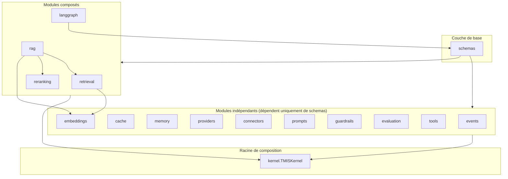
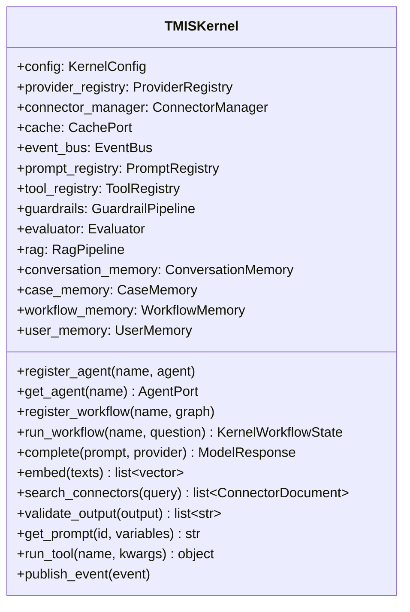
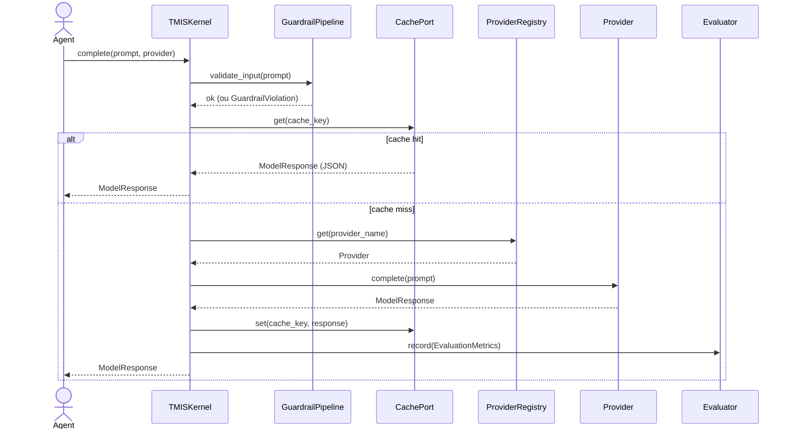
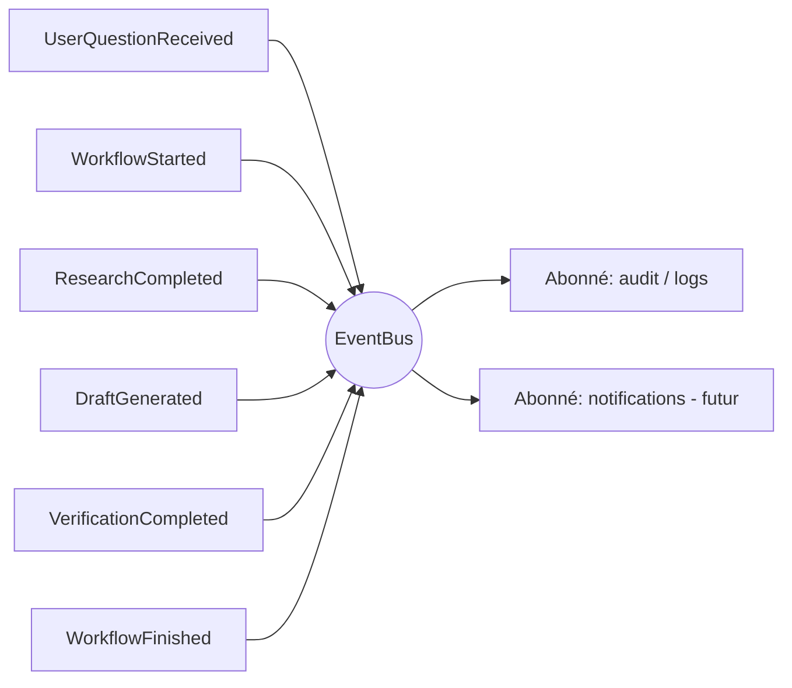

# AI Kernel — architecture (Sprint 2)

## Pourquoi un Kernel

Avant le Sprint 2, chaque agent risquait de finir par appeler un fournisseur
de modèle ou une source documentaire directement — recréant, dossier après
dossier, le même couplage fort que l'architecture DDD du Sprint 1 s'efforce
d'éviter partout ailleurs.

Le **TMIS AI Kernel** (`backend/src/tmis/ai/`) est le socle qui empêche
cela structurellement : **aucun code en dehors de `tmis.ai` n'importe un
SDK de fournisseur de modèle ou un connecteur documentaire**. Tout passe
par `TMISKernel`.

Le Sprint 2 ne développe aucune fonctionnalité métier : chaque
implémentation est volontairement minimale (échos déterministes, fixtures
en mémoire) mais **réellement exécutable**, sans appel réseau externe.

## Vue d'ensemble des modules

Chaque module (à l'exception de `schemas`, la base commune) peut évoluer
indépendamment : changer de fournisseur de cache (Redis ↔ mémoire), de
fournisseur de modèle, ou de moteur de reranking ne touche aucun autre
module.

## `TMISKernel` — responsabilités

`TMISKernel` est la **racine de composition** (composition root) : elle
construit une implémentation par défaut de chaque port si aucune n'est
injectée, ce qui permet de l'instancier sans configuration (`TMISKernel()`)
en développement/tests, et de tout remplacer en production (Redis pour le
cache et la mémoire, un vrai fournisseur de modèle, etc.) sans changer une
ligne d'agent.

## Séquence : `TMISKernel.complete()`

Cette même discipline (garde-fous → cache → appel réel → évaluation) est
répétée dans `search_connectors()` pour la recherche documentaire.

## Event Bus

Les composants du Kernel ne s'appellent jamais directement entre eux : ils
publient des événements typés (`tmis.ai.events.events`) sur un bus
in-memory (`tmis.ai.events.bus.EventBus`). Un nouvel abonné (audit,
notification) s'ajoute avec `event_bus.subscribe(EventType, handler)` sans
toucher aux publishers.

## Configuration

`KernelConfig` (`tmis.ai.kernel.config`) est chargée depuis les variables
d'environnement (préfixe `TMIS_AI_`), sur le même modèle que
`tmis.core.config.Settings` :

| Variable | Rôle | Défaut |
|---|---|---|
| `TMIS_AI_DEFAULT_PROVIDER` | Fournisseur de modèle utilisé par défaut | `openai` |
| `TMIS_AI_DEFAULT_CONNECTORS` | Connecteurs interrogés par défaut | `codes,jurisprudence,doctrine` |
| `TMIS_AI_CACHE_TTL_SECONDS` | Durée de vie du cache des appels IA | `300` |
| `TMIS_AI_USE_CACHE` | Active/désactive le cache globalement | `true` |

## Portée du Sprint 2

- Aucune fonctionnalité métier (analyse de contrat, conclusions,
  recherche juridique réelle) n'est développée ici.
- Aucun appel réseau externe réel n'est effectué : les providers renvoient
  un écho déterministe et taggé, les connecteurs interrogent une fixture
  en mémoire.
- Tout est néanmoins **réellement exécutable de bout en bout** — voir
  `docs/11-langgraph-architecture.md` pour le workflow de démonstration et
  `backend/tests/integration/ai/` pour les preuves automatisées.
