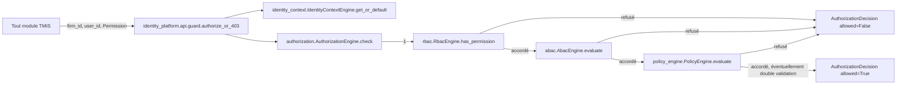
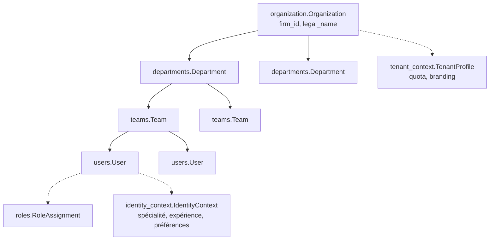

# Architecture — Enterprise Identity & Trust Platform (Sprint 19)

## Objectif

L'EITP (`tmis.identity_platform`) devient le socle de sécurité,
d'identité, de gouvernance et de confiance de l'ensemble de TMIS.
**Aucun module ne peut désormais être utilisé sans passer par cette
plateforme.** Zero Trust : aucun service ne fait confiance à un autre
sans vérification ; chaque action est authentifiée, autorisée,
tracée, explicable, auditée.

Ce sprint occupe le créneau réservé pour « Identity & Firm » depuis la
révision post-Sprint 4 de la roadmap (voir
docs/09-roadmap-30-sprints.md) — il ne s'insère pas, le total de
sprints reste à 38.

## Les 32 sous-modules + la couche API

```
backend/src/tmis/identity_platform/
├── authentication/     # dispatch par méthode (OAuth2/OIDC/passwordless/magic link/WebAuthn)
├── authorization/       # moteur central Zero Trust : RBAC -> ABAC -> Policy
├── tenant_management/    # Organisation -> Départements -> Équipes -> Utilisateurs
├── organization/           # Organization (fuller Firm aggregate)
├── departments/             # Department
├── teams/                     # Team
├── users/                       # User (identité firm-wide)
├── roles/                         # Role (firm-wide) + RoleAssignment
├── permissions/                     # Permission (vocabulaire firm-wide)
├── rbac/                               # RbacEngine + DEFAULT_ROLE_PERMISSIONS
├── abac/                                 # AbacEngine + règles pluggables
├── policy_engine/                          # PolicyEngine (politiques configurables)
├── session_manager/                          # sessions, rotation, révocation
├── device_trust/                               # UNKNOWN -> TRUSTED -> REVOKED
├── mfa/                                          # TOTP (RFC 6238, stdlib)
├── webauthn/                                       # cérémonie WebAuthn (référence)
├── passkeys/                                         # WebAuthn usernameless
├── oauth2/                                             # Authorization Code grant
├── openid_connect/                                       # ID token sur OAuth2
├── passwordless/                                           # code à usage unique
├── magic_links/                                              # lien de connexion signé JWT
├── delegation/                                                 # délégation temporaire de permissions
├── impersonation/                                                # "agir en tant que" (support)
├── secret_manager/                                                 # secrets chiffrés, jamais en clair
├── audit/                                                           # trail append-only depuis security_events
├── security_events/                                                   # bus d'événements de sécurité
├── identity_context/                                                    # profil métier par utilisateur
├── tenant_context/                                                        # TenantProfile (quota/branding)
├── compliance/                                                              # sources RGPD identity_platform
├── configuration/                                                              # config auth/MFA par cabinet
├── monitoring/                                                                   # IdentityDashboard
└── api/                                                                            # endpoints REST + guard.py
```

Chaque sous-module suit le patron déjà établi dans TMIS : `schemas.py`
→ `ports.py` (si un point d'extension est plausible) → `store.py`
(implémentation en mémoire) → `engine.py` → `__init__.py`.

## Le moteur d'autorisation central (Zero Trust)



`check()` ne retourne jamais un accord implicite : un utilisateur
inconnu du système (aucun rôle assigné) est toujours refusé par la
couche RBAC. Chaque couche ne peut que **retirer** ce qu'une couche
précédente a accordé, jamais l'inverse — RBAC pose le plancher,
Policy a le dernier mot.

## La hiérarchie tenant



`tenant_management.TenantManagementEngine` compose ces cinq
sous-moteurs sans jamais les réimplémenter — c'est le point d'entrée
unique pour provisionner un cabinet (`onboard_firm`) ou lire sa
hiérarchie complète (`hierarchy`).

## Migration des modules existants

Chaque module métier construit depuis le Sprint 2 doit désormais
récupérer le contexte utilisateur, vérifier les permissions, appliquer
les politiques du cabinet et enregistrer des événements de sécurité
avant toute action sensible. Ce sprint migre 5 points d'entrée
représentatifs vers `identity_platform.api.guard.authorize_or_403` —
voir docs/109-guide-migration-identity-platform.md pour le détail et
le plan de migration des endpoints restants.

## Conventions de nommage réutilisées (collisions documentées, jamais fusionnées)

- `identity_platform.roles.Role` (firm-wide : PARTNER/ASSOCIATE/
  COUNSEL/PARALEGAL/ASSISTANT/IT_ADMIN) — distinct de
  `collaboration.roles.Role` (rôles d'un espace de travail, Sprint 8).
  Même principe, deux portées disjointes.
- `identity_platform.permissions.Permission` — distinct de
  `collaboration.permissions.Permission` (Sprint 8).
- `identity_platform.policy_engine.PolicyEngine` — quatrième
  occurrence de la collision `PolicyEngine`/`GovernanceEngine` déjà
  actée pour `ai_fabric.governance.GovernanceEngine` (Sprint 14),
  `ai_governance.policy_engine.PolicyEngine` (Sprint 15) et
  `cabinet_knowledge.governance.GovernanceEngine` (Sprint 12). Celui-ci
  gouverne l'autorisation d'accès identitaire.
- `identity_platform.oauth2.OAuth2Client` (Authorization Code grant,
  connexion utilisateur interactive) — distinct de
  `cabinet_os.public_api.OAuthClient` (Client Credentials grant, accès
  machine-à-machine, Sprint 9).
- `identity_platform.users.User` (identité firm-wide) — distinct de
  `collaboration.members.Member` (invitation à un espace de travail,
  Sprint 8).
- `identity_platform.organization.Organization` — la "fuller Firm
  aggregate" que `cabinet_os.administration.FirmRecord` (Sprint 9)
  déférait explicitement à ce sprint.

## Réutilisation, jamais réimplémentation

- `tenant_context` réexporte directement
  `platform.security.tenant_isolation.TenantContext`/
  `TenantAccessError`/`require_same_firm` (Sprint 10).
- `secret_manager` compose `platform.security.encryption`/
  `secrets_rotation.RotatingEncryption` (Sprint 10) — même convention
  que `integration_hub.security` (Sprint 18).
- `risk_engine` compose `platform.rate_limiting.brute_force.
  BruteForceProtector` (Sprint 10).
- `oauth2`/`magic_links` réutilisent `tmis.core.security.
  create_access_token`/`decode_access_token` (JWT) directement.
- `openid_connect.OpenIdConnectEngine` compose `oauth2.OAuth2Engine`
  et comble le point d'extension `platform.security.sso.
  OidcProviderPort` déclaré "architecture-only" au Sprint 10.
- `compliance` enregistre les sources de données du module
  (utilisateurs, sessions, appareils, délégations) auprès de
  `platform.compliance.ComplianceEngine` (Sprint 10) plutôt que de
  réimplémenter l'export/suppression RGPD.

## Limite assumée : WebAuthn "logique, non cryptographique"

`webauthn.WebAuthnEngine` est une cérémonie de référence : elle
vérifie une clé publique opaque et un compteur de signature
strictement croissant (protection anti-rejeu standard), mais
**n'analyse aucune clé COSE réelle et ne vérifie aucune signature
d'attestation/assertion cryptographique**. Un déploiement de
production remplacerait ce moteur par une implémentation appuyée sur
une bibliothèque (`webauthn`/`fido2`), derrière le même
`WebAuthnCredentialStorePort` — même convention que
`platform.security.sso.OidcProviderPort`/`SamlProviderPort` (Sprint
10).

## Dette technique identifiée : incompatibilité bcrypt/passlib

L'environnement embarque `passlib==1.7.4` avec `bcrypt==5.0.0`, deux
versions incompatibles : `passlib` s'appuie sur
`bcrypt.__about__.__version__`, supprimé depuis `bcrypt` 4.1. Tout
appel à `tmis.core.security.hash_password`/`verify_password` échoue à
l'exécution. Ce bug préexistait, non détecté par les 18 sprints
précédents faute d'un test l'exerçant. Ce sprint ne l'utilise pas
(aucune méthode d'authentification livrée ici ne repose sur un mot de
passe choisi par l'utilisateur) : le hachage du secret client OAuth2
utilise SHA-256 (`oauth2.engine._hash_client_secret`), un choix
légitime pour un secret opaque à haute entropie — jamais pour un mot
de passe. **Ce bug doit être corrigé avant qu'un futur sprint
introduise une authentification par mot de passe réel**, soit en
repin­nant `bcrypt`/`passlib` sur des versions compatibles, soit en
migrant vers une bibliothèque de hachage sans cette dépendance
(`argon2-cffi`).
