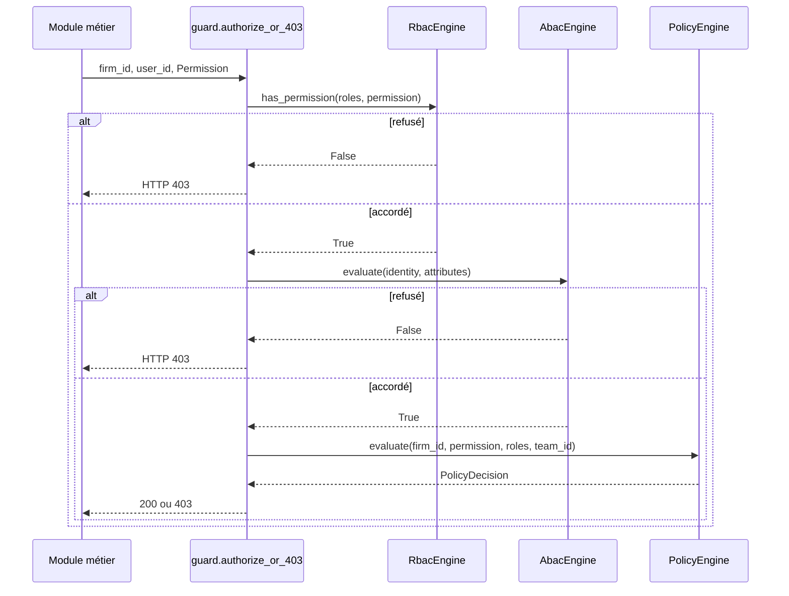

# Guide — RBAC, ABAC & Zero Trust (Sprint 19)

## Le principe Zero Trust

« Aucun service ne fait confiance à un autre sans vérification. »
`authorization.AuthorizationEngine.check()` est l'unique point d'entrée
d'autorisation de TMIS. Il ne retourne **jamais** un accord implicite :
un utilisateur sans rôle assigné est toujours refusé, même sans
politique configurée.

```python
decision = authorization.check(identity, Permission.CONSULTATION_VALIDATE, attributes)
if not decision.allowed:
    raise HTTPException(status_code=403, detail=decision.reason)
```

## RBAC — le plancher

`rbac.RbacEngine` porte la matrice `DEFAULT_ROLE_PERMISSIONS` (une
permission par rôle firm-wide) :

| Rôle | Permissions par défaut |
|---|---|
| PARTNER | consultation.validate, ai_model.restricted_use, export.data, strategy_draft.validate, workflow.use_team_restricted, organization.manage, user.manage |
| ASSOCIATE | export.data, workflow.use_team_restricted |
| COUNSEL | export.data |
| PARALEGAL | (aucune) |
| ASSISTANT | (aucune) |
| IT_ADMIN | organization.manage, secret.manage |

Un rôle non assigné → refus RBAC → la chaîne s'arrête là, ABAC et
Policy ne sont jamais évalués.

## ABAC — les conditions contextuelles

`abac.AbacEngine` évalue une liste de règles pluggables
(`AbacRulePort`) sur `(IdentityContext, AbacAttributes)`. Trois règles
livrées ce sprint :

- `MinimumSeniorityRule(min_years)` — refuse si
  `identity.seniority_years < min_years`.
- `ConfidentialityRule(experience_rank)` — refuse si le niveau
  d'expérience de l'identité (junior/senior/partner) ne couvre pas le
  niveau de confidentialité de la ressource
  (standard/confidential/privileged).
- `SameDepartmentRule` — refuse si l'identité et la ressource
  n'appartiennent pas au même département (ignore la règle si la
  ressource ne précise aucun département).

Une seule règle qui échoue suffit à refuser — `AbacEngine.evaluate`
retourne `False` dès le premier échec.

## Policy — le dernier mot du cabinet

`policy_engine.PolicyEngine` porte des `Policy` configurables **par
cabinet**, au-dessus de RBAC/ABAC :

```python
policies.create(
    firm_id, Permission.EXPORT_DATA,
    denied_roles=frozenset({Role.PARTNER}),
    reason="export interdit ce trimestre",
)
```

Exemples couverts par les tests (voir
`tests/unit/identity_platform/test_identity_platform_authorization.py`) :

- `denied_roles` refuse un rôle malgré un accord RBAC.
- `allowed_roles` restreint à une liste blanche.
- `restricted_to_team_id` scope la permission à une équipe — comparé
  à `IdentityContext.team_id` (jamais un champ de requête que
  l'appelant pourrait falsifier ; voir docs/107 pour comment fixer le
  contexte d'un utilisateur).
- `requires_second_validation=True` accorde l'accès mais signale
  qu'une double validation est requise
  (`AuthorizationDecision.requires_second_validation`).

## Zero Trust de bout en bout


