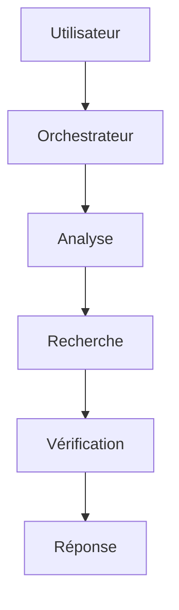
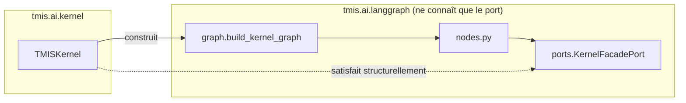

# Architecture LangGraph (Sprint 2)

## Le workflow de démonstration du Kernel

`tmis.ai.langgraph` porte le premier graphe LangGraph du Kernel,
enregistré par `TMISKernel` sous le nom `kernel_demo` :



| Nœud (fichier `nodes.py`) | Rôle | Événement publié |
|---|---|---|
| `user_question_step` | Enregistre la question entrante | `UserQuestionReceived` |
| `orchestrator_step` | Marque le début du workflow | `WorkflowStarted` |
| `analysis_step` | Appelle `kernel.complete()` pour produire une première analyse | — |
| `research_step` | Appelle `kernel.search_connectors()` | `ResearchCompleted` |
| `verification_step` | Applique `kernel.validate_output()` (garde-fous) sur l'analyse | `VerificationCompleted` |
| `response_step` | Assemble l'analyse et les sources en une réponse finale | — |

`TMISKernel.run_workflow()` encadre l'exécution du graphe en publiant
`WorkflowFinished` une fois celui-ci terminé, et journalise chaque
exécution dans `workflow_memory`.

## Découplage Kernel / LangGraph



Les nœuds du graphe ne dépendent que de `KernelFacadePort` (un `Protocol`
listant `complete`, `search_connectors`, `publish_event`,
`validate_output`) — jamais de la classe concrète `TMISKernel`. Cela évite
tout import circulaire entre `tmis.ai.kernel` (qui construit le graphe) et
`tmis.ai.langgraph` (qui définit les nœuds), et permet de tester le graphe
avec un faux Kernel minimal.

## État du workflow

`KernelWorkflowState` (un `TypedDict`, voir `tmis.ai.langgraph.state`)
porte les données qui transitent entre les nœuds :

```python
class KernelWorkflowState(TypedDict):
    workflow_id: uuid.UUID
    question: str
    analysis: AgentOutput | None
    research: list[ConnectorDocument]
    verification_warnings: list[str]
    response: str | None
```

Les noms de nœuds sont suffixés par `_step` (`analysis_step`,
`research_step`, ...) car LangGraph interdit qu'un nœud porte le même nom
qu'une clé de l'état (ex. un nœud nommé `analysis` entrerait en conflit
avec la clé `analysis`).

## Ce que ce graphe n'est pas

Ce graphe minimal **ne remplace pas** la stratégie multi-agents détaillée
dans `docs/05-strategie-multi-agents.md` (Chef d'Orchestre + 11 agents
spécialisés). Il prouve seulement que l'infrastructure d'orchestration du
Kernel fonctionne de bout en bout. Les agents métier définis au Sprint 1
(`tmis.agents`) seront reliés au Kernel dans les sprints métier à venir
(Sprint 11 et suivants, voir `docs/09-roadmap-30-sprints.md`), en
remplaçant leurs implémentations `NotImplementedError` par des appels à
`TMISKernel.complete()` / `search_connectors()`.
