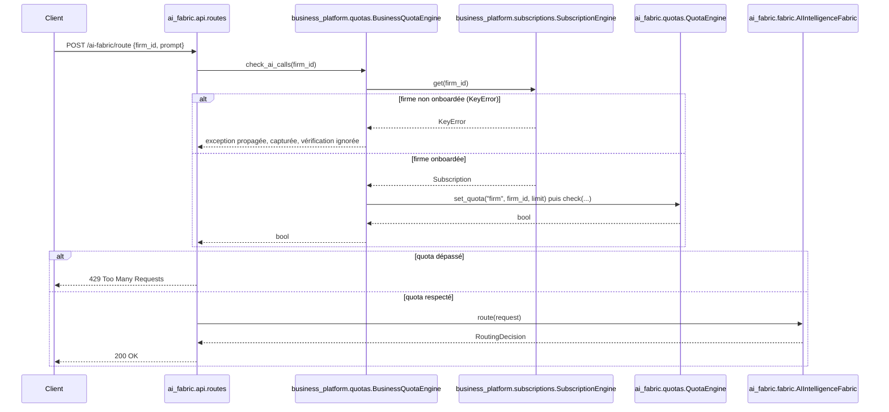
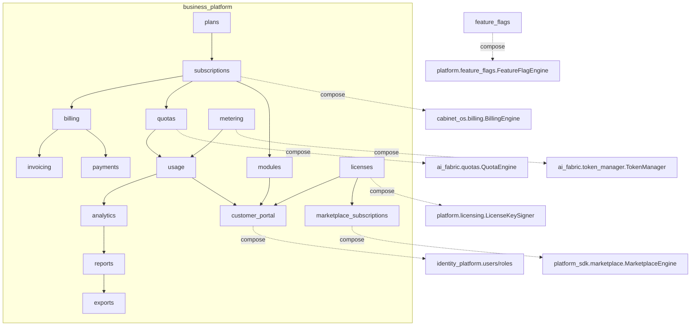

# Architecture — SaaS Business Platform (Sprint 20)

## Objectif

La SaaS Business Platform (`tmis.business_platform`) fournit toutes
les capacités nécessaires à l'exploitation commerciale de TMIS en
mode SaaS multi-cabinet : abonnements, licences, quotas, consommation
IA, facturation, feature flags, administration des cabinets, portail
client, métriques commerciales. Chaque cabinet possède son propre
abonnement, ses options, ses quotas, ses licences et ses modules
activés, dynamiquement modifiables sans redéploiement.

Ce sprint occupe le créneau réservé pour « Billing & abonnements »
depuis la roadmap initiale (voir docs/09-roadmap-30-sprints.md) — il
livre bien plus que ce placeholder initial ne suggérait : la roadmap
est mise à jour en conséquence, le total de sprints reste inchangé.

## Les 20 sous-modules + la couche API

```
backend/src/tmis/business_platform/
├── plans/                    # PlanCatalog — 5 tiers versionnés (Trial→Enterprise)
├── subscriptions/              # Subscription (trial/active/past_due/cancelled/expired)
├── trial/                        # essai gratuit → conversion payante
├── pricing/                        # calcul du prix (cycle + remise)
├── billing/                          # facturation abonnement (compose cabinet_os.billing)
├── invoicing/                          # cycle de facturation récurrent
├── payments/                             # encaissement (compose cabinet_os.billing)
├── licenses/                               # 4 types de licence (nominative/flottante/invité/API)
├── quotas/                                   # 7 dimensions de quota (compose ai_fabric.quotas)
├── metering/                                   # historisation append-only (compose token_manager)
├── usage/                                         # vue consommation vs quota
├── feature_flags/                                   # extensions env/groupe/fenêtre/expérimentation
├── modules/                                           # activation par bounded context TMIS
├── tenant_settings/                                     # paramètres métier par cabinet
├── customer_portal/                                       # agrégateur en lecture (8 domaines)
├── marketplace_subscriptions/                               # abonnements extensions payantes
├── analytics/                                                 # dashboard commercial
├── reports/                                                     # rapports figés exportables
├── notifications/                                                 # events métier (compose collaboration)
├── exports/                                                         # export CSV/JSON
└── api/                                                                # endpoints REST + bootstrap.py
```

Chaque sous-module suit le patron Clean Architecture déjà établi dans
TMIS : `schemas.py` → `ports.py` (si un point d'extension est
plausible) → `store.py` (implémentation en mémoire) → `engine.py` →
`__init__.py`. Les modules purement compositionnels (`billing`,
`invoicing`, `payments`, `pricing`, `usage`, `trial`) n'ont ni
`ports.py` ni `store.py` — ils n'orchestrent que d'autres moteurs.

## Le principe directeur : composer, ne jamais réimplémenter

Le thème architectural central de ce sprint est la réutilisation
explicite des moteurs des sprints précédents plutôt que leur
duplication :

| Ce sprint compose | Le moteur du sprint antérieur |
|---|---|
| `billing.SubscriptionBillingEngine` | `cabinet_os.billing.BillingEngine` (Sprint 9) |
| `payments.PaymentEngine` | `cabinet_os.billing.BillingEngine.record_payment` (Sprint 9) |
| `licenses.LicenseEngine` | `platform.licensing.signing.LicenseKeySigner` (Sprint 10) |
| `quotas.BusinessQuotaEngine.check_ai_calls` | `ai_fabric.quotas.QuotaEngine` (Sprint 14) |
| `metering.MeteringEngine.record_ai_call` | `ai_fabric.token_manager.TokenManager` (Sprint 14) |
| `feature_flags.BusinessFeatureFlagEngine` | `platform.feature_flags.FeatureFlagEngine` (Sprint 10) |
| `marketplace_subscriptions` | `platform_sdk.marketplace.MarketplaceEngine` (Sprint 13) |
| `customer_portal` | `identity_platform.users`/`roles` (Sprint 19) |
| `notifications.BusinessNotificationEngine` | `collaboration.notifications.NotificationEngine` (Sprint 8) |
| `exports.ExportEngine` (CSV path) | `cabinet_os.reports.CsvReportExporter` (Sprint 9) |
| `analytics.AnalyticsEngine` | `platform.cost_control.CostTrackerEngine` (Sprint 10) |

Chaque composition est documentée dans la docstring du moteur
concerné, expliquant explicitement *pourquoi* il ne réimplémente pas
ce que le moteur composé fait déjà.

## Same-concept-different-scope : coexistence documentée, pas de fusion

Plusieurs concepts de ce sprint portent le même nom qu'un concept déjà
existant dans TMIS, à une échelle différente — la convention établie
depuis le Sprint 19 (identité) est reconduite : documenter la
coexistence plutôt que fusionner les deux abstractions.

- `business_platform.plans.PlanName` (5 tiers, versionné) coexiste
  avec `cabinet_os.subscriptions.PlanTier` (Sprint 9, 3 tiers,
  non versionné) — le second reste utilisable par ses appelants
  historiques.
- `business_platform.subscriptions.Subscription` (référence une
  version de plan exacte, cycle de facturation, statut `past_due`)
  coexiste avec `cabinet_os.subscriptions.Subscription` (Sprint 9).
- `business_platform.licenses.LicenseType`/`LicenseGrant` (licence
  individuelle par détenteur, 4 types) coexiste avec
  `platform.licensing.License` (Sprint 10, une licence signée par
  cabinet regroupant sièges/fonctionnalités/expiration) — même
  concept de « licence », granularité différente.

## Le moteur de quotas — dimension par dimension

`quotas.BusinessQuotaEngine` gère sept dimensions
(`QuotaDimension`) : `USERS`, `STORAGE_GB`, `AI_CALLS`,
`GPU_MINUTES`, `CASES`, `WORKFLOWS`, `AGENTS`. Six d'entre elles ont
une limite de base dérivée du plan (`plans.schemas.PlanLimits`) ; la
septième, `GPU_MINUTES`, n'a **aucune** allocation de plan par
défaut — sa base est toujours zéro, et la capacité GPU ne s'obtient
que via un `QuotaOverride` (une option payante additionnelle). Un
override est toujours **additif** sur la limite du plan
(`plan_limit + extra_amount`), jamais un remplacement — publier une
nouvelle version de plan ne modifie donc jamais silencieusement une
option déjà achetée.

## Versionnement des plans — sécurité contractuelle

`PlanCatalog.publish()` incrémente toujours la version et crée un
nouvel enregistrement `Plan` immuable ; `Subscription.plan_id` référence
la version exacte vendue. Publier une nouvelle version d'un plan
(nouveau tarif, nouvelles limites) ne modifie donc jamais
rétroactivement ce qu'un abonné existant a accepté — vérifié
explicitement par
`tests/unit/business_platform/test_plans_subscriptions_trial.py::test_publishing_new_version_never_mutates_previous`.

## Diagramme — flux d'un appel IA gardé par les quotas



## Diagramme — vue d'ensemble des dépendances



## API REST

Les endpoints (`/api/v1/business-platform/...`) couvrent plans,
abonnements, licences, quotas, feature flags, usage, modules,
paramètres du cabinet, analytics, rapports et le portail client. Les
mutations sensibles (`activate`, `change-plan`, `assign` licence,
`(de)activate` module, override de quota) passent par
`identity_platform.api.guard.authorize_or_403` avec la permission
`Permission.BUSINESS_PLATFORM_MANAGE` — conformément à la contrainte
du sprint : « les décisions d'accès ne doivent jamais contourner
l'Enterprise Identity & Trust Platform ».

## Guides associés

- docs/112-guide-subscriptions-plans.md
- docs/113-guide-quotas-licences.md
- docs/114-guide-feature-flags-modules.md
- docs/115-guide-customer-portal-marketplace.md
- docs/116-guide-migration-business-platform.md
- docs/117-reference-api-business-platform.md
