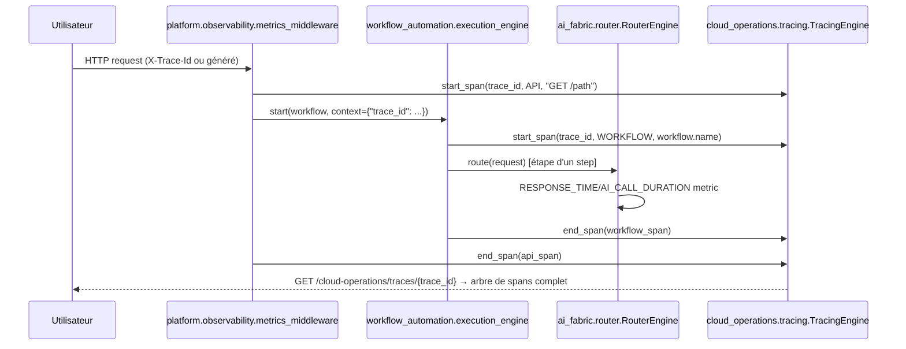

# Architecture — Cloud Operations & Observability Platform (Sprint 21)

## Objectif

La Cloud Operations & Observability Platform (`tmis.cloud_operations`)
fournit toutes les capacités d'exploitation nécessaires pour faire
fonctionner TMIS à grande échelle : télémétrie, supervision,
métriques, logs, traces distribuées, alertes, haute disponibilité,
résilience, optimisation des performances, gestion de la capacité.
Elle répond à la question opérationnelle centrale : *pourquoi une
requête est-elle lente, quel agent IA consomme le plus, quel cabinet
génère le plus de trafic, quel workflow échoue, quel connecteur est
indisponible, quel modèle IA coûte le plus, où est le goulot
d'étranglement* — via des dashboards et des alertes, jamais en
inspectant les logs à la main.

Ce sprint occupe le numéro 21, réattribué par instruction utilisateur
explicite à ce contenu plutôt qu'à l'ancien « Module Document » — voir
la note de révision dans docs/09-roadmap-30-sprints.md pour le détail
du renumérotage et l'absorption de l'ancien Sprint 36 « Observabilité
complète », que ce sprint livre et dépasse largement.

## Les 20 sous-modules + la couche API

```
backend/src/tmis/cloud_operations/
├── telemetry/            # façade façon OpenTelemetry (record_metric/start_span/end_span/emit_event)
├── metrics/               # MetricsEngine — historise ce que platform.metrics.MetricsRegistry ne fait pas
├── logging/                 # rétention par catégorie ; redaction déléguée à platform.logging
├── tracing/                   # spans sous le trace_id de core.observability (jamais un second id)
├── alerting/                    # seuils configurables, compose collaboration.notifications
├── dashboards/                    # composition pure : monitoring/ai_fabric/identity/business/integration_hub
├── health_checks/                   # 5 checks manquants, enregistrés dans platform.health (partagé)
├── sla/                                # 4 indicateurs (disponibilité/latence/réussite/restauration)
├── slo/                                  # objectifs internes, réutilise sla.average_value
├── capacity/                               # projection de croissance à partir de metrics
├── performance/                              # snapshot production (distinct de platform.performance.benchmark)
├── profiling/                                  # 4 catégories d'offenders + recommandations
├── cache/                                        # wrapper d'instrumentation (hit/miss/size/eviction)
├── queue_monitoring/                               # wrapper d'instrumentation (taille/débit/attente/erreurs)
├── error_tracking/                                   # agrégation cross-module des erreurs
├── incident_management/                                # cycle de vie ouverture→suivi→résolution→post-mortem
├── runbooks/                                             # bibliothèque de 5 procédures opérationnelles
├── diagnostics/                                            # composition health+performance+errors+tracing
├── resilience/                                               # circuit breaker (nouveau, confirmé absent)
├── chaos_testing/                                              # simulation, verrou production
└── api/                                                          # 21 endpoints REST + bootstrap.py
```

Chaque sous-module suit le patron Clean Architecture déjà établi :
`schemas.py` → `ports.py` (si un point d'extension est plausible) →
`store.py` (implémentation en mémoire) → `engine.py` → `__init__.py`.
Les modules purement compositionnels (`capacity`, `performance`,
`health_checks`, `diagnostics`, `runbooks`) n'ont ni `ports.py` ni
`store.py` propre — ils n'orchestrent que d'autres moteurs ou ne
gardent qu'un état transitoire en mémoire.

## Le principe directeur : composer, ne jamais reconstruire

Comme pour tous les sprints transverses précédents (Sprint 10
Enterprise Platform, Sprint 20 SaaS Business Platform), ce sprint
réutilise explicitement l'existant plutôt que de le dupliquer :

| Ce sprint compose | Le moteur du sprint antérieur |
|---|---|
| `metrics.MetricsEngine` | `platform.metrics.MetricsRegistry` (Sprint 10) — reste la source du `/platform/metrics` Prometheus |
| `tracing.Span.trace_id` | `core.observability.trace_id_middleware` (Sprint 1) — jamais un second schéma d'id |
| `logging.LoggingGovernanceEngine` (anonymisation) | `platform.logging.redaction.RedactSensitiveFields` (Sprint 10) |
| `alerting.AlertingEngine` (livraison) | `collaboration.notifications.NotificationEngine` (Sprint 8) |
| `dashboards.DashboardsEngine` | `platform.monitoring` (S10), `ai_fabric.telemetry` (S14), `identity_platform.monitoring` (S19), `business_platform.analytics` (S20), `integration_hub.connector_registry`/`.health` (S18) |
| `health_checks.register_business_context_health_checks` | `platform.health.HealthCheckEngine` (Sprint 10) — même moteur partagé, pas un second |
| `slo.SLOEngine.status` | `sla.SLAEngine.average_value` — jamais une seconde moyenne |
| `resilience.CircuitBreaker` | `ai_fabric.retry.RetryPolicy`/`ai_fabric.fallback.FallbackEngine` (S14) — complémentaire, pas un remplacement |
| `chaos_testing.ChaosTestingEngine` | `resilience.CircuitBreaker.force_open` — simule sans infrastructure réelle |

Chaque composition est documentée dans la docstring du moteur
concerné, expliquant explicitement *pourquoi* il ne réimplémente pas
ce que le moteur composé fait déjà. Le research préalable a confirmé
par lecture directe qu'aucun circuit breaker, aucun suivi hit/miss de
cache, aucun suivi taille/débit de file n'existait ailleurs dans
TMIS — ces trois modules sont donc des constructions authentiquement
nouvelles.

## Télémétrie : une façade, pas une dépendance OpenTelemetry

`telemetry.TelemetryEngine` expose une API façon OpenTelemetry
(`record_metric`/`start_span`/`end_span`/`emit_event`) mais reste
adossée en interne à `metrics.MetricsEngine` et `tracing.TracingEngine`
— TMIS n'a aujourd'hui aucune dépendance OpenTelemetry/Prometheus
client (choix délibéré, cohérent avec le reste du socle hand-rolled,
voir docs/49-guide-supervision.md). Cette façade peut être remplacée
plus tard par un vrai SDK/exportateur OpenTelemetry sans qu'aucun
module appelant ne change une seule ligne — voir
docs/119-guide-opentelemetry-cloud-operations.md.

## Traçage distribué bout-en-bout

`tracing.Span.trace_id` est toujours l'id déjà porté par
`request.state.trace_id` (`core.observability.trace_id_middleware`,
Sprint 1), le même qui alimente `platform.observability.
correlation_middleware` (Sprint 10) pour les logs — un seul id de
corrélation partagé par logs, traces et métriques.



Ce sprint instrumente 3 points représentatifs de ce chemin
(middleware API, `workflow_automation.execution_engine`, `ai_fabric.
router`) et documente le reste comme travail d'instrumentation
progressif — voir docs/124-guide-migration-cloud-operations.md,
même principe que la migration d'endpoints représentatifs des
Sprints 19/20.

## Health checks : extension du moteur partagé, pas un second

`health_checks.register_business_context_health_checks` enregistre 5
vérifications (AI Fabric, Marketplace, Workflow Engine, Identity
Platform, Business Platform) dans le **même** `platform.health.
HealthCheckEngine` singleton que les 7 vérifications déjà
enregistrées par `platform.health.bootstrap` (Sprint 10) —
`GET /platform/health/ready` reflète donc désormais 12 composants,
pas 7 (voir docs/125-reference-api-cloud-operations.md et le test
mis à jour `tests/integration/platform/test_platform_api_integration.py`).
Chaque nouvelle vérification est structurelle (objet construit et
joignable), pas un aller-retour réel — même limitation documentée
que les 7 vérifications existantes.

## Résilience et chaos testing — le verrou production

`resilience.CircuitBreaker` implémente le patron classique
fermé→ouvert→semi-ouvert par dépendance nommée. `chaos_testing.
ChaosTestingEngine` simule les 4 pannes demandées (panne fournisseur
IA, indisponibilité base de données, coupure réseau, saturation de
file) en forçant le circuit correspondant à s'ouvrir — **jamais**
d'appel réseau réel. La contrainte de sécurité du sprint est
appliquée au niveau du moteur, pas seulement documentée :
`ChaosTestingEngine.run_scenario` lève
`ProductionChaosTestingForbiddenError` si `environment == "production"`
et `authorized=False`, vérifié par
`tests/unit/cloud_operations/test_resilience_chaos.py` et par
l'endpoint `POST /cloud-operations/chaos/{scenario}` (403 sans
`authorized=true`).

## Isolation multi-tenant

Chaque événement historisé (`MetricEvent`, `AlertEvent`, `SLASample`,
`ErrorEvent`, `Incident`) porte un `firm_id | None` optionnel — `None`
signifie une donnée plateforme-globale (jamais associée à un cabinet
précis), jamais une fuite entre cabinets. `DashboardsEngine.overview`
laisse `ai`/`security`/`business` à `None` quand `firm_id` n'est pas
fourni, faute de signification globale pour ces vues.

## Diagramme — vue d'ensemble des dépendances

```mermaid
graph TD
    subgraph cloud_operations
        metrics --> telemetry
        tracing --> telemetry
        metrics --> alerting
        metrics --> capacity
        metrics --> performance
        metrics --> cache
        metrics --> queue_monitoring
        metrics --> error_tracking
        sla --> slo
        performance --> diagnostics
        error_tracking --> diagnostics
        tracing --> diagnostics
        resilience --> chaos_testing
    end
    metrics -.compose.-> platform_metrics[platform.metrics.MetricsRegistry]
    tracing -.compose.-> trace_mw[core.observability.trace_id_middleware]
    logging -.compose.-> redaction[platform.logging.RedactSensitiveFields]
    alerting -.compose.-> notif[collaboration.notifications.NotificationEngine]
    health_checks -.compose.-> platform_health[platform.health.HealthCheckEngine]
    dashboards -.compose.-> monitoring[platform.monitoring.MonitoringEngine]
    dashboards -.compose.-> ai_telemetry[ai_fabric.telemetry.TelemetryDashboard]
    dashboards -.compose.-> id_monitoring[identity_platform.monitoring.IdentityMonitoringEngine]
    dashboards -.compose.-> biz_analytics[business_platform.analytics.AnalyticsEngine]
    resilience -.complement.-> retry[ai_fabric.retry.RetryPolicy]
    resilience -.complement.-> fallback[ai_fabric.fallback.FallbackEngine]
```



## API REST

Les 21 endpoints (`/cloud-operations/...`) sont **délibérément hors**
de `/api/v1` et **non authentifiés**, sur le même principe déjà établi
par `platform.api.routes` (Sprint 10) : « metrics/health endpoints
sont une préoccupation opérationnelle, pas une API métier versionnée ».
Voir docs/125-reference-api-cloud-operations.md pour la liste
complète.

## Guides associés

- docs/119-guide-opentelemetry-cloud-operations.md
- docs/120-guide-dashboards-cloud-operations.md
- docs/121-guide-alerting-cloud-operations.md
- docs/122-guide-incidents-cloud-operations.md
- docs/123-guide-runbooks-cloud-operations.md
- docs/124-guide-migration-cloud-operations.md
- docs/125-reference-api-cloud-operations.md
