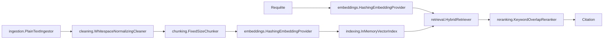

# Architecture RAG — implémentation (Sprint 2)

`docs/06-strategie-rag.md` décrit la stratégie cible. Ce document décrit
ce qui est **réellement implémenté** au Sprint 2 dans `tmis.ai.rag`,
`tmis.ai.embeddings`, `tmis.ai.retrieval` et `tmis.ai.reranking` — sans
aucune source externe branchée.

## Pipeline implémenté

`RagPipeline` (`tmis.ai.rag.pipeline`) assemble ces étapes :

- `ingest_document(id, content, metadata)` : ingestion → nettoyage →
  découpage → embeddings → indexation.
- `query(text, top_k)` : récupération hybride → reranking → citations.

## Pourquoi ces implémentations minimales sont réelles (pas des stubs vides)

| Étape | Implémentation Sprint 2 | Ce qu'elle prouve |
|---|---|---|
| Chunking | `FixedSizeChunker` : fenêtre glissante avec chevauchement configurable | Découpage déterministe et testable, prêt à être remplacé par un découpage sémantique (Sprint 7) |
| Embeddings | `HashingEmbeddingProvider` : sac-de-mots haché, normalisé (norme L2) | La similarité cosinus reflète réellement le vocabulaire partagé — assez pour trier des résultats de façon significative |
| Indexation | `InMemoryVectorIndex` : recherche brute-force par similarité cosinus + filtre sur métadonnées | Même sémantique de recherche que Qdrant (top-k, filtre par payload), sans dépendance externe |
| Récupération | `HybridRetriever` : combine score vectoriel et recouvrement lexical | Couvre à la fois les questions ouvertes et les références précises, comme le prévoit `docs/06-strategie-rag.md` |
| Reranking | `KeywordOverlapReranker` : bonus pour correspondance de phrase exacte | Étape de reranking distincte et explicable, en attendant un reranker appris (Sprint 9) |
| Citations | `RetrievedChunk.to_citation()` | Aucune citation n'est jamais inventée : elle référence toujours un chunk réellement indexé |

## Isolation multi-tenant (préparation)

`InMemoryVectorIndex.search()` accepte déjà un paramètre `filters`
(`dict[str, str]`), qui sera utilisé pour appliquer le filtre obligatoire
`firm_id`/`case_id` décrit dans `docs/06-strategie-rag.md` dès que le RAG
sera branché sur de vraies données (Sprint 7).

## Prochaines étapes (hors Sprint 2)

- Remplacer `InMemoryVectorIndex` par Qdrant (Sprint 7).
- Remplacer `HashingEmbeddingProvider` par un modèle d'embedding réel via
  `tmis.ai.providers` (Sprint 7).
- Découpage sémantique par article/clause (Sprint 7).
- Reranker appris (cross-encoder) (Sprint 9).
- Brancher les connecteurs de sources juridiques réels (Sprint 8).
