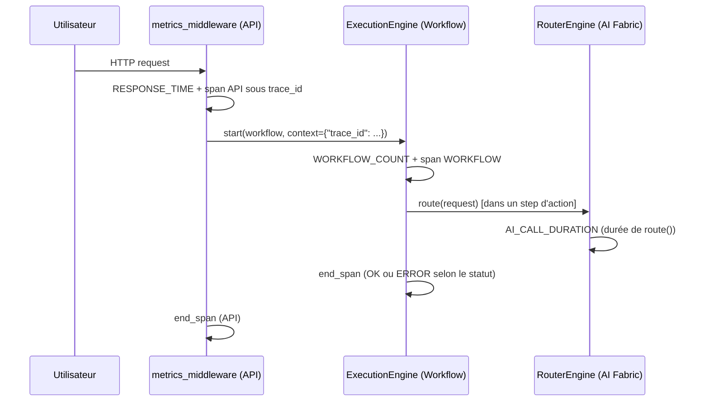

# Guide — Instrumentation des modules existants (Sprint 21)

## Principe

Tout module TMIS peut désormais publier des métriques/traces/erreurs
via `cloud_operations.telemetry.TelemetryEngine` (façade façon
OpenTelemetry) ou directement via les moteurs plus bas niveau
(`cloud_operations.metrics.MetricsEngine`, `.tracing.TracingEngine`,
`.error_tracking.ErrorTrackingEngine`). Les singletons process-wide
sont accessibles via `cloud_operations.bootstrap` — aucune logique
d'instrumentation ne doit être dupliquée ailleurs.

Pour éviter toute dépendance circulaire au chargement du module (le
bootstrap `cloud_operations` compose à son tour `ai_fabric.bootstrap`,
`workflow_automation.bootstrap`, `integration_hub.bootstrap`,
`identity_platform.bootstrap`, `business_platform.bootstrap`,
`platform_sdk.bootstrap`), chaque point d'instrumentation importe
`cloud_operations.bootstrap` **localement**, à l'intérieur de la
méthode qui en a besoin — jamais en haut de fichier.

## Trois points d'instrumentation représentatifs (ce sprint)

| Module | Hop du chemin de requête | Ce qui est publié |
|---|---|---|
| `platform.observability.middleware.metrics_middleware` | API | `RESPONSE_TIME` par route + span `SpanKind.API` sous le `trace_id` de la requête |
| `workflow_automation.execution_engine.ExecutionEngine` | Workflow | `WORKFLOW_COUNT` à l'ouverture, span `SpanKind.WORKFLOW`, `ErrorTrackingEngine` sur échec |
| `ai_fabric.router.RouterEngine` | AI Fabric | `AI_CALL_DURATION` (latence de la décision de routage), `ErrorTrackingEngine` sur `NoEligibleModelError`/`QuotaExceededError` |

Le middleware exclut délibérément ses propres routes
(`/cloud-operations/*`) de l'instrumentation, pour ne pas polluer les
métriques avec le trafic de consultation de l'observabilité
elle-même.

## Pourquoi trois et pas tous les modules

Comme pour les migrations des Sprints 19/20 (voir docs/109 et
docs/116), instrumenter chaque module de TMIS en un seul sprint
referait le travail de plusieurs sprints à la fois. Ce sprint établit
le mécanisme (façade télémétrie + singleton process-wide + import
local pour éviter les cycles) et le démontre sur un échantillon
couvrant les trois hops centraux du chemin de requête que le sprint
cite explicitement (Utilisateur → API → Workflow → AI Fabric →
Réponse). La migration du reste des modules (Agents, Knowledge
Engine, Connecteurs) suit le même schéma au fil des évolutions de
chaque module.

## Comment instrumenter un nouveau point

1. Identifier la `MetricCategory` pertinente
   (`cloud_operations.metrics.schemas.MetricCategory`) — dix
   catégories couvrent déjà temps de réponse, appels IA, mémoire,
   CPU, files, cache, base de données, workflows, erreurs, débit.
2. Dans la méthode à instrumenter, importer localement
   `from tmis.cloud_operations.bootstrap import get_metrics_engine`
   (ou `get_tracing_engine`/`get_error_tracking_engine`) et appeler
   `.record(...)`/`.start_span(...)`/`.record(...)` en conséquence.
3. Pour un span, toujours réutiliser le `trace_id` déjà présent (issu
   de `request.state.trace_id` ou propagé via `context["trace_id"]`),
   jamais en générer un nouveau — sinon la trace se fragmente.
4. Vérifier que les tests existants du module passent sans
   modification (l'instrumentation ne doit jamais changer le
   comportement observable) — ce sprint l'a vérifié sur les 1727 tests
   existants (aucune régression), voir
   `docs/reports/sprint-21-rapport-architecture.md`.

## Migration report complet — voir aussi

`docs/reports/sprint-21-rapport-architecture.md` recense l'état
d'instrumentation de chaque module cité par le sprint.
