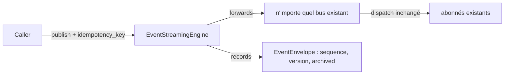
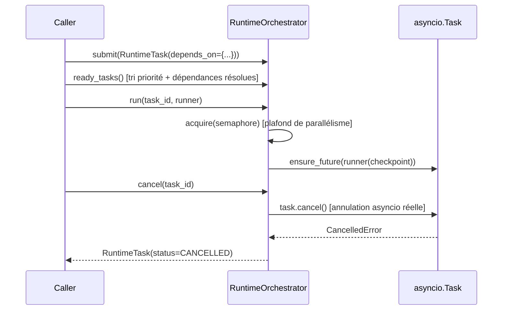

# Architecture — Cloud Native Runtime Platform (Sprint 23)

## Objectif

Après la consolidation des opérations cloud (Sprint 21) et de la
supervision transverse (Sprint 22), ce sprint s'attaque à
l'exécution, la scalabilité, la résilience et les performances :
`tmis.runtime_platform`, un nouveau package top-level suivant
exactement le même patron que `cloud_operations` (Sprint 21),
`identity_platform` (Sprint 19) ou `business_platform` (Sprint 20) —
un bounded context authentiquement nouveau, jamais un second
`cloud_operations`.

## Phase 1 — Audit préalable (résumé)

Avant d'écrire la moindre ligne de code, un audit exhaustif du dépôt
a recensé l'existant :

| Domaine | Constat |
|---|---|
| Moteurs d'exécution | `workflow_automation.execution_engine`, `ai_team.coordinator`/`work_queue` — aucun ne supporte de graphe de dépendances arbitraire, de plafond de parallélisme global, ni d'annulation réelle |
| Files asynchrones | 3 files en mémoire quasi identiques (`ai_team.work_queue`, `integration_hub.queue`) — **aucune Dead Letter Queue, aucun délai programmé** nulle part |
| Bus d'événements | **7** bus pub/sub en mémoire structurellement identiques (`ai.events`, `workflow_automation.event_bus`, `collaboration`, `identity_platform.security_events`, `integration_hub.event_bridge`, `platform_sdk.events_sdk`, `ai_governance.events`) — aucun ne supporte replay, idempotence, versionnage ou archivage |
| Cache | `ai.cache.CachePort` + `RedisCache` — **déjà un vrai cache distribué**, adossé à Redis (`docker-compose.yml`), réutilisable tel quel |
| CQRS / Event Sourcing | **Aucune implémentation**, réelle ou partielle, nulle part dans le dépôt |
| HA / DR (Sprint 10 `platform/`) | `BackupEngine`/`RestoreEngine` réels ; `DisasterRecoveryEngine` et `AutoscalingPolicy` sont des objets de politique/décision simples, pas des boucles de contrôle |
| Chaos testing (Sprint 21) | `ChaosTestingEngine` simule 4 scénarios en forçant un `CircuitBreaker` ouvert — pas d'injection de panne réelle |
| Load testing | **Aucune infrastructure** nulle part dans le dépôt |

Ce constat a directement déterminé la portée : composer ce qui existe
déjà (orchestration, cache, résilience, DR), et ne construire du
neuf que là où l'audit a confirmé un vide réel (DLQ, delta événementiel,
Event Store, CQRS, load testing).

## Les 12 sous-modules

```
backend/src/tmis/runtime_platform/
├── runtime_orchestrator/  # tâches longues : dépendances, priorité, parallélisme, annulation, reprise
├── async_processing/      # DLQ + délai programmé — génuinement absents ailleurs
├── event_streaming/       # décore N'IMPORTE lequel des 7 bus : replay/idempotence/version/archive
├── distributed_cache/     # décore ai.cache.CachePort : invalidation, warming, compression, stats
├── event_store/           # Event Sourcing générique : stream/sequence/snapshot/replay/archive
├── cqrs/                  # Command Bus + Query Bus (fondations, aucune migration de domaine)
├── runtime_optimizer/     # recommandations depuis performance/capacity/profiling/workflow_monitoring
├── high_availability/     # heartbeat/statut de nœud/supervise/failover — étend platform.disaster_recovery
├── disaster_recovery/     # politiques + simulation de restauration + RPO/RTO — compose backup/restore/DR
├── autoscaling_advisor/   # recommandation de réplicas + détection de goulets — indépendant du cloud
├── load_testing/          # simulateur d'utilisateurs virtuels in-process (100/1000/10000)
├── chaos_engineering/     # 3 scénarios supplémentaires + mesure automatique (reprise/disponibilité/pertes)
└── api/                   # 30+ endpoints REST + bootstrap.py
```

Chaque module compositionnel (`runtime_optimizer`, `autoscaling_advisor`,
`load_testing`) n'a pas de `store.py` propre — il ne fait
qu'orchestrer d'autres moteurs déjà existants.

## Le principe directeur : composer, jamais reconstruire

| Ce sprint compose | Le moteur du sprint antérieur |
|---|---|
| `runtime_orchestrator` (adapter) | `workflow_automation.execution_engine.ExecutionEngine.resume` (Sprint 17) — réutilisé, jamais réimplémenté |
| `event_streaming.EventStreamingEngine` | N'IMPORTE lequel des 7 bus existants, via un `Protocol` de deux méthodes (`publish`/`history`) qu'ils partagent tous déjà |
| `distributed_cache.DistributedCacheEngine` | `ai.cache.CachePort`/`RedisCache` (Sprint 2) — le vrai cache distribué, jamais dupliqué |
| `runtime_optimizer.RuntimeOptimizerEngine` | `cloud_operations.performance`/`.capacity`/`.profiling` (Sprint 21) + `.workflow_monitoring` (Sprint 22) |
| `high_availability.HighAvailabilityEngine` | `platform.disaster_recovery.DisasterRecoveryEngine.decide_failover` (Sprint 10) |
| `disaster_recovery.RuntimeDisasterRecoveryEngine` | `platform.backup.BackupEngine` + `platform.restore.RestoreEngine` (Sprint 10) |
| `autoscaling_advisor.AutoscalingAdvisorEngine` | `cloud_operations.capacity`/`.profiling` + `platform.autoscaling.AutoscalingPolicy` (Sprint 10) |
| `chaos_engineering.RuntimeChaosEngine` | `cloud_operations.chaos_testing.ensure_chaos_authorized` (extrait, pas dupliqué) + `cloud_operations.resilience.CircuitBreaker` (Sprint 21) |

## Le patron « decorate, don't replace » pour le bus d'événements

`event_streaming.EventStreamingEngine` ne remplace aucun des 7 bus.
Il type sa dépendance contre `PublishableEventBusPort`, un `Protocol`
à deux méthodes que les sept implémentent déjà structurellement
(`async publish(event)` + `.history`). N'importe lequel peut donc
être décoré sans modification :



`runtime_platform.bootstrap.get_workflow_event_streaming_engine()`
décore le singleton `workflow_automation.event_bus.WorkflowEventBus`
existant à titre de démonstration — aucun éditeur existant n'est
obligé de migrer, conformément à « l'adoption sera progressive ».

## Runtime Orchestrator — dépendances, priorité, parallélisme, annulation, reprise



`checkpoint()`/`resume()` permettent à un `runner` de reprendre après
un échec sans repartir de zéro — la « reprise automatique » demandée
par le sprint.

## CQRS — fondations seulement

`cqrs.CommandBus`/`cqrs.QueryBus` implémentent la même règle
(dispatch par type, un seul handler par type) que les bus
événementiels appliquent au pluriel (plusieurs abonnés) — ici,
volontairement un seul. **Aucun domaine métier n'est migré** vers
CQRS par ce sprint ; `ReadModelPort`/`WriteModelPort` sont des
`Protocol` d'extension, pas des implémentations concrètes.
L'adoption est explicitement progressive, comme le prompt du sprint
le demande.

## Event Store — Event Sourcing générique, pas par domaine

`event_store.EventStoreEngine` accepte `(stream_id, event_type: str,
payload: dict)` plutôt qu'une hiérarchie d'événements typée — ainsi
n'importe lequel des sept hiérarchies d'événements existantes peut y
être journalisé sans hériter d'une nouvelle classe de base. Supporte
snapshot, replay-depuis-le-dernier-snapshot, archivage et
restauration.

## Chaos Engineering — extension, pas duplication

`cloud_operations.chaos_testing.ChaosTestingEngine` (Sprint 21) a été
étendu — pas dupliqué — pour exposer `ensure_chaos_authorized` comme
fonction réutilisable. `runtime_platform.chaos_engineering.
RuntimeChaosEngine` l'appelle directement et ajoute trois scénarios
(`NODE_LOSS`, `CACHE_LOSS`, `MESSAGE_BUS_LOSS`) plus la mesure
automatique — temps de reprise, disponibilité, pertes — que le
moteur Sprint 21 ne calculait pas.

## Ce que ce sprint n'est pas

- Ce n'est **pas** un second `cloud_operations` : aucun module de
  télémétrie/métriques/traçage/alertes/incidents n'est reconstruit.
- Ce n'est **pas** une migration complète vers CQRS/Event Sourcing :
  fondations disponibles, aucun domaine métier converti.
- `load_testing`/`chaos_engineering` restent des **simulations
  in-process**, jamais une disruption d'infrastructure réelle — même
  principe de sécurité que le chaos testing du Sprint 21.

## Guides associés

- docs/133-guide-runtime-orchestrator.md
- docs/134-guide-event-replay-cqrs.md
- docs/135-guide-cache-distribuee-runtime.md
- docs/136-guide-disaster-recovery-runtime.md
- docs/137-guide-chaos-engineering-runtime.md
- docs/138-reference-api-runtime-platform.md
