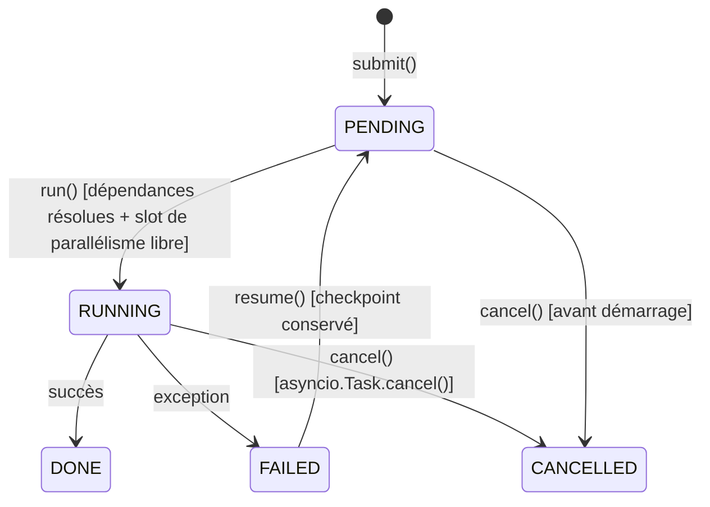

# Guide — Runtime Orchestrator (Sprint 23)

## Pourquoi un moteur au-dessus des moteurs existants

L'audit préalable a confirmé que `workflow_automation.execution_engine.
ExecutionEngine` (Sprint 17) et `ai_team.coordinator.CoordinatorEngine`
(Sprint 11) gèrent chacun leur propre séquencement, mais aucun des
deux ne plafonne le parallélisme au niveau du processus, ne supporte
un graphe de dépendances entre tâches de nature différente (un
workflow qui dépend d'une mission IA, par exemple), ni n'expose
d'annulation `asyncio` réelle. `runtime_orchestrator.RuntimeOrchestrator`
comble ce manque sans reconstruire l'exécution des étapes elle-même.

## Le cycle de vie d'une `RuntimeTask`



## Priorité et dépendances

`ready_tasks()` retourne les tâches `PENDING` dont tous les
`depends_on` sont `DONE`, triées par priorité décroissante puis par
ordre de soumission — une politique volontairement simple (pas de
graphe multi-niveaux complexe), suffisante pour composer des tâches
hétérogènes sans réimplémenter un ordonnanceur complet.

## Parallélisme et annulation réelle

`max_parallelism` est appliqué via un `asyncio.Semaphore` partagé par
l'instance. `cancel(task_id)` appelle directement `asyncio.Task.cancel()`
sur la tâche en cours si elle tourne, ou marque `CANCELLED` sans
démarrage sinon — une annulation réelle, pas un simple changement de
statut ignoré par l'exécution en cours.

## Réutiliser le Workflow Engine plutôt que le réimplémenter

`runtime_orchestrator.adapters.workflow_execution_task_runner`
construit un `TaskRunner` qui délègue directement à
`ExecutionEngine.resume` :

```python
runner = workflow_execution_task_runner(execution_engine, execution, workflow, context)
await orchestrator.run(task.id, runner)
```

`ExecutionEngine` lui-même n'est pas modifié — c'est un adaptateur,
pas une migration de son code, donc tout appelant existant continue
de fonctionner à l'identique.

## Limite volontaire : pas d'exécution via REST

`POST /runtime/tasks` ne permet que la **soumission** d'une tâche
(métadonnées : id, nom, priorité, dépendances). `run()`/`resume()` ne
sont pas exposés en REST : ils prennent une coroutine Python en
paramètre, qui n'a pas de représentation HTTP sensée — un appelant
Python doit invoquer `RuntimeOrchestrator.run`/`.resume` directement
(voir le rapport de démo du Sprint 23).
