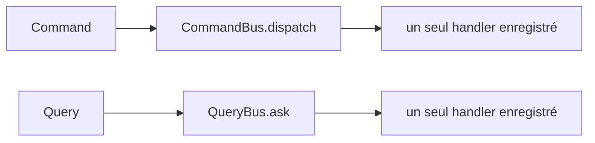

# Guide — Event Replay, Event Store et fondations CQRS (Sprint 23)

## Event Streaming : replay, idempotence, versionnage, archivage

L'audit a confirmé que les 7 bus événementiels de TMIS partagent
tous la même forme minimale : `async publish(event)` et une propriété
`.history`. `event_streaming.EventStreamingEngine` type sa dépendance
contre ce contrat commun (`PublishableEventBusPort`) plutôt que
contre un bus précis — il peut donc décorer n'importe lequel des
sept sans connaître sa hiérarchie d'événements concrète.

```python
streaming = EventStreamingEngine(workflow_event_bus, schema_version=1)
envelope = await streaming.publish(event, idempotency_key="wf-exec-42")
# envelope is None si idempotency_key déjà vu — dédoublonnage automatique
replayed = streaming.replay(from_sequence=10)
streaming.archive(before_sequence=100)
```

- **Ordering** : `sequence` est un compteur monotone par instance, en
  ordre de publication (`asyncio` étant mono-thread côté event loop,
  l'ordre d'insertion est déjà garanti).
- **Idempotency** : une `idempotency_key` déjà vue court-circuite la
  publication — ni le bus décoré, ni l'enveloppe ne sont affectés une
  seconde fois.
- **Versioning** : chaque enveloppe porte un `schema_version` fixé à
  la construction du décorateur.
- **Archive** : `archive(before_sequence)` marque les enveloppes plus
  anciennes comme archivées — exclues de `replay()` par défaut, mais
  toujours lisibles via `archived()`.

## Event Store : Event Sourcing générique

Aucun Event Store n'existait avant ce sprint (confirmé par recherche
directe — les classes nommées `EventStore` trouvées dans
`cloud_operations`/`business_platform` sont des journaux de
télémétrie opérationnelle, pas des logs d'événements de domaine).
`event_store.EventStoreEngine` est neuf, générique, et accepte
n'importe quel événement métier existant sans lui imposer une classe
de base commune :

```python
event = store.append("firm-42", "SubscriptionActivated", {"plan": "professional"})
store.snapshot("firm-42", {"status": "active", "plan": "professional"})
store.append("firm-42", "PlanChanged", {"plan": "enterprise"})
events_since_snapshot = store.replay("firm-42")  # seulement PlanChanged
```

`archive(stream_id)`/`restore(stream_id)` verrouillent/déverrouillent
les nouveaux `append()` sur un flux, sans supprimer son historique.

## CQRS — fondations uniquement



`CommandBus`/`QueryBus` appliquent la règle CQRS classique — un seul
handler par type de message, à la différence des bus événementiels
qui autorisent plusieurs abonnés. `ReadModelPort`/`WriteModelPort`
sont des `Protocol` d'extension, sans implémentation concrète : aucun
domaine métier existant (facturation, dossiers, etc.) n'est migré
vers CQRS par ce sprint. `HandlerAlreadyRegisteredError`/
`NoHandlerRegisteredError` rendent les deux erreurs de configuration
les plus probables (double enregistrement, dispatch sans handler)
explicites plutôt que silencieuses.

## Ce qui reste à faire (dette documentée)

- Aucun domaine n'utilise encore `CommandBus`/`QueryBus` en
  production — l'adoption est explicitement laissée progressive.
- `EventStoreEngine` n'est pas encore branché sur un flux métier réel
  (aucun domaine n'y journalise ses événements) ; c'est une fondation
  disponible, pas une migration.
