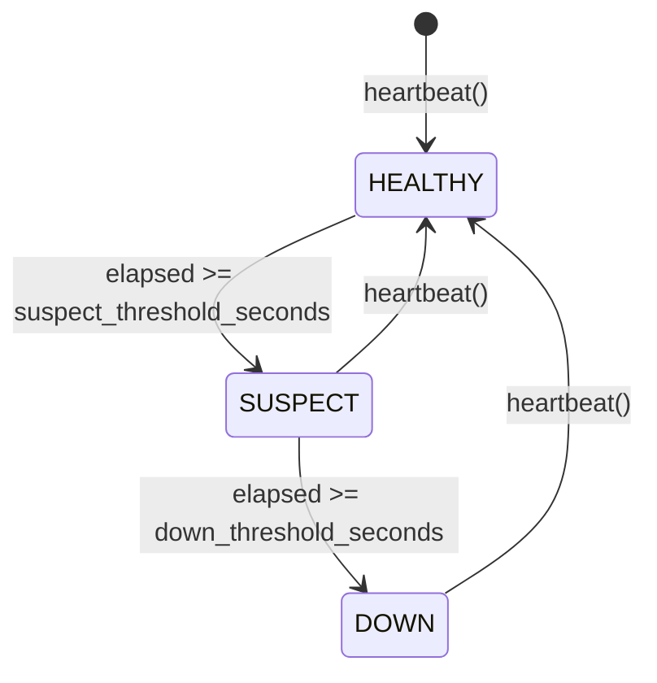
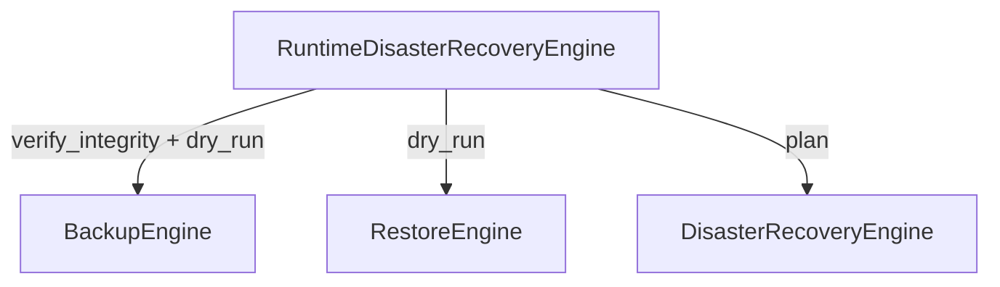

# Guide — High Availability et Disaster Recovery étendus (Sprint 23)

## High Availability

`runtime_platform.high_availability.HighAvailabilityEngine` étend
`platform.disaster_recovery.DisasterRecoveryEngine` (Sprint 10), qui
possède déjà la décision de failover à seuil de heartbeat unique mais
délègue explicitement à l'appelant tout suivi par nœud. Ce sprint
ajoute ce suivi :

`supervise()` retourne le statut de tous les nœuds connus en un seul
appel ; `decide_failover(node_id)` calcule l'écart depuis le dernier
battement et délègue le verdict au `DisasterRecoveryEngine` partagé —
jamais un second calcul de seuil. `record_replication`/
`replication_status` suivent le retard (lag) de chaque réplique.

Les mécaniques réelles de failover (bascule DNS, réordonnancement de
pods) restent hors périmètre, exactement comme le documente déjà
`DisasterRecoveryEngine` — déléguées aux manifestes Kubernetes.

## Disaster Recovery — politiques, simulation, RPO/RTO

`runtime_platform.disaster_recovery.RuntimeDisasterRecoveryEngine`
compose les trois moteurs déjà livrés au Sprint 10
(`BackupEngine`, `RestoreEngine`, `DisasterRecoveryEngine`) au lieu
d'une quatrième implémentation de sauvegarde :

- **Politiques** : `set_policy(firm_id, schedule_cron, retention_days)`
  — un concept qu'aucun des trois moteurs Sprint 10 ne modélisait.
- **Simulation de restauration** : `simulate_restore(backup_id)`
  combine `RestoreEngine.dry_run` (que serait restauré) et
  `BackupEngine.verify_integrity` (est-ce restaurable avec
  certitude) — les deux informations qu'un opérateur veut avant de
  lancer une vraie restauration.
- **Validation de sauvegarde** : `validate_backup(backup_id)` expose
  directement `BackupEngine.verify_integrity`.
- **Estimation RPO/RTO** : `estimate_rpo_rto(last_backup_at)` compare
  l'ancienneté réelle de la dernière sauvegarde d'un cabinet à
  l'objectif RPO configuré dans `DisasterRecoveryEngine.plan()` —
  jamais un second objectif inventé.

## Limite documentée

`estimate_rpo_rto` compare une ancienneté de sauvegarde fournie par
l'appelant à l'objectif configuré — ce moteur ne connaît pas
lui-même la date de la dernière sauvegarde réelle d'un cabinet tant
qu'aucun domaine n'enregistre systématiquement cette information ;
c'est au caller de la fournir (typiquement depuis
`BackupRecord.created_at` du dernier enregistrement pour ce cabinet).
