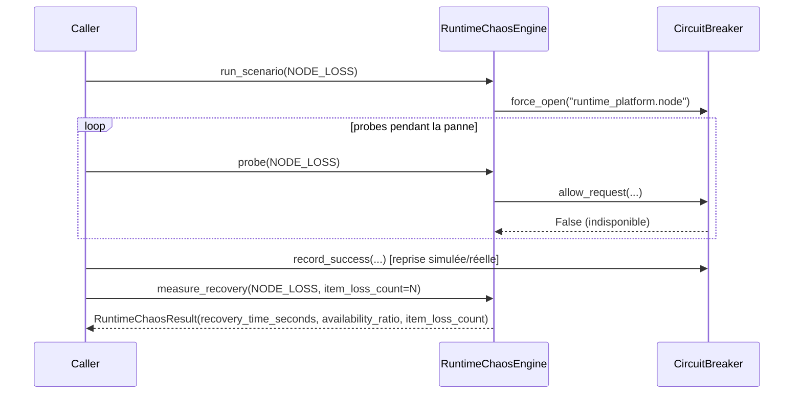

# Guide — Load Testing et Chaos Engineering étendus (Sprint 23)

## Load Testing — simulateur in-process

Aucune infrastructure de test de charge n'existait dans TMIS avant ce
sprint (aucune dépendance Locust/k6, aucun générateur maison).
`runtime_platform.load_testing.LoadTestingEngine` simule
`concurrent_users` (100, 1 000 ou 10 000 — les trois paliers demandés
par le sprint) tâches `asyncio` concurrentes appelant une coroutine
cible fournie par l'appelant :

```python
report = await LoadTestingEngine().run(LoadTestPreset.LARGE, mon_appel_cible)
# report.avg_latency_ms, .p95_latency_ms, .throughput_rps, .error_count
```

10 000 utilisateurs virtuels s'exécutent en environ 150ms contre une
cible triviale (mesuré lors du développement de ce sprint) — largement
suffisant pour charger un moteur TMIS en mémoire sans infrastructure
supplémentaire. **C'est une simulation, pas un vrai trafic réseau** :
le même compromis de transparence que `cloud_operations.
chaos_testing.ChaosTestingEngine`, qui documente explicitement
simuler une panne plutôt que la provoquer réellement.

## Chaos Engineering — extension, pas duplication

`cloud_operations.chaos_testing.ChaosTestingEngine` (Sprint 21) a été
étendu pour exposer sa garde de sécurité production
(`ensure_chaos_authorized`) comme fonction réutilisable, plutôt que
de la dupliquer. `runtime_platform.chaos_engineering.
RuntimeChaosEngine` l'applique aux trois scénarios que ce sprint
ajoute :

| Scénario | Sprint 21 couvre déjà | Sprint 23 ajoute |
|---|---|---|
| Panne fournisseur IA | `AI_PROVIDER_OUTAGE` | — |
| Perte d'une intégration | `NETWORK_CUT` | — |
| Perte d'un nœud | — | `NODE_LOSS` |
| Perte du cache | — | `CACHE_LOSS` |
| Perte du Message Bus | — | `MESSAGE_BUS_LOSS` |

## Mesure automatique — ce que le Sprint 21 ne calculait pas

`ChaosTestingEngine.run_scenario` (Sprint 21) force un circuit ouvert
et s'arrête là. `RuntimeChaosEngine` ajoute un cycle de mesure
complet :



- **Temps de reprise** : écart entre `opened_at` et le moment où
  `measure_recovery` constate que le circuit a de nouveau accepté une
  requête.
- **Disponibilité** : `probes_successful / probes_total` sur la
  fenêtre de panne — chaque appel à `probe()` est un échantillon.
- **Pertes** : `item_loss_count` reste un paramètre fourni par
  l'appelant (le nombre de tâches/événements perdus pendant la
  panne) — ce moteur ne prétend pas le déduire automatiquement d'une
  source qu'il ne possède pas.
