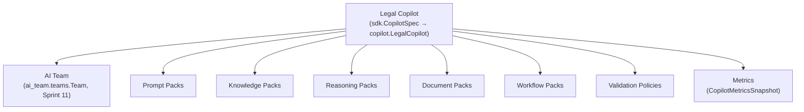

# Architecture — Legal Copilot Framework (Sprint 24)

## Objectif

Après douze sprints métier (5-9, 11-12, 15-18) et huit sprints plateforme
(10, 13-14, 19-23), TMIS dispose de tout ce qu'il faut pour *faire*
fonctionner un copilote juridique (agents, prompts, connaissances,
raisonnement, rédaction, workflows, gouvernance) mais d'aucun moyen
déclaratif de *composer* ces briques en un produit nommé, versionné,
installable par domaine (contentieux, droit des sociétés, droit fiscal...).
Le **Legal Copilot Framework** (LCF, `tmis.legal_copilot_framework`) est
cette couche d'orchestration — jamais une réimplémentation de ce qui
existe déjà.

## Phase 1 — Audit préalable (résumé)

Un audit exhaustif (docs/reports/sprint-24-rapport-audit.md) a précédé
tout code, comme l'exigeait le prompt du sprint. Constat :

| Catégorie | Nombre | Exemples |
|---|---|---|
| Composants réutilisés tels quels | 18 | `ai_team.teams.TeamBuilder`, `ai.prompts.PromptRegistry`, `cabinet_knowledge.knowledge.KnowledgeSpace`, `legal_drafting.templates.TemplateRegistry`, `workflow_automation.template_library.TemplateLibrary`, `ai_governance.policy_engine.PolicyEngine`, `identity_platform.tenant_context.TenantContextEngine`, `platform_sdk.marketplace.MarketplaceEngine` |
| Composants étendus (additifs) | 5 | `Permission.COPILOT_MANAGE`, `GovernancePolicyType.RESTRICTED_TO_ROLE`, `PluginType.COPILOT`, 5 `MetricCategory` copilote, `TmisModule.LEGAL_COPILOT_FRAMEWORK` |
| Composants réellement nouveaux | 11 | Copilot SDK, Copilot Registry, Context Engine, 5 familles de Packs, Validation Policies, 5 copilotes MVP |

Aucun conflit d'architecture bloquant n'a été identifié ; quatre zones
de recouvrement apparent ont été tranchées explicitement dans l'audit
(voir la section « Conflits d'architecture » de ce même rapport) :
activation par copilote vs. activation par module (`business_platform.
modules`), déclaration vs. exécution du raisonnement (`legal_reasoning`
reste seul exécuteur), trois couches de marketplace déjà existantes
(pas de quatrième), et portée du Context Engine (le contexte dossier
reste fourni par l'appelant plutôt que de coupler LCF à
`case_intelligence`).

## La hiérarchie du framework



Chaque niveau est un **pointeur versionné**, jamais une copie : un
`LegalCopilot` ne stocke que des ids (`team_id`, `prompt_pack_id`,
`knowledge_pack_ids`, ...), résolus fraîchement à chaque appel via le
moteur propriétaire de chaque pack. Une mise à jour d'un pack est donc
immédiatement visible par tous les copilotes qui le référencent, sans
republication du copilote lui-même.

## Les 11 sous-modules

```
backend/src/tmis/legal_copilot_framework/
├── copilot/            # LegalCopilot, CopilotActivation, CopilotEngine — catalogue + activation par firme
├── sdk/                 # CopilotSpec (déclaratif) + CopilotBuilder (validation + assemblage)
├── registry/             # CopilotManifest versionné (plusieurs versions simultanées)
├── context_engine/        # agrège contexte utilisateur/cabinet/dossier sans dupliquer les sources
├── prompt_packs/           # pointeurs vers ai.prompts.PromptRegistry, avec héritage/override
├── knowledge_packs/         # pointeurs vers cabinet_knowledge.knowledge.KnowledgeSpace
├── reasoning_packs/          # déclaration de stratégies + pointeurs vers reasoning_patterns
├── document_packs/            # pointeurs vers legal_drafting.templates + cabinet_knowledge.templates
├── workflow_packs/              # pointeurs vers workflow_automation.template_library
├── validation_policies/          # politiques spécialisées, adossées à ai_governance
├── metrics/                       # CopilotMetricsEngine, composé sur cloud_operations.metrics
├── copilots/                       # les 5 copilotes MVP (données fictives)
├── api/                             # 14 endpoints REST + bootstrap.py
└── bootstrap.py                      # composition root (singletons @lru_cache)
```

## Le principe directeur : composer, jamais reconstruire

| Ce sprint compose | Le moteur déjà existant |
|---|---|
| `prompt_packs.PromptPackEngine` | `ai.prompts.PromptRegistry` (Sprint 2) + `ai_fabric.prompt_optimizer.PromptOptimizer` (Sprint 14) |
| `knowledge_packs.KnowledgePackEngine` | `cabinet_knowledge.knowledge.KnowledgeSpace` (Sprint 12) |
| `reasoning_packs.ReasoningPackEngine` | `cabinet_knowledge.reasoning_patterns` (Sprint 12) — l'exécution reste dans `legal_reasoning` (Sprint 6) |
| `document_packs.DocumentPackEngine` | `legal_drafting.templates.TemplateRegistry` (Sprint 7) + `cabinet_knowledge.templates.CabinetTemplateEngine` (Sprint 12) |
| `workflow_packs.WorkflowPackEngine` | `workflow_automation.template_library.TemplateLibrary` (Sprint 17) |
| `validation_policies.ValidationPolicyEngine` | `ai_governance.policy_engine.PolicyEngine` + `.human_validation.HumanValidationEngine` (Sprint 15) |
| `context_engine.ContextEngine` | `identity_platform.tenant_context.TenantContextEngine` (Sprint 19) + `cabinet_knowledge.writing_style.WritingStyleEngine` (Sprint 12) |
| `sdk.CopilotBuilder` | `ai_team.teams.TeamBuilder` (Sprint 11) pour l'équipe d'agents |
| `metrics.CopilotMetricsEngine` | `cloud_operations.metrics.MetricsEngine` (Sprint 21) |
| `copilot.marketplace.to_plugin_manifest` | `platform_sdk.plugin_system`/`.publishing`/`.marketplace` (Sprint 13) |

## Contraintes respectées

- **Aucun package concurrent** : chaque moteur LCF compose un moteur
  existant plutôt que de le dupliquer (tableau ci-dessus).
- **Clean Architecture / DDD / SOLID** : chaque pack a son propre
  schéma, port, store et engine ; le SDK ne connaît que les ports des
  pack engines, jamais leurs stores.
- **Event Driven** : aucune nouvelle infrastructure d'événements —
  les compositions au-dessus de `workflow_automation`/`ai_governance`
  restent événementielles via les moteurs sous-jacents.
- **Multi-tenant** : tout appel touchant l'état d'un cabinet passe par
  `firm_id` jusqu'à `KnowledgeSpace`/`TenantContextEngine`, qui
  appliquent déjà `require_same_firm`.
- **Enterprise Identity & Trust Platform** : chaque endpoint mutateur
  appelle `identity_platform.api.guard.authorize_or_403` avec le
  nouveau `Permission.COPILOT_MANAGE`.
- **Compilable** : `ruff check src tests` et `mypy src` passent sans
  erreur, `pytest` : 1903 tests passent (1825 précédents + 78 nouveaux).

## Voir aussi

- docs/reports/sprint-24-rapport-audit.md — l'audit complet (Phase 1)
- docs/reports/sprint-24-rapport-architecture.md — rapport d'architecture détaillé
- docs/140-guide-sdk-legal-copilot-framework.md
- docs/141-guide-creation-copilote.md
- docs/142-guide-packs-legal-copilot-framework.md
- docs/143-guide-context-engine.md
- docs/144-guide-marketplace-legal-copilot-framework.md
