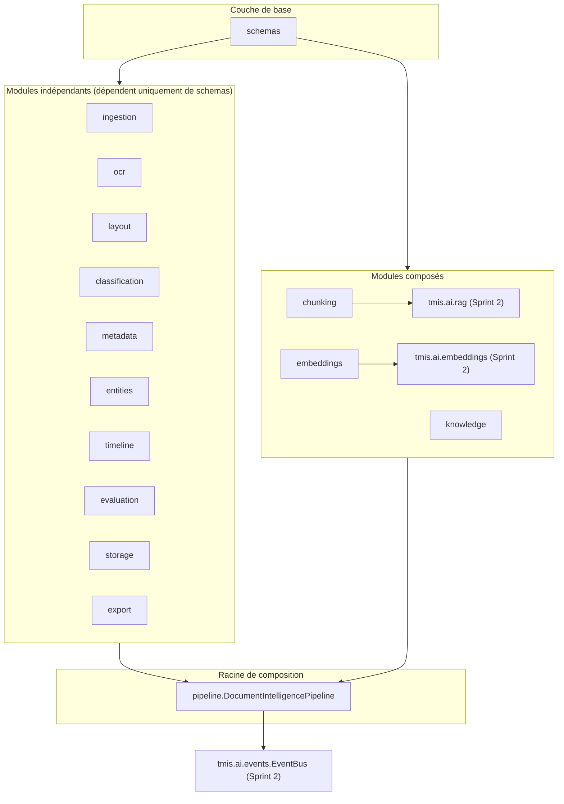
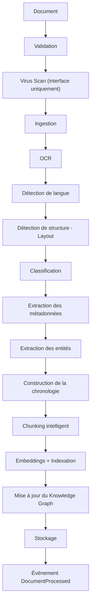
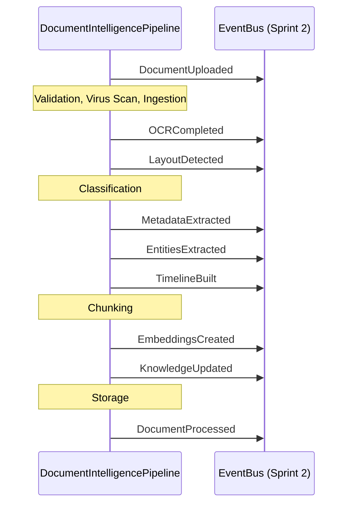

# Document Intelligence Engine (DIE) — architecture (Sprint 3)

## Pourquoi un moteur documentaire dédié

Un cabinet d'avocats travaille avant tout avec des documents. L'objectif du
DIE n'est pas seulement d'en extraire le texte : c'est de reconstruire la
structure logique et documentaire d'un dossier — mise en page, type de
document, métadonnées, entités, chronologie, découpage, embeddings et un
graphe de connaissances — pour que tous les futurs modules métier
(contrats, conclusions, stratégie...) s'appuient sur la même base fiable.

Comme le AI Kernel (Sprint 2), le DIE (`backend/src/tmis/document_intelligence/`)
ne connecte aucun moteur propriétaire directement : chaque capacité
(OCR, classification, extraction d'entités...) est un port avec une
implémentation minimale, prête à être remplacée sans toucher au pipeline
ni aux autres modules.

## Vue d'ensemble des modules

## Le pipeline documentaire

`DocumentIntelligencePipeline.process()` (`pipeline/document_pipeline.py`)
exécute ces 14 étapes dans l'ordre. Chaque étape :

- est mesurée (durée en millisecondes) et journalisée (log structuré) ;
- publie un événement sur l'`EventBus` du Sprint 2 lorsque pertinent ;
- enregistre son résultat dans `PipelineMetrics` (voir Observabilité
  ci-dessous) ;
- propage l'exception si elle échoue (une étape en échec arrête le
  pipeline — voir docs/17 et les tests de validation).

## Événements publiés

`workflow_id` corrèle tous les événements d'une même exécution du
pipeline ; `document_id` identifie le document à travers plusieurs
exécutions (nouvelle version, retraitement).

## Modules et responsabilités

| Module | Port principal | Implémentation Sprint 3 | Rôle |
|---|---|---|---|
| `ingestion` | `DocumentParserPort`, `VirusScanPort` | Parsers PDF (`pypdf`)/DOCX (`python-docx`)/TXT/Image (`Pillow`) réels ; EML préparé (non implémenté) ; scan antivirus interface-only | Transforme un fichier brut en `IngestedDocument` |
| `ocr` | `OcrEnginePort`, `LanguageDetectorPort`, `RotationDetectorPort` | `PassthroughOcrEngine` (texte déjà extrait), `NullOcrEngine` (image, placeholder), détecteur de langue heuristique (fr/en), détecteur de rotation stub | Garantit un texte exploitable, quel que soit le type de source |
| `layout` | `LayoutAnalyzerPort` | `HeuristicLayoutAnalyzer` (regex/heuristiques) | Détecte titres, sous-titres, paragraphes, listes, tableaux, signatures, annexes, notes de bas de page, en-têtes, pieds de page |
| `classification` | `ClassifierPort` | `KeywordClassifier` (10 catégories) | Classe le document (contrat, jugement, assignation, conclusions, courrier, pièce, facture, email, jurisprudence, autres) |
| `metadata` | `MetadataExtractorPort` | `DefaultMetadataExtractor` | Auteur, date, langue, type, taille, pages, source, version, hash SHA-256, qualité OCR |
| `entities` | `EntityExtractorPort` | `RegexEntityExtractor` (10 types) | Personnes, sociétés, juridictions, adresses, dates, montants, références, numéros, articles de loi, références de décisions |
| `timeline` | `TimelineBuilderPort` | `ChronologicalTimelineBuilder` | Construit une chronologie triée à partir des entités de type date, chaque événement gardant un lien vers son document |
| `chunking` | `DocumentChunkerPort` | `StructuralChunker` (respecte les sections/titres) + `FixedSizeChunkingStrategy` (adaptateur de comparaison) | Découpage qui ne se fait jamais uniquement par taille |
| `embeddings` | — | `DocumentEmbeddingBridge` | Branche `tmis.ai.embeddings` et `tmis.ai.rag.indexing` (Sprint 2) : Chunk → Embedding → Vector Store → Référencement |
| `knowledge` | `KnowledgeGraphPort` | `InMemoryKnowledgeGraph` + `KnowledgeGraphBuilder` | Graphe de connaissances V1, indépendant de la base vectorielle |
| `pipeline` | — | `DocumentIntelligencePipeline` | Orchestre toutes les étapes, publie les événements, mesure les performances |
| `storage` | `DocumentStorePort` | `InMemoryDocumentStore` | Persiste chaque artefact produit |
| `export` | `ExportPort` | `JsonExporter` | Sérialise un `DocumentRecord` pour consultation/debug |
| `evaluation` | — | `PipelineEvaluator` | Durée, erreurs et résultats par étape et par document |

## Ce que le stockage conserve

`DocumentRecord` (`schemas/record.py`) rassemble : bytes originaux, texte
OCR, blocs de mise en page, classification, métadonnées, entités,
chronologie, **références** aux chunks (les vecteurs eux-mêmes vivent dans
le vector store du Sprint 2, jamais dupliqués ici) et l'état du
traitement (`ProcessingStatus`).

## Portée du Sprint 3

- Aucune fonctionnalité métier (analyse de contrat, conclusions,
  stratégie) n'est développée : le DIE ne fait que comprendre et
  structurer les documents.
- Aucun moteur propriétaire n'est connecté (pas d'API OCR cloud, pas de
  modèle de classification externe) : tout est heuristique/déterministe,
  documenté comme placeholder derrière une interface stable.
- Le stockage est en mémoire ; la persistance SQLAlchemy arrive avec le
  bounded context `document` (Sprint 6, voir docs/09-roadmap-30-sprints.md).
