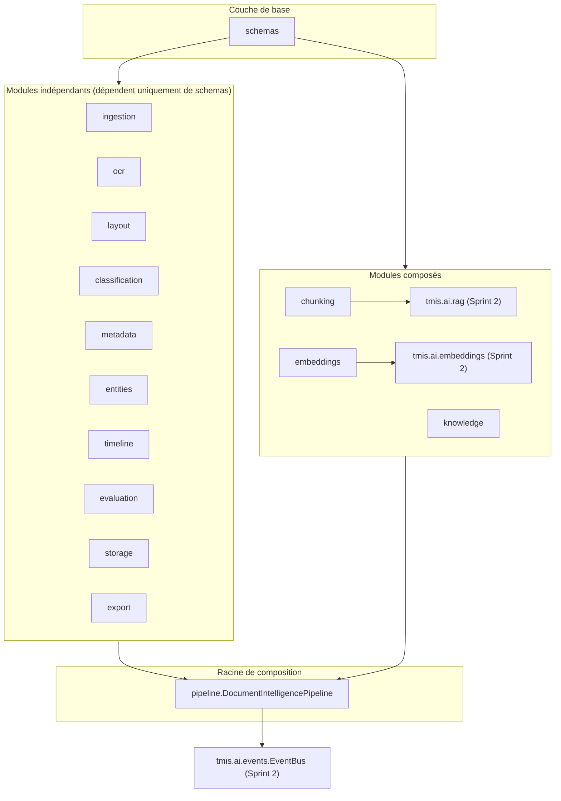
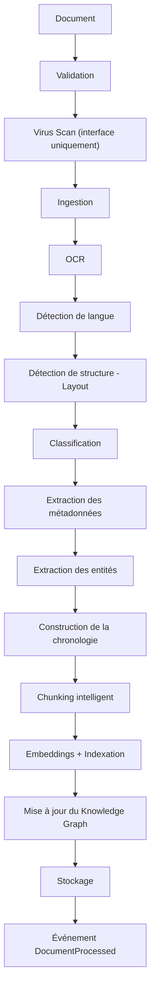
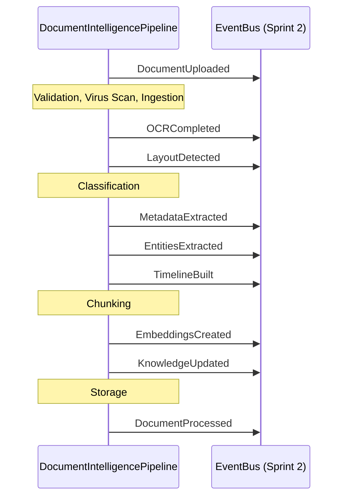

# Document Intelligence Engine (DIE) — architecture (Sprint 3)

## Pourquoi un moteur documentaire dédié

Un cabinet d'avocats travaille avant tout avec des documents. L'objectif du
DIE n'est pas seulement d'en extraire le texte : c'est de reconstruire la
structure logique et documentaire d'un dossier — mise en page, type de
document, métadonnées, entités, chronologie, découpage, embeddings et un
graphe de connaissances — pour que tous les futurs modules métier
(contrats, conclusions, stratégie...) s'appuient sur la même base fiable.

Comme le AI Kernel (Sprint 2), le DIE (`backend/src/tmis/document_intelligence/`)
ne connecte aucun moteur propriétaire directement : chaque capacité
(OCR, classification, extraction d'entités...) est un port avec une
implémentation minimale, prête à être remplacée sans toucher au pipeline
ni aux autres modules.

## Vue d'ensemble des modules

## Le pipeline documentaire

`DocumentIntelligencePipeline.process()` (`pipeline/document_pipeline.py`)
exécute ces 14 étapes dans l'ordre. Chaque étape :

- est mesurée (durée en millisecondes) et journalisée (log structuré) ;
- publie un événement sur l'`EventBus` du Sprint 2 lorsque pertinent ;
- enregistre son résultat dans `PipelineMetrics` (voir Observabilité
  ci-dessous) ;
- propage l'exception si elle échoue (une étape en échec arrête le
  pipeline — voir docs/17 et les tests de validation).

## Événements publiés

`workflow_id` corrèle tous les événements d'une même exécution du
pipeline ; `document_id` identifie le document à travers plusieurs
exécutions (nouvelle version, retraitement).

## Modules et responsabilités

| Module | Port principal | Implémentation Sprint 3 | Rôle |
|---|---|---|---|
| `ingestion` | `DocumentParserPort`, `VirusScanPort` | Parsers PDF (`pypdf`)/DOCX (`python-docx`)/TXT/Image (`Pillow`) réels ; EML préparé (non implémenté) ; scan antivirus interface-only | Transforme un fichier brut en `IngestedDocument` |
| `ocr` | `OcrEnginePort`, `LanguageDetectorPort`, `RotationDetectorPort` | `PassthroughOcrEngine` (texte déjà extrait), `NullOcrEngine` (image, placeholder), détecteur de langue heuristique (fr/en), détecteur de rotation stub | Garantit un texte exploitable, quel que soit le type de source |
| `layout` | `LayoutAnalyzerPort` | `HeuristicLayoutAnalyzer` (regex/heuristiques) | Détecte titres, sous-titres, paragraphes, listes, tableaux, signatures, annexes, notes de bas de page, en-têtes, pieds de page |
| `classification` | `ClassifierPort` | `KeywordClassifier` (10 catégories) | Classe le document (contrat, jugement, assignation, conclusions, courrier, pièce, facture, email, jurisprudence, autres) |
| `metadata` | `MetadataExtractorPort` | `DefaultMetadataExtractor` | Auteur, date, langue, type, taille, pages, source, version, hash SHA-256, qualité OCR |
| `entities` | `EntityExtractorPort` | `RegexEntityExtractor` (10 types) | Personnes, sociétés, juridictions, adresses, dates, montants, références, numéros, articles de loi, références de décisions |
| `timeline` | `TimelineBuilderPort` | `ChronologicalTimelineBuilder` | Construit une chronologie triée à partir des entités de type date, chaque événement gardant un lien vers son document |
| `chunking` | `DocumentChunkerPort` | `StructuralChunker` (respecte les sections/titres) + `FixedSizeChunkingStrategy` (adaptateur de comparaison) | Découpage qui ne se fait jamais uniquement par taille |
| `embeddings` | — | `DocumentEmbeddingBridge` | Branche `tmis.ai.embeddings` et `tmis.ai.rag.indexing` (Sprint 2) : Chunk → Embedding → Vector Store → Référencement |
| `knowledge` | `KnowledgeGraphPort` | `InMemoryKnowledgeGraph` + `KnowledgeGraphBuilder` | Graphe de connaissances V1, indépendant de la base vectorielle |
| `pipeline` | — | `DocumentIntelligencePipeline` | Orchestre toutes les étapes, publie les événements, mesure les performances |
| `storage` | `DocumentStorePort` | `InMemoryDocumentStore` | Persiste chaque artefact produit |
| `export` | `ExportPort` | `JsonExporter` | Sérialise un `DocumentRecord` pour consultation/debug |
| `evaluation` | — | `PipelineEvaluator` | Durée, erreurs et résultats par étape et par document |

## Ce que le stockage conserve

`DocumentRecord` (`schemas/record.py`) rassemble : bytes originaux, texte
OCR, blocs de mise en page, classification, métadonnées, entités,
chronologie, **références** aux chunks (les vecteurs eux-mêmes vivent dans
le vector store du Sprint 2, jamais dupliqués ici) et l'état du
traitement (`ProcessingStatus`).

## Portée du Sprint 3

- Aucune fonctionnalité métier (analyse de contrat, conclusions,
  stratégie) n'est développée : le DIE ne fait que comprendre et
  structurer les documents.
- Aucun moteur propriétaire n'est connecté (pas d'API OCR cloud, pas de
  modèle de classification externe) : tout est heuristique/déterministe,
  documenté comme placeholder derrière une interface stable.
- Le stockage est en mémoire ; la persistance SQLAlchemy arrive avec le
  bounded context `document` (Sprint 6, voir docs/09-roadmap-30-sprints.md).

## Persistance & isolation multi-tenant (Axe A, dernière tranche)

`document_records` est persistant depuis le Sprint 26 (`SQLAlchemyDocumentStore`,
Sprint 37) mais est resté le seul module de l'Axe A **non isolé par
cabinet** jusqu'à cette tranche — c'est l'**entrée** de toute la
verticale (`document → case → draft/research`), donc la dernière pièce
qui referme la boucle. Enjeu propre à ce module : `document_records`
contient `raw_bytes` — **le fichier uploadé lui-même** — pas seulement de
la métadonnée dérivée ; une fuite cross-tenant ici expose le contenu
brut, ce qui en fait la plus grave fuite possible de l'Axe A.

**ADR-DOCINT-01 — la source de vérité du `firm_id` d'un document est le
token de l'uploadeur, pas le dossier.** Un document peut n'avoir aucun
`case_id` (upload sans dossier autorisé) ; il est malgré tout estampillé
au cabinet de l'uploadeur à l'écriture, dans `upload_document` (route) et
`process_document_task` (tâche Celery), tous deux dérivant `firm_id` du
token authentifié, jamais de `case_id`. Dériver le `firm_id` d'écriture
depuis `case_id` casserait les uploads sans dossier. La migration `0013`
(rétro-remplissage sur `document_records`, déjà peuplée) est la seule
exception : `case_id → cases.firm_id` y est la seule source rétroactive
disponible (`document_records` n'a pas de colonne `case_id` dédiée — le
champ n'a jamais existé sur `DocumentRecord`, la migration ne peut donc
lire qu'une éventuelle clé `"case_id"` dans le `payload` JSON de chaque
ligne) ; toute ligne préexistante non rattachable à un cabinet est
purgée, journalisée, jamais laissée avec un `firm_id` nul ou deviné.

**`SQLAlchemyDocumentStore(firm_id=...)`** (`document_intelligence.
adapters.sqlalchemy_store`) exige désormais `firm_id` à la construction —
`get`/`save`/`list_ids`/`list_versions` sont tous scopés via
`core.tenancy.scoped_query`. Il n'existe plus de store agnostique : un
`document_id` d'un autre cabinet résout à `None` (`404` côté web),
**jamais** de `raw_bytes` renvoyés. `document_intelligence.bootstrap.
get_document_store(firm_id)` remplace le singleton `lru_cache` du Sprint
37 — comme `SQLAlchemyCaseStore`, le store ne porte aucun état au-delà de
`firm_id`, donc rien à mettre en cache.

Les trois routes `GET /documents/{document_id}`, `GET /documents/
{document_id}/versions` et `GET /documents/{document_id}/analysis`
reçoivent désormais `firm_id = Depends(get_current_firm_id)` et lisent
via le store scopé (ou, pour `/versions`, via une lecture directe au
moteur asynchrone filtrée sur `DocumentRecordModel.firm_id`, pour la même
raison que documentée dans `tmis.api.v1.document.routes` — ce port n'a
pas de méthode "liste toutes les versions").

**Le graphe de connaissances est partitionné par cabinet**
(`get_document_knowledge_graph(firm_id)`, `lru_cache` par `firm_id`,
mirroring `case_intelligence.bootstrap.get_case_graph`) — plus de graphe
global partagé entre cabinets. Volatile entre redémarrages (comme le
graphe de `case_intelligence`) : persister ce graphe reste une dette
documentée, hors périmètre de cette tranche. **Note multi-worker** : ce
graphe vit en mémoire du processus qui le construit — un déploiement
Celery à plusieurs workers aura un graphe distinct par worker pour un
même cabinet (chaque worker Celery construit sa propre instance via
`process_document_task`), donc pas de vue unifiée entre workers tant que
ce graphe n'est pas externalisé.

`process_document_task` (Celery) exige désormais `firm_id` (sinon
`ValueError`, "no processing without firm_id") — il construit son propre
`DocumentIntelligencePipeline` (store + graphe scopés via les mêmes
accesseurs que ci-dessus) plutôt que de passer par
`document_intelligence.bootstrap.get_document_pipeline()`, qui partage
l'`EventBus` en mémoire du process FastAPI : un worker Celery, hors de ce
process, ne peut pas le partager (même raison que
`trigger_case_workflow_task` dans `case_intelligence`).

`agents.bootstrap.get_contract_agent(firm_id)` n'est plus un singleton
`lru_cache` : assemblé à chaque appel avec le store scopé du cabinet
appelant, backing `GET /documents/{document_id}/analysis`.
`agents.bootstrap.get_orchestrator(firm_id)` (déjà firm-scopé depuis la
tranche `case_intelligence`) utilise lui aussi désormais le store scopé
pour son `AnalysisAgent`. Le constructeur `Orchestrator()` sans argument
(utilisé sans requête, donc sans `firm_id`) ne reconstruit plus le vrai
store : il retombe sur le défaut privé et non partagé
(`InMemoryDocumentStore`) d'`AnalysisAgent`, pour ne jamais rouvrir la
fuite `raw_bytes` que cette tranche ferme.

**Dette assumée** — `agents.bootstrap.get_contract_agent`'s `case_store`
reste `case_intelligence.bootstrap.get_shared_case_intelligence_workflow(
).case_store` (le singleton non isolé, dette déjà documentée dans
docs/19-case-intelligence.md) : cette tranche ferme la fuite
`document_intelligence`, pas la dette `case_intelligence` déjà connue sur
ce même composition root.

**Dette structurelle reconnue — `raw_bytes` en base** : le fichier
uploadé lui-même vit dans une colonne `LargeBinary` de Postgres. C'est
fonctionnellement correct et désormais isolé par cabinet, mais des
fichiers binaires dans la base relationnelle restent un choix
structurellement coûteux à l'échelle (taille de base, sauvegardes,
réplication). Sortir `raw_bytes` vers un stockage objet (S3-like), en ne
gardant qu'une référence dans `document_records`, est un sprint futur
explicitement différé — non embarqué ici.
