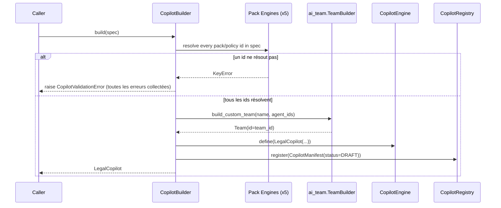

# Guide — Copilot SDK (Sprint 24)

## Objectif

Le Copilot SDK (`tmis.legal_copilot_framework.sdk`) est le point
d'entrée unique pour transformer une déclaration (`CopilotSpec`) en
un `LegalCopilot` réel, enregistré et prêt à être installé par une
firme. Un nouveau domaine juridique s'ajoute en écrivant un nouveau
`CopilotSpec` — jamais en modifiant `CopilotBuilder`.

## `CopilotSpec` — la déclaration

`CopilotSpec` (`sdk/schemas.py`) reprend exactement les champs
demandés par le Sprint 24 : identifiant, nom, domaine juridique,
description, version, dépendances, agents utilisés, modèles IA
compatibles, workflows, documents, connaissances, permissions,
métriques.

```python
@dataclass(frozen=True, slots=True)
class CopilotSpec:
    id: str
    name: str
    domain: LegalDomain
    description: str
    version: str
    author: str = "unknown"
    compatibility: str = "*"
    dependencies: tuple[str, ...] = ()
    agent_ids: tuple[str, ...] = ()
    compatible_models: frozenset[str] = field(default_factory=frozenset)
    workflow_pack_ids: tuple[str, ...] = ()
    document_pack_ids: tuple[str, ...] = ()
    knowledge_pack_ids: tuple[str, ...] = ()
    reasoning_pack_ids: tuple[str, ...] = ()
    prompt_pack_id: str | None = None
    validation_policy_ids: tuple[str, ...] = ()
    permissions: frozenset[str] = field(default_factory=frozenset)
    metrics_enabled: bool = True
```

`domain` réutilise directement `ai_team.capabilities.schemas.
LegalDomain` (Sprint 11) — jamais un second vocabulaire de domaines.

## `CopilotBuilder.build()` — le flux



Validation d'abord, construction ensuite : `build()` ne crée ni
équipe ni copilote tant qu'un seul id référencé (prompt pack,
knowledge pack, reasoning pack, document pack, workflow pack,
validation policy) ne résout pas — jamais d'installation partielle.
Toutes les erreurs sont collectées avant de lever
`CopilotValidationError`, pour qu'un auteur de copilote voie d'un
coup toutes ses références cassées plutôt qu'une à la fois.

## Exemple minimal

```python
from tmis.ai_team.capabilities.schemas import LegalDomain
from tmis.legal_copilot_framework.sdk.schemas import CopilotSpec

spec = CopilotSpec(
    id="copilot-demo",
    name="Copilote de démonstration",
    domain=LegalDomain.CIVIL,
    description="Assiste l'analyse de dossiers civils simples.",
    version="1.0.0",
    author="cabinet-demo",
    agent_ids=("agent-document-analyst", "agent-drafter"),
)

copilot = builder.build(spec)  # builder: CopilotBuilder (voir bootstrap.get_copilot_builder)
```

`build()` enregistre systématiquement le copilote avec le statut
`CopilotStatus.DRAFT` et une entrée `CopilotManifest` correspondante
dans le `CopilotRegistry` — la publication (passage à `PUBLISHED`)
est une étape distincte (`CopilotRegistry.set_status`, voir
docs/144-guide-marketplace-legal-copilot-framework.md pour le chemin
vers le Marketplace).

## Voir aussi

- docs/141-guide-creation-copilote.md — tutoriel pas à pas
- docs/142-guide-packs-legal-copilot-framework.md — comment déclarer
  les packs qu'un `CopilotSpec` référence
- `backend/src/tmis/legal_copilot_framework/copilots/*.py` — les 5
  copilotes MVP comme exemples complets
