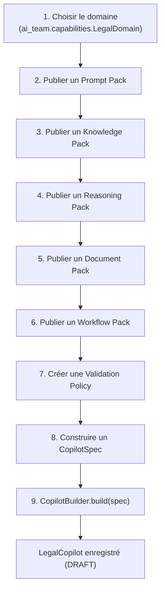

# Guide — Création d'un copilote juridique (Sprint 24)

## Objectif

Ce guide décrit, pas à pas, comment ajouter un nouveau copilote
juridique au Legal Copilot Framework **sans modifier une seule ligne
du framework lui-même** — la même méthode que celle utilisée pour les
cinq copilotes MVP du sprint
(`backend/src/tmis/legal_copilot_framework/copilots/`).



## Étape par étape (exemple : Contentieux)

Chaque étape ci-dessous est extraite, sans modification, de
`copilots/contentieux.py` — le fichier complet sert de référence pour
toute nouvelle domaine.

### 1. Choisir le domaine

```python
from tmis.ai_team.capabilities.schemas import LegalDomain
domain = LegalDomain.CIVIL
```

### 2. Publier un Prompt Pack

```python
deps.prompt_registry.register(
    "contentieux-system", category="system",
    template="Tu es le copilote Contentieux du cabinet {cabinet}...",
    variables=("cabinet", "dossier"),
)
prompt_pack = deps.prompt_packs.register_pack(
    "pp-contentieux", "Prompts Contentieux", domain,
    system_prompt_ids=("contentieux-system",),
)
```

### 3-6. Publier les autres packs

Chaque pack suit le même patron : créer/référencer le contenu sous-
jacent (un `KnowledgeObject`, un `DocumentType` existant, un
`WorkflowTemplate` existant), puis appeler `register_pack(...)` sur
l'engine correspondant. Voir docs/142-guide-packs-legal-copilot-
framework.md pour le détail de chaque famille.

### 7. Créer une Validation Policy

```python
validation_policy = deps.validation_policies.create_policy(
    "vp-contentieux-partner", "Validation associé avant dépôt", domain,
    CopilotValidationPolicyType.PARTNER_VALIDATION,
    "Toute assignation ou conclusions doit être validée par un associé.",
    required_role="partner",
)
```

### 8. Construire le `CopilotSpec`

```python
spec = CopilotSpec(
    id="copilot-contentieux",
    name="Copilote Contentieux",
    domain=domain,
    description="Assiste la qualification des faits...",
    version="1.0.0",
    author="tmis-legal-copilot-framework",
    agent_ids=("agent-document-analyst", "agent-legal-researcher", "agent-drafter"),
    compatible_models=frozenset({"gpt-4o", "claude-3-5-sonnet"}),
    prompt_pack_id=prompt_pack.id,
    knowledge_pack_ids=(knowledge_pack.id,),
    reasoning_pack_ids=(reasoning_pack.id,),
    document_pack_ids=(document_pack.id,),
    workflow_pack_ids=(workflow_pack.id,),
    validation_policy_ids=(validation_policy.id,),
    permissions=frozenset({"copilot.contentieux.use"}),
)
```

### 9. Construire le copilote

```python
copilot = deps.builder.build(spec)
```

## Ajouter ce nouveau copilote au processus de seed

Un module `copilots/<domaine>.py` exposant une fonction
`build(deps: DemoCopilotDeps) -> LegalCopilot` s'enregistre en une
ligne dans `copilots/seed.py` :

```python
def seed_demo_copilots(deps: DemoCopilotDeps) -> list[LegalCopilot]:
    return [
        contentieux.build(deps),
        mon_nouveau_domaine.build(deps),  # une ligne ajoutée, rien d'autre modifié
        ...
    ]
```

Aucun fichier du framework lui-même (`sdk/`, `copilot/`, `registry/`,
`prompt_packs/`, ...) n'est jamais modifié pour ajouter un domaine —
c'est la garantie explicite du Sprint 24 : « permettre l'ajout de
nouveaux domaines juridiques sans modification du noyau TMIS ».

## Voir aussi

- docs/140-guide-sdk-legal-copilot-framework.md
- docs/142-guide-packs-legal-copilot-framework.md
- `backend/src/tmis/legal_copilot_framework/copilots/` — les 5
  implémentations complètes (Contentieux, Droit des sociétés, Droit
  fiscal, Droit social, Contrats)
