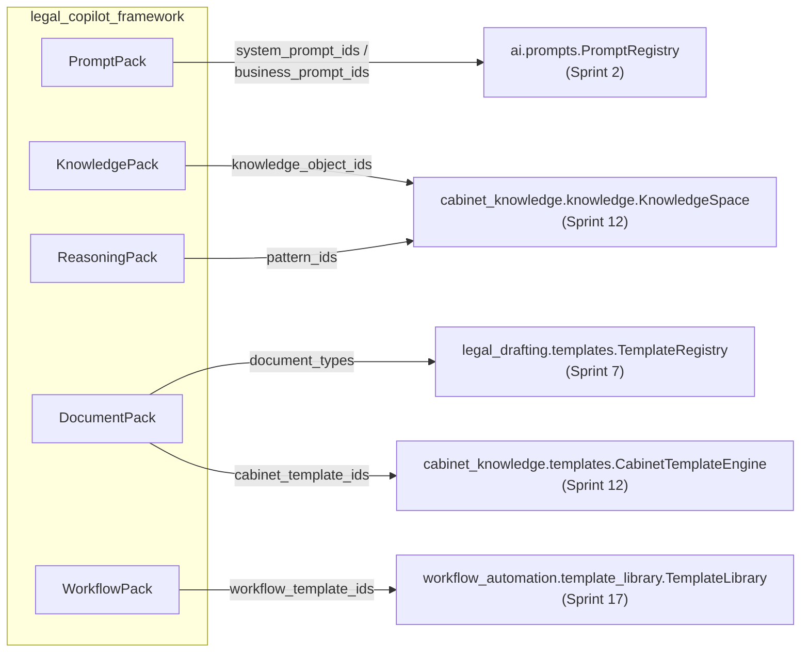

# Guide — Les Packs du Legal Copilot Framework (Sprint 24)

## Objectif

Un Pack est un **pointeur nommé et versionné** vers du contenu qui
vit déjà ailleurs dans TMIS — jamais une copie. Cinq familles de Packs
composent un copilote ; chacune délègue entièrement le stockage et la
logique métier à un moteur d'un sprint antérieur.



## Prompt Packs

`PromptPackEngine` (`prompt_packs/`) ajoute héritage et override
au-dessus d'`ai.prompts.PromptRegistry` — jamais un second registre
de prompts. `resolve_prompt_id(pack_id, prompt_id)` remonte la chaîne
`overrides` → `parent_pack_id` → id de base, avant de déléguer le
rendu à `PromptRegistry.get(...).render(**kwargs)`.

```python
pack = prompt_packs.register_pack(
    "pp-1", "Mon pack", LegalDomain.CIVIL,
    system_prompt_ids=("mon-prompt",), overrides={"mon-prompt": "mon-prompt-v2"},
)
rendered = prompt_packs.render("pp-1", "mon-prompt", nom="Ada")
```

## Knowledge Packs

`KnowledgePackEngine` (`knowledge_packs/`) sélectionne des
`KnowledgeObject` déjà gérés par `KnowledgeSpace` — gouvernance,
versionnage et isolation tenant restent entièrement dans
`cabinet_knowledge`. `resolve_objects(firm_id, pack_id)` relit les
objets à chaque appel, donc reflète toujours leur statut de
gouvernance actuel (brouillon/validé/obsolète).

## Reasoning Packs

`ReasoningPackEngine` (`reasoning_packs/`) est une **déclaration**,
jamais un exécuteur : il nomme les stratégies utilisées
(`ReasoningStrategyType` — qualification, analyse de risques,
argumentation contradictoire, recherche d'alternatives, comparaison
de jurisprudence, vérification de cohérence) et pointe vers des
`ReasoningPattern` stockés comme `KnowledgeObject`. L'exécution
réelle d'un raisonnement reste entièrement dans `tmis.legal_reasoning`
(Sprint 6) — ce module ne l'appelle ni ne le réimplémente.

## Document Packs

`DocumentPackEngine` (`document_packs/`) compose deux registres de
templates : `document_types` pointe vers `legal_drafting.templates.
TemplateRegistry` (structure — sections, variables, règles) et
`cabinet_template_ids` vers `cabinet_knowledge.templates.
CabinetTemplateEngine` (personnalisation propre au cabinet d'un de
ces types).

## Workflow Packs

`WorkflowPackEngine` (`workflow_packs/`) référence des
`WorkflowTemplate` déjà enregistrés dans `workflow_automation.
template_library.TemplateLibrary`. `instantiate_pack(firm_id, owner,
pack_id)` délègue systématiquement à `TemplateLibrary.instantiate`,
donc chaque workflow produit est un `Workflow` normal, versionné,
identique à celui qu'obtiendrait un cabinet en instanciant
directement un des six modèles du Sprint 17.

## Publier un pack via l'API

Chaque famille expose un endpoint dédié sous `POST /api/v1/legal-
copilots/packs/{prompt,knowledge,reasoning,document,workflow}` (voir
docs/09-roadmap-30-sprints.md et le rapport d'architecture pour la
liste complète). Chaque appel incrémente automatiquement la version
du pack (`register_pack` conserve l'historique complet — voir
docs/144-guide-marketplace-legal-copilot-framework.md pour la
distinction avec le versionnage du copilote lui-même).

## Voir aussi

- docs/140-guide-sdk-legal-copilot-framework.md
- docs/141-guide-creation-copilote.md
