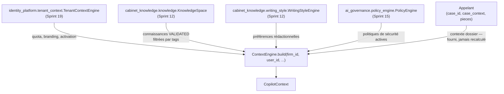

# Guide — Context Engine (Sprint 24)

## Objectif

Le Context Engine (`tmis.legal_copilot_framework.context_engine`)
agrège tout le contexte qu'un agent IA a besoin de connaître avant de
travailler sur un dossier — sans dupliquer aucune des sources
d'origine. Il produit un `CopilotContext` immuable, prêt à être
transmis aux agents d'un copilote.



## `CopilotContext` — le résultat

```python
@dataclass(frozen=True, slots=True)
class CopilotContext:
    firm_id: str
    user_id: str
    case_id: str | None
    user_context: dict[str, str]
    firm_context: dict[str, str]
    case_context: dict[str, str]
    pieces: tuple[str, ...]
    relevant_knowledge_ids: tuple[str, ...]
    security_policies: tuple[str, ...]
    writing_preferences: dict[str, str]
```

## Ce que le Context Engine agrège — et ce qu'il ne fait pas

| Champ | Source | Note |
|---|---|---|
| `firm_context` | `TenantContextEngine.get(firm_id)` | vide si le cabinet n'est pas encore provisionné (jamais d'erreur) |
| `relevant_knowledge_ids` | `KnowledgeSpace.list(firm_id, status=VALIDATED)` | filtré par `knowledge_tags` si fourni ; seules les connaissances **validées** sont retenues |
| `writing_preferences` | `WritingStyleEngine.get_or_create_profile(firm_id, user_id)` | profil créé à la volée s'il n'existe pas encore |
| `security_policies` | `PolicyEngine.list_policies(firm_id)`, filtrées `active` | résumé lisible (`type: raison`), jamais l'objet `GovernancePolicy` complet |
| `case_context`, `pieces` | fournis par l'appelant | **délibérément non recalculés** — le Context Engine ne couple pas le framework à `case_intelligence`; voir l'audit du sprint pour la justification de cette limite de portée assumée |

## Exemple

```python
context = context_engine.build(
    firm_id="cabinet-demo",
    user_id="avocat-1",
    case_id="dossier-2026-042",
    case_context={"type": "litige commercial"},
    pieces=("piece-contrat.pdf",),
    knowledge_tags=frozenset({"civil"}),
)
```

## Voir aussi

- docs/139-architecture-legal-copilot-framework.md
- docs/reports/sprint-24-rapport-audit.md — section sur la portée
  volontairement limitée du contexte dossier
