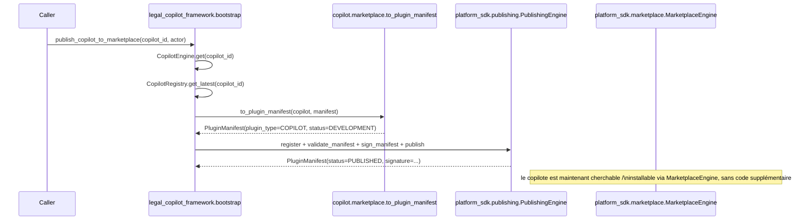
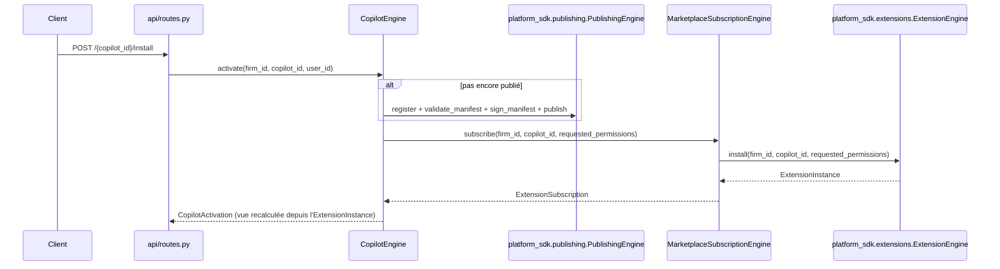

# Guide — Marketplace des copilotes (Sprint 24, réconcilié Sprint 44)

## Objectif

Le Sprint 24 demande de « préparer un futur Marketplace de copilotes »
sans construire un quatrième mécanisme de marketplace. L'audit du
sprint a recensé trois couches déjà existantes :

| Couche | Rôle | Sprint |
|---|---|---|
| `platform_sdk.plugin_system` + `.publishing` + `.marketplace` | Cycle de vie générique d'un plugin (développement → validation → signature → publication → retrait), catalogue, recherche, avis, installation/mise à jour/désinstallation | 13 |
| `business_platform.marketplace_subscriptions` | Emballage commercial (facturation) d'une installation Marketplace | 20 |

Le Sprint 24 réutilise la première couche en ajoutant un
`PluginType.COPILOT` — la deuxième s'applique automatiquement puisqu'elle
enveloppe n'importe quel `plugin_id` publié.

Un quatrième mécanisme, `ai_team.marketplace` (`MarketplaceListing`,
Sprint 11), avait été recensé dans l'audit d'origine comme jamais câblé à
aucun appelant — confirmé toujours vrai au Sprint 44
(`docs/reports/sprint-44-rapport-audit.md` §4) et supprimé purement et
simplement à cette occasion, plutôt que réconcilié.

**Ce que le Sprint 24 laissait ouvert et que le Sprint 44 a comblé :**
l'activation d'un copilote par un cabinet
(`CopilotEngine.activate`/`POST /{id}/install`) ne passait par aucune des
deux couches ci-dessus — un copilote pouvait être « actif » sans jamais
être « installé » ni facturé (voir `docs/171-audit-marketplace.md` pour
le diagnostic complet, Sprint 43). Voir la section « Activation par
cabinet » ci-dessous pour l'état actuel.

## Le pont : `LegalCopilot` → `PluginManifest`



`to_plugin_manifest` (`copilot/marketplace.py`) est une conversion à
sens unique et sans état : elle ne stocke rien, elle transforme les
champs déjà présents sur `LegalCopilot`/`CopilotManifest` (id, nom,
version, auteur, dépendances, permissions) vers les champs attendus
par `PluginManifest`. Après cet appel, le copilote profite
gratuitement de tout ce que `platform_sdk.marketplace.
MarketplaceEngine` sait déjà faire : `search`, `categories`,
`submit_review`, `install`, `update`, `install_count`.

## Le scaffold `PluginType.COPILOT`

`platform_sdk.templates.engine` génère un `copilot.json` (et non un
`.py`) pour ce type de plugin — délibérément, pour ne jamais faire
importer `legal_copilot_framework` par `platform_sdk`, qui se situe
plus bas dans le graphe de dépendances (voir docs/139-architecture-
legal-copilot-framework.md).

## Utiliser l'API

```
POST /api/v1/legal-copilots/{copilot_id}/publish-to-marketplace
{"firm_id": "...", "user_id": "..."}
```

Répond avec `plugin_id`, `plugin_type` (`"copilot"`), `version`,
`status` (`"published"` si la validation/signature réussit) et
`signature`.

## Activation par cabinet (Sprint 44)

`CopilotEngine.activate`/`POST /{copilot_id}/install` ne tenaient
jusqu'ici aucun compte de ce pont : un cabinet pouvait « activer » un
copilote sans jamais l'installer via `ExtensionEngine`, ni le facturer
via `MarketplaceSubscriptionEngine`. Depuis le Sprint 44, `activate`
compose directement les deux :



`CopilotActivation` n'est plus un enregistrement stocké par
`legal_copilot_framework` — elle est reconstruite à chaque lecture depuis
l'`ExtensionInstance` du cabinet (`version`, `granted_permissions`,
statut). Un copilote n'a donc plus qu'une seule source de vérité pour son
état d'installation, partagée avec tout autre plugin publié. Détail
complet, y compris la rupture de compatibilité contrôlée introduite sur
`POST /install`/`/deactivate` (documentée avant/après) :
`docs/reports/sprint-44-rapport-architecture.md`.

`CopilotManifest`/`CopilotSpec` portent désormais un champ `license: str`
réel (défaut `"proprietary"`, même vocabulaire libre que `PluginManifest.
license`), remplaçant la constante `_LICENSE` qui était codée en dur dans
`copilot/marketplace.py` — portée volontairement minimale, aucune refonte
du modèle de pricing des copilotes.

## Voir aussi

- docs/139-architecture-legal-copilot-framework.md
- docs/65-architecture-platform-sdk.md (ou équivalent) pour le détail
  du cycle de publication générique
- docs/171-audit-marketplace.md — diagnostic de l'écart d'activation
  (Sprint 43)
- docs/reports/sprint-44-rapport-audit.md /
  docs/reports/sprint-44-rapport-architecture.md — résolution de l'écart
  (Sprint 44)
- docs/reports/sprint-24-rapport-audit.md — section « Conflits
  d'architecture » sur les trois couches de marketplace
