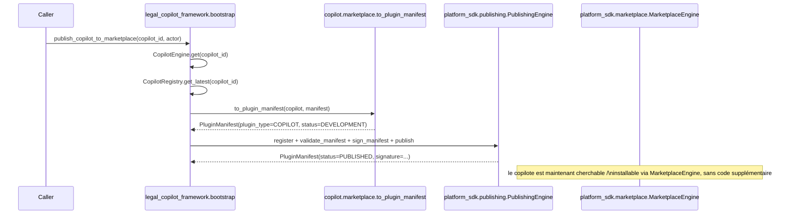

# Guide — Marketplace des copilotes (Sprint 24)

## Objectif

Le Sprint 24 demande de « préparer un futur Marketplace de copilotes »
sans construire un quatrième mécanisme de marketplace. L'audit du
sprint a recensé trois couches déjà existantes :

| Couche | Rôle | Sprint |
|---|---|---|
| `platform_sdk.plugin_system` + `.publishing` + `.marketplace` | Cycle de vie générique d'un plugin (développement → validation → signature → publication → retrait), catalogue, recherche, avis, installation/mise à jour/désinstallation | 13 |
| `business_platform.marketplace_subscriptions` | Emballage commercial (facturation) d'une installation Marketplace | 20 |
| `ai_team.marketplace` | Listings d'agents uniquement — jamais câblé à un appelant | 11 |

Le Sprint 24 réutilise la première couche en ajoutant un
`PluginType.COPILOT` — la troisième reste hors périmètre (jamais
câblée), la deuxième s'applique automatiquement puisqu'elle
enveloppe n'importe quel `plugin_id` publié.

## Le pont : `LegalCopilot` → `PluginManifest`



`to_plugin_manifest` (`copilot/marketplace.py`) est une conversion à
sens unique et sans état : elle ne stocke rien, elle transforme les
champs déjà présents sur `LegalCopilot`/`CopilotManifest` (id, nom,
version, auteur, dépendances, permissions) vers les champs attendus
par `PluginManifest`. Après cet appel, le copilote profite
gratuitement de tout ce que `platform_sdk.marketplace.
MarketplaceEngine` sait déjà faire : `search`, `categories`,
`submit_review`, `install`, `update`, `install_count`.

## Le scaffold `PluginType.COPILOT`

`platform_sdk.templates.engine` génère un `copilot.json` (et non un
`.py`) pour ce type de plugin — délibérément, pour ne jamais faire
importer `legal_copilot_framework` par `platform_sdk`, qui se situe
plus bas dans le graphe de dépendances (voir docs/139-architecture-
legal-copilot-framework.md).

## Utiliser l'API

```
POST /api/v1/legal-copilots/{copilot_id}/publish-to-marketplace
{"firm_id": "...", "user_id": "..."}
```

Répond avec `plugin_id`, `plugin_type` (`"copilot"`), `version`,
`status` (`"published"` si la validation/signature réussit) et
`signature`.

## Voir aussi

- docs/139-architecture-legal-copilot-framework.md
- docs/65-architecture-platform-sdk.md (ou équivalent) pour le détail
  du cycle de publication générique
- docs/reports/sprint-24-rapport-audit.md — section « Conflits
  d'architecture » sur les trois couches de marketplace
