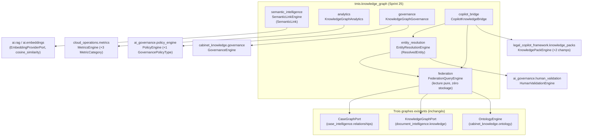

# Architecture — Knowledge Graph Federation & Semantic Intelligence (Sprint 25)

## Objectif

TMIS dispose déjà de trois graphes, chacun scope à son propre bounded
context et n'en sortant jamais :

- `tmis.case_intelligence.relationships` (`CaseGraphPort`, scope dossier)
- `tmis.document_intelligence.knowledge` (`KnowledgeGraphPort`, scope document)
- `tmis.cabinet_knowledge.ontology` (`OntologyEngine`/`RelationStorePort`, scope cabinet)

Aucun des trois ne répond seul à une question qui les traverse tous :
« tout ce qui touche l'entité X, dans quel dossier, quel document,
quelle recommandation cabinet ». Le Sprint 25 (`tmis.knowledge_graph`)
ajoute cette capacité de fédération, sans jamais devenir un quatrième
moteur de graphe — il ne stocke aucun node ni edge brut, il interroge
les trois moteurs existants via leurs ports.

## Phase 1 — Audit préalable (résumé)

Un audit exhaustif (docs/reports/sprint-25-rapport-audit.md) a précédé
tout code, comme l'exigeait le prompt du sprint. Constat : les neuf
fichiers de référence désignés par le prompt (ports/schemas/stores des
trois graphes, `human_validation`, `cloud_operations.metrics`,
`policy_engine`, `knowledge_packs`, `ai.rag.ports`) n'avaient pas dévié
de l'analyse CTO — aucun écart à signaler, le développement a pu
commencer directement.

## Phase 1 du code — DRY sur les deux graphes en mémoire

`InMemoryCaseGraph` et `InMemoryKnowledgeGraph` dupliquaient exactement
le même mécanisme (dict de nodes, liste d'edges, adjacency list en
`defaultdict`). `tmis.core.graph.AdjacencyGraphStore` (générique sur
`NodeT`/`EdgeT`, contraint par les protocoles structurels `_HasId`/
`_HasEndpoints`) factorise ce mécanisme ; les deux classes le composent
désormais par délégation. Les ports `CaseGraphPort`/`KnowledgeGraphPort`
et tous les tests existants sont restés inchangés — voir
docs/reports/sprint-25-rapport-architecture.md pour le détail de la
vérification.

## Les six sous-modules de `tmis.knowledge_graph`

1. **`federation`** — `FederationQueryEngine` ne détient aucun état :
   `case_neighborhood`/`document_neighborhood`/`cabinet_neighborhood`
   sont chacun une projection fine d'un appel existant
   (`get_node`/`get_neighbors` ou `OntologyEngine.relations_for`).
   `cross_scope_neighborhood` est le point d'entrée de la requête
   fédérée : à partir d'occurrences déjà identifiées comme la même
   entité (typiquement produites par `entity_resolution`), il rassemble
   un `FederatedNeighborhood` par scope où l'entité apparaît.

2. **`entity_resolution`** — la seule capacité réellement nouvelle au
   sens strict : rien d'autre dans TMIS ne décide que des identifiants
   différents dans les trois graphes désignent la même personne ou
   société. Le score de confiance est le pire appariement de labels
   entre occurrences (`difflib.SequenceMatcher`, conservateur par
   construction). Sous le seuil configuré (0.85 par défaut), la
   résolution n'est jamais auto-confirmée : elle passe par
   `HumanValidationEngine.request_simple`, réutilisé tel quel.

3. **`semantic_intelligence`** — des `SemanticLink` calculés via
   `tmis.ai.embeddings`/`tmis.ai.rag` (le même `EmbeddingProviderPort`
   et la même `cosine_similarity` que le reste de TMIS), explicitement
   distincts des edges « connecté à » des trois graphes — même
   principe que celui déjà documenté dans
   `document_intelligence.knowledge.ports.KnowledgeGraphPort` pour
   justifier l'indépendance vis-à-vis de `tmis.ai.rag`.

4. **`analytics`** — étend `cloud_operations.metrics.MetricCategory`
   avec `GRAPH_COVERAGE`, `ENTITY_RESOLUTION_RATE`,
   `SEMANTIC_LINK_DENSITY` (toutes `GAUGE`), et compose
   `MetricsEngine` — jamais un entrepôt de métriques parallèle, même
   convention que le Sprint 24.

5. **`governance`** — étend `ai_governance.policy_engine.
   GovernancePolicyType` avec `RESTRICTED_ENTITY_VISIBILITY`
   (`GovernancePolicy.restricted_entity_id`,
   `PolicyEvaluationContext.entity_id`, tous deux additifs) et compose
   `cabinet_knowledge.governance.GovernanceEngine` pour vérifier qu'un
   objet de connaissance référencé est bien `VALIDATED` — jamais un
   second moteur de politique.

6. **`copilot_bridge`** — étend `KnowledgePack` avec
   `resolved_entity_ids`/`federated_relation_refs` (tuples vides par
   défaut, `KnowledgePackEngine.register_pack` accepte les deux en
   kwargs optionnels) pour qu'un Knowledge Pack puisse pointer vers des
   entités résolues et des relations fédérées — toujours des ids
   résolus fraîchement à chaque appel, jamais une copie, le patron
   « pointeur, pas payload » déjà établi au Sprint 24.

## Règles non négociables — respectées

- Aucun submodule ne stocke de nodes/edges bruts : `federation` lit
  uniquement à travers les trois ports existants ; `entity_resolution`
  ne stocke que l'issue de la résolution (`ResolvedEntity`), jamais un
  node/edge de graphe ; `semantic_intelligence` ne stocke que des
  `SemanticLink`, un type distinct des edges des trois graphes.
- Chaque composant étendu (`MetricCategory`, `GovernancePolicyType`,
  `KnowledgePack`/`KnowledgePackEngine.register_pack`) n'a reçu que des
  ajouts : nouveaux membres d'enum, nouveaux champs à défaut, nouveaux
  paramètres optionnels — zéro rupture, tous les tests antérieurs
  passent sans modification.
- `tmis.knowledge_graph.api` (REST, `/api/v1/knowledge-graph`) est une
  couche HTTP fine au-dessus des six moteurs ci-dessus, sur le même
  principe que le reste du dépôt — voir
  docs/148-reference-api-knowledge-graph.md.

## Vérification

- `ruff check src tests` → All checks passed
- `mypy src` → Success, aucune erreur
- `pytest -q` → voir docs/reports/sprint-25-rapport-architecture.md pour le décompte exact
