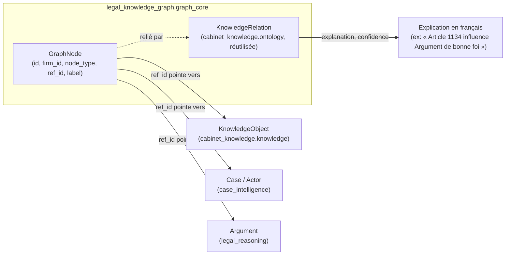

# Architecture — Legal Knowledge Graph & Semantic Intelligence Platform (Sprint 25)

## Objectif

Après vingt-quatre sprints, TMIS sait analyser un document, raisonner
sur un dossier, rechercher une source, rédiger un brouillon, composer
des copilotes — mais chaque connaissance produite reste enfermée dans
le contexte qui l'a créée : un document ne connaît pas les contrats
similaires, une jurisprudence ne sait pas qu'elle influence un
argument, un copilote ne peut interroger qu'un `KnowledgeSpace` plat.
Le **Legal Knowledge Graph & Semantic Intelligence Platform**
(LKG-SIP, `tmis.legal_knowledge_graph`) transforme ces connaissances
dispersées en un réseau explicable, jamais en un second moteur de
connaissances concurrent de l'existant.

## Phase 1 — Audit préalable (résumé)

Un audit exhaustif a précédé tout code, comme l'exigeait le prompt du
sprint. Constat central : **trois graphes fragmentés existaient
déjà**, aucun unifié :

| Graphe existant | Sprint | Portée | Multi-tenant |
|---|---|---|---|
| `document_intelligence.knowledge.InMemoryKnowledgeGraph` | 3 | Un seul document | Non |
| `case_intelligence.relationships` (`CaseNode`/`CaseEdge`) | 4 | Un seul dossier | Non |
| `cabinet_knowledge.ontology.OntologyEngine` | 12 | Relations entre deux `KnowledgeObject` | Oui (seul fragment) |

Décision d'architecture : étendre `cabinet_knowledge.ontology` (seul
fragment multi-tenant) comme substrat canonique du nouveau graphe,
plutôt que construire un quatrième moteur. Les deux graphes locaux
(document, dossier) restent inchangés — ils alimentent le nouveau
graphe via l'ingestion, jamais remplacés.

| Catégorie | Nombre | Exemples |
|---|---|---|
| Composants réutilisés tels quels | 12 | `cabinet_knowledge.ontology.KnowledgeRelation`, `cabinet_knowledge.knowledge.KnowledgeSpace`, `.lineage`/`.validation`/`.approval`/`.quality`/`.feedback`, `case_intelligence.actors.merger.normalize_name`, `ai.embeddings.HashingEmbeddingProvider`, `document_intelligence.classification`/`.entities`, `ai_governance.human_validation.HumanValidationEngine`, `identity_platform.api.guard.authorize_or_403`, `cloud_operations.metrics.MetricsEngine`, `legal_copilot_framework.context_engine.ContextEngine` |
| Composants étendus (additifs) | 5 | 4 `RelationType` (`INFLUENCES`/`APPEARS_IN`/`MENTIONS`/`SAME_AS`), `KnowledgeType.CONTRACT`, `Permission.KNOWLEDGE_GRAPH_MANAGE`, 6 `MetricCategory` graphe, `CopilotContext.graph_context` |
| Composants réellement nouveaux | 11 | Graph Core, Semantic Engine, Entity Resolution, Ingestion Pipeline, Human Validation (graphe), Copilot Bridge, Governance, Quality Engine (graphe), Analytics (graphe), démonstration, API |

## Le graphe : un réseau de pointeurs, jamais de copies



Un `GraphNode` (CONCEPT, LAW_ARTICLE, JURISPRUDENCE, DECISION,
CONTRACT, CLAUSE, PARTY, LEGAL_ENTITY, CASE, ARGUMENT, RISK,
PROCEDURE, DOCUMENT) est un **pointeur**, jamais une copie : `ref_id`
est l'id de l'entité réelle dans son contexte propriétaire ; résoudre
`ref_id` en contenu reste toujours la responsabilité de l'appelant, à
travers le port de ce contexte. Chaque relation (`GraphEngine.link`)
réutilise directement `cabinet_knowledge.ontology.KnowledgeRelation`/
`RelationType` et porte une `explanation` — générée automatiquement
(`"{source} {verbe} {target}"`) ou fournie explicitement — de sorte
que toute relation du graphe reste explicable en une phrase, comme
l'exige le sprint.

## Les 11 sous-modules

```
backend/src/tmis/legal_knowledge_graph/
├── graph_core/         # GraphNode, GraphEngine — nœuds/relations explicables (Phase 2)
├── semantic_engine/      # recherche par intention, similarité, classification (Phase 3)
├── entity_resolution/      # scoring, correspondance SAME_AS, validation humaine, historique (Phase 4)
├── ingestion/                # Import → Extraction → Classification → Enrichissement → Validation → Publication (Phase 5)
├── human_validation/           # feedback sur nœuds/relations/correspondances (Phase 6)
├── copilot_bridge/                # KnowledgeGraphQueryEngine + attach_graph_context (Phase 7)
├── governance/                       # confidentialité/rétention par nœud, décision déléguée à identity_platform (Phase 8)
├── quality/                             # doublons/incohérences/sources manquantes → score de confiance (Phase 9)
├── analytics/                              # taille du graphe, latence, qualité, validations, enrichissements (Phase 10)
├── demo/                                     # scénario de démonstration (cabinet fictif, Phase 11)
├── api/                                        # 13 endpoints REST + schemas
└── bootstrap.py                                  # composition root (singletons @lru_cache)
```

## Le principe directeur : composer, jamais reconstruire

| Ce sprint compose | Le moteur déjà existant |
|---|---|
| `graph_core.GraphEngine` (relations) | `cabinet_knowledge.ontology.KnowledgeRelation`/`RelationType` (Sprint 12) |
| `semantic_engine.SemanticEngine` | `ai.embeddings.HashingEmbeddingProvider`/`.similarity` (Sprint 2) + `document_intelligence.classification` (Sprint 3) |
| `entity_resolution.EntityResolutionEngine` | `case_intelligence.actors.merger.normalize_name` (Sprint 4, généralisé du dossier au cabinet) + `ai_governance.human_validation.HumanValidationEngine` (Sprint 15) |
| `ingestion.KnowledgeIngestionPipeline` | `cabinet_knowledge.knowledge.KnowledgeSpace`/`.lineage`/`.validation`/`.approval` (Sprint 12) + `document_intelligence.entities.RegexEntityExtractor` (Sprint 3) |
| `human_validation.GraphFeedbackEngine` | `cabinet_knowledge.feedback.FeedbackAction` (vocabulaire réutilisé, Sprint 12) |
| `copilot_bridge` | `legal_copilot_framework.context_engine.CopilotContext` (Sprint 24, champ additif jamais un couplage dur) |
| `governance.GraphAccessPolicyEngine` | `identity_platform.api.guard.authorize_or_403` + `identity_platform.abac.AbacAttributes` (Sprint 19) |
| `quality.GraphQualityEngine` | `cabinet_knowledge.quality.QualityEngine` (Sprint 12, étendu de trois pénalités) |
| `analytics.GraphAnalyticsEngine` | `cloud_operations.metrics.MetricsEngine` (Sprint 21) |

## Contraintes respectées

- **Aucun graphe concurrent** : le nouveau graphe étend
  `cabinet_knowledge.ontology` ; `document_intelligence.knowledge` et
  `case_intelligence.relationships` restent inchangés et non dupliqués.
- **Traçabilité** : chaque nœud de type CLAUSE/JURISPRUDENCE/DECISION/
  CONTRACT/DOCUMENT pointe vers un `KnowledgeObject` dont la lignée
  reste gérée par `cabinet_knowledge.lineage.LineageEngine` (Sprint 12).
- **Aucune connaissance sans validation humaine** : seule une
  correspondance de nom exact (score 1.0) auto-confirme une relation
  `SAME_AS` ; l'ingestion ne publie jamais automatiquement
  (`KnowledgeIngestionPipeline.publish` reste un appel humain distinct).
- **Isolation multi-tenant** : chaque store (`InMemoryGraphNodeStore`,
  `InMemoryGraphRelationStore`, `InMemoryResolutionMatchStore`, ...)
  filtre par `firm_id` avant tout accès.
- **Confidentialité et gouvernance** : `GraphAccessPolicyEngine` ne
  décide jamais lui-même — il fournit les attributs ABAC à
  `identity_platform.api.guard.authorize_or_403`, seul décideur.
- **Clean Architecture / DDD / SOLID** : chaque sous-module a son
  propre schéma, port, store et engine ; aucun moteur n'accède au
  store d'un autre sous-module directement.
- **Compilable** : `ruff check src tests` et `mypy src` passent sans
  erreur, `pytest` : 1961 tests passent (1903 précédents + 58 nouveaux).

## Voir aussi

- docs/reports/sprint-25-demo-legal-knowledge-graph.md — démonstration avec sorties réelles
- docs/146-guide-ingestion-knowledge-graph.md
- docs/147-guide-validation-humaine-graphe.md
- docs/148-guide-gouvernance-knowledge-graph.md
- docs/149-guide-creation-knowledge-pack.md
- docs/150-reference-api-legal-knowledge-graph.md
