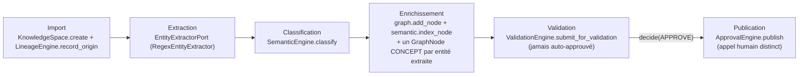

# Guide — Pipeline d'ingestion du Knowledge Graph (Sprint 25)

## Objectif

Le pipeline d'ingestion (`tmis.legal_knowledge_graph.ingestion.
KnowledgeIngestionPipeline`) transforme une source de connaissance
brute (document interne, modèle, contrat, analyse, note, jurisprudence
importée) en un nœud du graphe, explicable et traçable — sans jamais
publier automatiquement une connaissance non validée par un humain.



## Les six étapes

| Étape | Méthode | Ce qu'elle fait |
|---|---|---|
| Import | `KnowledgeSpace.create` + `LineageEngine.record_origin` | crée un `KnowledgeObject` (Sprint 12) et enregistre ses sources d'origine |
| Extraction | `EntityExtractorPort.extract` (`RegexEntityExtractor`, Sprint 3) | entités (personnes, sociétés, articles, dates, montants...) — jamais un second extracteur |
| Classification | `SemanticEngine.classify` → `document_intelligence.classification` | catégorie (contrat, jugement, courrier...) + confiance |
| Enrichissement | `GraphEngine.add_node` + `SemanticEngine.index_node` | un `GraphNode` pour la source, un `GraphNode` CONCEPT par entité extraite, reliés par `RelationType.MENTIONS` |
| Validation | `ValidationEngine.submit_for_validation` (Sprint 12) | jamais sautée — la connaissance reste `IN_REVIEW` tant qu'un humain n'a pas décidé |
| Publication | `KnowledgeIngestionPipeline.publish` → `ApprovalEngine.publish` | appel explicite, distinct de la validation, exactement comme `cabinet_knowledge.approval` l'exige déjà |

## Les six types de source

```python
class IngestionSourceType(StrEnum):
    INTERNAL_DOCUMENT = "internal_document"
    TEMPLATE = "template"
    CONTRACT = "contract"
    ANALYSIS = "analysis"
    NOTE = "note"
    IMPORTED_JURISPRUDENCE = "imported_jurisprudence"
```

Chaque type se projette sur un `KnowledgeType` (Sprint 12) et un
`GraphNodeType` (Sprint 25) existants — jamais une nouvelle taxonomie :

| `IngestionSourceType` | `KnowledgeType` | `GraphNodeType` |
|---|---|---|
| `CONTRACT` | `KnowledgeType.CONTRACT` (ajout additif) | `CONTRACT` |
| `TEMPLATE` | `KnowledgeType.TEMPLATE` | `DOCUMENT` |
| `IMPORTED_JURISPRUDENCE` | `KnowledgeType.JURISPRUDENCE_NOTE` | `JURISPRUDENCE` |
| `INTERNAL_DOCUMENT`, `ANALYSIS`, `NOTE` | `NOTE`/`BEST_PRACTICE` | `DOCUMENT` |

## Exemple

```python
result = await pipeline.ingest(
    "firm-demo",
    IngestionSourceType.CONTRACT,
    "Contrat de prestation ACME",
    "Contrat conclu avec ACME Corp SARL, article 1134 du Code civil.",
    "Julien Moreau",
)
# result.extracted_entity_labels == ("article 1134", "ACME Corp SARL")
# result.classification_category == "contract"

validation.decide(firm_id, result.validation_request_id, ValidationDecision.APPROVE, reviewer="Camille Lefèvre")
pipeline.publish(firm_id, result.knowledge_object_id, approver="Camille Lefèvre")
```

## Voir aussi

- docs/145-architecture-legal-knowledge-graph.md
- docs/147-guide-validation-humaine-graphe.md
- docs/reports/sprint-25-demo-legal-knowledge-graph.md
