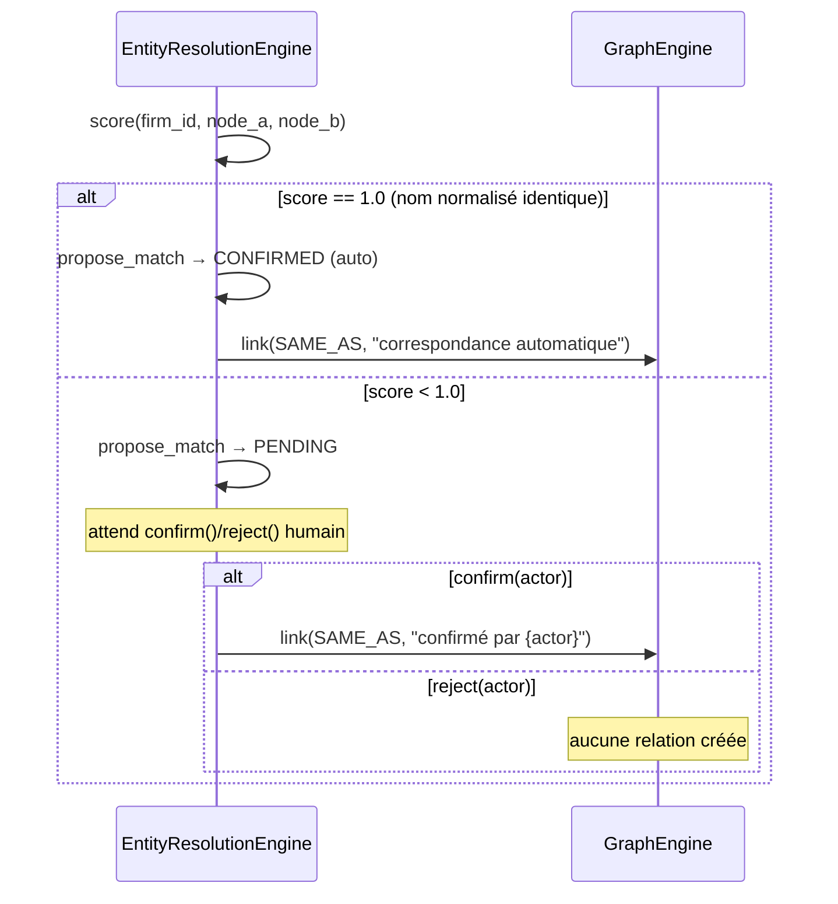

# Guide — Validation humaine dans le Knowledge Graph (Sprint 25)

## Objectif

Le sprint distingue deux boucles de validation humaine, chacune
adossée à un mécanisme différent selon la nature du sujet — jamais un
second mécanisme concurrent pour le même type de sujet :

| Sujet | Mécanisme | Sprint |
|---|---|---|
| Un `KnowledgeObject` (document, contrat, note ingérés) | `cabinet_knowledge.validation.ValidationEngine` + `cabinet_knowledge.feedback.FeedbackEngine` | 12 |
| Une correspondance d'entités (`ResolutionMatch`) | `entity_resolution.EntityResolutionEngine.confirm`/`.reject` (+ `ai_governance.human_validation` pour une revue formelle) | 25 |
| Un `GraphNode` ou une `KnowledgeRelation` (pas un `KnowledgeObject`) | `human_validation.GraphFeedbackEngine` | 25 |

`GraphFeedbackEngine` comble exactement le trou que
`cabinet_knowledge.feedback.FeedbackEngine` ne peut pas couvrir : il
réutilise le même vocabulaire (`FeedbackAction` — ACCEPT, MODIFY,
REJECT, ANNOTATE, EXPLAIN) mais avec un store propre au sujet
(`subject_id` générique), puisque `FeedbackEngine.submit` exige que
`KnowledgeSpace.get` résolve l'objet — ce qui échoue pour un nœud
CASE/PARTY/ARGUMENT qui pointe vers un autre contexte.

## La boucle de résolution d'entités



`_AUTO_CONFIRM_THRESHOLD = 0.98` — seule une correspondance de nom
normalisé exact (score 1.0, même logique que
`case_intelligence.actors.merger.normalize_name`, Sprint 4) auto-
confirme. Tout le reste attend une décision humaine, conformément à la
contrainte du sprint (« aucune connaissance ne peut être ajoutée
automatiquement sans validation humaine », héritée du Sprint 12).

## L'historique n'est jamais écrasé

`ResolutionMatch` a l'air mutable (`@dataclass(slots=True)`, pas
`frozen`) mais `confirm()`/`reject()` ne modifient jamais l'instance en
place : ils construisent un nouveau `ResolutionMatch` avec le même
`id` et le sauvegardent à nouveau — le store append à une liste,
`history()` retourne donc chaque décision jamais prise.

## Exemple

```python
feedback_engine.submit(
    firm_id, relation.id, FeedbackAction.ACCEPT, "Camille Lefèvre",
    "Confirmé : l'article 1134 fonde bien l'argument de bonne foi.",
)
feedback_engine.acceptance_rate(firm_id, relation.id)  # 1.0
```

## Voir aussi

- docs/145-architecture-legal-knowledge-graph.md
- docs/146-guide-ingestion-knowledge-graph.md
- docs/reports/sprint-25-demo-legal-knowledge-graph.md
