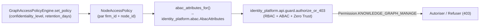

# Guide — Gouvernance du Knowledge Graph (Sprint 25)

## Objectif

Qui peut voir, modifier ou publier un élément du graphe ? Quelle est
sa durée de conservation, son niveau de confidentialité ? Le sprint
répond à ces questions **sans construire un second mécanisme
d'autorisation** : `GraphAccessPolicyEngine` ne porte que les
métadonnées, la décision reste toujours celle de l'Enterprise Identity
& Trust Platform (Sprint 19).



## Ce que `GraphAccessPolicyEngine` fait — et ne fait pas

| Fait | Ne fait pas |
|---|---|
| Stocke `confidentiality_level` (défaut `"standard"`) et `retention_days` par nœud | Ne décide jamais elle-même de l'accès |
| Calcule `is_past_retention()` à partir de `created_at` | N'applique aucune suppression automatique |
| Traduit la politique en `AbacAttributes` | N'évalue jamais une règle RBAC/ABAC |

Chaque endpoint mutateur de l'API (`POST /legal-knowledge-graph/...`)
appelle `authorize_or_403(firm_id, user_id, Permission.
KNOWLEDGE_GRAPH_MANAGE)` avant toute action — le nouveau
`Permission.KNOWLEDGE_GRAPH_MANAGE` est accordé, dans le même commit
que sa création, à `Role.PARTNER`, `Role.ASSOCIATE` et
`Role.IT_ADMIN` dans `identity_platform.rbac.DEFAULT_ROLE_PERMISSIONS`
— une leçon tirée directement du Sprint 24, où `COPILOT_MANAGE` avait
été ajouté à l'énumération sans jamais être accordé à un rôle,
bloquant silencieusement tous les endpoints mutateurs jusqu'à ce que
les tests d'intégration le révèlent.

## Exemple

```python
governance.set_policy(
    firm_id, jurisprudence_node.id,
    confidentiality_level="confidential",
    retention_days=3650,
)
attributes = governance.abac_attributes_for(firm_id, jurisprudence_node.id)
# attributes.confidentiality_level == "confidential"
```

## Voir aussi

- docs/145-architecture-legal-knowledge-graph.md
- docs/103-architecture-identity-platform.md — `authorize_or_403`, RBAC/ABAC
- docs/reports/sprint-25-demo-legal-knowledge-graph.md
