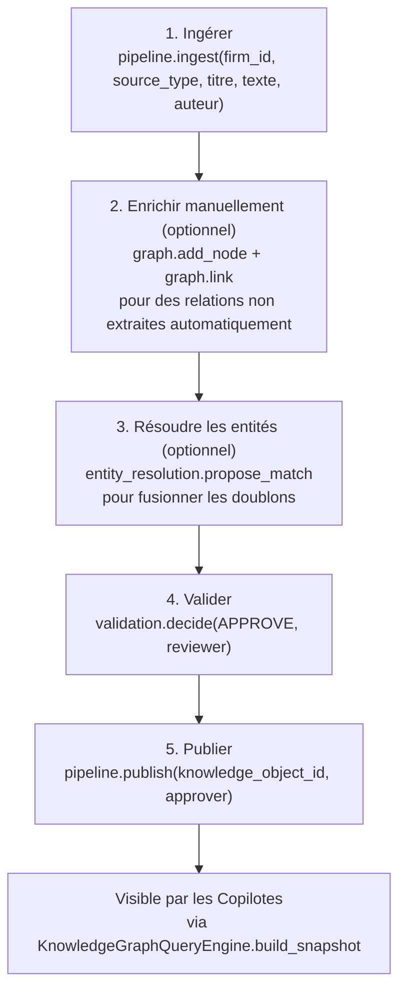

# Guide — Créer et publier un Knowledge Pack dans le graphe (Sprint 25)

## Objectif

Ce guide décrit le parcours complet pour faire entrer une nouvelle
connaissance dans le Knowledge Graph — de sa rédaction à sa
disponibilité pour un Legal Copilot. On appelle « Knowledge Pack »
ici le **paquet de connaissance publié** (ingestion + enrichissement +
validation + publication), à ne pas confondre avec
`legal_copilot_framework.knowledge_packs.KnowledgePack` (Sprint 24),
qui est un pointeur versionné vers un ensemble de `KnowledgeObject`
existants pour un copilote — les deux notions sont complémentaires : un
Knowledge Pack de copilote peut référencer des `KnowledgeObject` créés
via ce parcours.

## Le parcours en cinq étapes



## Étape par étape

**1. Ingérer.** Choisir le `IngestionSourceType` le plus proche
(`CONTRACT`, `TEMPLATE`, `IMPORTED_JURISPRUDENCE`, ...) — voir
docs/146-guide-ingestion-knowledge-graph.md pour le détail des six
types. Le pipeline crée automatiquement le `GraphNode` racine et un
`GraphNode` CONCEPT par entité extraite.

**2. Enrichir (optionnel).** Ajouter des relations que l'extraction
automatique ne peut pas déduire — par exemple un lien `INFLUENCES`
entre un article de loi et un argument juridique :

```python
graph.link(firm_id, article_node.id, argument_node.id, RelationType.INFLUENCES)
```

**3. Résoudre les entités (optionnel).** Si la connaissance mentionne
une partie déjà connue sous une autre forme, proposer une
correspondance (voir docs/147-guide-validation-humaine-graphe.md) :

```python
match = await entity_resolution.propose_match(firm_id, node_a.id, node_b.id)
```

**4. Valider.** Un humain (jamais le système) décide :

```python
validation.decide(firm_id, result.validation_request_id, ValidationDecision.APPROVE, reviewer="Camille Lefèvre")
```

**5. Publier.** Distinct de la validation, comme l'exige
`cabinet_knowledge.approval` depuis le Sprint 12 :

```python
pipeline.publish(firm_id, result.knowledge_object_id, approver="Camille Lefèvre")
```

À partir de cet instant, un Copilot peut interroger cette connaissance
via `KnowledgeGraphQueryEngine` (voir docs/145-architecture-legal-
knowledge-graph.md, section « Copilot Bridge »).

## Voir aussi

- docs/146-guide-ingestion-knowledge-graph.md
- docs/147-guide-validation-humaine-graphe.md
- docs/142-guide-packs-legal-copilot-framework.md — les Knowledge Packs du Copilot Framework (Sprint 24)
- docs/reports/sprint-25-demo-legal-knowledge-graph.md
