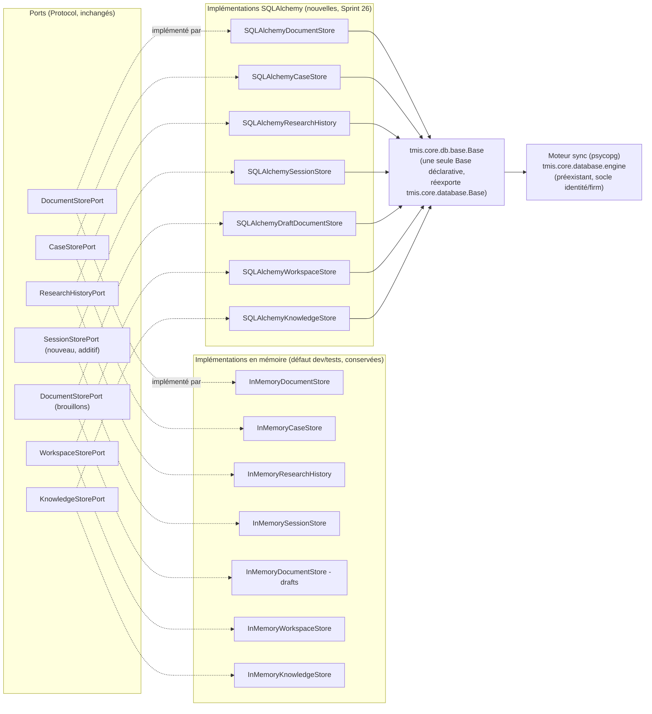

# 151 — Architecture de persistance (Sprint 26)

Ce document décrit le socle de persistance ajouté au Sprint 26 derrière
les 7 ports de stockage qui, jusqu'ici, n'existaient qu'en mémoire. Voir
le rapport d'audit (`docs/reports/sprint-26-rapport-audit.md`) pour le
détail composant par composant, et le rapport d'architecture
(`docs/reports/sprint-26-rapport-architecture.md`) pour les décisions.

## Principe : composition sur les ports existants, jamais de remplacement

Aucun des 7 ports de stockage n'a changé de signature. Chaque adaptateur
SQLAlchemy implémente le port *tel quel* ; le code appelant (pipelines,
orchestrateurs, API) continue de dépendre du `Protocol`, jamais d'une
implémentation concrète — c'est ce qui permet de faire coexister
`InMemory*Store` (défaut dev/tests) et `SQLAlchemy*Store` (production)
sans aucune branche `if` dans le code métier.

**Pourquoi les 7 stores SQLAlchemy sont tous synchrones** : les 7 ports
déclarent des méthodes `def`, jamais `async def` — un `Protocol` ne peut
pas changer de signature, donc un adaptateur qui l'implémente ne peut pas
devenir asynchrone non plus. Les 7 stores utilisent donc le moteur sync
déjà présent dans le dépôt (`tmis.core.database`), pas un second moteur.

## Le moteur asyncpg : seulement là où aucun port n'existe

`tmis.core.db.session` ajoute un second moteur, `asyncpg`, à côté du
moteur sync — mais il ne sert **pas** aux 7 stores ci-dessus. Il sert au
seul endroit du Sprint 26 qui lit des données en dehors de tout port :
l'historique complet des versions d'un document
(`GET /documents/{id}/versions`), puisque `DocumentStorePort` n'expose
que la dernière version par construction (`get(document_id)`).

## Limite connue : deux vues de `CaseProfile` qui ne convergent pas encore

`case_intelligence.bootstrap.get_case_intelligence_workflow()` (Sprint 4,
utilisé par les endpoints synchrones `/api/v1/cases/*`) continue de
construire son `CaseIntelligenceWorkflow` avec `InMemoryCaseStore` par
défaut — ce câblage n'a pas été touché ce sprint, qui ajoute des
adaptateurs derrière les ports existants sans changer leur câblage par
défaut ailleurs dans le dépôt. Seul le nouveau chemin asynchrone
(`trigger_case_workflow_task`) construit un `CaseIntelligenceWorkflow`
avec `SQLAlchemyCaseStore`. Résultat : un dossier créé via
`POST /api/v1/cases/{id}/profile` et un dossier enrichi via l'upload
asynchrone d'un document ne sont, pour l'instant, pas la même ligne tant
qu'un sprint futur ne réconcilie pas ce câblage. C'est documenté ici et
dans le rapport d'audit plutôt que corrigé silencieusement, pour ne pas
élargir le périmètre du sprint à un changement de câblage partagé par de
nombreux tests existants (Sprint 4).

## Versionning des documents

`document_records` a une clé primaire de substitution (`id`, UUID) — pas
`document_id`. `save()` insère toujours une nouvelle ligne, jamais une
mise à jour en place ; `version` s'incrémente, `previous_version_id`
pointe vers la ligne précédente. `get(document_id)` (le seul accès que le
port expose) renvoie la version la plus récente ; `list_versions()`
(méthode supplémentaire, hors port, utilisée par l'endpoint d'historique)
renvoie tout l'historique, du plus ancien au plus récent.

## Migrations

Voir `docs/152-guide-migrations.md`. Une migration par domaine, chaînée
linéairement (`0001_document_record` → ... → `0007_knowledge_object`),
jamais une migration fourre-tout.
