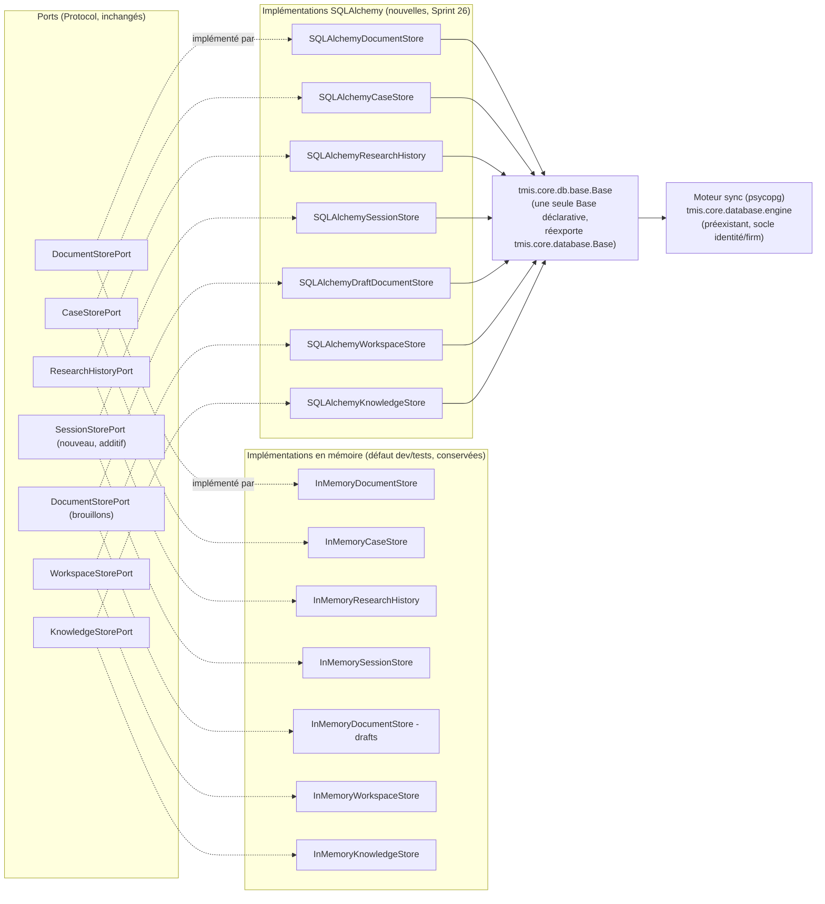
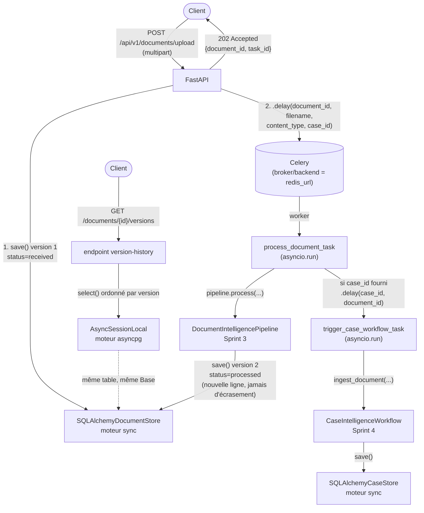

# 151 — Architecture de persistance (Sprint 26)

Ce document décrit le socle de persistance ajouté au Sprint 26 derrière
les 7 ports de stockage qui, jusqu'ici, n'existaient qu'en mémoire. Voir
le rapport d'audit (`docs/reports/sprint-26-rapport-audit.md`) pour le
détail composant par composant, et le rapport d'architecture
(`docs/reports/sprint-26-rapport-architecture.md`) pour les décisions.

## Principe : composition sur les ports existants, jamais de remplacement

Aucun des 7 ports de stockage n'a changé de signature. Chaque adaptateur
SQLAlchemy implémente le port *tel quel* ; le code appelant (pipelines,
orchestrateurs, API) continue de dépendre du `Protocol`, jamais d'une
implémentation concrète — c'est ce qui permet de faire coexister
`InMemory*Store` (défaut dev/tests) et `SQLAlchemy*Store` (production)
sans aucune branche `if` dans le code métier.



**Pourquoi les 7 stores SQLAlchemy sont tous synchrones** : les 7 ports
déclarent des méthodes `def`, jamais `async def` — un `Protocol` ne peut
pas changer de signature, donc un adaptateur qui l'implémente ne peut pas
devenir asynchrone non plus. Les 7 stores utilisent donc le moteur sync
déjà présent dans le dépôt (`tmis.core.database`), pas un second moteur.

## Le moteur asyncpg : seulement là où aucun port n'existe

`tmis.core.db.session` ajoute un second moteur, `asyncpg`, à côté du
moteur sync — mais il ne sert **pas** aux 7 stores ci-dessus. Il sert au
seul endroit du Sprint 26 qui lit des données en dehors de tout port :
l'historique complet des versions d'un document
(`GET /documents/{id}/versions`), puisque `DocumentStorePort` n'expose
que la dernière version par construction (`get(document_id)`).



## `CaseStorePort` désormais partagé (Sprint 43)

**Avant.** Depuis le Sprint 4, `case_intelligence.bootstrap.
get_case_intelligence_workflow()` — utilisé par les six endpoints
synchrones `/api/v1/cases/*` et, via `agents.bootstrap`, par
`get_orchestrator()`/`get_contract_agent()`/`get_jurisprudence_agent()` —
ne passait pas de `case_store` du tout et retombait donc sur le défaut de
`CaseIntelligenceWorkflow`, `InMemoryCaseStore()`. Seul le chemin
asynchrone Celery (`core.tasks.case_tasks.trigger_case_workflow_task`)
construisait un `SQLAlchemyCaseStore()` — une nouvelle instance à chaque
tâche, qui plus est. Un dossier créé via `POST /api/v1/cases/{id}/profile`
et un dossier enrichi via l'upload asynchrone d'un document n'étaient
donc pas la même ligne : deux vues divergentes du même `CaseProfile`,
documentées ici depuis le Sprint 26 et jamais reprises. Aucune donnée de
production n'existait dans `InMemoryCaseStore` (voir
`docs/reports/sprint-43-rapport-audit.md`), donc aucune migration n'était
nécessaire pour refermer cet écart, seulement un changement de câblage.

**Après.** Même patron que `document_intelligence.bootstrap.
get_document_store()` (Sprint 37, section suivante) :

```python
@lru_cache
def get_case_store() -> CaseStorePort:
    return SQLAlchemyCaseStore()
```

`get_case_intelligence_workflow()` lui injecte désormais ce singleton
(`case_store=get_case_store()`), et
`core.tasks.case_tasks.trigger_case_workflow_task` a été mis à jour pour
appeler `get_case_store()` plutôt que d'instancier son propre
`SQLAlchemyCaseStore()` par tâche. `CaseIntelligenceWorkflow.__init__`
garde `case_store: CaseStorePort | None = None` inchangé — seul le
comportement *par défaut* des composition roots change, aucun port ni
signature publique n'a bougé. Voir
`docs/reports/sprint-43-rapport-audit.md` pour le recensement complet des
points de câblage examinés et `docs/reports/sprint-43-rapport-architecture.md`
pour le détail de la convergence.

> **Mise à jour ultérieure** : ce `get_case_store()` process-wide, sans
> `firm_id`, décrit l'état du Sprint 43 — un seul cabinet en pratique.
> La tranche `case_intelligence` persistante & isolée (docs/19-case-
> intelligence.md § "Persistance & isolation multi-tenant") l'a depuis
> remplacé par `get_case_store(firm_id)` : il n'existe plus de
> `SQLAlchemyCaseStore` partagé par tout le processus. Le récit
> ci-dessus reste correct pour comprendre *pourquoi* le câblage a
> convergé au Sprint 43 ; pour l'état actuel du câblage, voir docs/19.

## Versionning des documents

`document_records` a une clé primaire de substitution (`id`, UUID) — pas
`document_id`. `save()` insère toujours une nouvelle ligne, jamais une
mise à jour en place ; `version` s'incrémente, `previous_version_id`
pointe vers la ligne précédente. `get(document_id)` (le seul accès que le
port expose) renvoie la version la plus récente ; `list_versions()`
(méthode supplémentaire, hors port, utilisée par l'endpoint d'historique)
renvoie tout l'historique, du plus ancien au plus récent.

## Migrations

Voir `docs/152-guide-migrations.md`. Une migration par domaine, chaînée
linéairement (`0001_document_record` → ... → `0007_knowledge_object`),
jamais une migration fourre-tout.

## `DocumentStorePort` désormais partagé (Sprint 37)

**Avant.** `SQLAlchemyDocumentStore` (ci-dessus) existait depuis le
Sprint 26, mais chaque point d'entrée qui en avait besoin instanciait le
sien : `document_intelligence.bootstrap.get_document_pipeline()` ne
passait pas de `document_store` du tout et retombait donc sur le défaut
du pipeline, `InMemoryDocumentStore()` ; `agents.orchestrator.
Orchestrator` construisait son `AnalysisAgent()` sans `document_store`
(même défaut `InMemoryDocumentStore()`) ; `agents.bootstrap.
get_contract_agent()` faisait de même pour `ContractAgent`. Seul
`core.tasks.document_tasks.process_document_task` — le flux réel
d'upload — construisait explicitement `SQLAlchemyDocumentStore()`. Trois
composition roots pointaient donc, par défaut, vers un stockage en
mémoire jamais partagé avec la production, malgré l'existence de
l'adaptateur Postgres depuis onze sprints.

**Après.** `document_intelligence.bootstrap.get_document_store()` est un
singleton `@lru_cache`, même patron que `legal_research.bootstrap.
get_research_orchestrator()`/`cabinet_knowledge.bootstrap.
get_knowledge_space()` :

```python
@lru_cache
def get_document_store() -> DocumentStorePort:
    return SQLAlchemyDocumentStore()
```

Contrairement aux connecteurs LRE (réel HTTP vs. fixture, un choix de
configuration), `SQLAlchemyDocumentStore` n'a pas de branche
réel/fixture à ce niveau : c'est toujours l'implémentation de
production, elle lit `Settings.database_url` directement. Cette même
instance est désormais injectée dans les trois points d'entrée qui
construisaient auparavant leur propre store par défaut :

- `get_document_pipeline()` (`document_intelligence.bootstrap`)
- `Orchestrator.__init__`'s default `AnalysisAgent` (`agents.
  orchestrator`)
- `get_contract_agent()` (`agents.bootstrap`)

`api.v1.document.routes.get_document_store()` — qui retournait déjà
`SQLAlchemyDocumentStore()` (Sprint 26 Phase 4) — délègue maintenant au
même singleton plutôt que de garder sa propre définition locale.
`process_document_task` (déjà correct) n'a pas été touché : il continue
de construire son `SQLAlchemyDocumentStore()` directement, hors de tout
composition root, ce que ce sprint n'a pas cherché à unifier.

Chaque constructeur (`DocumentIntelligencePipeline`, `AnalysisAgent`,
`ContractAgent`) garde `document_store: DocumentStorePort | None = None`
inchangé — les tests continuent d'injecter `InMemoryDocumentStore()`
explicitement, sans aucun changement de comportement ; seul le
comportement *par défaut* (composition root réelle) change. Voir
`docs/reports/sprint-37-rapport-architecture.md` pour le détail du
câblage et `docs/reports/sprint-37-rapport-audit.md` pour l'impact sur
les tests d'intégration qui dépendaient implicitement de l'ancien
défaut en mémoire.
