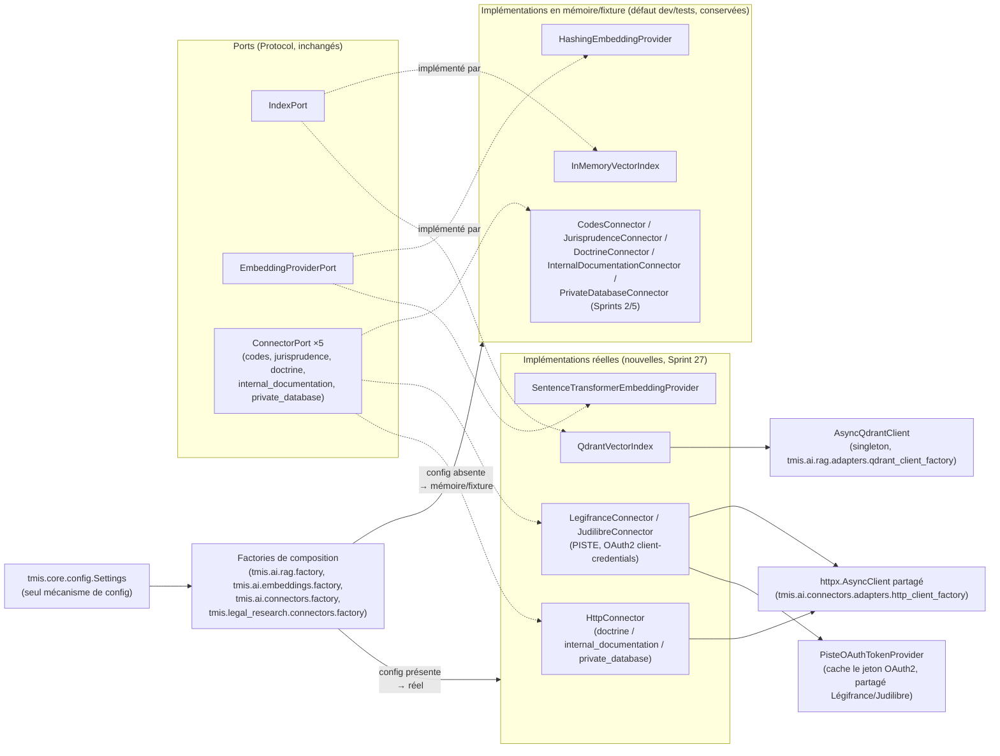
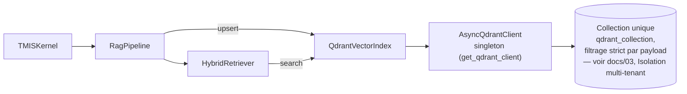

# 153 — Architecture RAG en production (Sprint 27)

Ce document décrit les adaptateurs réels ajoutés au Sprint 27 derrière
les ports RAG et connecteurs qui, jusqu'ici (Sprints 2 et 5), n'avaient
que des implémentations en mémoire/fixture. Voir le rapport d'audit
(`docs/reports/sprint-27-rapport-audit.md`) pour le détail composant par
composant et le rapport d'architecture
(`docs/reports/sprint-27-rapport-architecture.md`) pour les décisions.

## Principe : composition sur les ports existants, jamais de remplacement

Aucun des trois ports concernés (`IndexPort`, `EmbeddingProviderPort`,
`ConnectorPort`) n'a changé de signature. Chaque adaptateur réel
l'implémente *tel quel* ; le code qui consomme un port
(`HybridRetriever`, `DocumentEmbeddingBridge`, `RagPipeline`,
`ConnectorManager`) continue de dépendre du `Protocol`, jamais d'une
implémentation concrète — c'est ce qui permet à `InMemoryVectorIndex`,
`HashingEmbeddingProvider` et aux 5 connecteurs fixture (Sprints 2/5) de
rester le comportement par défaut sans aucune branche `if` dans le code
métier consommateur.

## Qui décide, et où

La bascule mémoire ↔ réel n'est **jamais** dans les classes qui
implémentent un port (elles ne savent rien les unes des autres) ni dans
les classes qui les consomment (`RagPipeline`, `TMISKernel`,
`ConnectorManager`, `HybridRetriever`, `DocumentEmbeddingBridge` — ces
deux derniers *n'ont reçu aucune modification*, conformément au mandat
du sprint). Elle vit dans quatre fonctions de composition, appelées
uniquement depuis les points de bootstrap process-wide
(`tmis.ai.kernel.bootstrap.get_kernel()`,
`tmis.legal_research.bootstrap.get_research_orchestrator()`) :

| Factory | Décide entre | Basée sur |
|---|---|---|
| `tmis.ai.rag.factory.get_vector_index()` | `InMemoryVectorIndex` / `QdrantVectorIndex` | `TMIS_RAG_VECTOR_INDEX_BACKEND` |
| `tmis.ai.embeddings.factory.get_embedding_provider()` | `HashingEmbeddingProvider` / `SentenceTransformerEmbeddingProvider` | `TMIS_EMBEDDING_BACKEND`, jamais un plantage même si le modèle échoue à charger |
| `tmis.ai.connectors.factory` (`build_codes_connector`, `build_jurisprudence_connector`, `build_doctrine_connector`) | fixture Sprint 2 / adaptateur réel | `TMIS_PISTE_CLIENT_ID`/`SECRET`, `TMIS_DOCTRINE_CONNECTOR_BASE_URL` |
| `tmis.legal_research.connectors.factory` (`build_internal_documentation_connector`, `build_private_database_connector`) | fixture Sprint 5 / `HttpConnector` | `TMIS_INTERNAL_DOCUMENTATION_CONNECTOR_BASE_URL`, `TMIS_PRIVATE_DATABASE_CONNECTOR_BASE_URL` |

`ConnectorManager.__init__` et `register_legal_research_connectors()` ont
reçu chacun trois/deux paramètres optionnels supplémentaires
(`codes`/`jurisprudence`/`doctrine` et
`internal_documentation`/`private_database`) — extension additive, même
patron que `ReasoningOrchestrator(session_store: SessionStorePort | None
= None)` au Sprint 26 : tout appelant existant sans argument continue
d'obtenir exactement les fixtures Sprint 2/5.

## Qdrant : un seul client, une collection, filtrage par payload

`get_qdrant_client()` (`tmis.ai.rag.adapters.qdrant_client_factory`) est
le seul point de construction d'un `AsyncQdrantClient` dans le dépôt —
aucun module appelant n'en ouvre un second. Le client ne sonde pas le
serveur à la construction (`check_compatibility=False`) : comme tous les
autres adaptateurs de ce dépôt (`RedisMemoryStore`, `RedisCache`...),
rien ne dépend d'un backend externe déjà joignable au démarrage du
process ; une indisponibilité de Qdrant remonte au premier appel réel
(`upsert`/`search`), pas à la construction du singleton.

`QdrantVectorIndex.upsert()` dérive un id de point stable
(`uuid5(NAMESPACE_URL, chunk_id)`) à partir du `chunk_id` — un upsert
répété avec le même `chunk_id` écrase le point existant au lieu d'en
créer un doublon, contrairement à `InMemoryVectorIndex.upsert()` qui,
lui, ajoute toujours (voir le test d'intégration dédié).

## Embeddings : local par défaut si activé, jamais de clé API obligatoire

`SentenceTransformerEmbeddingProvider` charge un modèle
`sentence-transformers` local (`paraphrase-multilingual-MiniLM-L12-v2`
par défaut — multilingue, couvre le français) : aucune clé API, un seul
téléchargement de modèle vers le cache local au premier usage. C'est le
choix explicitement suggéré par le brief du sprint plutôt qu'un
fournisseur d'API tierce, pour ne jamais rendre le pipeline RAG
dépendant d'une clé API en dev.

`get_embedding_provider()` encapsule *tout* échec de chargement (paquet
absent, pas de réseau pour le téléchargement initial, cache corrompu...)
dans un `try/except Exception` qui journalise un avertissement et
retombe sur `HashingEmbeddingProvider` — jamais un plantage au
démarrage. Ce comportement a été vérifié en conditions réelles dans cet
environnement : le proxy sortant bloque `huggingface.co` (`403
Forbidden`), et le fallback s'est déclenché exactement comme prévu (voir
docs/reports/sprint-27-rapport-audit.md).

**Décision de périmètre** : le brief mentionnait, en option, un second
fournisseur d'embeddings à clé API qui basculerait lui-même sur
`HashingEmbeddingProvider` en l'absence de clé. Cette option n'a pas été
construite : aucun fournisseur externe n'était nommé, et l'ajouter
n'aurait été qu'une seconde variante du même mécanisme de fallback déjà
implémenté pour `SentenceTransformerEmbeddingProvider`, sans capacité
nouvelle. `get_embedding_provider()` est écrit pour qu'ajouter une
troisième branche (`embedding_backend == "openai"` par exemple) tienne
en quelques lignes le jour où un fournisseur concret est choisi.

## Connecteurs : sources publiques réelles quand elles existent, HTTP générique sinon

- **codes** → `LegifranceConnector` (API Légifrance/DILA, via la
  passerelle PISTE) si `TMIS_PISTE_CLIENT_ID`/`TMIS_PISTE_CLIENT_SECRET`
  sont configurés.
- **jurisprudence** → `JudilibreConnector` (API Judilibre — Cour de
  cassation, même passerelle PISTE) sous la même condition.
- **doctrine** → `HttpConnector` configurable
  (`TMIS_DOCTRINE_CONNECTOR_BASE_URL`) : aucune API publique pertinente
  n'existe pour la doctrine juridique française.
- **internal_documentation** / **private_database** → `HttpConnector`
  configurable, une base URL par connecteur : ce sont par nature des
  sources propres au cabinet (documentation interne, base privée sous
  licence), jamais des API publiques.

`LegifranceConnector` et `JudilibreConnector` partagent un
`PisteOAuthTokenProvider` (jeton OAuth2 *client credentials* mis en
cache jusqu'à expiration) et le même `httpx.AsyncClient` singleton
(`get_connector_http_client()`) que `HttpConnector` — un seul pool de
connexions HTTP pour tous les connecteurs réels, même principe que le
client Qdrant unique.

**Limite assumée, documentée plutôt que masquée** : les chemins
d'API/formats de requête-réponse de Légifrance et Judilibre suivent la
documentation publique de la passerelle PISTE (`api.gouv.fr`,
`piste.gouv.fr`), mais n'ont **pas** pu être validés contre le service
réel dans cet environnement (aucun identifiant PISTE disponible, et le
proxy sortant de ce bac à sable bloque de toute façon les hôtes non
allowlistés). Chaque champ lu dans la réponse JSON est traité de façon
défensive (`.get(...)` avec repli) et `base_url` reste configurable par
environnement, pour qu'une dérive de schéma côté DILA ou un changement
de chemin d'endpoint se corrige en configuration plutôt qu'en code. Les
tests unitaires couvrent le contrat HTTP (requête/réponse simulées via
`httpx.MockTransport`), pas un appel réel — voir
docs/reports/sprint-27-rapport-audit.md.

## Health check : DEGRADED, pas silencieux

Un connecteur qui retombe sur sa fixture n'est pas cassé (il répond,
avec des données de démonstration) : `/health` le rapporte donc
`DEGRADED`, jamais `DOWN`, avec le détail de ce qui manque en
configuration (`ConnectorBackendHealthCheck`, enregistré dans
`tmis.platform.health.bootstrap.get_health_check_engine()` aux côtés des
sept vérifications existantes). Le même fait est aussi journalisé une
fois au démarrage par chaque factory (`connector.fixture_fallback`),
pour qu'un opérateur qui ne regarde que les logs de démarrage — pas
uniquement `/health` — voie la même information.

Voir `docs/154-guide-configuration-connecteurs.md` pour la liste
complète des variables d'environnement.
