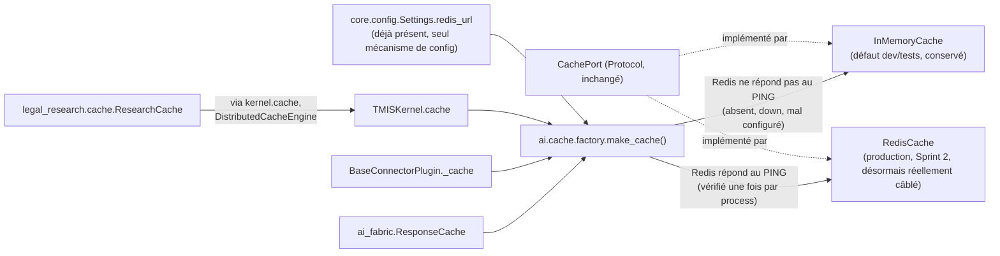

# 155 — Architecture : cache Redis en production (Sprint 28)

Ce document décrit le câblage réel ajouté au Sprint 28 derrière
`ai.cache.CachePort`, jusqu'ici toujours codé en dur sur `InMemoryCache`
malgré l'existence de `RedisCache` (Sprint 2) et de `redis_url` dans
`core.config.Settings` (Sprint "socle infra"). Voir le rapport d'audit
(`docs/reports/sprint-28-rapport-audit.md`) pour le détail composant par
composant et le rapport d'architecture
(`docs/reports/sprint-28-rapport-architecture.md`) pour les décisions.

## Principe : composition sur le port existant, jamais de remplacement

`CachePort` n'a pas changé de signature. `RedisCache` et `InMemoryCache`
l'implémentent toujours *telles quelles* ; aucune classe qui consomme un
cache (`TMISKernel`, `BaseConnectorPlugin`, `ResponseCache`,
`ResearchCache`, `DistributedCacheEngine`) n'a de branche conditionnelle
sur la configuration. La décision vit dans un unique point de
composition : `tmis.ai.cache.factory.make_cache()`.

## Qui décide, et où

Les trois câblages codés en dur identifiés en Phase 0
(`ai.kernel.kernel.TMISKernel.__init__`,
`platform_sdk.connector_sdk.base.BaseConnectorPlugin.__init__`,
`ai_fabric.bootstrap.get_response_cache`) appellent désormais
`make_cache()` au lieu de construire `InMemoryCache()` directement — dans
les trois cas, uniquement comme valeur par défaut du paramètre optionnel
`cache` déjà existant, donc **aucun appelant qui injecte déjà
explicitement un cache ne change de comportement**.

`legal_research.bootstrap.get_research_orchestrator` n'avait pas de
câblage en dur à remplacer : il construit déjà
`ResearchCache(DistributedCacheEngine(kernel.cache))` — il hérite donc du
nouveau comportement de `TMISKernel.cache` sans aucune modification de ce
fichier (confirmé par `git diff` sur ce fichier après implémentation).

## `make_cache()` : sélection par joignabilité, pas par flag

Contrairement aux factories du Sprint 27 (`get_vector_index`,
`get_embedding_provider`, qui décident sur un flag explicite —
`TMIS_RAG_VECTOR_INDEX_BACKEND`, `TMIS_EMBEDDING_BACKEND`), `make_cache()`
ne lit qu'une seule variable déjà existante, `redis_url` (défaut
`redis://localhost:6379/0`, jamais vide), et décide par un `PING`
synchrone borné (0,5 s de timeout socket) :

- `PING` répond → `RedisCache`, construit sur un client `redis.asyncio`
  partagé.
- `PING` échoue, pour n'importe quelle raison (Redis absent, mal
  configuré, coupure réseau) → `InMemoryCache`, journalisé
  (`cache.redis_unreachable`), **jamais** une exception propagée.

**Écart assumé par rapport à la convention du Sprint 27** ("aucun
adaptateur ne sonde son backend à la construction" —
`get_qdrant_client()`, `get_connector_http_client()`) : `CachePort` est
sur le chemin chaud de pratiquement chaque appel du Kernel
(`complete()`, `search_connectors()`), de chaque connecteur, et des trois
couches du cache du LRE. Différer la détection au premier appel réel,
comme pour Qdrant, aurait signifié propager une `ConnectionError` non
gérée à chacun de ces points d'appel dès que Redis est indisponible —
bien plus disruptif que le coût borné d'un `PING` unique au démarrage. Le
prompt du sprint demande explicitement cette sémantique (« RedisCache si
`redis_url` configuré et joignable, sinon `InMemoryCache` »), ce qui est
appliqué ici tel quel plutôt que la convention par défaut du dépôt.

## Un seul client Redis, jamais un par appelant

Le `PING` et la construction du client `redis.asyncio.Redis` vivent dans
`_shared_redis_client()`, `@lru_cache` : **au plus un** `PING` et **au
plus un** client par process, quel que soit le nombre d'appelants de
`make_cache()`. `make_cache()` elle-même n'est **pas** mise en cache —
chaque appel construit une nouvelle instance de `RedisCache` (légère,
partageant le même client/pool de connexions sous-jacent) ou une nouvelle
instance d'`InMemoryCache` (un `dict` privé, isolé).

Cette dernière distinction est délibérée : avant ce sprint, chaque
appelant (`TMISKernel()`, chaque `BaseConnectorPlugin`, `ResponseCache`)
construisait son propre `InMemoryCache()` privé, jamais partagé. Un
`make_cache()` qui aurait mémorisé un unique `InMemoryCache` partagé
aurait fait fuir des entrées entre connecteurs distincts portant le même
`plugin_id` dans des instances différentes — un scénario réel couvert par
`test_connector_search_uses_cache_on_second_call`
(`tests/unit/platform_sdk/test_platform_sdk_agent_connector_sdk.py`), qui
aurait commencé à échouer de façon intermittente selon l'ordre
d'exécution des tests. `make_cache()` reproduit donc exactement
l'isolation préexistante pour la branche mémoire, et ajoute le partage de
connexion uniquement pour la branche Redis, où le partage est un gain
(un seul pool) sans coût d'isolation (Redis isole déjà par clé, et
chaque `RedisCache`/`ResearchCache`/`ResponseCache` préfixe ses clés).

Le mécanisme de connexion Redis de Celery (`tmis.core.tasks.celery_app`,
Sprint 26) reste totalement indépendant : Celery gère son propre cycle de
vie de connexion broker/backend et n'a jamais partagé de client avec
`ai.cache`. `make_cache()` est le seul point de construction d'un client
`redis.asyncio.Redis` du dépôt — vérifié par recherche avant
implémentation (Phase 0).

## Vérifier ce qui est réellement actif

- **Logs de démarrage** : `cache.redis_unreachable` si Redis ne répond
  pas au `PING` ; `cache.backend_selected` (`backend=redis`) sinon.
- **`kernel.cache`** : `InMemoryCache` ou `RedisCache` selon ce qui a été
  détecté — inspectable directement, `TMISKernel.cache` est un attribut
  public.
- Aucune nouvelle variable d'environnement : `TMIS_REDIS_URL` (déjà
  présent depuis le socle infra) suffit — pointez-le vers un Redis
  joignable pour activer `RedisCache` sans redémarrage de code.
