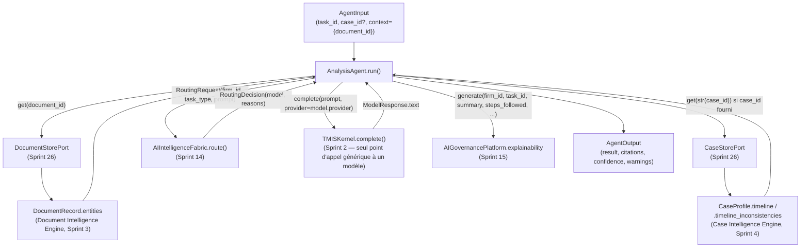

# 157 — Architecture : Agent Analyse réel (Sprint 29)

Ce document décrit le câblage réel de `tmis.agents.analysis_agent.
AnalysisAgent`, qui remplace le placeholder Sprint 1 vide (`entities: []`,
confiance `LOW` systématique) par une extraction réelle appuyée sur des
données réellement persistées. Voir le rapport d'audit
(`docs/reports/sprint-29-rapport-audit.md`) pour le détail composant par
composant et le rapport d'architecture
(`docs/reports/sprint-29-rapport-architecture.md`) pour les décisions.

## Principe : un seul agent réel, un patron de câblage pour les suivants

Ce sprint n'implémente que `AnalysisAgent`. Les 8 autres agents de
`tmis.agents` (synthèse, vérificateur, recherche documentaire,
jurisprudence, rédaction, contrat, stratégie, veille, collaboration)
restent les placeholders Sprint 1 — chacun garde son propre sprint dédié
(30, 31, 33, 34, 35, 36 ; rédaction/stratégie/collaboration hors roadmap
actuelle, voir le rapport d'audit). Ce que `AnalysisAgent` démontre ici —
`TMISKernel.complete()`, `AIIntelligenceFabric.route()`,
`AIGovernancePlatform.explainability`, `DocumentStorePort`/`CaseStorePort`
— est le patron que ces sprints réutiliseront tel quel.

## Vue d'ensemble

## Ce que l'agent ne reconstruit jamais

| Besoin | Composant existant réutilisé | Ce que l'agent ne fait pas |
|---|---|---|
| Entités (personnes, sociétés, dates, montants, juridictions, références) | `DocumentRecord.entities` (`ExtractedEntity`, Document Intelligence Engine, Sprint 3) | Un second extracteur d'entités par regex/NLP |
| Chronologie du dossier | `CaseProfile.timeline` (`CaseTimelineEntry`, Case Intelligence Engine, Sprint 4) — repli sur `DocumentRecord.timeline_events` si aucun `case_id` n'est fourni | Un second moteur de chronologie |
| Incohérences | `CaseProfile.timeline_inconsistencies` (`TimelineInconsistency`, Case Intelligence Engine, Sprint 4) | Un second détecteur d'incohérences |
| Appel générique à un modèle | `TMISKernel.complete(prompt, provider=...)` (Sprint 2) | Un second client LLM ad hoc |
| Choix du modèle | `AIIntelligenceFabric.route(RoutingRequest(...))` (Sprint 14) — `RoutingDecision.model` porte à la fois `name` et `provider`, un seul appel suffit | Un fournisseur fixe codé en dur, un second routeur |
| Explicabilité du résultat | `AIGovernancePlatform.explainability.generate(...)` (Sprint 15) | Une gouvernance de production parallèle |

`AnalysisAgent` reste par ailleurs un simple `AgentPort`
(`tmis.agents.contracts`, `name` + `async def run(agent_input) ->
AgentOutput`) — aucune signature de `AgentInput`/`AgentOutput`/`AgentPort`
n'a changé.

## Pourquoi pas `platform_sdk.agent_sdk.BaseAgentPlugin`

L'audit Phase 0 (docs/reports/sprint-29-rapport-audit.md) a vérifié que
`BaseAgentPlugin` (Sprint 13) n'est aujourd'hui utilisé que par les deux
plugins de démonstration du Marketplace (`agent_fiscal`,
`agent_droit_social`) — jamais par un agent de `tmis.agents` ni par un
agent `tmis.ai_team`. Sa méthode abstraite a la signature
`run(context: PluginContext, agent_input: AgentInput) -> AgentOutput`,
incompatible avec `AgentPort.run(agent_input) -> AgentOutput` que
l'`Orchestrator` invoque directement (`state["output"] = await
self._analysis_agent.run(state["agent_input"])`). L'utiliser ici aurait
donc nécessité de changer le contrat que l'`Orchestrator` appelle — exclu
par la contrainte "zéro changement de signature" de ce sprint.

## Ce qui n'est délibérément pas câblé

`workflow_automation.event_bus.WorkflowEventBus`,
`integration_hub.connector_framework.ConnectorPort` et
`strategic_intelligence.overview.StrategicIntelligencePlatform` sont
listés au Sprint 29 de la roadmap comme plateformes disponibles "pour
toute" automatisation déclenchée, échange externe, ou proposition de
stratégie — aucune des trois ne s'applique à ce que `AnalysisAgent` fait
réellement (extraction et regroupement de données déjà persistées, aucune
automatisation déclenchée, aucun système externe, aucune proposition de
stratégie). Les câbler ici aurait été une intégration sans besoin
fonctionnel, contraire au principe de ce dépôt de ne construire que ce
qu'un besoin réel justifie. `tmis.ai_team.coordinator`/`.planner` restent
également non utilisés par `AnalysisAgent` lui-même : ce sont les
briques d'orchestration de missions multi-agents (Sprint 11), un
mécanisme distinct de l'`Orchestrator` LangGraph (Sprint 1) que ce sprint
étend — les deux coexistent par conception, aucun des deux ne remplace
l'autre (voir le rapport d'audit, section "ai_team.coordinator/planner").

## Patron de câblage pour un futur agent (Sprint 30 et suivants)

Voir le docstring de `tmis.agents.orchestrator.Orchestrator` pour la
procédure complète. En résumé : un futur agent (ex. `SynthesisAgent`,
Sprint 30) s'ajoute au même graphe LangGraph par un paramètre de
constructeur optionnel, un nœud `run_<name>` supplémentaire, et un
branchement d'arêtes — sans jamais changer `OrchestratorState` ni la
signature publique `Orchestrator.run()`.
