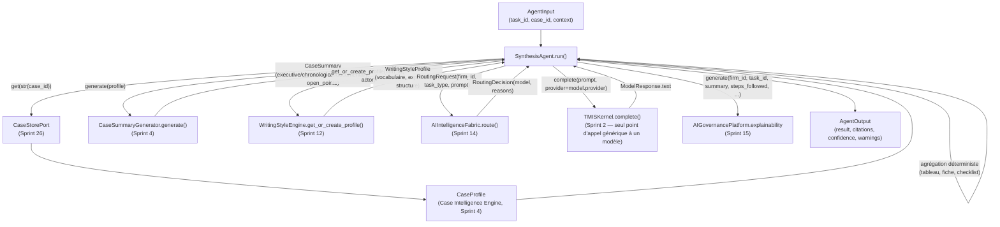

# 158 — Architecture : Agent Synthèse réel (Sprint 30)

Ce document décrit le câblage réel de `tmis.agents.synthesis_agent.
SynthesisAgent`, qui remplace le placeholder Sprint 1 vide
(`raise NotImplementedError`) par une agrégation réelle appuyée sur des
données réellement persistées. Voir le rapport d'audit
(`docs/reports/sprint-30-rapport-audit.md`) pour le détail
composant par composant et le rapport d'architecture
(`docs/reports/sprint-30-rapport-architecture.md`) pour les décisions.

## Principe : un seul agent réel de plus, le même patron de câblage

Ce sprint n'implémente que `SynthesisAgent`, en suivant exactement le
patron établi par `AnalysisAgent` au Sprint 29
(docs/157-architecture-agent-analyse.md) : `TMISKernel.complete()`,
`AIIntelligenceFabric.route()`, `AIGovernancePlatform.explainability`. Les
7 autres agents de `tmis.agents` (vérificateur, recherche documentaire,
jurisprudence, contrat, veille, rédaction, stratégie, collaboration)
restent les placeholders Sprint 1 — chacun garde son propre sprint dédié
(31, 33-36) ou reste hors roadmap actuelle.

## Vue d'ensemble

## Ce que l'agent ne reconstruit jamais

| Besoin | Composant existant réutilisé | Ce que l'agent ne fait pas |
|---|---|---|
| Résumé exécutif, résumé chronologique, résumé documentaire, statut du dossier, points ouverts | `CaseSummaryGenerator.generate()` (Sprint 4) — exécutif seul via `TMISKernel.complete()`, le reste déterministe | Un second générateur de résumé, un second appel de modèle pour ce que `CaseSummaryGenerator` produit déjà |
| Chronologie et incohérences | `CaseProfile.timeline`/`.timeline_inconsistencies` (Sprint 4) | Un second moteur de chronologie ou de détection d'incohérences |
| Réécriture de texte selon le style du cabinet | `WritingStyleProfile` (données lues via `WritingStyleEngine.get_or_create_profile()`) injectées dans le prompt | Un appel à `WritingStyleEngine.apply_style()` — cette méthode ajoute un bloc de signature déterministe, ce n'est pas une réécriture générative (voir son propre docstring) |
| Appel générique à un modèle | `TMISKernel.complete(prompt, provider=...)` (Sprint 2) | Un second client LLM ad hoc |
| Choix du modèle | `AIIntelligenceFabric.route(RoutingRequest(...))` (Sprint 14) | Un fournisseur fixe codé en dur, un second routeur |
| Explicabilité du résultat | `AIGovernancePlatform.explainability.generate(...)` (Sprint 15) | Une gouvernance de production parallèle |

## Ce que l'agent produit en plus de `CaseSummaryGenerator`

`CaseSummaryGenerator.generate()` couvre le résumé exécutif, chronologique,
documentaire, le statut et les points ouverts — mais rien de tabulaire ni
de structuré. `SynthesisAgent` ajoute, en agrégation déterministe pure
(aucun appel de modèle) à partir du `CaseProfile` :

- **Tableau structuré acteurs/faits/échéances** (`result["table"]`) :
  `CaseProfile.actors` (+ `.actor_roles`), `CaseProfile.facts`, et les
  `CaseProfile.tasks` non terminées comme échéances ouvertes — un champ
  que `CaseSummaryGenerator` ne lit jamais, évitant toute duplication.
- **Fiche de synthèse** (`result["fact_sheet"]`) : titre, statut,
  clients/parties adverses/avocats/juridictions (propriétés déjà
  calculées de `CaseProfile`), nombre de documents, de faits, de
  questions juridiques ouvertes.
- **Checklist des points ouverts** (`result["checklist"]`) : fusionne les
  `open_points` déjà produits par `CaseSummaryGenerator` (questions
  juridiques ouvertes + incohérences de chronologie) avec les
  `CaseProfile.tasks` (terminées ou non) — une vue actionnable unique,
  sans recalculer ce que `CaseSummaryGenerator` a déjà déterminé.

La seule valeur ajoutée générative propre à cet agent est la **note de
synthèse narrative** (`result["synthesis_note"]`) : une mise en forme
narrative de ces livrables, stylée selon le `WritingStyleProfile` du
cabinet (vocabulaire, expressions favorites, préférences de structure)
injecté dans le prompt — un besoin que `CaseSummaryGenerator` ne couvre
pas puisqu'il ignore totalement le style rédactionnel du cabinet. C'est un
second appel à `TMISKernel.complete()` dans le pipeline complet
Analyse→Synthèse, mais jamais un second appel pour ce que
`CaseSummaryGenerator` produit déjà (le résumé exécutif reste un seul
appel, à l'intérieur de `CaseSummaryGenerator.generate()`).

`SynthesisAgent` reste par ailleurs un simple `AgentPort`
(`tmis.agents.contracts`, `name` + `async def run(agent_input) ->
AgentOutput`) — aucune signature de `AgentInput`/`AgentOutput`/
`AgentPort`/`SummaryGeneratorPort` n'a changé.

## Orchestrateur : nœud "synthesis" entre "verifier" et `END`

Le graphe devient `analysis -> verifier -> synthesis -> END`. Synthesis
est un `AgentPort` ordinaire (`run(agent_input)`, pas un post-processeur
comme le Vérificateur), donc `run_synthesis` appelle
`self._synthesis_agent.run(state["agent_input"])` exactement comme
`run_analysis` — mais son résultat est **fusionné** dans la sortie
vérifiée (`_fuse_with_synthesis`) plutôt que de la remplacer :
`OrchestratorState` ne porte qu'un seul `AgentOutput`, et Synthèse répond
à une question différente ("à quoi ressemble le dossier dans son
ensemble ?") de celle d'Analyse/Vérificateur ("ce document est-il
fiable ?"). Remplacer purement et simplement `state["output"]` aurait
fait chuter la confiance globale à `LOW` dès qu'aucun `case_id` n'est
fourni (cas normal pour une simple analyse de document), cassant les
tests Sprint 29 existants sans raison fonctionnelle — voir le rapport
d'architecture pour le raisonnement complet.

Concrètement, `_fuse_with_synthesis(previous, synthesis)` :
- conserve `previous.confidence` (l'évaluation du Vérificateur sur la
  fiabilité du résultat primaire reste autoritaire) ;
- fusionne `result` sous une clé `"synthesis"` dédiée (`{**previous.result,
  "synthesis": synthesis.result}`), sans jamais écraser ce qu'Analyse a
  produit ;
- concatène `citations` et `warnings` des deux résultats.

Positionnement choisi — **après `verifier`, avant `END`** — car
`SynthesisAgent` consomme la sortie déjà vérifiée du pipeline (même
principe que documenté dans le docstring de `Orchestrator` au Sprint 29 :
« one that runs *after* Verifier ... is inserted between "verifier" and
END »), et parce que la Synthèse est conceptuellement la dernière étape
d'un pipeline de traitement de dossier — produire les livrables de
synthèse une fois l'analyse validée, jamais avant.

## Pourquoi pas `platform_sdk.agent_sdk.BaseAgentPlugin`

Même raisonnement qu'au Sprint 29 (docs/157, section dédiée) : sa
signature `run(context, agent_input)` est incompatible avec
`AgentPort.run(agent_input)` qu'`Orchestrator` invoque directement —
l'utiliser aurait changé un contrat que ce sprint doit laisser intact.

## Ce qui n'est délibérément pas câblé

Même conclusion qu'au Sprint 29 pour les mêmes raisons (voir docs/157) :
`strategic_intelligence.overview.StrategicIntelligencePlatform`,
`workflow_automation.event_bus.WorkflowEventBus` et
`integration_hub.connector_framework.ConnectorPort` ne s'appliquent pas à
ce que `SynthesisAgent` fait réellement (agrégation de données déjà
persistées et mise en forme narrative, aucune proposition de stratégie,
aucune automatisation déclenchée, aucun système externe consulté).

## Patron de câblage pour un futur agent (Sprint 31 et suivants)

Voir le docstring de `tmis.agents.orchestrator.Orchestrator` pour la
procédure à jour. En résumé : un futur agent s'ajoute au même graphe par
un paramètre de constructeur optionnel, un nœud `run_<name>`
supplémentaire, et un branchement d'arêtes — soit en remplaçant
`state["output"]` (cas standard, comme Analyse), soit en le fusionnant
(cas d'un agent qui *ajoute* aux résultats précédents, comme Synthèse) —
sans jamais changer `OrchestratorState` ni la signature publique
`Orchestrator.run()`.
